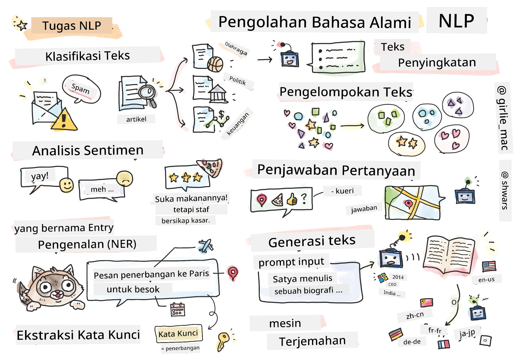

# Pemrosesan Bahasa Alami



Di bagian ini, kita akan fokus pada penggunaan Jaringan Saraf untuk menangani tugas-tugas yang berkaitan dengan **Pemrosesan Bahasa Alami (Natural Language Processing/NLP)**. Ada banyak masalah NLP yang ingin kita selesaikan dengan bantuan komputer:

* **Klasifikasi teks** adalah masalah klasifikasi yang berkaitan dengan urutan teks. Contohnya termasuk mengklasifikasikan pesan e-mail sebagai spam atau bukan spam, atau mengategorikan artikel ke dalam kategori seperti olahraga, bisnis, politik, dll. Selain itu, saat mengembangkan chatbot, kita sering perlu memahami apa yang ingin disampaikan oleh pengguna -- dalam hal ini kita berurusan dengan **klasifikasi maksud**. Dalam klasifikasi maksud, sering kali kita harus menangani banyak kategori.
* **Analisis sentimen** adalah masalah regresi, di mana kita perlu memberikan nilai (sentimen) yang mencerminkan seberapa positif/negatif makna sebuah kalimat. Versi yang lebih canggih dari analisis sentimen adalah **analisis sentimen berbasis aspek** (Aspect-Based Sentiment Analysis/ABSA), di mana kita memberikan sentimen tidak untuk seluruh kalimat, tetapi untuk bagian-bagian tertentu (aspek), misalnya *Di restoran ini, saya suka masakannya, tetapi suasananya sangat buruk*.
* **Pengenalan Entitas Bernama** (Named Entity Recognition/NER) mengacu pada masalah mengekstraksi entitas tertentu dari teks. Sebagai contoh, kita mungkin perlu memahami bahwa dalam frasa *Saya perlu terbang ke Paris besok* kata *besok* merujuk pada TANGGAL, dan *Paris* adalah LOKASI.  
* **Ekstraksi kata kunci** mirip dengan NER, tetapi kita perlu mengekstrak kata-kata yang penting untuk makna kalimat secara otomatis, tanpa pelatihan sebelumnya untuk jenis entitas tertentu.
* **Pengelompokan teks** dapat berguna ketika kita ingin mengelompokkan kalimat yang serupa, misalnya, permintaan serupa dalam percakapan dukungan teknis.
* **Menjawab pertanyaan** mengacu pada kemampuan model untuk menjawab pertanyaan tertentu. Model menerima teks dan pertanyaan sebagai input, dan perlu memberikan tempat dalam teks di mana jawaban atas pertanyaan tersebut terkandung (atau, terkadang, menghasilkan teks jawaban).
* **Pembuatan teks** adalah kemampuan model untuk menghasilkan teks baru. Ini dapat dianggap sebagai tugas klasifikasi yang memprediksi huruf/kata berikutnya berdasarkan *teks awal*. Model pembuatan teks yang canggih, seperti GPT-3, mampu menyelesaikan tugas NLP lainnya seperti klasifikasi menggunakan teknik yang disebut [prompt programming](https://towardsdatascience.com/software-3-0-how-prompting-will-change-the-rules-of-the-game-a982fbfe1e0) atau [prompt engineering](https://medium.com/swlh/openai-gpt-3-and-prompt-engineering-dcdc2c5fcd29).
* **Rangkuman teks** adalah teknik di mana kita ingin komputer "membaca" teks panjang dan meringkasnya dalam beberapa kalimat.
* **Penerjemahan mesin** dapat dilihat sebagai kombinasi pemahaman teks dalam satu bahasa, dan pembuatan teks dalam bahasa lain.

Awalnya, sebagian besar tugas NLP diselesaikan menggunakan metode tradisional seperti tata bahasa. Sebagai contoh, dalam penerjemahan mesin, parser digunakan untuk mengubah kalimat awal menjadi pohon sintaksis, kemudian struktur semantik tingkat tinggi diekstraksi untuk mewakili makna kalimat, dan berdasarkan makna ini serta tata bahasa dari bahasa target, hasilnya dihasilkan. Saat ini, banyak tugas NLP lebih efektif diselesaikan menggunakan jaringan saraf.

> Banyak metode NLP klasik diimplementasikan dalam pustaka Python [Natural Language Processing Toolkit (NLTK)](https://www.nltk.org). Ada [Buku NLTK](https://www.nltk.org/book/) yang sangat bagus tersedia secara online yang membahas bagaimana berbagai tugas NLP dapat diselesaikan menggunakan NLTK.

Dalam kursus ini, kita akan lebih banyak fokus pada penggunaan Jaringan Saraf untuk NLP, dan kita akan menggunakan NLTK jika diperlukan.

Kita telah mempelajari penggunaan jaringan saraf untuk menangani data tabular dan gambar. Perbedaan utama antara jenis data tersebut dan teks adalah bahwa teks adalah urutan dengan panjang variabel, sementara ukuran input pada gambar sudah diketahui sebelumnya. Meskipun jaringan konvolusi dapat mengekstrak pola dari data input, pola dalam teks lebih kompleks. Misalnya, kita dapat memiliki negasi yang dipisahkan dari subjek oleh banyak kata (misalnya, *Saya tidak suka jeruk*, vs. *Saya tidak suka jeruk besar yang berwarna-warni dan lezat*), dan itu tetap harus diinterpretasikan sebagai satu pola. Oleh karena itu, untuk menangani bahasa, kita perlu memperkenalkan jenis jaringan saraf baru, seperti *jaringan berulang* (recurrent networks) dan *transformer*.

## Instalasi Pustaka

Jika Anda menggunakan instalasi Python lokal untuk menjalankan kursus ini, Anda mungkin perlu menginstal semua pustaka yang diperlukan untuk NLP menggunakan perintah berikut:

**Untuk PyTorch**
```bash
pip install -r requirements-torch.txt
```
**Untuk TensorFlow**
```bash
pip install -r requirements-tf.txt
```

> Anda dapat mencoba NLP dengan TensorFlow di [Microsoft Learn](https://docs.microsoft.com/learn/modules/intro-natural-language-processing-tensorflow/?WT.mc_id=academic-77998-cacaste)

## Peringatan GPU

Di bagian ini, dalam beberapa contoh kita akan melatih model yang cukup besar.
* **Gunakan Komputer dengan GPU**: Disarankan untuk menjalankan notebook Anda di komputer yang mendukung GPU untuk mengurangi waktu tunggu saat bekerja dengan model besar.
* **Keterbatasan Memori GPU**: Menjalankan di GPU dapat menyebabkan situasi di mana memori GPU habis, terutama saat melatih model besar.
* **Konsumsi Memori GPU**: Jumlah memori GPU yang digunakan selama pelatihan tergantung pada berbagai faktor, termasuk ukuran minibatch.
* **Minimalkan Ukuran Minibatch**: Jika Anda mengalami masalah memori GPU, pertimbangkan untuk mengurangi ukuran minibatch dalam kode Anda sebagai solusi potensial.
* **Pelepasan Memori GPU TensorFlow**: Versi lama TensorFlow mungkin tidak melepaskan memori GPU dengan benar saat melatih beberapa model dalam satu kernel Python. Untuk mengelola penggunaan memori GPU secara efektif, Anda dapat mengonfigurasi TensorFlow untuk mengalokasikan memori GPU hanya saat diperlukan.
* **Penyertaan Kode**: Untuk mengatur TensorFlow agar hanya menambah alokasi memori GPU saat diperlukan, sertakan kode berikut dalam notebook Anda:

```python
physical_devices = tf.config.list_physical_devices('GPU') 
if len(physical_devices)>0:
    tf.config.experimental.set_memory_growth(physical_devices[0], True) 
```

Jika Anda tertarik mempelajari NLP dari perspektif pembelajaran mesin klasik, kunjungi [rangkaian pelajaran ini](https://github.com/microsoft/ML-For-Beginners/tree/main/6-NLP)

## Dalam Bagian Ini
Di bagian ini kita akan mempelajari:

* [Merepresentasikan teks sebagai tensor](13-TextRep/README.md)
* [Word Embeddings](14-Emdeddings/README.md)
* [Pemodelan Bahasa](15-LanguageModeling/README.md)
* [Jaringan Saraf Berulang](16-RNN/README.md)
* [Jaringan Generatif](17-GenerativeNetworks/README.md)
* [Transformer](18-Transformers/README.md)

---

**Penafian**:  
Dokumen ini telah diterjemahkan menggunakan layanan penerjemahan AI [Co-op Translator](https://github.com/Azure/co-op-translator). Meskipun kami berusaha untuk memberikan hasil yang akurat, harap diingat bahwa terjemahan otomatis mungkin mengandung kesalahan atau ketidakakuratan. Dokumen asli dalam bahasa aslinya harus dianggap sebagai sumber yang otoritatif. Untuk informasi yang bersifat kritis, disarankan menggunakan jasa penerjemahan profesional oleh manusia. Kami tidak bertanggung jawab atas kesalahpahaman atau penafsiran yang keliru yang timbul dari penggunaan terjemahan ini.