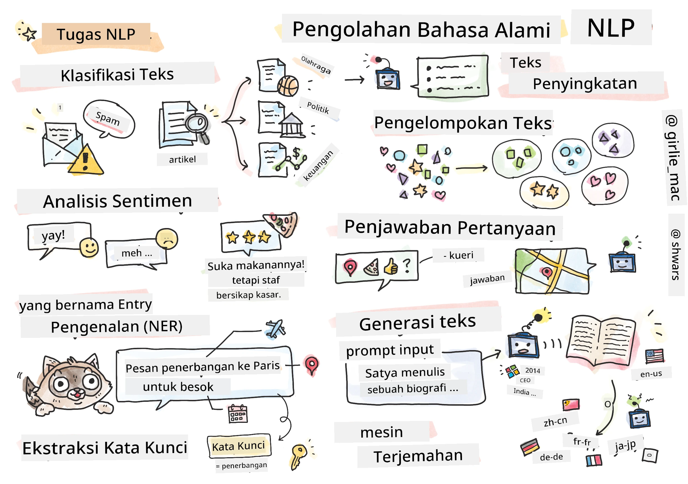

# Pemrosesan Bahasa Alami



Dalam bagian ini, kita akan fokus menggunakan Jaringan Saraf untuk menangani tugas-tugas terkait **Pemrosesan Bahasa Alami (NLP)**. Ada banyak masalah NLP yang ingin kita bisa selesaikan dengan komputer:

* **Klasifikasi teks** adalah masalah klasifikasi khas yang terkait dengan urutan teks. Contohnya termasuk mengklasifikasikan pesan email sebagai spam vs. tidak spam, atau mengkategorikan artikel sebagai olahraga, bisnis, politik, dll. Juga, saat mengembangkan bot obrolan, kita sering perlu memahami apa yang ingin dikatakan pengguna -- dalam kasus ini kita berurusan dengan **klasifikasi intent**. Seringkali, dalam klasifikasi intent kita perlu menangani banyak kategori.
* **Analisis sentimen** adalah masalah regresi khas, di mana kita perlu memberikan angka (sentimen) yang sesuai dengan seberapa positif/negatif makna suatu kalimat. Versi yang lebih maju dari analisis sentimen adalah **analisis sentimen berbasis aspek** (ABSA), di mana kita memberikan sentimen bukan untuk seluruh kalimat, tapi untuk bagian-bagian berbeda dari kalimat tersebut (aspek), misalnya *Di restoran ini, saya suka masakannya, tapi suasananya buruk*.
* **Pengenalan Entitas Bernama** (NER) merujuk pada masalah mengekstrak entitas tertentu dari teks. Misalnya, kita perlu memahami bahwa dalam frasa *Saya perlu terbang ke Paris besok* kata *besok* merujuk ke TANGGAL, dan *Paris* adalah LOKASI.  
* **Ekstraksi kata kunci** mirip dengan NER, tapi kita perlu mengekstrak kata-kata penting untuk makna kalimat secara otomatis, tanpa pelatihan awal untuk jenis entitas tertentu.
* **Pengelompokan teks** dapat berguna ketika kita ingin mengelompokkan kalimat yang mirip, contohnya, permintaan serupa dalam percakapan dukungan teknis.
* **Menjawab pertanyaan** merujuk pada kemampuan model untuk menjawab pertanyaan spesifik. Model menerima teks dan pertanyaan sebagai masukan, dan perlu menyediakan bagian dalam teks di mana jawaban pertanyaan terdapat (atau, kadang-kadang, menghasilkan teks jawaban).
* **Generasi teks** adalah kemampuan model untuk menghasilkan teks baru. Ini dapat dianggap sebagai tugas klasifikasi yang memprediksi huruf/kata berikutnya berdasarkan *prompt teks*. Model generasi teks canggih, seperti GPT-3, mampu menyelesaikan tugas NLP lain seperti klasifikasi dengan teknik yang disebut [prompt programming](https://towardsdatascience.com/software-3-0-how-prompting-will-change-the-rules-of-the-game-a982fbfe1e0) atau [prompt engineering](https://medium.com/swlh/openai-gpt-3-and-prompt-engineering-dcdc2c5fcd29)
* **Ringkasan teks** adalah teknik dimana kita ingin komputer "membaca" teks panjang dan merangkumnya dalam beberapa kalimat.
* **Penerjemahan mesin** dapat dipandang sebagai kombinasi pemahaman teks dalam satu bahasa, dan menghasilkan teks dalam bahasa lain.

Awalnya, sebagian besar tugas NLP diselesaikan menggunakan metode tradisional seperti tata bahasa. Misalnya, dalam penerjemahan mesin, parser digunakan untuk mengubah kalimat awal menjadi pohon sintaksis, kemudian struktur semantik tingkat tinggi diekstrak untuk merepresentasikan makna kalimat, dan berdasarkan makna ini serta tata bahasa bahasa target hasilnya dihasilkan. Saat ini, banyak tugas NLP lebih efektif diselesaikan menggunakan jaringan saraf.

> Banyak metode NLP klasik diimplementasikan dalam pustaka Python [Natural Language Processing Toolkit (NLTK)](https://www.nltk.org). Ada buku [NLTK Book](https://www.nltk.org/book/) yang tersedia online yang membahas bagaimana berbagai tugas NLP dapat diselesaikan menggunakan NLTK.

Dalam kursus kami, kami akan lebih banyak fokus menggunakan Jaringan Saraf untuk NLP, dan kami akan menggunakan NLTK bila diperlukan.

Kita telah belajar menggunakan jaringan saraf untuk menangani data tabular dan gambar. Perbedaan utama antara jenis data tersebut dan teks adalah bahwa teks adalah urutan dengan panjang variabel, sementara ukuran input untuk gambar diketahui sebelumnya. Meskipun jaringan konvolusional bisa mengekstrak pola dari data input, pola dalam teks lebih kompleks. Misalnya, kita dapat memiliki negasi yang terpisah dari subjek dengan jarak kata yang bervariasi (misalnya *Saya tidak suka jeruk*, vs. *Saya tidak suka jeruk besar berwarna cerah yang enak itu*), dan itu tetap harus diinterpretasikan sebagai satu pola. Oleh karena itu, untuk menangani bahasa kita perlu memperkenalkan jenis jaringan saraf baru, seperti *jaringan berulang* dan *transformer*.

## Instalasi Perpustakaan

Jika Anda menggunakan instalasi Python lokal untuk menjalankan kursus ini, Anda mungkin perlu menginstal semua perpustakaan yang dibutuhkan untuk NLP dengan perintah berikut:

**Untuk PyTorch**
```bash
pip install -r requirements-pytorch.txt
```
**Untuk TensorFlow**
```bash
pip install -r requirements-tf.txt
```

> Anda dapat mencoba NLP dengan TensorFlow di [Microsoft Learn](https://docs.microsoft.com/learn/modules/intro-natural-language-processing-tensorflow/?WT.mc_id=academic-77998-cacaste)

## Peringatan GPU

Dalam bagian ini, di beberapa contoh kita akan melatih model yang cukup besar.
* **Gunakan Komputer dengan GPU**: Disarankan menjalankan notebook Anda pada komputer dengan GPU untuk mengurangi waktu tunggu saat bekerja dengan model besar.
* **Keterbatasan Memori GPU**: Menjalankan di GPU bisa menyebabkan kehabisan memori GPU, terutama saat melatih model besar.
* **Konsumsi Memori GPU**: Jumlah memori GPU yang digunakan selama pelatihan tergantung pada berbagai faktor, termasuk ukuran minibatch.
* **Perkecil Ukuran Minibatch**: Jika Anda mengalami masalah memori GPU, pertimbangkan mengurangi ukuran minibatch dalam kode Anda sebagai solusi potensial.
* **Pelepasan Memori GPU di TensorFlow**: Versi TensorFlow lama mungkin tidak melepaskan memori GPU dengan benar saat melatih banyak model dalam satu kernel Python. Untuk mengelola penggunaan memori GPU secara efektif, Anda dapat mengonfigurasi TensorFlow agar hanya mengalokasikan memori GPU sesuai kebutuhan.
* **Inklusi Kode**: Untuk mengatur TensorFlow agar hanya meningkatkan alokasi memori GPU saat diperlukan, sertakan kode berikut dalam notebook Anda:

```python
physical_devices = tf.config.list_physical_devices('GPU') 
if len(physical_devices)>0:
    tf.config.experimental.set_memory_growth(physical_devices[0], True) 
```

Jika Anda tertarik belajar NLP dari perspektif ML klasik, kunjungi [rangkaian pelajaran ini](https://github.com/microsoft/ML-For-Beginners/tree/main/6-NLP)

## Dalam Bagian Ini
Dalam bagian ini kita akan mempelajari tentang:

* [Merepresentasikan teks sebagai tensor](13-TextRep/README.md)
* [Word Embeddings](14-Embeddings/README.md)
* [Pemodelan Bahasa](15-LanguageModeling/README.md)
* [Jaringan Saraf Berulang](16-RNN/README.md)
* [Jaringan Generatif](17-GenerativeNetworks/README.md)
* [Transformer](18-Transformers/README.md)

---

<!-- CO-OP TRANSLATOR DISCLAIMER START -->
**Penafian**:
Dokumen ini telah diterjemahkan menggunakan layanan terjemahan AI [Co-op Translator](https://github.com/Azure/co-op-translator). Meskipun kami berupaya untuk mencapai akurasi, harap diketahui bahwa terjemahan otomatis mungkin mengandung kesalahan atau ketidakakuratan. Dokumen asli dalam bahasa aslinya harus dianggap sebagai sumber yang sah. Untuk informasi penting, disarankan menggunakan terjemahan profesional oleh manusia. Kami tidak bertanggung jawab atas kesalahpahaman atau penafsiran yang keliru yang timbul dari penggunaan terjemahan ini.
<!-- CO-OP TRANSLATOR DISCLAIMER END -->