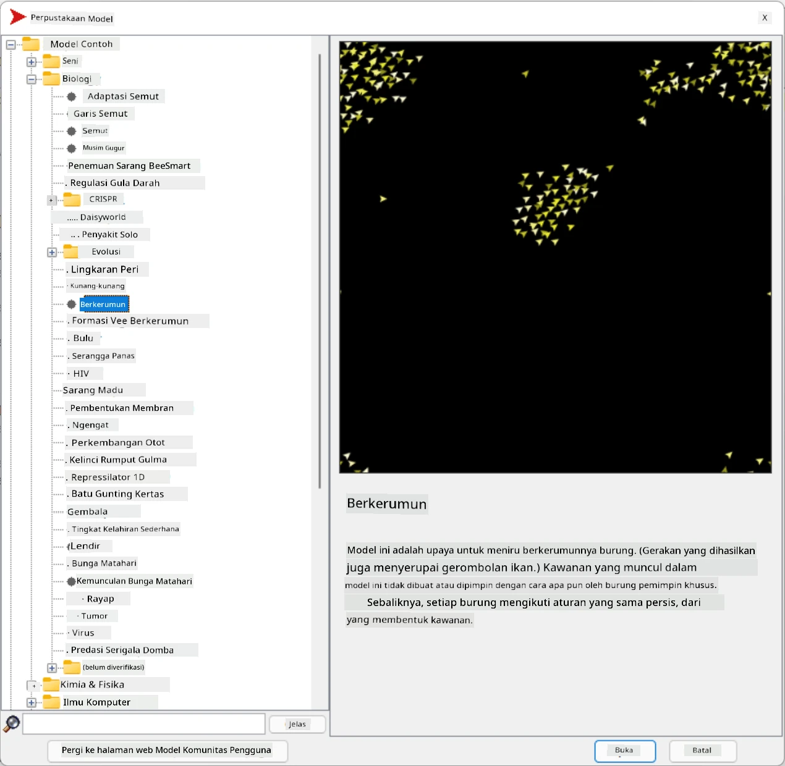
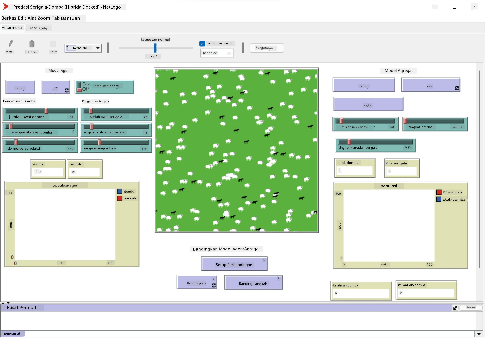

# Sistem Multi-Agen

Salah satu cara untuk mencapai kecerdasan adalah pendekatan yang disebut **emergent** (atau **sinergis**), yang didasarkan pada fakta bahwa perilaku gabungan dari banyak agen yang relatif sederhana dapat menghasilkan perilaku sistem secara keseluruhan yang lebih kompleks (atau cerdas). Secara teori, ini didasarkan pada prinsip [Kecerdasan Kolektif](https://en.wikipedia.org/wiki/Collective_intelligence), [Emergentisme](https://en.wikipedia.org/wiki/Global_brain), dan [Sibernetika Evolusioner](https://en.wikipedia.org/wiki/Global_brain), yang menyatakan bahwa sistem tingkat tinggi memperoleh nilai tambah tertentu ketika dikombinasikan dengan benar dari sistem tingkat rendah (disebut *prinsip transisi metasistem*).

## [Kuis Pra-Kuliah](https://ff-quizzes.netlify.app/en/ai/quiz/45)

Arah **Sistem Multi-Agen** muncul dalam AI pada tahun 1990-an sebagai respons terhadap pertumbuhan Internet dan sistem terdistribusi. Salah satu buku teks AI klasik, [Artificial Intelligence: A Modern Approach](https://en.wikipedia.org/wiki/Artificial_Intelligence:_A_Modern_Approach), berfokus pada pandangan AI klasik dari sudut pandang sistem multi-agen.

Pusat pendekatan multi-agen adalah konsep **Agen** - entitas yang hidup dalam suatu **lingkungan**, yang dapat ia persepsi dan tindak lanjuti. Ini adalah definisi yang sangat luas, dan ada banyak jenis serta klasifikasi agen yang berbeda:

* Berdasarkan kemampuan mereka untuk bernalar:
   - **Agen Reaktif** biasanya memiliki perilaku sederhana tipe permintaan-respons
   - **Agen Deliberatif** menggunakan semacam penalaran logis dan/atau kemampuan perencanaan
* Berdasarkan tempat eksekusi kode agen:
   - **Agen Statis** bekerja pada node jaringan yang didedikasikan
   - **Agen Mobile** dapat memindahkan kode mereka antar node jaringan
* Berdasarkan perilaku mereka:
   - **Agen Pasif** tidak memiliki tujuan spesifik. Agen semacam ini dapat bereaksi terhadap rangsangan eksternal, tetapi tidak akan memulai tindakan sendiri.
   - **Agen Aktif** memiliki beberapa tujuan yang mereka kejar
   - **Agen Kognitif** melibatkan perencanaan dan penalaran yang kompleks

Sistem multi-agen saat ini digunakan dalam sejumlah aplikasi:

* Dalam permainan, banyak karakter non-pemain menggunakan semacam AI, dan dapat dianggap sebagai agen cerdas
* Dalam produksi video, rendering adegan 3D kompleks yang melibatkan kerumunan biasanya dilakukan menggunakan simulasi multi-agen
* Dalam pemodelan sistem, pendekatan multi-agen digunakan untuk mensimulasikan perilaku model yang kompleks. Misalnya, pendekatan multi-agen telah berhasil digunakan untuk memprediksi penyebaran penyakit COVID-19 di seluruh dunia. Pendekatan serupa dapat digunakan untuk memodelkan lalu lintas di kota dan melihat bagaimana ia bereaksi terhadap perubahan aturan lalu lintas.
* Dalam sistem otomatisasi kompleks, setiap perangkat dapat bertindak sebagai agen independen, yang membuat sistem secara keseluruhan menjadi kurang monolitik dan lebih tangguh.

Kita tidak akan menghabiskan banyak waktu untuk mendalami sistem multi-agen, tetapi akan mempertimbangkan satu contoh **Pemodelan Multi-Agen**.

## NetLogo

[NetLogo](https://ccl.northwestern.edu/netlogo/) adalah lingkungan pemodelan multi-agen yang didasarkan pada versi modifikasi dari bahasa pemrograman [Logo](https://en.wikipedia.org/wiki/Logo_(programming_language)). Bahasa ini dikembangkan untuk mengajarkan konsep pemrograman kepada anak-anak, dan memungkinkan Anda mengontrol agen yang disebut **turtle**, yang dapat bergerak dan meninggalkan jejak. Ini memungkinkan pembuatan bentuk geometris yang kompleks, yang merupakan cara visual untuk memahami perilaku agen.

Di NetLogo, kita dapat membuat banyak turtle menggunakan perintah `create-turtles`. Kita kemudian dapat memerintahkan semua turtle untuk melakukan beberapa tindakan (dalam contoh di bawah - bergerak maju 10 poin):

```
create-turtles 10
ask turtles [
  forward 10
]
```

Tentu saja, tidak menarik jika semua turtle melakukan hal yang sama, jadi kita dapat `ask` kelompok turtle, misalnya mereka yang berada di sekitar titik tertentu. Kita juga dapat membuat turtle dari berbagai *breed* menggunakan perintah `breed [cats cat]`. Di sini `cat` adalah nama breed, dan kita perlu menentukan kata tunggal dan jamak, karena perintah yang berbeda menggunakan bentuk yang berbeda untuk kejelasan.

> ✅ Kita tidak akan mempelajari bahasa NetLogo itu sendiri - Anda dapat mengunjungi sumber daya [Beginner's Interactive NetLogo Dictionary](https://ccl.northwestern.edu/netlogo/bind/) yang luar biasa jika Anda tertarik untuk belajar lebih lanjut.

Anda dapat [mengunduh](https://ccl.northwestern.edu/netlogo/download.shtml) dan menginstal NetLogo untuk mencobanya.

### Perpustakaan Model

Hal yang hebat tentang NetLogo adalah ia memiliki perpustakaan model yang dapat Anda coba. Pergi ke **File &rightarrow; Models Library**, dan Anda memiliki banyak kategori model untuk dipilih.



> Tangkapan layar perpustakaan model oleh Dmitry Soshnikov

Anda dapat membuka salah satu model, misalnya **Biology &rightarrow; Flocking**.

### Prinsip Utama

Setelah membuka model, Anda akan dibawa ke layar utama NetLogo. Berikut adalah contoh model yang menggambarkan populasi serigala dan domba, dengan sumber daya yang terbatas (rumput).



> Tangkapan layar oleh Dmitry Soshnikov

Di layar ini, Anda dapat melihat:

* Bagian **Interface** yang berisi:
  - Lapangan utama, tempat semua agen hidup
  - Berbagai kontrol: tombol, slider, dll.
  - Grafik yang dapat Anda gunakan untuk menampilkan parameter simulasi
* Tab **Code** yang berisi editor, tempat Anda dapat mengetik program NetLogo

Dalam kebanyakan kasus, antarmuka akan memiliki tombol **Setup**, yang menginisialisasi keadaan simulasi, dan tombol **Go** yang memulai eksekusi. Tombol-tombol tersebut ditangani oleh handler yang sesuai dalam kode yang terlihat seperti ini:

```
to go [
...
]
```

Dunia NetLogo terdiri dari objek-objek berikut:

* **Agen** (turtle) yang dapat bergerak melintasi lapangan dan melakukan sesuatu. Anda memerintahkan agen menggunakan sintaks `ask turtles [...]`, dan kode dalam tanda kurung dieksekusi oleh semua agen dalam *mode turtle*.
* **Patch** adalah area persegi di lapangan, tempat agen hidup. Anda dapat merujuk semua agen di patch yang sama, atau Anda dapat mengubah warna patch dan beberapa properti lainnya. Anda juga dapat `ask patches` untuk melakukan sesuatu.
* **Observer** adalah agen unik yang mengontrol dunia. Semua handler tombol dieksekusi dalam *mode observer*.

> ✅ Keindahan lingkungan multi-agen adalah bahwa kode yang berjalan dalam mode turtle atau mode patch dieksekusi secara bersamaan oleh semua agen secara paralel. Dengan demikian, dengan menulis sedikit kode dan memprogram perilaku agen individu, Anda dapat menciptakan perilaku kompleks dari sistem simulasi secara keseluruhan.

### Flocking

Sebagai contoh perilaku multi-agen, mari kita pertimbangkan **[Flocking](https://en.wikipedia.org/wiki/Flocking_(behavior))**. Flocking adalah pola kompleks yang sangat mirip dengan cara kawanan burung terbang. Melihat mereka terbang, Anda mungkin berpikir bahwa mereka mengikuti semacam algoritma kolektif, atau bahwa mereka memiliki semacam *kecerdasan kolektif*. Namun, perilaku kompleks ini muncul ketika setiap agen individu (dalam hal ini, seekor *burung*) hanya mengamati beberapa agen lain dalam jarak pendek darinya, dan mengikuti tiga aturan sederhana:

* **Alignment** - bergerak menuju arah rata-rata agen tetangga
* **Cohesion** - mencoba bergerak menuju posisi rata-rata tetangga (*tarikan jarak jauh*)
* **Separation** - ketika terlalu dekat dengan burung lain, mencoba menjauh (*tolakan jarak pendek*)

Anda dapat menjalankan contoh flocking dan mengamati perilakunya. Anda juga dapat menyesuaikan parameter, seperti *derajat pemisahan*, atau *jangkauan penglihatan*, yang menentukan seberapa jauh setiap burung dapat melihat. Perhatikan bahwa jika Anda mengurangi jangkauan penglihatan menjadi 0, semua burung menjadi buta, dan flocking berhenti. Jika Anda mengurangi pemisahan menjadi 0, semua burung berkumpul dalam garis lurus.

> ✅ Beralih ke tab **Code** dan lihat di mana tiga aturan flocking (alignment, cohesion, dan separation) diimplementasikan dalam kode. Perhatikan bagaimana kita hanya merujuk pada agen yang berada dalam jangkauan penglihatan.

### Model Lain yang Bisa Dilihat

Ada beberapa model menarik lainnya yang dapat Anda coba:

* **Art &rightarrow; Fireworks** menunjukkan bagaimana kembang api dapat dianggap sebagai perilaku kolektif dari aliran api individu
* **Social Science &rightarrow; Traffic Basic** dan **Social Science &rightarrow; Traffic Grid** menunjukkan model lalu lintas kota dalam Grid 1D dan 2D dengan atau tanpa lampu lalu lintas. Setiap mobil dalam simulasi mengikuti aturan berikut:
   - Jika ruang di depannya kosong - percepat (hingga kecepatan maksimum tertentu)
   - Jika melihat hambatan di depan - rem (dan Anda dapat menyesuaikan seberapa jauh pengemudi dapat melihat)
* **Social Science &rightarrow; Party** menunjukkan bagaimana orang berkumpul selama pesta koktail. Anda dapat menemukan kombinasi parameter yang menghasilkan peningkatan kebahagiaan kelompok tercepat.

Seperti yang Anda lihat dari contoh-contoh ini, simulasi multi-agen dapat menjadi cara yang sangat berguna untuk memahami perilaku sistem kompleks yang terdiri dari individu-individu yang mengikuti logika yang sama atau serupa. Ini juga dapat digunakan untuk mengontrol agen virtual, seperti [NPC](https://en.wikipedia.org/wiki/NPC) dalam permainan komputer, atau agen dalam dunia animasi 3D.

## Agen Deliberatif

Agen yang dijelaskan di atas sangat sederhana, bereaksi terhadap perubahan lingkungan menggunakan semacam algoritma. Dengan demikian, mereka adalah **agen reaktif**. Namun, terkadang agen dapat bernalar dan merencanakan tindakan mereka, dalam hal ini mereka disebut **deliberatif**.

Contoh khas adalah agen pribadi yang menerima instruksi dari manusia untuk memesan paket liburan. Misalkan ada banyak agen yang hidup di internet, yang dapat membantunya. Agen tersebut harus menghubungi agen lain untuk melihat penerbangan yang tersedia, harga hotel untuk tanggal yang berbeda, dan mencoba menegosiasikan harga terbaik. Ketika rencana liburan selesai dan dikonfirmasi oleh pemiliknya, agen tersebut dapat melanjutkan dengan pemesanan.

Untuk melakukan itu, agen perlu **berkomunikasi**. Untuk komunikasi yang sukses, mereka membutuhkan:

* Beberapa **bahasa standar untuk bertukar pengetahuan**, seperti [Knowledge Interchange Format](https://en.wikipedia.org/wiki/Knowledge_Interchange_Format) (KIF) dan [Knowledge Query and Manipulation Language](https://en.wikipedia.org/wiki/Knowledge_Query_and_Manipulation_Language) (KQML). Bahasa-bahasa tersebut dirancang berdasarkan [Teori Tindak Tutur](https://en.wikipedia.org/wiki/Speech_act).
* Bahasa-bahasa tersebut juga harus mencakup beberapa **protokol untuk negosiasi**, berdasarkan berbagai **jenis lelang**.
* **Ontologi umum** untuk digunakan, sehingga mereka merujuk pada konsep yang sama dengan mengetahui semantiknya
* Cara untuk **menemukan** apa yang dapat dilakukan agen lain, juga berdasarkan semacam ontologi

Agen deliberatif jauh lebih kompleks daripada agen reaktif, karena mereka tidak hanya bereaksi terhadap perubahan lingkungan, tetapi juga harus mampu *memulai* tindakan. Salah satu arsitektur yang diusulkan untuk agen deliberatif adalah agen yang disebut Belief-Desire-Intention (BDI):

* **Beliefs** membentuk kumpulan pengetahuan tentang lingkungan agen. Ini dapat disusun sebagai basis pengetahuan atau kumpulan aturan yang dapat diterapkan agen pada situasi tertentu di lingkungan.
* **Desires** mendefinisikan apa yang ingin dilakukan agen, yaitu tujuannya. Misalnya, tujuan agen asisten pribadi di atas adalah memesan paket liburan, dan tujuan agen hotel adalah memaksimalkan keuntungan.
* **Intentions** adalah tindakan spesifik yang direncanakan agen untuk mencapai tujuannya. Tindakan biasanya mengubah lingkungan dan menyebabkan komunikasi dengan agen lain.

Ada beberapa platform yang tersedia untuk membangun sistem multi-agen, seperti [JADE](https://jade.tilab.com/). [Makalah ini](https://arxiv.org/ftp/arxiv/papers/2007/2007.08961.pdf) berisi tinjauan platform multi-agen, bersama dengan sejarah singkat sistem multi-agen dan berbagai skenario penggunaannya.

## Kesimpulan

Sistem Multi-Agen dapat mengambil berbagai bentuk dan digunakan dalam banyak aplikasi yang berbeda. 
Semua sistem ini cenderung berfokus pada perilaku sederhana dari agen individu, dan mencapai perilaku yang lebih kompleks dari sistem secara keseluruhan berkat **efek sinergis**.

## 🚀 Tantangan

Bawa pelajaran ini ke dunia nyata dan coba konseptualisasikan sistem multi-agen yang dapat menyelesaikan masalah. Apa, misalnya, yang perlu dilakukan sistem multi-agen untuk mengoptimalkan rute bus sekolah? Bagaimana sistem ini dapat bekerja di sebuah toko roti?

## [Kuis Pasca-Kuliah](https://ff-quizzes.netlify.app/en/ai/quiz/46)

## Tinjauan & Studi Mandiri

Tinjau penggunaan jenis sistem ini dalam industri. Pilih domain seperti manufaktur atau industri permainan video dan temukan bagaimana sistem multi-agen dapat digunakan untuk menyelesaikan masalah unik.

## [Tugas NetLogo](assignment.md)

---

