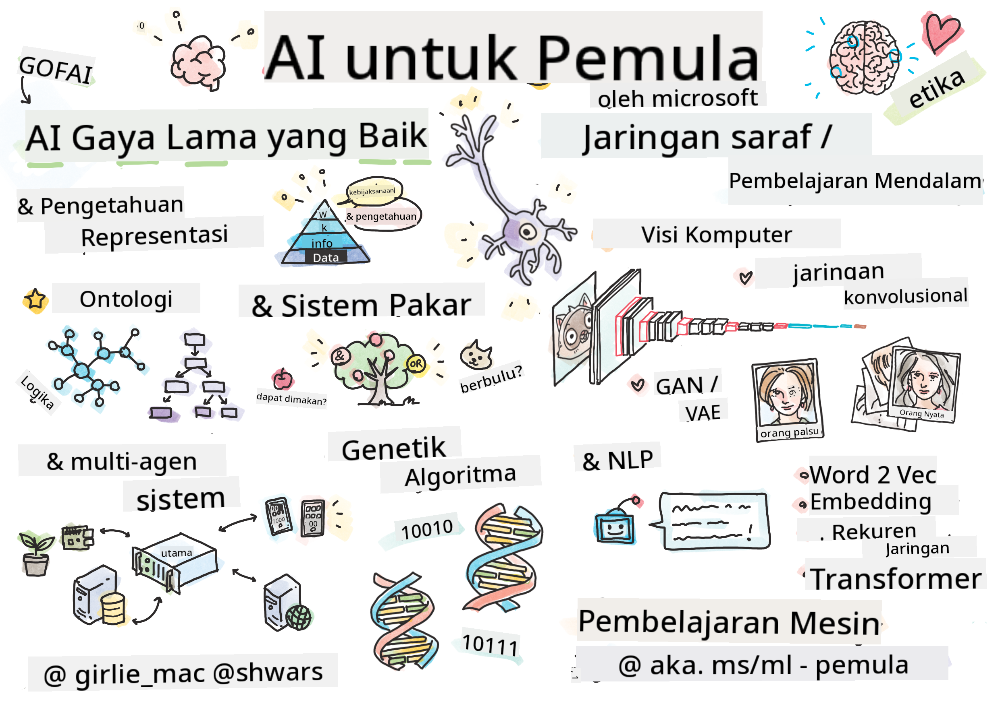

<!--
CO_OP_TRANSLATOR_METADATA:
{
  "original_hash": "5fef1a0b22498d7188959e2a2cb08af7",
  "translation_date": "2025-08-29T12:12:09+00:00",
  "source_file": "lessons/README.md",
  "language_code": "id"
}
-->
# Gambaran Umum

> Sketsa oleh [Tomomi Imura](https://twitter.com/girlie_mac)

---

**Penafian**:  
Dokumen ini telah diterjemahkan menggunakan layanan penerjemahan AI [Co-op Translator](https://github.com/Azure/co-op-translator). Meskipun kami berusaha untuk memberikan hasil yang akurat, harap diingat bahwa terjemahan otomatis mungkin mengandung kesalahan atau ketidakakuratan. Dokumen asli dalam bahasa aslinya harus dianggap sebagai sumber yang otoritatif. Untuk informasi yang bersifat kritis, disarankan menggunakan jasa penerjemahan profesional oleh manusia. Kami tidak bertanggung jawab atas kesalahpahaman atau penafsiran yang keliru yang timbul dari penggunaan terjemahan ini.