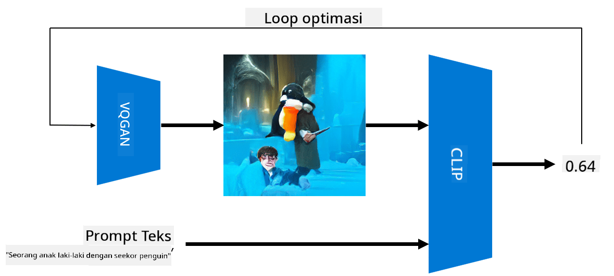

<!--
CO_OP_TRANSLATOR_METADATA:
{
  "original_hash": "9c592c26aca16ca085d268c732284187",
  "translation_date": "2025-08-29T12:18:02+00:00",
  "source_file": "lessons/X-Extras/X1-MultiModal/README.md",
  "language_code": "id"
}
-->
# Jaringan Multi-Modal

Setelah keberhasilan model transformer dalam menyelesaikan tugas NLP, arsitektur yang sama atau serupa telah diterapkan pada tugas penglihatan komputer. Ada minat yang semakin besar untuk membangun model yang dapat *menggabungkan* kemampuan penglihatan dan bahasa alami. Salah satu upaya tersebut dilakukan oleh OpenAI, yang disebut CLIP dan DALL.E.

## Contrastive Image Pre-Training (CLIP)

Ide utama dari CLIP adalah untuk dapat membandingkan teks dengan gambar dan menentukan seberapa baik gambar tersebut sesuai dengan teks.

> *Gambar dari [blog ini](https://openai.com/blog/clip/)*

Model ini dilatih menggunakan gambar yang diperoleh dari Internet dan keterangan gambar mereka. Untuk setiap batch, kita mengambil N pasangan (gambar, teks), dan mengonversinya menjadi representasi vektor tertentu I, ..., I / T, ..., T. Representasi tersebut kemudian dicocokkan satu sama lain. Fungsi loss didefinisikan untuk memaksimalkan kesamaan kosinus antara vektor yang sesuai dengan satu pasangan (misalnya I dan T), dan meminimalkan kesamaan kosinus antara semua pasangan lainnya. Itulah alasan pendekatan ini disebut **contrastive**.

Model/pustaka CLIP tersedia di [GitHub OpenAI](https://github.com/openai/CLIP). Pendekatan ini dijelaskan dalam [blog ini](https://openai.com/blog/clip/), dan lebih rinci dalam [makalah ini](https://arxiv.org/pdf/2103.00020.pdf).

Setelah model ini dilatih sebelumnya, kita dapat memberikannya batch gambar dan batch teks, dan model ini akan mengembalikan tensor dengan probabilitas. CLIP dapat digunakan untuk beberapa tugas:

**Klasifikasi Gambar**

Misalkan kita perlu mengklasifikasikan gambar antara, misalnya, kucing, anjing, dan manusia. Dalam kasus ini, kita dapat memberikan model sebuah gambar, dan serangkaian teks: "*gambar seekor kucing*", "*gambar seekor anjing*", "*gambar seorang manusia*". Dalam vektor hasil dengan 3 probabilitas, kita hanya perlu memilih indeks dengan nilai tertinggi.

> *Gambar dari [blog ini](https://openai.com/blog/clip/)*

**Pencarian Gambar Berbasis Teks**

Kita juga dapat melakukan sebaliknya. Jika kita memiliki koleksi gambar, kita dapat memberikan koleksi ini ke model, dan teks - ini akan memberikan kita gambar yang paling mirip dengan teks yang diberikan.

## ✍️ Contoh: [Menggunakan CLIP untuk Klasifikasi Gambar dan Pencarian Gambar](Clip.ipynb)

Buka notebook [Clip.ipynb](Clip.ipynb) untuk melihat CLIP beraksi.

## Pembuatan Gambar dengan VQGAN+CLIP

CLIP juga dapat digunakan untuk **pembuatan gambar** dari teks. Untuk melakukan ini, kita memerlukan **model generator** yang dapat menghasilkan gambar berdasarkan input vektor tertentu. Salah satu model tersebut disebut [VQGAN](https://compvis.github.io/taming-transformers/) (Vector-Quantized GAN).

Ide utama VQGAN yang membedakannya dari [GAN](../../4-ComputerVision/10-GANs/README.md) biasa adalah sebagai berikut:
* Menggunakan arsitektur transformer autoregresif untuk menghasilkan urutan bagian visual yang kaya konteks yang membentuk gambar. Bagian visual tersebut dipelajari oleh [CNN](../../4-ComputerVision/07-ConvNets/README.md).
* Menggunakan diskriminator sub-gambar yang mendeteksi apakah bagian gambar "nyata" atau "palsu" (berbeda dengan pendekatan "semua atau tidak sama sekali" pada GAN tradisional).

Pelajari lebih lanjut tentang VQGAN di situs web [Taming Transformers](https://compvis.github.io/taming-transformers/).

Salah satu perbedaan penting antara VQGAN dan GAN tradisional adalah bahwa GAN tradisional dapat menghasilkan gambar yang cukup baik dari vektor input apa pun, sementara VQGAN cenderung menghasilkan gambar yang tidak koheren. Oleh karena itu, kita perlu membimbing lebih lanjut proses pembuatan gambar, dan itu dapat dilakukan menggunakan CLIP.

Untuk menghasilkan gambar yang sesuai dengan teks, kita mulai dengan vektor encoding acak yang diteruskan melalui VQGAN untuk menghasilkan gambar. Kemudian CLIP digunakan untuk menghasilkan fungsi loss yang menunjukkan seberapa baik gambar sesuai dengan teks. Tujuannya adalah meminimalkan loss ini, menggunakan backpropagation untuk menyesuaikan parameter vektor input.

Pustaka hebat yang mengimplementasikan VQGAN+CLIP adalah [Pixray](http://github.com/pixray/pixray).

 |   | 
----|----|----
Gambar yang dihasilkan dari teks *a closeup watercolor portrait of young male teacher of literature with a book* | Gambar yang dihasilkan dari teks *a closeup oil portrait of young female teacher of computer science with a computer* | Gambar yang dihasilkan dari teks *a closeup oil portrait of old male teacher of mathematics in front of blackboard*

> Gambar dari koleksi **Artificial Teachers** oleh [Dmitry Soshnikov](http://soshnikov.com)

## DALL-E
### [DALL-E 1](https://openai.com/research/dall-e)
DALL-E adalah versi GPT-3 yang dilatih untuk menghasilkan gambar dari teks. Model ini dilatih dengan 12 miliar parameter.

Berbeda dengan CLIP, DALL-E menerima teks dan gambar sebagai satu aliran token untuk keduanya. Oleh karena itu, dari beberapa teks, Anda dapat menghasilkan gambar berdasarkan teks tersebut.

### [DALL-E 2](https://openai.com/dall-e-2)
Perbedaan utama antara DALL-E 1 dan 2 adalah bahwa DALL-E 2 menghasilkan gambar dan seni yang lebih realistis.

Contoh gambar yang dihasilkan dengan DALL-E:
 |   | 
----|----|----
Gambar yang dihasilkan dari teks *a closeup watercolor portrait of young male teacher of literature with a book* | Gambar yang dihasilkan dari teks *a closeup oil portrait of young female teacher of computer science with a computer* | Gambar yang dihasilkan dari teks *a closeup oil portrait of old male teacher of mathematics in front of blackboard*

## Referensi

* Makalah VQGAN: [Taming Transformers for High-Resolution Image Synthesis](https://compvis.github.io/taming-transformers/paper/paper.pdf)
* Makalah CLIP: [Learning Transferable Visual Models From Natural Language Supervision](https://arxiv.org/pdf/2103.00020.pdf)

---

**Penafian**:  
Dokumen ini telah diterjemahkan menggunakan layanan penerjemahan AI [Co-op Translator](https://github.com/Azure/co-op-translator). Meskipun kami berusaha untuk memberikan hasil yang akurat, harap diingat bahwa terjemahan otomatis mungkin mengandung kesalahan atau ketidakakuratan. Dokumen asli dalam bahasa aslinya harus dianggap sebagai sumber yang otoritatif. Untuk informasi yang bersifat kritis, disarankan menggunakan jasa penerjemahan profesional oleh manusia. Kami tidak bertanggung jawab atas kesalahpahaman atau penafsiran yang keliru yang timbul dari penggunaan terjemahan ini.