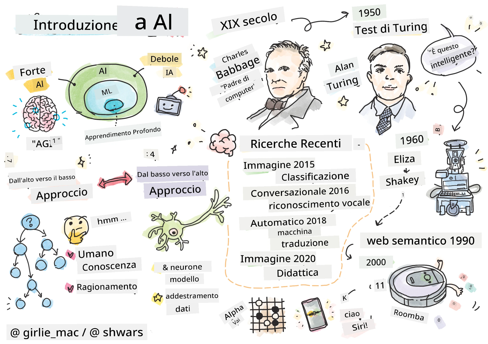
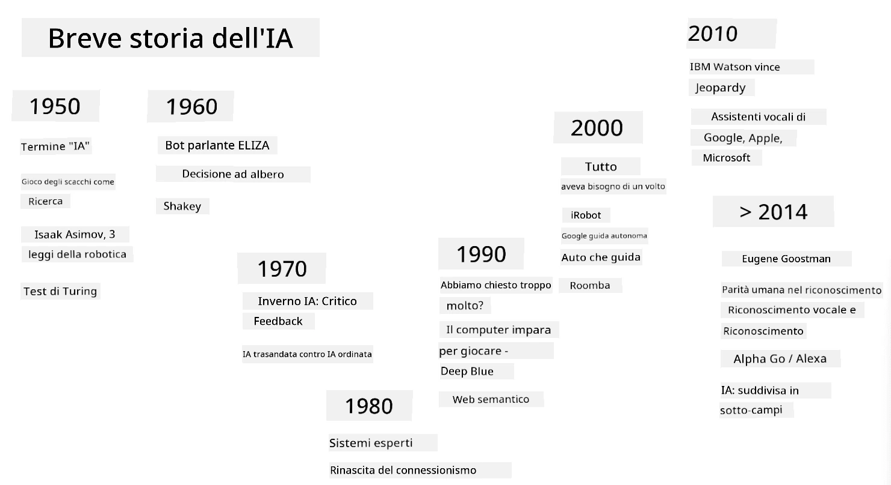
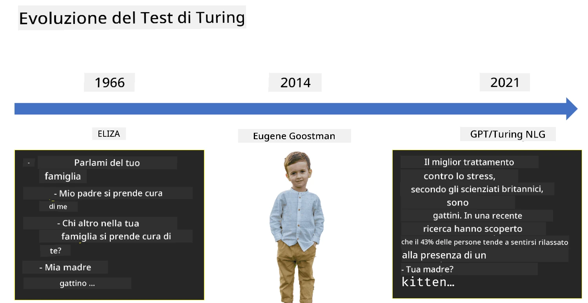

# Introduzione all'Intelligenza Artificiale

> Schizzo di [Tomomi Imura](https://twitter.com/girlie_mac)

## [Quiz pre-lezione](https://ff-quizzes.netlify.app/en/ai/quiz/1)

**L'Intelligenza Artificiale** è una disciplina scientifica entusiasmante che studia come possiamo far sì che i computer mostrino comportamenti intelligenti, ad esempio svolgano attività in cui gli esseri umani eccellono.

Originariamente, i computer furono inventati da [Charles Babbage](https://en.wikipedia.org/wiki/Charles_Babbage) per operare sui numeri seguendo una procedura ben definita - un algoritmo. I computer moderni, anche se significativamente più avanzati rispetto al modello originale proposto nel XIX secolo, seguono ancora lo stesso principio di calcoli controllati. Pertanto, è possibile programmare un computer per fare qualcosa se conosciamo la sequenza esatta di passaggi necessari per raggiungere l'obiettivo.

> Foto di [Vickie Soshnikova](http://twitter.com/vickievalerie)

> ✅ Definire l'età di una persona dalla sua fotografia è un compito che non può essere programmato esplicitamente, perché non sappiamo come arriviamo a un numero nella nostra mente quando lo facciamo.

---

Ci sono alcuni compiti, tuttavia, per i quali non sappiamo esplicitamente come risolverli. Consideriamo il determinare l'età di una persona dalla sua fotografia. In qualche modo impariamo a farlo, perché abbiamo visto molti esempi di persone di età diverse, ma non possiamo spiegare esplicitamente come lo facciamo, né possiamo programmare un computer per farlo. Questo è esattamente il tipo di compito che interessa all'**Intelligenza Artificiale** (IA).

✅ Pensa a qualche compito che potresti delegare a un computer e che trarrebbe vantaggio dall'IA. Considera i settori della finanza, della medicina e delle arti - come stanno beneficiando oggi dell'IA?

## IA Debole vs. IA Forte

IA Debole | IA Forte
---------------------------------------|-------------------------------------
L'IA debole si riferisce a sistemi di IA progettati e addestrati per un compito specifico o un insieme ristretto di compiti.|L'IA forte, o Intelligenza Artificiale Generale (AGI), si riferisce a sistemi di IA con intelligenza e comprensione a livello umano.
Questi sistemi di IA non sono generalmente intelligenti; eccellono nell'esecuzione di un compito predefinito ma mancano di vera comprensione o coscienza.|Questi sistemi di IA hanno la capacità di svolgere qualsiasi compito intellettuale che un essere umano può fare, adattarsi a diversi domini e possedere una forma di coscienza o autoconsapevolezza.
Esempi di IA debole includono assistenti virtuali come Siri o Alexa, algoritmi di raccomandazione utilizzati dai servizi di streaming e chatbot progettati per specifici compiti di assistenza clienti.|Raggiungere l'IA forte è un obiettivo a lungo termine della ricerca sull'IA e richiederebbe lo sviluppo di sistemi di IA che possano ragionare, apprendere, comprendere e adattarsi a una vasta gamma di compiti e contesti.
L'IA debole è altamente specializzata e non possiede capacità cognitive simili a quelle umane o capacità di risoluzione generale dei problemi al di fuori del suo dominio ristretto.|L'IA forte è attualmente un concetto teorico e nessun sistema di IA ha raggiunto questo livello di intelligenza generale.

Per maggiori informazioni, consulta **[Intelligenza Artificiale Generale](https://en.wikipedia.org/wiki/Artificial_general_intelligence)** (AGI).

## La Definizione di Intelligenza e il Test di Turing

Uno dei problemi nel trattare il termine **[Intelligenza](https://en.wikipedia.org/wiki/Intelligence)** è che non esiste una definizione chiara di questo termine. Si potrebbe sostenere che l'intelligenza sia collegata al **pensiero astratto**, o alla **autoconsapevolezza**, ma non possiamo definirla correttamente.

> [Foto](https://unsplash.com/photos/75715CVEJhI) di [Amber Kipp](https://unsplash.com/@sadmax) da Unsplash

Per vedere l'ambiguità del termine *intelligenza*, prova a rispondere alla domanda: "Un gatto è intelligente?". Persone diverse tendono a dare risposte diverse a questa domanda, poiché non esiste un test universalmente accettato per dimostrare che l'affermazione sia vera o meno. E se pensi che ci sia - prova a sottoporre il tuo gatto a un test del QI...

✅ Pensa per un minuto a come definisci l'intelligenza. Un corvo che riesce a risolvere un labirinto per ottenere del cibo è intelligente? Un bambino è intelligente?

---

Quando si parla di AGI, dobbiamo avere un modo per stabilire se abbiamo creato un sistema veramente intelligente. [Alan Turing](https://en.wikipedia.org/wiki/Alan_Turing) propose un metodo chiamato **[Test di Turing](https://en.wikipedia.org/wiki/Turing_test)**, che funge anche da definizione di intelligenza. Il test confronta un sistema dato con qualcosa di intrinsecamente intelligente - un essere umano reale, e poiché qualsiasi confronto automatico può essere aggirato da un programma informatico, utilizziamo un interrogatore umano. Quindi, se un essere umano non è in grado di distinguere tra una persona reale e un sistema informatico in un dialogo basato su testo - il sistema è considerato intelligente.

> Un chatbot chiamato [Eugene Goostman](https://en.wikipedia.org/wiki/Eugene_Goostman), sviluppato a San Pietroburgo, si avvicinò a superare il Test di Turing nel 2014 utilizzando un trucco di personalità intelligente. Dichiarò subito di essere un ragazzo ucraino di 13 anni, il che spiegava la mancanza di conoscenze e alcune discrepanze nel testo. Il bot convinse il 30% dei giudici che fosse umano dopo un dialogo di 5 minuti, una metrica che Turing credeva che una macchina sarebbe stata in grado di superare entro il 2000. Tuttavia, bisogna capire che ciò non indica che abbiamo creato un sistema intelligente, o che un sistema informatico abbia ingannato l'interrogatore umano - il sistema non ha ingannato gli umani, ma piuttosto i creatori del bot lo hanno fatto!

✅ Sei mai stato ingannato da un chatbot nel pensare che stavi parlando con un essere umano? Come ti ha convinto?

## Approcci Diversi all'IA

Se vogliamo che un computer si comporti come un essere umano, dobbiamo in qualche modo modellare all'interno di un computer il nostro modo di pensare. Di conseguenza, dobbiamo cercare di capire cosa rende un essere umano intelligente.

> Per essere in grado di programmare l'intelligenza in una macchina, dobbiamo capire come funzionano i nostri processi decisionali. Se fai un po' di introspezione, ti renderai conto che ci sono alcuni processi che avvengono inconsciamente – ad esempio, possiamo distinguere un gatto da un cane senza pensarci - mentre altri coinvolgono il ragionamento.

Ci sono due possibili approcci a questo problema:

Approccio Top-Down (Ragionamento Simbolico) | Approccio Bottom-Up (Reti Neurali)
---------------------------------------|-------------------------------------
Un approccio top-down modella il modo in cui una persona ragiona per risolvere un problema. Implica l'estrazione di **conoscenza** da un essere umano e la sua rappresentazione in una forma leggibile dal computer. Dobbiamo anche sviluppare un modo per modellare il **ragionamento** all'interno di un computer. | Un approccio bottom-up modella la struttura del cervello umano, costituito da un enorme numero di unità semplici chiamate **neuroni**. Ogni neurone agisce come una media ponderata dei suoi input, e possiamo addestrare una rete di neuroni a risolvere problemi utili fornendo **dati di addestramento**.

Ci sono anche altri possibili approcci all'intelligenza:

* Un approccio **Emergente**, **Sinergico** o **multi-agente** si basa sul fatto che un comportamento intelligente complesso può essere ottenuto dall'interazione di un gran numero di agenti semplici. Secondo la [cibernetica evolutiva](https://en.wikipedia.org/wiki/Global_brain#Evolutionary_cybernetics), l'intelligenza può *emergere* da comportamenti più semplici e reattivi nel processo di *transizione del metasistema*.

* Un approccio **Evolutivo**, o **algoritmo genetico**, è un processo di ottimizzazione basato sui principi dell'evoluzione.

Considereremo questi approcci più avanti nel corso, ma per ora ci concentreremo su due direzioni principali: top-down e bottom-up.

### L'Approccio Top-Down

In un **approccio top-down**, cerchiamo di modellare il nostro ragionamento. Poiché possiamo seguire i nostri pensieri quando ragioniamo, possiamo cercare di formalizzare questo processo e programmarlo all'interno del computer. Questo è chiamato **ragionamento simbolico**.

Le persone tendono ad avere alcune regole nella loro mente che guidano i loro processi decisionali. Ad esempio, quando un medico diagnostica un paziente, può rendersi conto che una persona ha la febbre e quindi potrebbe esserci un'infiammazione in corso nel corpo. Applicando un ampio insieme di regole a un problema specifico, un medico può essere in grado di arrivare alla diagnosi finale.

Questo approccio si basa fortemente sulla **rappresentazione della conoscenza** e sul **ragionamento**. Estrarre conoscenza da un esperto umano potrebbe essere la parte più difficile, perché un medico in molti casi non saprebbe esattamente perché sta arrivando a una particolare diagnosi. A volte la soluzione semplicemente emerge nella sua mente senza un pensiero esplicito. Alcuni compiti, come determinare l'età di una persona da una fotografia, non possono affatto essere ridotti alla manipolazione della conoscenza.

### Approccio Bottom-Up

In alternativa, possiamo cercare di modellare gli elementi più semplici all'interno del nostro cervello – un neurone. Possiamo costruire una cosiddetta **rete neurale artificiale** all'interno di un computer e poi cercare di insegnarle a risolvere problemi fornendole esempi. Questo processo è simile a come un neonato impara a conoscere il suo ambiente facendo osservazioni.

✅ Fai una piccola ricerca su come i bambini imparano. Quali sono gli elementi di base del cervello di un bambino?

> | E il ML?         |      |
> |--------------|-----------|
> | Parte dell'Intelligenza Artificiale basata sull'apprendimento del computer per risolvere un problema basato su alcuni dati è chiamata **Machine Learning**. Non considereremo il machine learning classico in questo corso - ti rimandiamo al curriculum separato [Machine Learning for Beginners](http://aka.ms/ml-beginners). |       |

## Breve Storia dell'IA

L'Intelligenza Artificiale è iniziata come campo a metà del ventesimo secolo. Inizialmente, il ragionamento simbolico era l'approccio prevalente e portò a una serie di successi importanti, come i sistemi esperti – programmi informatici in grado di agire come esperti in alcuni domini di problemi limitati. Tuttavia, presto divenne chiaro che tale approccio non si scala bene. Estrarre la conoscenza da un esperto, rappresentarla in un computer e mantenere accurata quella base di conoscenza si rivelò un compito molto complesso e troppo costoso per essere pratico in molti casi. Questo portò al cosiddetto [AI Winter](https://en.wikipedia.org/wiki/AI_winter) negli anni '70.

> Immagine di [Dmitry Soshnikov](http://soshnikov.com)

Con il passare del tempo, le risorse informatiche sono diventate più economiche e sono stati disponibili più dati, quindi gli approcci basati su reti neurali hanno iniziato a dimostrare grandi prestazioni nel competere con gli esseri umani in molte aree, come la visione artificiale o la comprensione del linguaggio. Nell'ultimo decennio, il termine Intelligenza Artificiale è stato utilizzato principalmente come sinonimo di Reti Neurali, poiché la maggior parte dei successi dell'IA di cui sentiamo parlare si basa su di esse.

Possiamo osservare come gli approcci siano cambiati, ad esempio, nella creazione di un programma per giocare a scacchi:

* I primi programmi di scacchi si basavano sulla ricerca – un programma cercava esplicitamente di stimare le mosse possibili di un avversario per un dato numero di mosse successive e selezionava una mossa ottimale basata sulla posizione ottimale che poteva essere raggiunta in poche mosse. Questo portò allo sviluppo del cosiddetto algoritmo di ricerca [alpha-beta pruning](https://en.wikipedia.org/wiki/Alpha%E2%80%93beta_pruning).
* Le strategie di ricerca funzionano bene verso la fine del gioco, dove lo spazio di ricerca è limitato da un piccolo numero di mosse possibili. Tuttavia, all'inizio del gioco, lo spazio di ricerca è enorme e l'algoritmo può essere migliorato imparando dalle partite esistenti tra giocatori umani. Esperimenti successivi impiegarono il cosiddetto [case-based reasoning](https://en.wikipedia.org/wiki/Case-based_reasoning), dove il programma cercava casi nella base di conoscenza molto simili alla posizione attuale nel gioco.
* I programmi moderni che vincono contro i giocatori umani si basano su reti neurali e [apprendimento per rinforzo](https://en.wikipedia.org/wiki/Reinforcement_learning), dove i programmi imparano a giocare esclusivamente giocando a lungo contro se stessi e imparando dai propri errori – proprio come fanno gli esseri umani quando imparano a giocare a scacchi. Tuttavia, un programma informatico può giocare molte più partite in molto meno tempo e quindi può imparare molto più velocemente.

✅ Fai una piccola ricerca su altri giochi giocati dall'IA.

Allo stesso modo, possiamo vedere come l'approccio verso la creazione di "programmi parlanti" (che potrebbero superare il Test di Turing) sia cambiato:

* I primi programmi di questo tipo, come [Eliza](https://en.wikipedia.org/wiki/ELIZA), si basavano su regole grammaticali molto semplici e sulla riformulazione della frase di input in una domanda.
* Gli assistenti moderni, come Cortana, Siri o Google Assistant, sono tutti sistemi ibridi che utilizzano reti neurali per convertire il discorso in testo e riconoscere il nostro intento, e poi impiegano qualche ragionamento o algoritmi espliciti per eseguire le azioni richieste.
* In futuro, possiamo aspettarci un modello completamente basato su reti neurali per gestire il dialogo autonomamente. Le recenti famiglie di reti neurali GPT e [Turing-NLG](https://www.microsoft.com/research/blog/turing-nlg-a-17-billion-parameter-language-model-by-microsoft) mostrano grandi successi in questo.

> Immagine di Dmitry Soshnikov, [foto](https://unsplash.com/photos/r8LmVbUKgns) di [Marina Abrosimova](https://unsplash.com/@abrosimova_marina_foto), Unsplash

## Ricerca recente sull'IA

Il grande sviluppo recente nella ricerca sulle reti neurali è iniziato intorno al 2010, quando sono diventati disponibili grandi dataset pubblici. Una vasta raccolta di immagini chiamata [ImageNet](https://en.wikipedia.org/wiki/ImageNet), che contiene circa 14 milioni di immagini annotate, ha dato vita alla [ImageNet Large Scale Visual Recognition Challenge](https://image-net.org/challenges/LSVRC/).

> Immagine di [Dmitry Soshnikov](http://soshnikov.com)

Nel 2012, le [Reti Neurali Convoluzionali](../4-ComputerVision/07-ConvNets/README.md) sono state utilizzate per la prima volta nella classificazione delle immagini, portando a una significativa riduzione degli errori di classificazione (dal quasi 30% al 16,4%). Nel 2015, l'architettura ResNet di Microsoft Research ha [raggiunto un livello di precisione pari a quello umano](https://doi.org/10.1109/ICCV.2015.123).

Da allora, le reti neurali hanno dimostrato un comportamento molto efficace in molti compiti:

---

Anno | Parità con l'uomo raggiunta
-----|--------
2015 | [Classificazione delle immagini](https://doi.org/10.1109/ICCV.2015.123)
2016 | [Riconoscimento vocale conversazionale](https://arxiv.org/abs/1610.05256)
2018 | [Traduzione automatica](https://arxiv.org/abs/1803.05567) (Cinese-Inglese)
2020 | [Descrizione delle immagini](https://arxiv.org/abs/2009.13682)

Negli ultimi anni abbiamo assistito a enormi successi con i modelli linguistici di grandi dimensioni, come BERT e GPT-3. Questo è avvenuto principalmente grazie alla disponibilità di una grande quantità di dati testuali generali, che ci permette di addestrare modelli per catturare la struttura e il significato dei testi, pre-addestrarli su collezioni testuali generali e poi specializzarli per compiti più specifici. Impareremo di più sul [Natural Language Processing](../5-NLP/README.md) più avanti in questo corso.

## 🚀 Sfida

Fai un giro su internet per determinare, secondo te, dove l'IA viene utilizzata in modo più efficace. È in un'app di mappatura, in un servizio di riconoscimento vocale o in un videogioco? Ricerca come è stato costruito il sistema.

## [Quiz post-lezione](https://ff-quizzes.netlify.app/en/ai/quiz/2)

## Revisione e studio autonomo

Rivedi la storia dell'IA e del ML leggendo [questa lezione](https://github.com/microsoft/ML-For-Beginners/tree/main/1-Introduction/2-history-of-ML). Prendi un elemento dallo sketchnote all'inizio di quella lezione o di questa e approfondiscilo per comprendere il contesto culturale che ha informato la sua evoluzione.

**Compito**: [Game Jam](assignment.md)

---

<!-- CO-OP TRANSLATOR DISCLAIMER START -->
**Disclaimer**:  
Questo documento è stato tradotto utilizzando il servizio di traduzione AI [Co-op Translator](https://github.com/Azure/co-op-translator). Sebbene ci impegniamo per garantire l'accuratezza, si prega di notare che le traduzioni automatiche potrebbero contenere errori o imprecisioni. Il documento originale nella sua lingua nativa dovrebbe essere considerato la fonte autorevole. Per informazioni critiche, si raccomanda una traduzione professionale umana. Non siamo responsabili per eventuali incomprensioni o interpretazioni errate derivanti dall'uso di questa traduzione.
<!-- CO-OP TRANSLATOR DISCLAIMER END -->