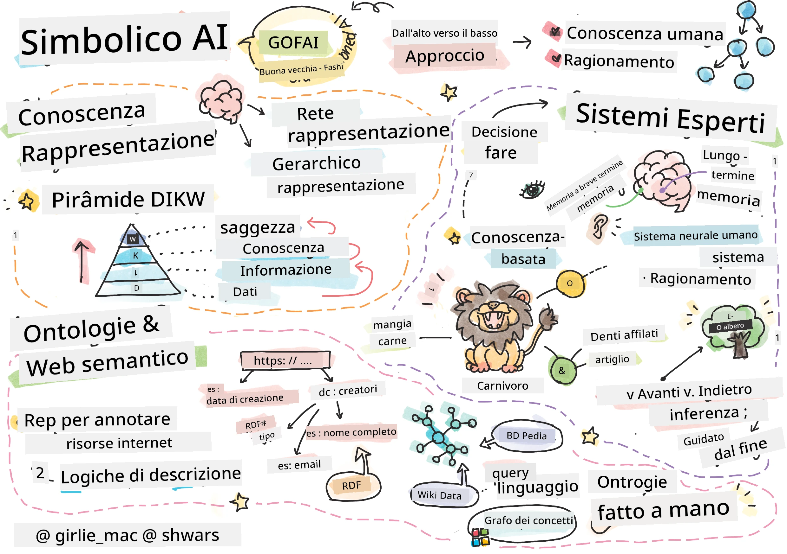
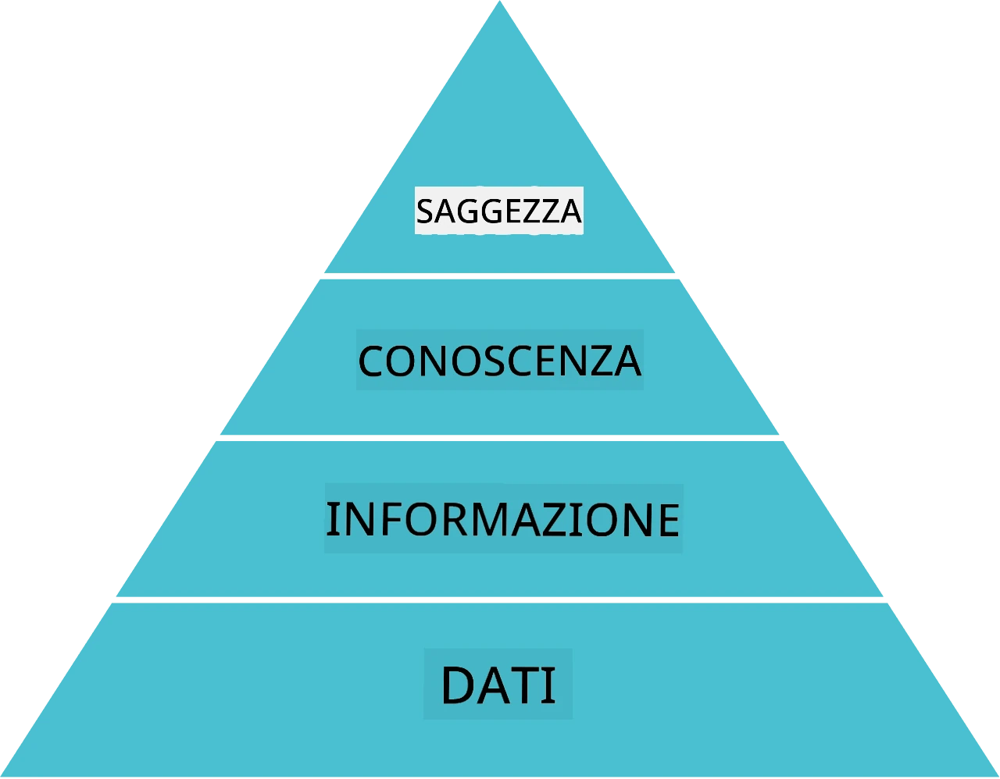
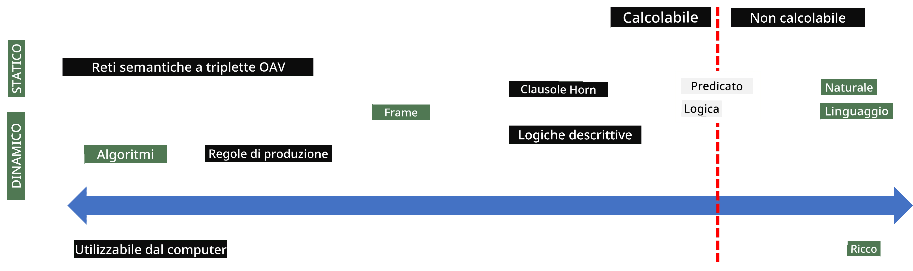
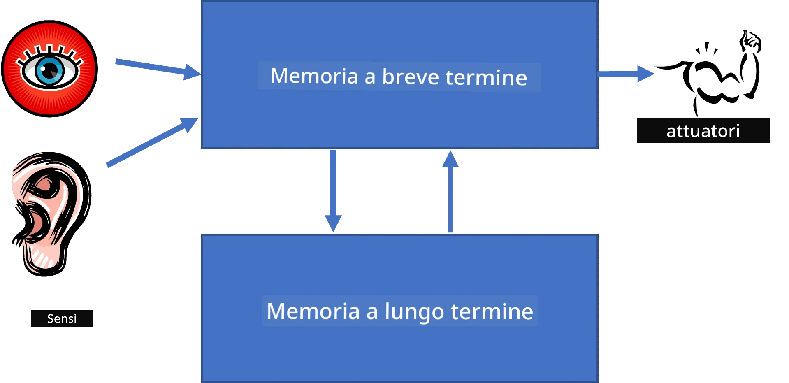
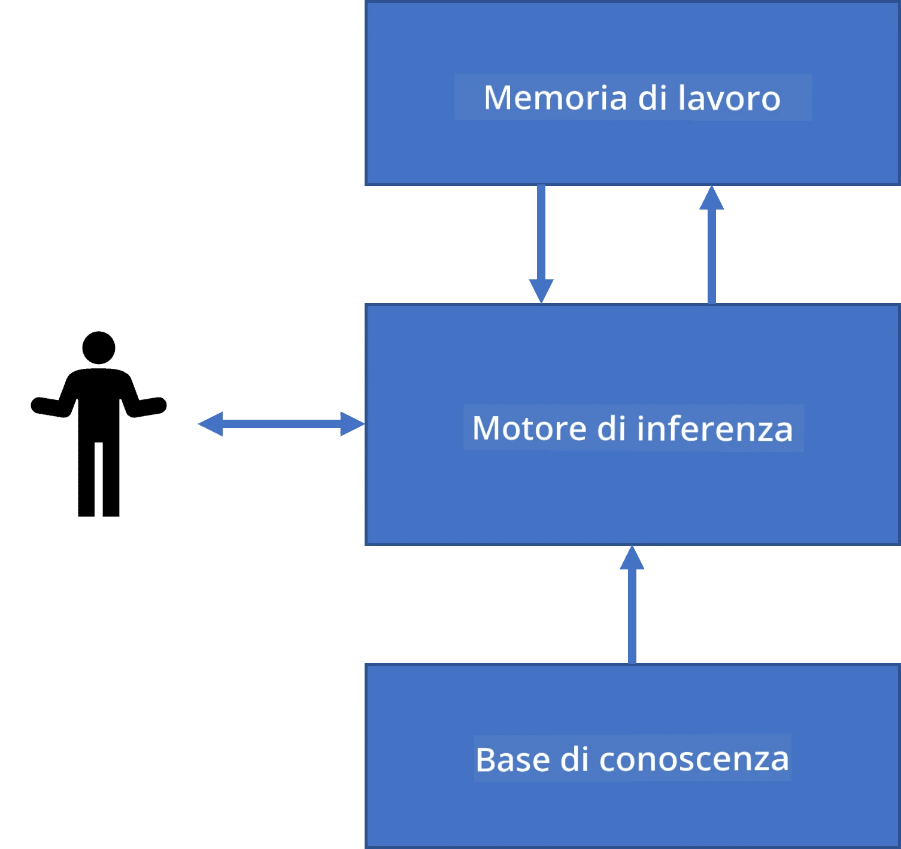
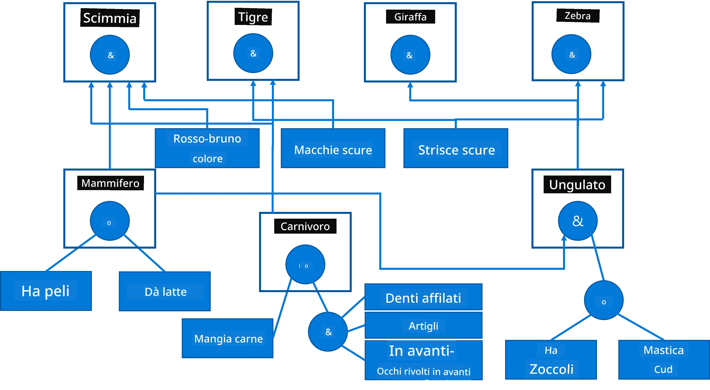
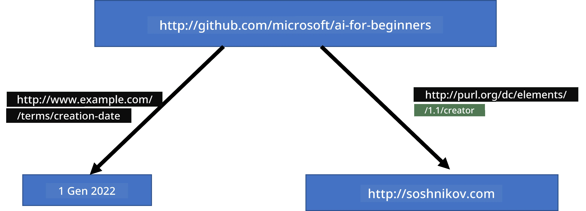
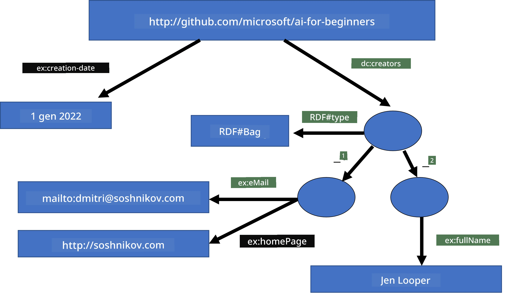
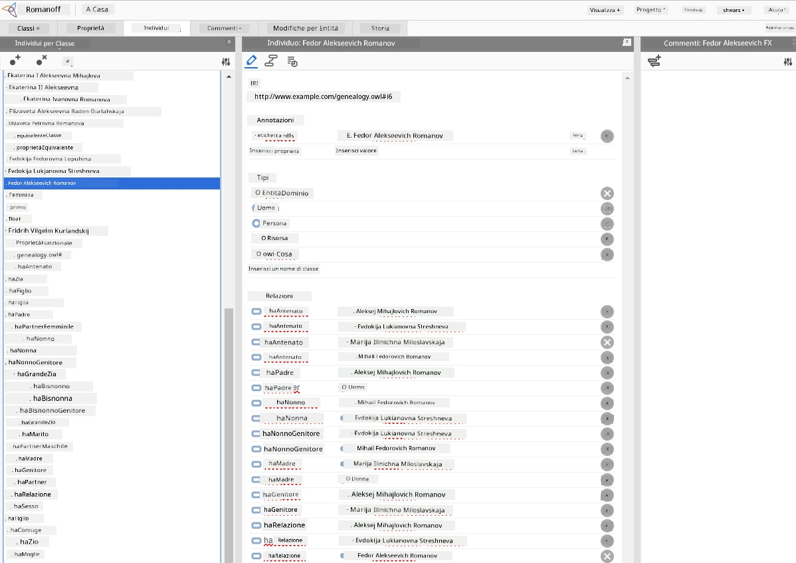

# Rappresentazione della Conoscenza e Sistemi Esperti



> Sketchnote di [Tomomi Imura](https://twitter.com/girlie_mac)

La ricerca dell'intelligenza artificiale si basa su una ricerca della conoscenza, per comprendere il mondo in modo simile a come fanno gli esseri umani. Ma come si può fare questo?

## [Quiz pre-lezione](https://ff-quizzes.netlify.app/en/ai/quiz/3)

Nei primi giorni dell'IA, l'approccio top-down alla creazione di sistemi intelligenti (discusso nella lezione precedente) era popolare. L'idea era di estrarre la conoscenza dalle persone in una qualche forma interpretabile dalla macchina, e poi usarla per risolvere problemi automaticamente. Questo approccio si basava su due grandi idee:

* Rappresentazione della Conoscenza
* Ragionamento

## Rappresentazione della Conoscenza

Uno dei concetti importanti nell'IA simbolica è la **conoscenza**. È importante differenziare la conoscenza da *informazione* o *dati*. Per esempio, si può dire che i libri contengono conoscenza, perché studiando i libri si può diventare esperti. Tuttavia, ciò che i libri contengono in realtà si chiama *dati*, e leggendo i libri e integrando questi dati nel nostro modello del mondo trasformiamo tali dati in conoscenza.

> ✅ **Conoscenza** è qualcosa che è contenuta nella nostra testa e rappresenta la nostra comprensione del mondo. Viene ottenuta tramite un processo attivo di **apprendimento**, che integra pezzi di informazione che riceviamo nel nostro modello attivo del mondo.

Più spesso, non definiamo la conoscenza in modo rigoroso, ma la allineiamo con altri concetti correlati usando la [Piràmide DIKW](https://it.wikipedia.org/wiki/Piramide_DI_KW). Contiene i seguenti concetti:

* **Dati** sono qualcosa rappresentato in un supporto fisico, come testo scritto o parole pronunciate. I dati esistono indipendentemente dagli esseri umani e possono essere trasmessi tra persone.
* **Informazione** è come interpretiamo i dati nella nostra mente. Per esempio, quando sentiamo la parola *computer*, abbiamo una certa comprensione di cosa sia.
* **Conoscenza** è l'informazione integrata nel nostro modello del mondo. Per esempio, una volta che impariamo cosa è un computer, iniziamo ad avere alcune idee su come funziona, quanto costa e a cosa può essere usato. Questa rete di concetti interrelati forma la nostra conoscenza.
* **Saggezza** è un livello ulteriore della nostra comprensione del mondo, e rappresenta la *meta-conoscenza*, es. una nozione su come e quando la conoscenza dovrebbe essere usata.



*Immagine [da Wikipedia](https://commons.wikimedia.org/w/index.php?curid=37705247), Di Longlivetheux - Opera propria, CC BY-SA 4.0*

Quindi, il problema della **rappresentazione della conoscenza** è trovare qualche modo efficace di rappresentare la conoscenza all'interno di un computer in forma di dati, per renderla automaticamente utilizzabile. Questo può essere visto come uno spettro:



> Immagine di [Dmitry Soshnikov](http://soshnikov.com)

* A sinistra, ci sono tipi molto semplici di rappresentazione della conoscenza che possono essere efficacemente usati dai computer. Il più semplice è algoritmico, quando la conoscenza è rappresentata da un programma per computer. Questo, però, non è il miglior modo di rappresentare la conoscenza, perché non è flessibile. La conoscenza nella nostra testa è spesso non algoritmica.
* A destra, ci sono rappresentazioni come il testo naturale. È il più potente, ma non può essere usato per ragionamenti automatici.

> ✅ Pensa un attimo a come rappresenti la conoscenza nella tua testa e la converti in appunti. C'è un formato particolare che funziona bene per te per aiutare nella memorizzazione?

## Classificazione delle Rappresentazioni della Conoscenza al Computer

Possiamo classificare i diversi metodi di rappresentazione della conoscenza al computer nelle seguenti categorie:

* **Rappresentazioni a rete** si basano sul fatto che abbiamo una rete di concetti interrelati nella nostra testa. Possiamo cercare di riprodurre le stesse reti come un grafo all'interno di un computer - una cosiddetta **rete semantica**.

1. **Triplette Oggetto-Attributo-Valore** o **coppie attributo-valore**. Poiché un grafo può essere rappresentato in un computer come una lista di nodi e archi, possiamo rappresentare una rete semantica tramite una lista di triplette, contenenti oggetti, attributi e valori. Per esempio, costruiamo le seguenti triplette su linguaggi di programmazione:

Oggetto | Attributo | Valore
--------|-----------|-------
Python  | è        | Linguaggio non tipizzato
Python  | inventato-da | Guido van Rossum
Python  | sintassi blocco | indentazione
Linguaggio non tipizzato | non ha | definizioni di tipo

> ✅ Pensa a come le triplette possono essere usate per rappresentare altri tipi di conoscenza.

2. **Rappresentazioni gerarchiche** enfatizzano il fatto che spesso creiamo una gerarchia di oggetti nella nostra mente. Per esempio, sappiamo che il canarino è un uccello, e tutti gli uccelli hanno le ali. Abbiamo anche una certa idea di quale colore ha solitamente un canarino, e qual è la velocità di volo.

   - La **rappresentazione a frame** si basa sul rappresentare ogni oggetto o classe di oggetti come un **frame** che contiene **slot**. Gli slot possono avere valori predefiniti possibili, restrizioni sul valore, o procedure memorizzate che possono essere chiamate per ottenere il valore di uno slot. Tutti i frame formano una gerarchia simile a una gerarchia degli oggetti nei linguaggi di programmazione orientati agli oggetti.
   - I **scenario** sono un tipo speciale di frame che rappresentano situazioni complesse che possono svolgersi nel tempo.

**Python**

Slot | Valore | Valore predefinito | Intervallo |
-----|---------|--------------------|------------|
Nome | Python  |                    |            |
È-Un | Linguaggio non tipizzato |          |            |
Variabile case |         | CamelCase          |            |
Lunghezza programma |     |                    | 5-5000 righe |
Sintassi blocco | Indentazione |             |            |

3. **Rappresentazioni procedurali** si basano sul rappresentare la conoscenza tramite una lista di azioni che possono essere eseguite quando si verifica una certa condizione.
   - Le regole di produzione sono affermazioni di tipo se-allora che ci permettono di trarre conclusioni. Per esempio, un medico può avere una regola che dice che **SE** un paziente ha febbre alta **O** un alto livello di proteina C-reattiva nell'analisi del sangue **ALLORA** ha un'infiammazione. Quando incontriamo una delle condizioni, possiamo trarre una conclusione sull'infiammazione, e poi usarla nel ragionamento successivo.
   - Gli algoritmi possono essere considerati un'altra forma di rappresentazione procedurale, anche se sono quasi mai usati direttamente nei sistemi basati sulla conoscenza.

4. La **Logica** fu originariamente proposta da Aristotele come modo per rappresentare la conoscenza universale umana.
   - La Logica dei predicati come teoria matematica è troppo ricca per essere computabile, quindi normalmente viene usato un sottoinsieme, come le clausole di Horn usate in Prolog.
   - La Logica descrittiva è una famiglia di sistemi logici usati per rappresentare e ragionare su gerarchie di oggetti e rappresentazioni della conoscenza distribuite come il *semantic web*.

## Sistemi Esperti

Uno dei primi successi dell'IA simbolica furono i cosiddetti **sistemi esperti** - sistemi computerizzati progettati per agire come esperti in un dominio di problemi limitato. Essi si basavano su una **base di conoscenza** estratta da uno o più esperti umani, e contenevano un **motore di inferenza** che eseguiva del ragionamento su di essa.

 | 
---------------------------------------------|------------------------------------------------
Struttura semplificata di un sistema neurale umano | Architettura di un sistema basato su conoscenza

I sistemi esperti sono costruiti come il sistema di ragionamento umano, che contiene **memoria a breve termine** e **memoria a lungo termine**. Analogamente, nei sistemi basati sulla conoscenza distinguiamo i seguenti componenti:

* **Memoria problema**: contiene la conoscenza sul problema attualmente risolto, cioè la temperatura o la pressione sanguigna di un paziente, se ha infiammazione o no, etc. Questa conoscenza è anche chiamata **conoscenza statica**, perché contiene un'istantanea di ciò che sappiamo al momento sul problema - lo stato del problema.
* **Base di conoscenza**: rappresenta la conoscenza a lungo termine su un dominio di problema. Viene estratta manualmente dagli esperti umani, e non cambia da consultazione a consultazione. Poiché ci permette di navigare da uno stato del problema a un altro, è anche chiamata **conoscenza dinamica**.
* **Motore di inferenza**: orchestra l'intero processo di ricerca nello spazio degli stati del problema, facendo domande all'utente quando necessario. È anche responsabile di trovare le regole giuste da applicare a ogni stato.

Come esempio, consideriamo il seguente sistema esperto per determinare un animale basato sulle sue caratteristiche fisiche:



> Immagine di [Dmitry Soshnikov](http://soshnikov.com)

Questo diagramma si chiama **albero AND-OR**, ed è una rappresentazione grafica di un insieme di regole di produzione. Disegnare un albero è utile all'inizio dell'estrazione della conoscenza dall'esperto. Per rappresentare la conoscenza all'interno del computer è più conveniente usare le regole:

```
IF the animal eats meat
OR (animal has sharp teeth
    AND animal has claws
    AND animal has forward-looking eyes
) 
THEN the animal is a carnivore
```

Puoi notare che ogni condizione sul lato sinistro della regola e l'azione sono essenzialmente triplette oggetto-attributo-valore (OAV). La **memoria di lavoro** contiene l'insieme delle triplette OAV che corrispondono al problema attualmente risolto. Un **motore di regole** cerca regole per cui una condizione è soddisfatta e le applica, aggiungendo un'altra tripletta alla memoria di lavoro.

> ✅ Scrivi il tuo albero AND-OR su un argomento che ti piace!

### Inferenza Diretta vs. Inversa

Il processo descritto sopra si chiama **inferenza diretta**. Inizia con alcuni dati iniziali sul problema disponibili nella memoria di lavoro, e poi esegue il seguente ciclo di ragionamento:

1. Se l'attributo obiettivo è presente nella memoria di lavoro - fermati e dai il risultato
2. Cerca tutte le regole la cui condizione è attualmente soddisfatta - ottieni un **insieme di conflitto** di regole.
3. Esegui la **risoluzione del conflitto** - seleziona una regola che sarà eseguita in questo passo. Ci possono essere diverse strategie di risoluzione del conflitto:
   - Seleziona la prima regola applicabile nella base di conoscenza
   - Seleziona una regola a caso
   - Seleziona una regola *più specifica*, cioè quella che soddisfa più condizioni nella "parte sinistra" (LHS)
4. Applica la regola selezionata e inserisci un nuovo pezzo di conoscenza nello stato del problema
5. Ripeti dal passo 1.

Tuttavia, in alcuni casi potremmo voler partire da una conoscenza vuota sul problema, e fare domande che ci aiutino a raggiungere la conclusione. Per esempio, quando si fa una diagnosi medica, di solito non eseguiamo tutte le analisi mediche in anticipo prima di iniziare a diagnosticare il paziente. Piuttosto, vogliamo eseguire le analisi quando bisogna prendere una decisione.

Questo processo può essere modellato usando l'**inferenza inversa**. È guidata dal **goal** - il valore dell'attributo che vogliamo trovare:

1. Seleziona tutte le regole che possono darci il valore di un goal (cioè con il goal sul RHS ("right-hand-side")) - un insieme di conflitto
1. Se non ci sono regole per questo attributo, o c'è una regola che dice che dovremmo chiedere il valore all'utente - chiedilo, altrimenti:
1. Usa la strategia di risoluzione del conflitto per selezionare una regola che useremo come *ipotesi* - proveremo a dimostrarla
1. Ripeti ricorsivamente il processo per tutti gli attributi nel LHS della regola, cercando di dimostrarli come goal
1. Se in qualsiasi momento il processo fallisce - usa un'altra regola al passo 3.

> ✅ In quali situazioni l'inferenza diretta è più appropriata? E l'inferenza inversa?

### Implementare Sistemi Esperti

I sistemi esperti possono essere implementati usando diversi strumenti:

* Programmandoli direttamente in un linguaggio di programmazione ad alto livello. Questa non è la migliore idea, perché il vantaggio principale di un sistema basato sulla conoscenza è che la conoscenza è separata dall'inferenza, e potenzialmente un esperto del dominio del problema dovrebbe essere in grado di scrivere regole senza comprendere i dettagli del processo di inferenza.
* Usando una **shell per sistemi esperti**, cioè un sistema specificamente progettato per essere popolato di conoscenza usando qualche linguaggio di rappresentazione della conoscenza.

## ✍️ Esercizio: Inferenza Animale

Vedi [Animals.ipynb](https://github.com/microsoft/AI-For-Beginners/blob/main/lessons/2-Symbolic/Animals.ipynb) per un esempio di implementazione di un sistema esperto con inferenza diretta e inversa.

> **Nota**: Questo esempio è piuttosto semplice, e dà solo l'idea di come è fatto un sistema esperto. Una volta che inizi a creare un sistema del genere, noterai un comportamento *intelligente* solo quando raggiungi un certo numero di regole, circa 200+. A un certo punto, le regole diventano troppo complesse per tenerle tutte a mente, e a quel punto potresti iniziare a chiederti perché un sistema prende certe decisioni. Tuttavia, la caratteristica importante dei sistemi basati sulla conoscenza è che puoi sempre *spiegare* esattamente come è stata presa una qualsiasi decisione.

## Ontologie e il Web Semantico

Alla fine del XX secolo c'è stata un'iniziativa di usare la rappresentazione della conoscenza per annotare risorse Internet, in modo che fosse possibile trovare risorse che corrispondessero a query molto specifiche. Questo movimento si chiamava **Web Semantico**, e si basava su diversi concetti:

- Una rappresentazione della conoscenza speciale basata su **[logiche descrittive](https://en.wikipedia.org/wiki/Description_logic)** (DL). È simile alla rappresentazione della conoscenza a frame, perché costruisce una gerarchia di oggetti con proprietà, ma ha una semantica logica formale e inferenza. Esiste un'intera famiglia di DL che bilancia tra espressività e complessità algoritmica dell'inferenza.
- Rappresentazione della conoscenza distribuita, dove tutti i concetti sono rappresentati da un identificatore URI globale, consentendo di creare gerarchie di conoscenza che attraversano Internet.
- Una famiglia di linguaggi basati su XML per la descrizione della conoscenza: RDF (Resource Description Framework), RDFS (RDF Schema), OWL (Ontology Web Language).

Un concetto fondamentale nel Web Semantico è il concetto di **Ontologia**. Si riferisce a una specifica esplicita di un dominio problematica utilizzando una rappresentazione formale della conoscenza. L'ontologia più semplice può essere solo una gerarchia di oggetti in un dominio problematico, ma ontologie più complesse includeranno regole che possono essere utilizzate per inferenza.

Nel web semantico, tutte le rappresentazioni si basano su triplette. Ogni oggetto e ogni relazione sono univocamente identificati dall'URI. Per esempio, se vogliamo affermare il fatto che questo Curriculum AI è stato sviluppato da Dmitry Soshnikov il 1° gennaio 2022 - ecco le triplette che possiamo usare:



```
http://github.com/microsoft/ai-for-beginners http://www.example.com/terms/creation-date “Jan 1, 2022”
http://github.com/microsoft/ai-for-beginners http://purl.org/dc/elements/1.1/creator http://soshnikov.com
```

> ✅ Qui `http://www.example.com/terms/creation-date` e `http://purl.org/dc/elements/1.1/creator` sono alcuni URI ben noti e universalmente accettati per esprimere i concetti di *creatore* e *data di creazione*.

In un caso più complesso, se vogliamo definire una lista di creatori, possiamo usare alcune strutture dati definite in RDF.



> Diagrammi sopra di [Dmitry Soshnikov](http://soshnikov.com)

Il progresso nella costruzione del Web Semantico è stato in qualche modo rallentato dal successo dei motori di ricerca e delle tecniche di elaborazione del linguaggio naturale, che consentono di estrarre dati strutturati dal testo. Tuttavia, in alcune aree ci sono ancora sforzi significativi per mantenere ontologie e basi di conoscenza. Alcuni progetti da segnalare:

* [WikiData](https://wikidata.org/) è una raccolta di basi di conoscenza leggibili da macchina associate a Wikipedia. La maggior parte dei dati è estratta dalle *InfoBoxes* di Wikipedia, pezzi di contenuto strutturato all'interno delle pagine di Wikipedia. È possibile [interrogare](https://query.wikidata.org/) wikidata in SPARQL, un linguaggio di query speciale per il Web Semantico. Ecco una query di esempio che mostra i colori degli occhi più popolari tra gli esseri umani:

```sparql
#defaultView:BubbleChart
SELECT ?eyeColorLabel (COUNT(?human) AS ?count)
WHERE
{
  ?human wdt:P31 wd:Q5.       # human instance-of homo sapiens
  ?human wdt:P1340 ?eyeColor. # human eye-color ?eyeColor
  SERVICE wikibase:label { bd:serviceParam wikibase:language "en". }
}
GROUP BY ?eyeColorLabel
```

* [DBpedia](https://www.dbpedia.org/) è un altro sforzo simile a WikiData.

> ✅ Se vuoi sperimentare la costruzione delle tue ontologie, o aprire quelle esistenti, c'è un ottimo editor visivo di ontologie chiamato [Protégé](https://protege.stanford.edu/). Scaricalo o usalo online.



*Editor Web Protégé aperto con l'ontologia della Famiglia Romanov. Screenshot di Dmitry Soshnikov*

## ✍️ Esercizio: Un'ontologia familiare

Consulta [FamilyOntology.ipynb](https://github.com/Ezana135/AI-For-Beginners/blob/main/lessons/2-Symbolic/FamilyOntology.ipynb) per un esempio di utilizzo delle tecniche del Web Semantico per ragionare sulle relazioni familiari. Prenderemo un albero genealogico rappresentato nel formato GEDCOM comune e un'ontologia delle relazioni familiari e costruiremo un grafo di tutte le relazioni familiari per un dato insieme di individui.

## Microsoft Concept Graph

Nella maggior parte dei casi, le ontologie sono create manualmente con cura. Tuttavia, è anche possibile **estrarre** ontologie da dati non strutturati, per esempio, da testi in linguaggio naturale.

Un tentativo del genere è stato fatto da Microsoft Research, che ha prodotto [Microsoft Concept Graph](https://blogs.microsoft.com/ai/microsoft-researchers-release-graph-that-helps-machines-conceptualize/?WT.mc_id=academic-77998-cacaste).

Si tratta di una grande raccolta di entità raggruppate insieme usando la relazione di ereditarietà `is-a`. Consente di rispondere a domande come "Cos'è Microsoft?" - la risposta è qualcosa come "una compagnia con probabilità 0.87, e un marchio con probabilità 0.75".

Il Grafo è disponibile sia come API REST, sia come un grande file di testo scaricabile che elenca tutte le coppie di entità.

## ✍️ Esercizio: Un grafo concettuale

Prova il notebook [MSConceptGraph.ipynb](https://github.com/microsoft/AI-For-Beginners/blob/main/lessons/2-Symbolic/MSConceptGraph.ipynb) per vedere come possiamo usare Microsoft Concept Graph per raggruppare articoli di notizie in diverse categorie.

## Conclusione

Oggigiorno, l'AI è spesso considerata sinonimo di *Machine Learning* o *Reti Neurali*. Tuttavia, un essere umano manifesta anche ragionamento esplicito, qualcosa che attualmente non viene gestito dalle reti neurali. Nei progetti reali, il ragionamento esplicito è ancora usato per svolgere compiti che richiedono spiegazioni o la capacità di modificare il comportamento del sistema in modo controllato.

## 🚀 Sfida

Nel notebook Ontologia Familiare associato a questa lezione, c'è la possibilità di sperimentare con altre relazioni familiari. Prova a scoprire nuove connessioni tra le persone nell'albero genealogico.

## [Quiz post-lezione](https://ff-quizzes.netlify.app/en/ai/quiz/4)

## Revisione & Studio autonomo

Fai qualche ricerca su internet per scoprire le aree in cui gli esseri umani hanno cercato di quantificare e codificare la conoscenza. Dai un'occhiata alla Tassonomia di Bloom e torna indietro nella storia per imparare come gli esseri umani hanno cercato di dare un senso al loro mondo. Esplora il lavoro di Linneo per creare una tassonomia degli organismi e osserva il modo in cui Dmitri Mendeleev ha creato un metodo per descrivere e raggruppare gli elementi chimici. Quali altri esempi interessanti riesci a trovare?

**Compito**: [Costruire un'ontologia](assignment.md)

---

<!-- CO-OP TRANSLATOR DISCLAIMER START -->
**Disclaimers**:  
Questo documento è stato tradotto utilizzando il servizio di traduzione AI [Co-op Translator](https://github.com/Azure/co-op-translator). Pur impegnandoci per garantire l’accuratezza, si prega di notare che le traduzioni automatiche possono contenere errori o imprecisioni. Il documento originale nella sua lingua natia deve essere considerato la fonte autorevole. Per informazioni critiche, si raccomanda una traduzione professionale effettuata da un traduttore umano. Non siamo responsabili per eventuali malintesi o interpretazioni errate derivanti dall’uso di questa traduzione.
<!-- CO-OP TRANSLATOR DISCLAIMER END -->