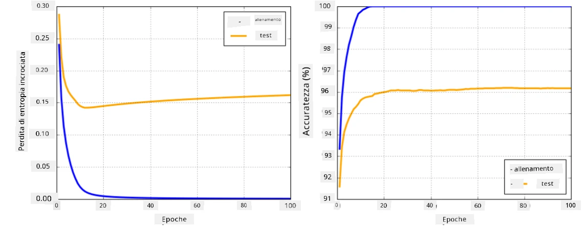

# Framework per Reti Neurali

Come abbiamo già appreso, per allenare reti neurali in modo efficiente dobbiamo fare due cose:

* Operare sui tensori, ad esempio moltiplicare, sommare e calcolare alcune funzioni come sigmoid o softmax
* Calcolare i gradienti di tutte le espressioni, per eseguire l'ottimizzazione tramite discesa del gradiente

## [Quiz pre-lezione](https://ff-quizzes.netlify.app/en/ai/quiz/9)

Mentre la libreria `numpy` può gestire la prima parte, abbiamo bisogno di un meccanismo per calcolare i gradienti. Nel [nostro framework](../04-OwnFramework/OwnFramework.ipynb) che abbiamo sviluppato nella sezione precedente, abbiamo dovuto programmare manualmente tutte le funzioni derivate all'interno del metodo `backward`, che esegue la retropropagazione. Idealmente, un framework dovrebbe offrirci la possibilità di calcolare i gradienti di *qualsiasi espressione* che possiamo definire.

Un altro aspetto importante è la capacità di eseguire calcoli su GPU o su altre unità di calcolo specializzate, come [TPU](https://en.wikipedia.org/wiki/Tensor_Processing_Unit). L'allenamento di reti neurali profonde richiede *molti* calcoli, e poter parallelizzare questi calcoli su GPU è fondamentale.

> ✅ Il termine 'parallelizzare' significa distribuire i calcoli su più dispositivi.

Attualmente, i due framework per reti neurali più popolari sono: [TensorFlow](http://TensorFlow.org) e [PyTorch](https://pytorch.org/). Entrambi forniscono un'API di basso livello per operare con tensori sia su CPU che su GPU. Oltre all'API di basso livello, esiste anche un'API di alto livello, chiamata [Keras](https://keras.io/) e [PyTorch Lightning](https://pytorchlightning.ai/) rispettivamente.

API di basso livello | [TensorFlow](http://TensorFlow.org) | [PyTorch](https://pytorch.org/)
----------------------|-------------------------------------|--------------------------------
API di alto livello   | [Keras](https://keras.io/)         | [PyTorch Lightning](https://pytorchlightning.ai/)

**Le API di basso livello** in entrambi i framework permettono di costruire i cosiddetti **grafi computazionali**. Questo grafo definisce come calcolare l'output (di solito la funzione di perdita) con parametri di input dati, e può essere inviato per il calcolo su GPU, se disponibile. Esistono funzioni per differenziare questo grafo computazionale e calcolare i gradienti, che possono poi essere utilizzati per ottimizzare i parametri del modello.

**Le API di alto livello** considerano le reti neurali come una **sequenza di strati**, rendendo la costruzione della maggior parte delle reti neurali molto più semplice. L'allenamento del modello di solito richiede la preparazione dei dati e poi la chiamata a una funzione `fit` per svolgere il lavoro.

L'API di alto livello consente di costruire reti neurali tipiche molto rapidamente senza preoccuparsi di molti dettagli. Allo stesso tempo, l'API di basso livello offre un controllo molto maggiore sul processo di allenamento, ed è quindi molto utilizzata nella ricerca, quando si lavora con nuove architetture di reti neurali.

È anche importante capire che è possibile utilizzare entrambe le API insieme, ad esempio si può sviluppare la propria architettura di strato di rete utilizzando l'API di basso livello, e poi usarla all'interno di una rete più grande costruita e allenata con l'API di alto livello. Oppure si può definire una rete utilizzando l'API di alto livello come una sequenza di strati, e poi utilizzare il proprio ciclo di allenamento di basso livello per eseguire l'ottimizzazione. Entrambe le API utilizzano gli stessi concetti di base e sono progettate per funzionare bene insieme.

## Apprendimento

In questo corso, offriamo la maggior parte dei contenuti sia per PyTorch che per TensorFlow. Puoi scegliere il framework che preferisci e seguire solo i notebook corrispondenti. Se non sei sicuro di quale framework scegliere, leggi alcune discussioni online riguardo **PyTorch vs. TensorFlow**. Puoi anche dare un'occhiata a entrambi i framework per ottenere una migliore comprensione.

Dove possibile, utilizzeremo le API di alto livello per semplicità. Tuttavia, riteniamo importante capire come funzionano le reti neurali dalle basi, quindi inizialmente lavoreremo con l'API di basso livello e i tensori. Tuttavia, se vuoi iniziare rapidamente e non vuoi dedicare troppo tempo a imparare questi dettagli, puoi saltare questa parte e passare direttamente ai notebook con l'API di alto livello.

## ✍️ Esercizi: Framework

Continua il tuo apprendimento nei seguenti notebook:

API di basso livello | [Notebook TensorFlow+Keras](IntroKerasTF.ipynb) | [PyTorch](IntroPyTorch.ipynb)
----------------------|-------------------------------------|--------------------------------
API di alto livello   | [Keras](IntroKeras.ipynb)         | *PyTorch Lightning*

Dopo aver padroneggiato i framework, ripassiamo il concetto di overfitting.

# Overfitting

L'overfitting è un concetto estremamente importante nel machine learning, ed è fondamentale comprenderlo correttamente!

Considera il seguente problema di approssimazione di 5 punti (rappresentati da `x` nei grafici sottostanti):

 | 
-------------------------|--------------------------
**Modello lineare, 2 parametri** | **Modello non lineare, 7 parametri**
Errore di training = 5.3 | Errore di training = 0
Errore di validazione = 5.1 | Errore di validazione = 20

* A sinistra, vediamo una buona approssimazione con una linea retta. Poiché il numero di parametri è adeguato, il modello coglie correttamente la distribuzione dei punti.
* A destra, il modello è troppo potente. Poiché abbiamo solo 5 punti e il modello ha 7 parametri, può adattarsi in modo da passare attraverso tutti i punti, facendo sì che l'errore di training sia 0. Tuttavia, questo impedisce al modello di comprendere il pattern corretto dei dati, causando un errore di validazione molto alto.

È molto importante trovare il giusto equilibrio tra la complessità del modello (numero di parametri) e il numero di campioni di training.

## Perché si verifica l'overfitting

  * Dati di training insufficienti
  * Modello troppo potente
  * Troppo rumore nei dati di input

## Come rilevare l'overfitting

Come puoi vedere dal grafico sopra, l'overfitting può essere rilevato da un errore di training molto basso e un errore di validazione molto alto. Normalmente durante l'allenamento vedremo sia l'errore di training che quello di validazione iniziare a diminuire, e poi a un certo punto l'errore di validazione potrebbe smettere di diminuire e iniziare a salire. Questo sarà un segnale di overfitting e un indicatore che probabilmente dovremmo interrompere l'allenamento a questo punto (o almeno fare uno snapshot del modello).

## Come prevenire l'overfitting

Se noti che si verifica l'overfitting, puoi fare una delle seguenti cose:

 * Aumentare la quantità di dati di training
 * Ridurre la complessità del modello
 * Utilizzare qualche [tecnica di regolarizzazione](../../4-ComputerVision/08-TransferLearning/TrainingTricks.md), come [Dropout](../../4-ComputerVision/08-TransferLearning/TrainingTricks.md#Dropout), che considereremo più avanti.

## Overfitting e Tradeoff Bias-Varianza

L'overfitting è in realtà un caso di un problema più generico in statistica chiamato [Tradeoff Bias-Varianza](https://en.wikipedia.org/wiki/Bias%E2%80%93variance_tradeoff). Se consideriamo le possibili fonti di errore nel nostro modello, possiamo vedere due tipi di errori:

* **Errori di bias**, causati dal fatto che il nostro algoritmo non riesce a catturare correttamente la relazione tra i dati di training. Questo può derivare dal fatto che il nostro modello non è abbastanza potente (**underfitting**).
* **Errori di varianza**, causati dal modello che approssima il rumore nei dati di input invece di una relazione significativa (**overfitting**).

Durante l'allenamento, l'errore di bias diminuisce (poiché il nostro modello impara ad approssimare i dati), e l'errore di varianza aumenta. È importante interrompere l'allenamento - manualmente (quando rileviamo l'overfitting) o automaticamente (introducendo la regolarizzazione) - per prevenire l'overfitting.

## Conclusione

In questa lezione, hai appreso le differenze tra le varie API dei due framework di AI più popolari, TensorFlow e PyTorch. Inoltre, hai approfondito un argomento molto importante: l'overfitting.

## 🚀 Sfida

Nei notebook allegati troverai delle 'attività' alla fine; lavora sui notebook e completa le attività.

## [Quiz post-lezione](https://ff-quizzes.netlify.app/en/ai/quiz/10)

## Revisione & Studio Autonomo

Fai delle ricerche sui seguenti argomenti:

- TensorFlow
- PyTorch
- Overfitting

Poniti le seguenti domande:

- Qual è la differenza tra TensorFlow e PyTorch?
- Qual è la differenza tra overfitting e underfitting?

## [Compito](lab/README.md)

In questo laboratorio, ti viene chiesto di risolvere due problemi di classificazione utilizzando reti completamente connesse a uno o più strati, utilizzando PyTorch o TensorFlow.

* [Istruzioni](lab/README.md)
* [Notebook](lab/LabFrameworks.ipynb)

---

