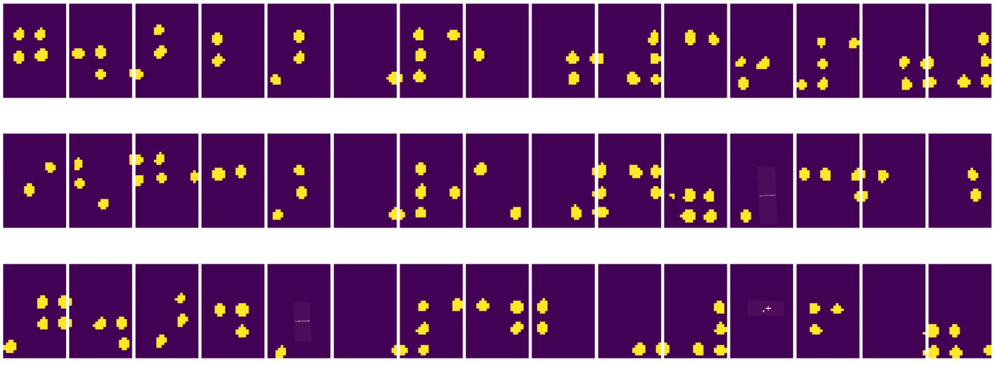
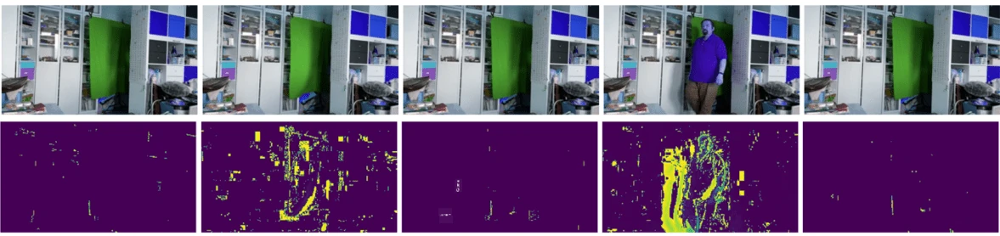

# Introduzione alla Visione Artificiale

[Computer Vision](https://wikipedia.org/wiki/Computer_vision) è una disciplina il cui obiettivo è permettere ai computer di ottenere una comprensione di alto livello delle immagini digitali. Questa è una definizione piuttosto ampia, poiché *comprensione* può significare molte cose diverse, tra cui trovare un oggetto in un'immagine (**rilevamento di oggetti**), capire cosa sta accadendo (**rilevamento di eventi**), descrivere un'immagine in testo o ricostruire una scena in 3D. Ci sono anche compiti specifici legati alle immagini umane: stima dell'età e delle emozioni, rilevamento e identificazione del volto, e stima della posa 3D, solo per citarne alcuni.

## [Quiz pre-lezione](https://ff-quizzes.netlify.app/en/ai/quiz/11)

Uno dei compiti più semplici della visione artificiale è la **classificazione delle immagini**.

La visione artificiale è spesso considerata un ramo dell'AI. Oggi, la maggior parte dei compiti di visione artificiale viene risolta utilizzando reti neurali. Impareremo di più sul tipo speciale di reti neurali utilizzate per la visione artificiale, le [reti neurali convoluzionali](../07-ConvNets/README.md), in questa sezione.

Tuttavia, prima di passare un'immagine a una rete neurale, in molti casi ha senso utilizzare alcune tecniche algoritmiche per migliorare l'immagine.

Esistono diverse librerie Python disponibili per l'elaborazione delle immagini:

* **[imageio](https://imageio.readthedocs.io/en/stable/)** può essere utilizzata per leggere/scrivere diversi formati di immagini. Supporta anche ffmpeg, uno strumento utile per convertire i fotogrammi video in immagini.
* **[Pillow](https://pillow.readthedocs.io/en/stable/index.html)** (conosciuta anche come PIL) è un po' più potente e supporta anche alcune manipolazioni delle immagini come morphing, regolazioni della palette e altro.
* **[OpenCV](https://opencv.org/)** è una potente libreria di elaborazione delle immagini scritta in C++, che è diventata lo standard *de facto* per l'elaborazione delle immagini. Ha un'interfaccia Python comoda.
* **[dlib](http://dlib.net/)** è una libreria C++ che implementa molti algoritmi di machine learning, inclusi alcuni algoritmi di visione artificiale. Ha anche un'interfaccia Python e può essere utilizzata per compiti impegnativi come il rilevamento del volto e dei punti di riferimento facciali.

## OpenCV

[OpenCV](https://opencv.org/) è considerata lo standard *de facto* per l'elaborazione delle immagini. Contiene molti algoritmi utili, implementati in C++. Puoi utilizzare OpenCV anche da Python.

Un buon punto di partenza per imparare OpenCV è [questo corso Learn OpenCV](https://learnopencv.com/getting-started-with-opencv/). Nel nostro curriculum, il nostro obiettivo non è imparare OpenCV, ma mostrarti alcuni esempi di quando può essere utilizzato e come.

### Caricamento delle immagini

Le immagini in Python possono essere comodamente rappresentate da array NumPy. Ad esempio, immagini in scala di grigi con dimensioni di 320x200 pixel sarebbero memorizzate in un array 200x320, e immagini a colori della stessa dimensione avrebbero una forma di 200x320x3 (per 3 canali di colore). Per caricare un'immagine, puoi utilizzare il seguente codice:

```python
import cv2
import matplotlib.pyplot as plt

im = cv2.imread('image.jpeg')
plt.imshow(im)
```

Tradizionalmente, OpenCV utilizza la codifica BGR (Blu-Verde-Rosso) per le immagini a colori, mentre il resto degli strumenti Python utilizza la più tradizionale RGB (Rosso-Verde-Blu). Per far sì che l'immagine appaia correttamente, è necessario convertirla nello spazio colore RGB, sia scambiando le dimensioni nell'array NumPy, sia chiamando una funzione OpenCV:

```python
im = cv2.cvtColor(im,cv2.COLOR_BGR2RGB)
```

La stessa funzione `cvtColor` può essere utilizzata per eseguire altre trasformazioni dello spazio colore, come convertire un'immagine in scala di grigi o nello spazio colore HSV (Tonalità-Saturazione-Valore).

Puoi anche utilizzare OpenCV per caricare video fotogramma per fotogramma - un esempio è fornito nell'esercizio [OpenCV Notebook](OpenCV.ipynb).

### Elaborazione delle immagini

Prima di passare un'immagine a una rete neurale, potresti voler applicare diversi passaggi di pre-elaborazione. OpenCV può fare molte cose, tra cui:

* **Ridimensionare** l'immagine utilizzando `im = cv2.resize(im, (320,200),interpolation=cv2.INTER_LANCZOS)`
* **Sfocare** l'immagine utilizzando `im = cv2.medianBlur(im,3)` o `im = cv2.GaussianBlur(im, (3,3), 0)`
* Modificare la **luminosità e il contrasto** dell'immagine può essere fatto tramite manipolazioni degli array NumPy, come descritto [in questa nota di Stackoverflow](https://stackoverflow.com/questions/39308030/how-do-i-increase-the-contrast-of-an-image-in-python-opencv).
* Utilizzare [thresholding](https://docs.opencv.org/4.x/d7/d4d/tutorial_py_thresholding.html) chiamando le funzioni `cv2.threshold`/`cv2.adaptiveThreshold`, che spesso è preferibile rispetto alla regolazione della luminosità o del contrasto.
* Applicare diverse [trasformazioni](https://docs.opencv.org/4.5.5/da/d6e/tutorial_py_geometric_transformations.html) all'immagine:
    - **[Trasformazioni affini](https://docs.opencv.org/4.5.5/d4/d61/tutorial_warp_affine.html)** possono essere utili se hai bisogno di combinare rotazione, ridimensionamento e inclinazione dell'immagine e conosci la posizione di origine e destinazione di tre punti nell'immagine. Le trasformazioni affini mantengono le linee parallele parallele.
    - **[Trasformazioni prospettiche](https://medium.com/analytics-vidhya/opencv-perspective-transformation-9edffefb2143)** possono essere utili quando conosci la posizione di origine e destinazione di 4 punti nell'immagine. Ad esempio, se scatti una foto di un documento rettangolare tramite la fotocamera di uno smartphone da un certo angolo e vuoi ottenere un'immagine rettangolare del documento stesso.
* Comprendere il movimento all'interno dell'immagine utilizzando **[optical flow](https://docs.opencv.org/4.5.5/d4/dee/tutorial_optical_flow.html)**.

## Esempi di utilizzo della Visione Artificiale

Nel nostro [OpenCV Notebook](OpenCV.ipynb), forniamo alcuni esempi di quando la visione artificiale può essere utilizzata per svolgere compiti specifici:

* **Pre-elaborazione di una fotografia di un libro in Braille**. Ci concentriamo su come possiamo utilizzare thresholding, rilevamento delle caratteristiche, trasformazione prospettica e manipolazioni NumPy per separare i singoli simboli Braille per una successiva classificazione tramite una rete neurale.

 |  | 
----|-----|-----

> Immagine da [OpenCV.ipynb](OpenCV.ipynb)

* **Rilevamento del movimento in video utilizzando la differenza tra fotogrammi**. Se la fotocamera è fissa, i fotogrammi del feed della fotocamera dovrebbero essere abbastanza simili tra loro. Poiché i fotogrammi sono rappresentati come array, semplicemente sottraendo questi array per due fotogrammi consecutivi otterremo la differenza dei pixel, che dovrebbe essere bassa per fotogrammi statici e diventare più alta quando c'è un movimento sostanziale nell'immagine.



> Immagine da [OpenCV.ipynb](OpenCV.ipynb)

* **Rilevamento del movimento utilizzando Optical Flow**. [Optical flow](https://docs.opencv.org/3.4/d4/dee/tutorial_optical_flow.html) ci permette di capire come si muovono i singoli pixel nei fotogrammi video. Ci sono due tipi di optical flow:

   - **Dense Optical Flow** calcola il campo vettoriale che mostra per ogni pixel dove si sta muovendo.
   - **Sparse Optical Flow** si basa sull'individuazione di alcune caratteristiche distintive nell'immagine (ad esempio, bordi) e sulla costruzione della loro traiettoria da fotogramma a fotogramma.


> Immagine da [OpenCV.ipynb](OpenCV.ipynb)

## ✍️ Notebook di esempio: OpenCV [prova OpenCV in azione](OpenCV.ipynb)

Facciamo alcuni esperimenti con OpenCV esplorando [OpenCV Notebook](OpenCV.ipynb)

## Conclusione

A volte, compiti relativamente complessi come il rilevamento del movimento o il rilevamento della punta delle dita possono essere risolti esclusivamente tramite visione artificiale. Pertanto, è molto utile conoscere le tecniche di base della visione artificiale e cosa possono fare librerie come OpenCV.

## 🚀 Sfida

Guarda [questo video](https://docs.microsoft.com/shows/ai-show/ai-show--2021-opencv-ai-competition--grand-prize-winners--cortic-tigers--episode-32?WT.mc_id=academic-77998-cacaste) dello show AI per conoscere il progetto Cortic Tigers e come hanno costruito una soluzione basata su blocchi per democratizzare i compiti di visione artificiale tramite un robot. Fai qualche ricerca su altri progetti simili che aiutano i nuovi studenti a entrare nel campo.

## [Quiz post-lezione](https://ff-quizzes.netlify.app/en/ai/quiz/12)

## Revisione & Studio Autonomo

Leggi di più sull'optical flow [in questo ottimo tutorial](https://learnopencv.com/optical-flow-in-opencv/).

## [Compito](lab/README.md)

In questo laboratorio, registrerai un video con gesti semplici, e il tuo obiettivo sarà estrarre movimenti su/giù/sinistra/destra utilizzando optical flow.


---

