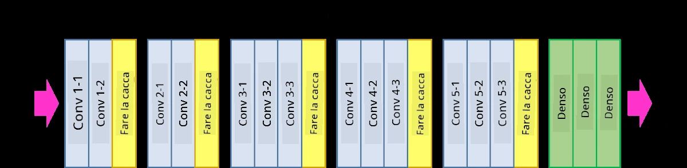
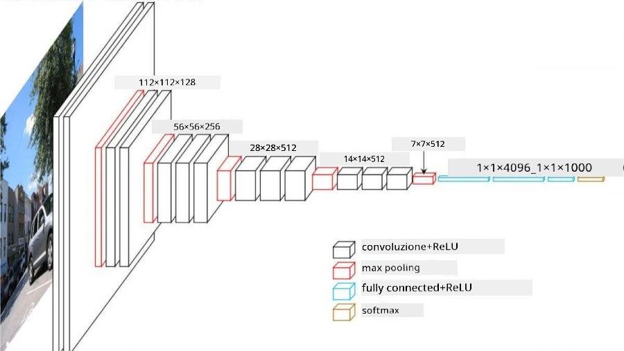
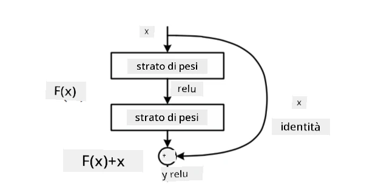

# Architetture CNN Famose

### VGG-16

VGG-16 è una rete che ha raggiunto il 92,7% di accuratezza nella classificazione top-5 di ImageNet nel 2014. Ha la seguente struttura di livelli:

Come puoi vedere, VGG segue una tradizionale architettura a piramide, che consiste in una sequenza di livelli di convoluzione e pooling.

> Immagine da [Researchgate](https://www.researchgate.net/figure/Vgg16-model-structure-To-get-the-VGG-NIN-model-we-replace-the-2-nd-4-th-6-th-7-th_fig2_335194493)

### ResNet

ResNet è una famiglia di modelli proposta da Microsoft Research nel 2015. L'idea principale di ResNet è l'utilizzo dei **blocchi residui**:

> Immagine da [questo articolo](https://arxiv.org/pdf/1512.03385.pdf)

Il motivo per utilizzare il passaggio identitario è far sì che il livello predica **la differenza** tra il risultato di un livello precedente e l'output del blocco residuo - da qui il nome *residuo*. Questi blocchi sono molto più facili da addestrare, e si possono costruire reti con centinaia di questi blocchi (le varianti più comuni sono ResNet-52, ResNet-101 e ResNet-152).

Puoi anche pensare a questa rete come capace di adattare la sua complessità al dataset. Inizialmente, quando si inizia ad addestrare la rete, i valori dei pesi sono piccoli e la maggior parte del segnale passa attraverso i livelli identitari. Con il progredire dell'addestramento e l'aumento dei pesi, l'importanza dei parametri della rete cresce, e la rete si adatta per fornire la potenza espressiva necessaria a classificare correttamente le immagini di addestramento.

### Google Inception

L'architettura Google Inception porta questa idea un passo avanti, costruendo ogni livello della rete come una combinazione di diversi percorsi:

> Immagine da [Researchgate](https://www.researchgate.net/figure/Inception-module-with-dimension-reductions-left-and-schema-for-Inception-ResNet-v1_fig2_355547454)

Qui è importante sottolineare il ruolo delle convoluzioni 1x1, che inizialmente potrebbero sembrare poco sensate. Perché dovremmo scansionare l'immagine con un filtro 1x1? Tuttavia, bisogna ricordare che i filtri di convoluzione lavorano anche con diversi canali di profondità (originariamente - colori RGB, nei livelli successivi - canali per diversi filtri), e la convoluzione 1x1 viene utilizzata per mescolare questi canali di input utilizzando diversi pesi addestrabili. Può anche essere vista come un downsampling (pooling) sulla dimensione del canale.

Ecco [un ottimo post sul blog](https://medium.com/analytics-vidhya/talented-mr-1x1-comprehensive-look-at-1x1-convolution-in-deep-learning-f6b355825578) sull'argomento, e [l'articolo originale](https://arxiv.org/pdf/1312.4400.pdf).

### MobileNet

MobileNet è una famiglia di modelli con dimensioni ridotte, adatti per dispositivi mobili. Usali se hai risorse limitate e puoi sacrificare un po' di accuratezza. L'idea principale dietro questi modelli è la cosiddetta **convoluzione separabile in profondità**, che permette di rappresentare i filtri di convoluzione come una composizione di convoluzioni spaziali e convoluzioni 1x1 sui canali di profondità. Questo riduce significativamente il numero di parametri, rendendo la rete più piccola e anche più facile da addestrare con meno dati.

Ecco [un ottimo post sul blog su MobileNet](https://medium.com/analytics-vidhya/image-classification-with-mobilenet-cc6fbb2cd470).

## Conclusione

In questa unità, hai appreso il concetto principale dietro le reti neurali per la visione artificiale - le reti convoluzionali. Le architetture reali che alimentano la classificazione delle immagini, il rilevamento degli oggetti e persino le reti di generazione di immagini si basano tutte sulle CNN, solo con più livelli e alcuni trucchi di addestramento aggiuntivi.

## 🚀 Sfida

Nei notebook allegati, ci sono note in fondo su come ottenere una maggiore accuratezza. Fai alcuni esperimenti per vedere se riesci a raggiungere una maggiore accuratezza.

## [Quiz post-lezione](https://ff-quizzes.netlify.app/en/ai/quiz/14)

## Revisione & Studio Autonomo

Sebbene le CNN siano più spesso utilizzate per compiti di visione artificiale, sono generalmente buone per estrarre modelli di dimensioni fisse. Ad esempio, se stiamo lavorando con suoni, potremmo voler utilizzare le CNN per cercare alcuni modelli specifici nel segnale audio - in tal caso i filtri sarebbero monodimensionali (e questa CNN sarebbe chiamata 1D-CNN). Inoltre, a volte si utilizza la 3D-CNN per estrarre caratteristiche in uno spazio multidimensionale, come certi eventi che si verificano in un video - la CNN può catturare certi modelli di cambiamento delle caratteristiche nel tempo. Fai una revisione e uno studio autonomo su altri compiti che possono essere svolti con le CNN.

## [Compito](lab/README.md)

In questo laboratorio, il tuo compito è classificare diverse razze di gatti e cani. Queste immagini sono più complesse rispetto al dataset MNIST, hanno dimensioni maggiori e ci sono più di 10 classi.

---

