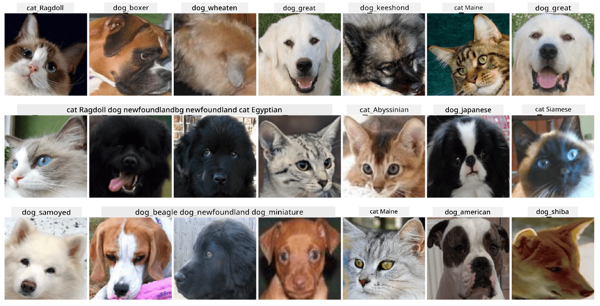

# Classificazione delle Facce degli Animali Domestici

Compito del laboratorio tratto dal [Curriculum AI for Beginners](https://github.com/microsoft/ai-for-beginners).

## Compito

Immagina di dover sviluppare un'applicazione per un asilo per animali domestici per catalogare tutti gli animali. Una delle funzionalità più utili di tale applicazione sarebbe identificare automaticamente la razza da una fotografia. Questo può essere fatto con successo utilizzando reti neurali.

Devi addestrare una rete neurale convoluzionale per classificare le diverse razze di gatti e cani utilizzando il dataset **Pet Faces**.

## Il Dataset

Utilizzeremo il [Oxford-IIIT Pet Dataset](https://www.robots.ox.ac.uk/~vgg/data/pets/), che contiene immagini di 37 diverse razze di cani e gatti.



Per scaricare il dataset, utilizza questo frammento di codice:

```python
!wget https://thor.robots.ox.ac.uk/~vgg/data/pets/images.tar.gz
!tar xfz images.tar.gz
!rm images.tar.gz
```

**Nota:** Le immagini del dataset Oxford-IIIT Pet sono organizzate per nome file (ad esempio, `Abyssinian_1.jpg`, `Bengal_2.jpg`). Il notebook include codice per organizzare queste immagini in sottodirectory specifiche per razza, rendendo più semplice la classificazione.

## Notebook di Partenza

Inizia il laboratorio aprendo [PetFaces.ipynb](PetFaces.ipynb)

## Conclusione

Hai risolto un problema relativamente complesso di classificazione delle immagini da zero! C'erano molte classi, e sei comunque riuscito a ottenere una precisione ragionevole! Ha anche senso misurare la precisione top-k, perché è facile confondere alcune classi che non sono chiaramente distinguibili nemmeno per gli esseri umani.

---

**Disclaimer**:  
Questo documento è stato tradotto utilizzando il servizio di traduzione automatica [Co-op Translator](https://github.com/Azure/co-op-translator). Sebbene ci impegniamo per garantire l'accuratezza, si prega di notare che le traduzioni automatiche possono contenere errori o imprecisioni. Il documento originale nella sua lingua nativa dovrebbe essere considerato la fonte autorevole. Per informazioni critiche, si raccomanda una traduzione professionale effettuata da un traduttore umano. Non siamo responsabili per eventuali incomprensioni o interpretazioni errate derivanti dall'uso di questa traduzione.