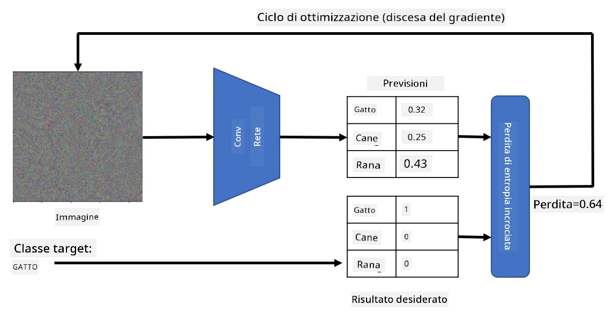

# Reti Pre-addestrate e Transfer Learning

Addestrare le CNN può richiedere molto tempo e una grande quantità di dati. Tuttavia, gran parte del tempo viene speso per imparare i migliori filtri di basso livello che una rete può utilizzare per estrarre schemi dalle immagini. Sorge una domanda naturale: possiamo utilizzare una rete neurale addestrata su un dataset e adattarla per classificare immagini diverse senza dover eseguire un processo di addestramento completo?

## [Quiz pre-lezione](https://ff-quizzes.netlify.app/en/ai/quiz/15)

Questo approccio si chiama **transfer learning**, perché trasferiamo alcune conoscenze da un modello di rete neurale a un altro. Nel transfer learning, di solito si parte da un modello pre-addestrato, che è stato addestrato su un grande dataset di immagini, come **ImageNet**. Questi modelli sono già in grado di estrarre diverse caratteristiche da immagini generiche, e in molti casi costruire semplicemente un classificatore sopra queste caratteristiche estratte può portare a buoni risultati.

> ✅ Il Transfer Learning è un termine che si trova anche in altri campi accademici, come l'Educazione. Si riferisce al processo di trasferire conoscenze da un dominio e applicarle a un altro.

## Modelli Pre-addestrati come Estrattori di Caratteristiche

Le reti convoluzionali di cui abbiamo parlato nella sezione precedente contengono un certo numero di livelli, ciascuno dei quali è progettato per estrarre caratteristiche dall'immagine, partendo da combinazioni di pixel di basso livello (come linee orizzontali/verticali o tratti), fino a combinazioni di caratteristiche di livello superiore, corrispondenti a elementi come un occhio o una fiamma. Se addestriamo una CNN su un dataset sufficientemente grande di immagini generiche e diversificate, la rete dovrebbe imparare a estrarre queste caratteristiche comuni.

Sia Keras che PyTorch contengono funzioni per caricare facilmente i pesi di reti neurali pre-addestrate per alcune architetture comuni, la maggior parte delle quali è stata addestrata su immagini di ImageNet. Le più utilizzate sono descritte nella pagina [Architetture CNN](../07-ConvNets/CNN_Architectures.md) della lezione precedente. In particolare, potresti considerare di utilizzare una delle seguenti:

* **VGG-16/VGG-19**, che sono modelli relativamente semplici ma che offrono comunque una buona accuratezza. Spesso utilizzare VGG come primo tentativo è una buona scelta per vedere come funziona il transfer learning.
* **ResNet**, una famiglia di modelli proposta da Microsoft Research nel 2015. Hanno più livelli e quindi richiedono più risorse.
* **MobileNet**, una famiglia di modelli con dimensioni ridotte, adatti per dispositivi mobili. Usali se hai risorse limitate e puoi sacrificare un po' di accuratezza.

Ecco alcune caratteristiche estratte da un'immagine di un gatto dalla rete VGG-16:

## Dataset Gatti vs. Cani

In questo esempio, utilizzeremo un dataset di [Gatti e Cani](https://www.microsoft.com/download/details.aspx?id=54765&WT.mc_id=academic-77998-cacaste), che è molto vicino a uno scenario reale di classificazione di immagini.

## ✍️ Esercizio: Transfer Learning

Vediamo il transfer learning in azione nei notebook corrispondenti:

* [Transfer Learning - PyTorch](TransferLearningPyTorch.ipynb)
* [Transfer Learning - TensorFlow](TransferLearningTF.ipynb)

## Visualizzare il Gatto Avversario

Una rete neurale pre-addestrata contiene diversi schemi all'interno del suo *cervello*, inclusi concetti di **gatto ideale** (così come cane ideale, zebra ideale, ecc.). Sarebbe interessante in qualche modo **visualizzare questa immagine**. Tuttavia, non è semplice, perché gli schemi sono distribuiti in tutti i pesi della rete e organizzati in una struttura gerarchica.

Un approccio che possiamo adottare è partire da un'immagine casuale e poi cercare di utilizzare la tecnica di **ottimizzazione con discesa del gradiente** per modificare quell'immagine in modo tale che la rete inizi a pensare che sia un gatto.

Tuttavia, se facciamo questo, otterremo qualcosa di molto simile a un rumore casuale. Questo perché *ci sono molti modi per far pensare alla rete che l'immagine di input sia un gatto*, inclusi alcuni che non hanno senso visivamente. Sebbene queste immagini contengano molti schemi tipici di un gatto, non c'è nulla che le vincoli a essere visivamente distintive.

Per migliorare il risultato, possiamo aggiungere un altro termine alla funzione di perdita, chiamato **variation loss**. È una metrica che mostra quanto sono simili i pixel vicini dell'immagine. Minimizzare la variation loss rende l'immagine più liscia e elimina il rumore, rivelando così schemi più visivamente piacevoli. Ecco un esempio di queste immagini "ideali", classificate come gatto e zebra con alta probabilità:

 | 
-----|-----
 *Gatto Ideale* | *Zebra Ideale*

Un approccio simile può essere utilizzato per eseguire i cosiddetti **attacchi avversari** su una rete neurale. Supponiamo di voler ingannare una rete neurale e far sembrare un cane un gatto. Se prendiamo l'immagine di un cane, che è riconosciuta dalla rete come un cane, possiamo modificarla leggermente utilizzando l'ottimizzazione con discesa del gradiente, fino a quando la rete inizia a classificarla come un gatto:

 | 
-----|-----
*Immagine originale di un cane* | *Immagine di un cane classificata come gatto*

Consulta il codice per riprodurre i risultati sopra nel seguente notebook:

* [Gatto Ideale e Avversario - TensorFlow](AdversarialCat_TF.ipynb)

## Conclusione

Utilizzando il transfer learning, puoi rapidamente mettere insieme un classificatore per un compito di classificazione di oggetti personalizzato e ottenere un'alta accuratezza. Puoi vedere che i compiti più complessi che stiamo risolvendo ora richiedono una maggiore potenza computazionale e non possono essere facilmente risolti sulla CPU. Nell'unità successiva, proveremo a utilizzare un'implementazione più leggera per addestrare lo stesso modello utilizzando risorse computazionali inferiori, con una riduzione minima dell'accuratezza.

## 🚀 Sfida

Nei notebook allegati, ci sono note in fondo su come il trasferimento di conoscenze funzioni meglio con dati di addestramento relativamente simili (ad esempio, un nuovo tipo di animale). Fai qualche esperimento con tipi di immagini completamente nuovi per vedere quanto bene o male funzionano i tuoi modelli di trasferimento di conoscenze.

## [Quiz post-lezione](https://ff-quizzes.netlify.app/en/ai/quiz/16)

## Revisione e Studio Autonomo

Leggi [TrainingTricks.md](TrainingTricks.md) per approfondire la tua conoscenza di altri modi per addestrare i tuoi modelli.

## [Compito](lab/README.md)

In questo laboratorio, utilizzeremo il dataset reale [Oxford-IIIT](https://www.robots.ox.ac.uk/~vgg/data/pets/) di animali domestici con 35 razze di gatti e cani, e costruiremo un classificatore di transfer learning.

---

