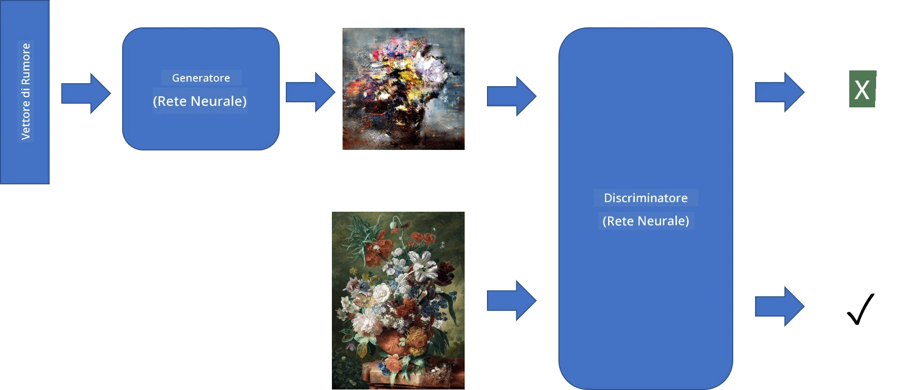
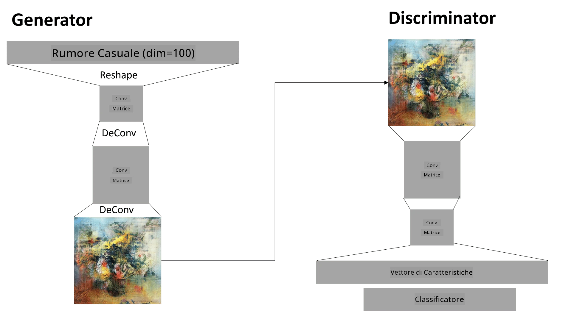

# Reti Generative Avversarie

Nella sezione precedente, abbiamo imparato a conoscere i **modelli generativi**: modelli che possono generare nuove immagini simili a quelle presenti nel dataset di addestramento. VAE era un buon esempio di modello generativo.

## [Quiz pre-lezione](https://ff-quizzes.netlify.app/en/ai/quiz/19)

Tuttavia, se proviamo a generare qualcosa di veramente significativo, come un dipinto ad una risoluzione ragionevole, con VAE, vedremo che l'addestramento non converge bene. Per questo caso d'uso, dovremmo imparare un'altra architettura specificamente mirata ai modelli generativi: le **Reti Generative Avversarie**, o GAN.

L'idea principale di una GAN è avere due reti neurali che vengono addestrate l'una contro l'altra:

> Immagine di [Dmitry Soshnikov](http://soshnikov.com)

> ✅ Un po' di vocabolario:
> * **Generatore**: è una rete che prende un vettore casuale e produce un'immagine come risultato.
> * **Discriminatore**: è una rete che prende un'immagine e deve determinare se è un'immagine reale (dal dataset di addestramento) o se è stata generata dal generatore. Essenzialmente è un classificatore di immagini.

### Discriminatore

L'architettura del discriminatore non differisce da una normale rete di classificazione di immagini. Nel caso più semplice, può essere un classificatore completamente connesso, ma molto probabilmente sarà una [rete convoluzionale](../07-ConvNets/README.md).

> ✅ Una GAN basata su reti convoluzionali è chiamata [DCGAN](https://arxiv.org/pdf/1511.06434.pdf)

Un discriminatore CNN consiste nei seguenti strati: diversi strati di convoluzione+pooling (con dimensioni spaziali decrescenti) e uno o più strati completamente connessi per ottenere un "vettore di caratteristiche", seguito da un classificatore binario finale.

> ✅ Il 'pooling' in questo contesto è una tecnica che riduce la dimensione dell'immagine. "I livelli di pooling riducono le dimensioni dei dati combinando gli output di cluster di neuroni in un livello in un singolo neurone nel livello successivo." - [fonte](https://wikipedia.org/wiki/Convolutional_neural_network#Pooling_layers)

### Generatore

Un generatore è leggermente più complesso. Può essere considerato come un discriminatore invertito. Partendo da un vettore latente (al posto di un vettore di caratteristiche), ha uno strato completamente connesso per convertirlo nella dimensione/forma richiesta, seguito da deconvoluzioni+upscaling. Questo è simile alla parte *decoder* di un [autoencoder](../09-Autoencoders/README.md).

> ✅ Poiché il livello di convoluzione è implementato come un filtro lineare che attraversa l'immagine, la deconvoluzione è essenzialmente simile alla convoluzione e può essere implementata utilizzando la stessa logica di livello.

> Immagine di [Dmitry Soshnikov](http://soshnikov.com)

### Addestramento della GAN

Le GAN sono chiamate **avversarie** perché c'è una competizione costante tra il generatore e il discriminatore. Durante questa competizione, sia il generatore che il discriminatore migliorano, e la rete impara a produrre immagini sempre migliori.

L'addestramento avviene in due fasi:

* **Addestramento del discriminatore**. Questo compito è piuttosto semplice: generiamo un batch di immagini con il generatore, etichettandole con 0, che indica immagini false, e prendiamo un batch di immagini dal dataset di input (con etichetta 1, immagine reale). Otteniamo una *loss del discriminatore* e eseguiamo il backpropagation.
* **Addestramento del generatore**. Questo è leggermente più complesso, perché non conosciamo direttamente l'output atteso per il generatore. Prendiamo l'intera rete GAN composta da un generatore seguito da un discriminatore, la alimentiamo con alcuni vettori casuali e ci aspettiamo che il risultato sia 1 (corrispondente a immagini reali). Poi congeliamo i parametri del discriminatore (non vogliamo che venga addestrato in questo passaggio) ed eseguiamo il backpropagation.

Durante questo processo, sia le perdite del generatore che del discriminatore non diminuiscono significativamente. Nella situazione ideale, dovrebbero oscillare, corrispondendo al miglioramento delle prestazioni di entrambe le reti.

## ✍️ Esercizi: GAN

* [Notebook GAN in TensorFlow/Keras](GANTF.ipynb)
* [Notebook GAN in PyTorch](GANPyTorch.ipynb)

### Problemi con l'addestramento delle GAN

Le GAN sono note per essere particolarmente difficili da addestrare. Ecco alcuni problemi:

* **Mode Collapse**. Con questo termine si intende che il generatore impara a produrre un'unica immagine di successo che inganna il discriminatore, invece di una varietà di immagini diverse.
* **Sensibilità agli iperparametri**. Spesso si può osservare che una GAN non converge affatto, e poi improvvisamente una riduzione del tasso di apprendimento porta alla convergenza.
* Mantenere un **equilibrio** tra il generatore e il discriminatore. In molti casi, la perdita del discriminatore può scendere a zero relativamente rapidamente, il che rende il generatore incapace di continuare l'addestramento. Per superare questo problema, possiamo provare a impostare tassi di apprendimento diversi per il generatore e il discriminatore, oppure saltare l'addestramento del discriminatore se la perdita è già troppo bassa.
* Addestramento per **alta risoluzione**. Riflettendo lo stesso problema degli autoencoder, questo problema si verifica perché ricostruire troppi strati di una rete convoluzionale porta ad artefatti. Questo problema viene tipicamente risolto con il cosiddetto **progressive growing**, in cui inizialmente alcuni strati vengono addestrati su immagini a bassa risoluzione, e poi gli strati vengono "sbloccati" o aggiunti. Un'altra soluzione potrebbe essere aggiungere connessioni extra tra gli strati e addestrare diverse risoluzioni contemporaneamente - vedi questo [Multi-Scale Gradient GANs paper](https://arxiv.org/abs/1903.06048) per i dettagli.

## Trasferimento di Stile

Le GAN sono un ottimo modo per generare immagini artistiche. Un'altra tecnica interessante è il cosiddetto **trasferimento di stile**, che prende una **immagine di contenuto** e la ridisegna in uno stile diverso, applicando filtri da una **immagine di stile**.

Il funzionamento è il seguente:
* Si parte con un'immagine di rumore casuale (o con un'immagine di contenuto, ma per comprendere meglio è più facile partire dal rumore casuale).
* Il nostro obiettivo sarà creare un'immagine che sia vicina sia all'immagine di contenuto che all'immagine di stile. Questo sarà determinato da due funzioni di perdita:
   - **Perdita di contenuto**: calcolata in base alle caratteristiche estratte dalla CNN in alcuni strati dall'immagine corrente e dall'immagine di contenuto.
   - **Perdita di stile**: calcolata tra l'immagine corrente e l'immagine di stile in modo intelligente utilizzando le matrici di Gram (maggiori dettagli nel [notebook di esempio](StyleTransfer.ipynb)).
* Per rendere l'immagine più fluida e rimuovere il rumore, introduciamo anche la **Perdita di variazione**, che calcola la distanza media tra i pixel vicini.
* Il ciclo principale di ottimizzazione regola l'immagine corrente utilizzando la discesa del gradiente (o qualche altro algoritmo di ottimizzazione) per minimizzare la perdita totale, che è una somma ponderata di tutte e tre le perdite.

## ✍️ Esempio: [Trasferimento di Stile](StyleTransfer.ipynb)

## [Quiz post-lezione](https://ff-quizzes.netlify.app/en/ai/quiz/20)

## Conclusione

In questa lezione, hai imparato a conoscere le GAN e come addestrarle. Hai anche appreso delle sfide particolari che questo tipo di rete neurale può affrontare e alcune strategie per superarle.

## 🚀 Sfida

Esegui il [notebook sul trasferimento di stile](StyleTransfer.ipynb) utilizzando le tue immagini.

## Revisione e Studio Autonomo

Per approfondire, leggi di più sulle GAN in queste risorse:

* Marco Pasini, [10 lezioni che ho imparato addestrando GAN per un anno](https://towardsdatascience.com/10-lessons-i-learned-training-generative-adversarial-networks-gans-for-a-year-c9071159628)
* [StyleGAN](https://en.wikipedia.org/wiki/StyleGAN), un'architettura GAN *de facto* da considerare
* [Creare arte generativa usando GAN su Azure ML](https://soshnikov.com/scienceart/creating-generative-art-using-gan-on-azureml/)

## Compito

Rivedi uno dei due notebook associati a questa lezione e riaddestra la GAN sulle tue immagini. Cosa riesci a creare?

---

