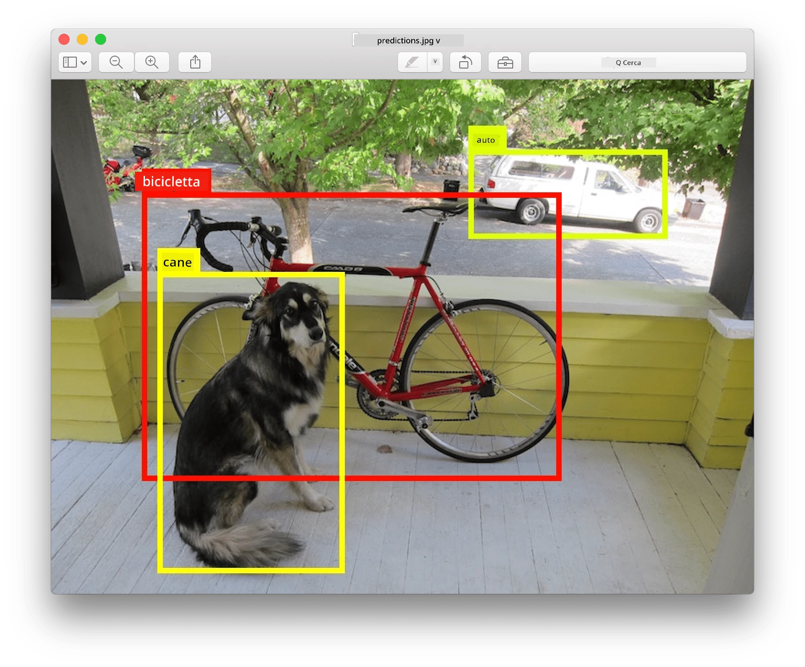
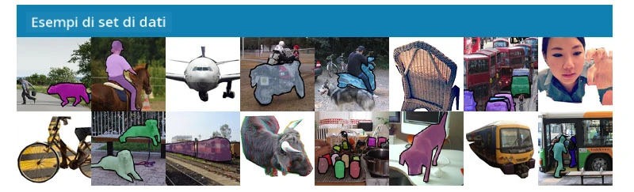
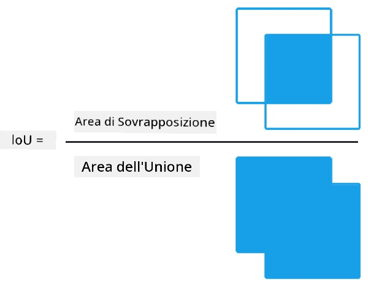
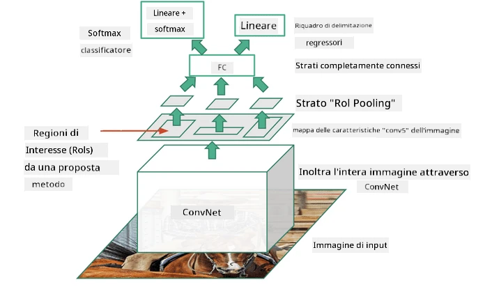
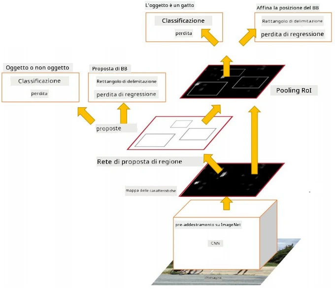
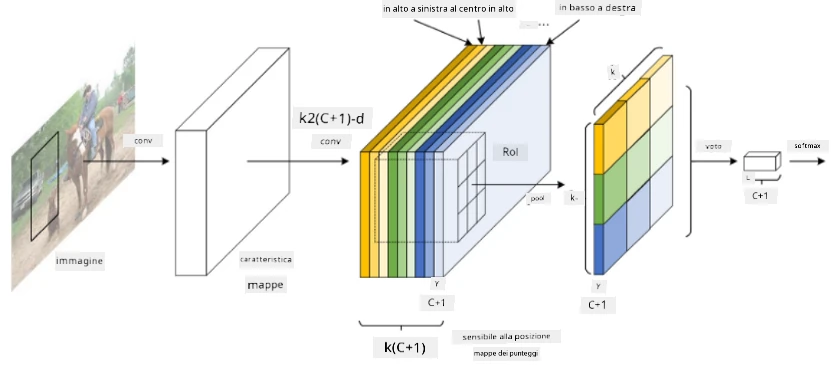
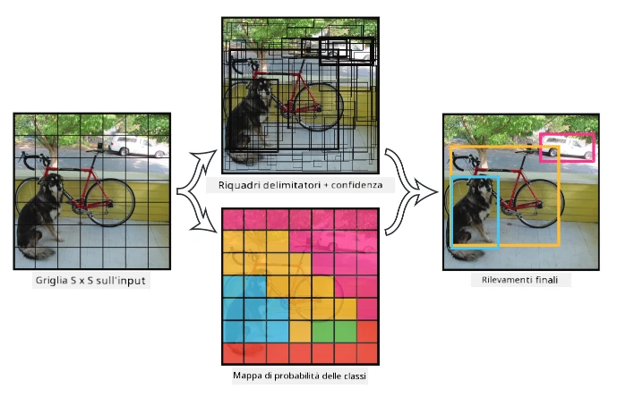

# Rilevamento degli Oggetti

I modelli di classificazione delle immagini che abbiamo trattato finora prendevano un'immagine e producevano un risultato categorico, come la classe 'numero' in un problema MNIST. Tuttavia, in molti casi non vogliamo solo sapere che un'immagine rappresenta degli oggetti - vogliamo essere in grado di determinare la loro posizione precisa. Questo è esattamente l'obiettivo del **rilevamento degli oggetti**.

## [Quiz pre-lezione](https://ff-quizzes.netlify.app/en/ai/quiz/21)

> Immagine dal [sito web di YOLO v2](https://pjreddie.com/darknet/yolov2/)

## Un Approccio Naïf al Rilevamento degli Oggetti

Supponendo di voler trovare un gatto in un'immagine, un approccio molto semplice al rilevamento degli oggetti potrebbe essere il seguente:

1. Suddividere l'immagine in un certo numero di riquadri.
2. Eseguire la classificazione delle immagini su ciascun riquadro.
3. I riquadri che producono un'attivazione sufficientemente alta possono essere considerati contenere l'oggetto in questione.

> *Immagine dal [Notebook di Esercizi](ObjectDetection-TF.ipynb)*

Tuttavia, questo approccio è tutt'altro che ideale, poiché consente all'algoritmo di localizzare il riquadro dell'oggetto in modo molto impreciso. Per una localizzazione più precisa, dobbiamo eseguire una sorta di **regressione** per prevedere le coordinate dei riquadri - e per questo, abbiamo bisogno di dataset specifici.

## Regressione per il Rilevamento degli Oggetti

[Questo post sul blog](https://towardsdatascience.com/object-detection-with-neural-networks-a4e2c46b4491) offre un'ottima introduzione al rilevamento delle forme.

## Dataset per il Rilevamento degli Oggetti

Potresti imbatterti nei seguenti dataset per questo compito:

* [PASCAL VOC](http://host.robots.ox.ac.uk/pascal/VOC/) - 20 classi
* [COCO](http://cocodataset.org/#home) - Common Objects in Context. 80 classi, riquadri delimitatori e maschere di segmentazione

## Metriche per il Rilevamento degli Oggetti

### Intersezione su Unione

Mentre per la classificazione delle immagini è facile misurare quanto bene l'algoritmo performa, per il rilevamento degli oggetti dobbiamo misurare sia la correttezza della classe, sia la precisione della posizione del riquadro delimitatore inferito. Per quest'ultimo, utilizziamo la cosiddetta **Intersezione su Unione** (IoU), che misura quanto bene due riquadri (o due aree arbitrarie) si sovrappongono.

> *Figura 2 da [questo eccellente post sul blog su IoU](https://pyimagesearch.com/2016/11/07/intersection-over-union-iou-for-object-detection/)*

L'idea è semplice - dividiamo l'area di intersezione tra due figure per l'area della loro unione. Per due aree identiche, IoU sarebbe 1, mentre per aree completamente disgiunte sarà 0. Altrimenti varierà da 0 a 1. Consideriamo tipicamente solo quei riquadri delimitatori per cui IoU supera un certo valore.

### Precisione Media

Supponiamo di voler misurare quanto bene una determinata classe di oggetti $C$ viene riconosciuta. Per misurarla, utilizziamo la metrica di **Precisione Media**, che viene calcolata come segue:

1. Considera la curva Precisione-Richiamo che mostra l'accuratezza in base a un valore di soglia di rilevamento (da 0 a 1).
2. A seconda della soglia, rileveremo più o meno oggetti nell'immagine, e valori diversi di precisione e richiamo.
3. La curva avrà questo aspetto:

> *Immagine da [NeuroWorkshop](http://github.com/shwars/NeuroWorkshop)*

La Precisione Media per una data classe $C$ è l'area sotto questa curva. Più precisamente, l'asse del Richiamo è tipicamente diviso in 10 parti, e la Precisione è mediata su tutti questi punti:

$$
AP = {1\over11}\sum_{i=0}^{10}\mbox{Precision}(\mbox{Recall}={i\over10})
$$

### AP e IoU

Considereremo solo quei rilevamenti per cui IoU supera un certo valore. Ad esempio, nel dataset PASCAL VOC tipicamente $\mbox{IoU Threshold} = 0.5$ è assunto, mentre in COCO AP viene misurato per diversi valori di $\mbox{IoU Threshold}$.

> *Immagine da [NeuroWorkshop](http://github.com/shwars/NeuroWorkshop)*

### Precisione Media Media - mAP

La metrica principale per il rilevamento degli oggetti è chiamata **Precisione Media Media**, o **mAP**. È il valore della Precisione Media, mediato su tutte le classi di oggetti, e talvolta anche su $\mbox{IoU Threshold}$. In dettaglio, il processo di calcolo di **mAP** è descritto
[in questo post sul blog](https://medium.com/@timothycarlen/understanding-the-map-evaluation-metric-for-object-detection-a07fe6962cf3)), e anche [qui con esempi di codice](https://gist.github.com/tarlen5/008809c3decf19313de216b9208f3734).

## Diversi Approcci al Rilevamento degli Oggetti

Esistono due grandi classi di algoritmi di rilevamento degli oggetti:

* **Reti di Proposta di Regione** (R-CNN, Fast R-CNN, Faster R-CNN). L'idea principale è generare **Regioni di Interesse** (ROI) ed eseguire CNN su di esse, cercando l'attivazione massima. È un po' simile all'approccio naïf, con l'eccezione che le ROI vengono generate in modo più intelligente. Uno dei principali svantaggi di tali metodi è che sono lenti, poiché necessitano di molti passaggi del classificatore CNN sull'immagine.
* Metodi **One-pass** (YOLO, SSD, RetinaNet). In queste architetture progettiamo la rete per prevedere sia le classi che le ROI in un unico passaggio.

### R-CNN: CNN Basata su Regione

[R-CNN](http://islab.ulsan.ac.kr/files/announcement/513/rcnn_pami.pdf) utilizza [Selective Search](http://www.huppelen.nl/publications/selectiveSearchDraft.pdf) per generare una struttura gerarchica di regioni ROI, che vengono poi passate attraverso estrattori di caratteristiche CNN e classificatori SVM per determinare la classe dell'oggetto, e regressione lineare per determinare le coordinate del *riquadro delimitatore*. [Paper ufficiale](https://arxiv.org/pdf/1506.01497v1.pdf)

> *Immagine da van de Sande et al. ICCV’11*

> *Immagini da [questo blog](https://towardsdatascience.com/r-cnn-fast-r-cnn-faster-r-cnn-yolo-object-detection-algorithms-36d53571365e)

### F-RCNN - Fast R-CNN

Questo approccio è simile a R-CNN, ma le regioni vengono definite dopo che i livelli di convoluzione sono stati applicati.

> Immagine dal [Paper ufficiale](https://www.cv-foundation.org/openaccess/content_iccv_2015/papers/Girshick_Fast_R-CNN_ICCV_2015_paper.pdf), [arXiv](https://arxiv.org/pdf/1504.08083.pdf), 2015

### Faster R-CNN

L'idea principale di questo approccio è utilizzare una rete neurale per prevedere le ROI - la cosiddetta *Rete di Proposta di Regione*. [Paper](https://arxiv.org/pdf/1506.01497.pdf), 2016

> Immagine dal [Paper ufficiale](https://arxiv.org/pdf/1506.01497.pdf)

### R-FCN: Rete Completamente Convoluzionale Basata su Regione

Questo algoritmo è ancora più veloce di Faster R-CNN. L'idea principale è la seguente:

1. Estrarre caratteristiche utilizzando ResNet-101
1. Le caratteristiche vengono elaborate da **Position-Sensitive Score Map**. Ogni oggetto delle classi $C$ è suddiviso in regioni $k\times k$, e si addestra per prevedere parti degli oggetti.
1. Per ogni parte delle regioni $k\times k$ tutte le reti votano per le classi degli oggetti, e la classe dell'oggetto con il massimo voto viene selezionata.

> Immagine dal [Paper ufficiale](https://arxiv.org/abs/1605.06409)

### YOLO - You Only Look Once

YOLO è un algoritmo in tempo reale a passaggio unico. L'idea principale è la seguente:

 * L'immagine è suddivisa in regioni $S\times S$
 * Per ogni regione, **CNN** prevede $n$ oggetti possibili, le coordinate del *riquadro delimitatore* e la *confidence*=*probabilità* * IoU.

 

> Immagine dal [Paper ufficiale](https://arxiv.org/abs/1506.02640)

### Altri Algoritmi

* RetinaNet: [Paper ufficiale](https://arxiv.org/abs/1708.02002)
   - [Implementazione PyTorch in Torchvision](https://pytorch.org/vision/stable/_modules/torchvision/models/detection/retinanet.html)
   - [Implementazione Keras](https://github.com/fizyr/keras-retinanet)
   - [Rilevamento degli Oggetti con RetinaNet](https://keras.io/examples/vision/retinanet/) nei campioni di Keras
* SSD (Single Shot Detector): [Paper ufficiale](https://arxiv.org/abs/1512.02325)

## ✍️ Esercizi: Rilevamento degli Oggetti

Continua il tuo apprendimento nel seguente notebook:

[ObjectDetection.ipynb](ObjectDetection.ipynb)

## Conclusione

In questa lezione hai fatto un tour rapido di tutti i vari modi in cui il rilevamento degli oggetti può essere realizzato!

## 🚀 Sfida

Leggi questi articoli e notebook su YOLO e prova a usarli tu stesso

* [Un buon post sul blog](https://www.analyticsvidhya.com/blog/2018/12/practical-guide-object-detection-yolo-framewor-python/) che descrive YOLO
 * [Sito ufficiale](https://pjreddie.com/darknet/yolo/)
 * Yolo: [Implementazione Keras](https://github.com/experiencor/keras-yolo2), [notebook passo-passo](https://github.com/experiencor/basic-yolo-keras/blob/master/Yolo%20Step-by-Step.ipynb)
 * Yolo v2: [Implementazione Keras](https://github.com/experiencor/keras-yolo2), [notebook passo-passo](https://github.com/experiencor/keras-yolo2/blob/master/Yolo%20Step-by-Step.ipynb)

## [Quiz post-lezione](https://ff-quizzes.netlify.app/en/ai/quiz/22)

## Revisione & Studio Autonomo

* [Rilevamento degli Oggetti](https://tjmachinelearning.com/lectures/1718/obj/) di Nikhil Sardana
* [Un buon confronto tra algoritmi di rilevamento degli oggetti](https://lilianweng.github.io/lil-log/2018/12/27/object-detection-part-4.html)
* [Revisione degli algoritmi di deep learning per il rilevamento degli oggetti](https://medium.com/comet-app/review-of-deep-learning-algorithms-for-object-detection-c1f3d437b852)
* [Introduzione passo-passo agli algoritmi di rilevamento degli oggetti di base](https://www.analyticsvidhya.com/blog/2018/10/a-step-by-step-introduction-to-the-basic-object-detection-algorithms-part-1/)
* [Implementazione di Faster R-CNN in Python per il rilevamento degli oggetti](https://www.analyticsvidhya.com/blog/2018/11/implementation-faster-r-cnn-python-object-detection/)

## [Compito: Rilevamento degli Oggetti](lab/README.md)

---

