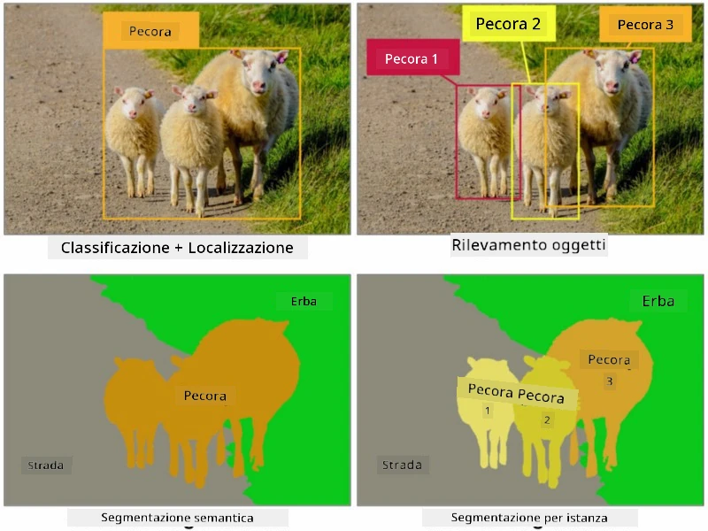
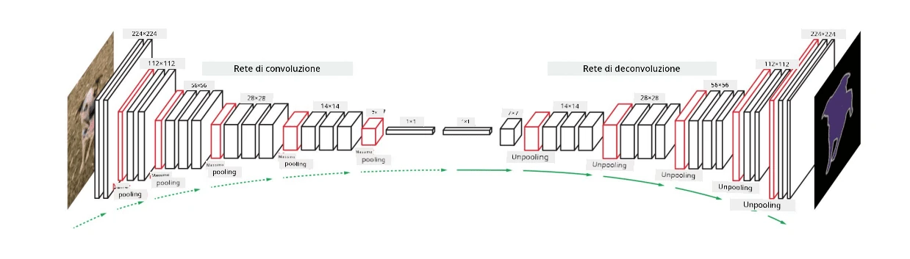

# Segmentazione

Abbiamo precedentemente imparato il rilevamento degli oggetti, che ci consente di localizzare gli oggetti in un'immagine prevedendo le loro *bounding boxes*. Tuttavia, per alcune attività non ci servono solo le bounding boxes, ma anche una localizzazione più precisa degli oggetti. Questa attività si chiama **segmentazione**.

## [Quiz pre-lezione](https://ff-quizzes.netlify.app/en/ai/quiz/23)

La segmentazione può essere vista come una **classificazione dei pixel**, in cui per **ogni** pixel dell'immagine dobbiamo prevedere la sua classe (*sfondo* essendo una delle classi). Esistono due principali algoritmi di segmentazione:

* **Segmentazione semantica** indica solo la classe del pixel e non distingue tra diversi oggetti della stessa classe.
* **Segmentazione per istanza** suddivide le classi in diverse istanze.

Ad esempio, nella segmentazione per istanza, queste pecore sono oggetti diversi, ma nella segmentazione semantica tutte le pecore sono rappresentate da una sola classe.

> Immagine tratta da [questo articolo](https://nirmalamurali.medium.com/image-classification-vs-semantic-segmentation-vs-instance-segmentation-625c33a08d50)

Esistono diverse architetture neurali per la segmentazione, ma tutte hanno la stessa struttura. In un certo senso, è simile all'autoencoder che hai imparato in precedenza, ma invece di decostruire l'immagine originale, il nostro obiettivo è decostruire una **maschera**. Pertanto, una rete di segmentazione ha le seguenti parti:

* **Encoder** estrae le caratteristiche dall'immagine di input.
* **Decoder** trasforma queste caratteristiche nell'immagine **maschera**, con la stessa dimensione e numero di canali corrispondenti al numero di classi.

> Immagine tratta da [questa pubblicazione](https://arxiv.org/pdf/2001.05566.pdf)

Dobbiamo menzionare in particolare la funzione di perdita utilizzata per la segmentazione. Quando si utilizzano autoencoder classici, dobbiamo misurare la somiglianza tra due immagini e possiamo utilizzare l'errore quadratico medio (MSE) per farlo. Nella segmentazione, ogni pixel nell'immagine maschera target rappresenta il numero della classe (codificato in one-hot lungo la terza dimensione), quindi dobbiamo utilizzare funzioni di perdita specifiche per la classificazione: la perdita di entropia incrociata, mediata su tutti i pixel. Se la maschera è binaria, si utilizza la **perdita di entropia incrociata binaria** (BCE).

> ✅ La codifica one-hot è un modo per codificare un'etichetta di classe in un vettore di lunghezza pari al numero di classi. Dai un'occhiata a [questo articolo](https://datagy.io/sklearn-one-hot-encode/) su questa tecnica.

## Segmentazione per Immagini Mediche

In questa lezione, vedremo la segmentazione in azione allenando la rete a riconoscere nevi umani (noti anche come nei) su immagini mediche. Utilizzeremo il <a href="https://www.fc.up.pt/addi/ph2%20database.html">Database PH2</a> di immagini dermoscopiche come fonte di immagini. Questo dataset contiene 200 immagini di tre classi: nevo tipico, nevo atipico e melanoma. Tutte le immagini contengono anche una **maschera** corrispondente che delinea il nevo.

> ✅ Questa tecnica è particolarmente adatta per questo tipo di immagini mediche, ma quali altre applicazioni reali potresti immaginare?

> Immagine tratta dal Database PH2

Alleneremo un modello per segmentare qualsiasi nevo dal suo sfondo.

## ✍️ Esercizi: Segmentazione Semantica

Apri i notebook qui sotto per saperne di più sulle diverse architetture di segmentazione semantica, esercitarti a lavorare con esse e vederle in azione.

* [Segmentazione Semantica Pytorch](SemanticSegmentationPytorch.ipynb)
* [Segmentazione Semantica TensorFlow](SemanticSegmentationTF.ipynb)

## [Quiz post-lezione](https://ff-quizzes.netlify.app/en/ai/quiz/24)

## Conclusione

La segmentazione è una tecnica molto potente per la classificazione delle immagini, andando oltre le bounding boxes fino alla classificazione a livello di pixel. È una tecnica utilizzata nell'imaging medico, tra altre applicazioni.

## 🚀 Sfida

La segmentazione del corpo è solo una delle attività comuni che possiamo fare con immagini di persone. Altre attività importanti includono il **rilevamento dello scheletro** e il **rilevamento della postura**. Prova la libreria [OpenPose](https://github.com/CMU-Perceptual-Computing-Lab/openpose) per vedere come il rilevamento della postura può essere utilizzato.

## Revisione & Studio Autonomo

Questo [articolo di Wikipedia](https://wikipedia.org/wiki/Image_segmentation) offre una buona panoramica delle varie applicazioni di questa tecnica. Scopri di più da solo sui sottodomini della segmentazione per istanza e della segmentazione panottica in questo campo di studio.

## [Compito](lab/README.md)

In questo laboratorio, prova la **segmentazione del corpo umano** utilizzando il [Segmentation Full Body MADS Dataset](https://www.kaggle.com/datasets/tapakah68/segmentation-full-body-mads-dataset) da Kaggle.

---

