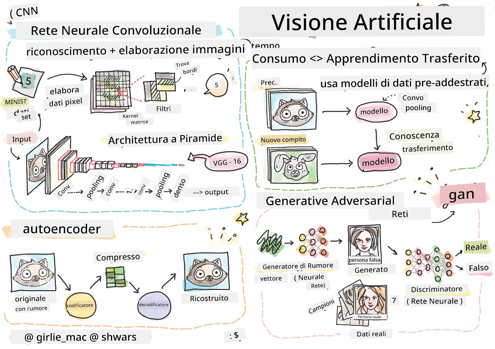

# Visione Artificiale

In questa sezione impareremo:

* [Introduzione alla Visione Artificiale e OpenCV](06-IntroCV/README.md)
* [Reti Neurali Convoluzionali](07-ConvNets/README.md)
* [Reti Pre-addestrate e Apprendimento per Trasferimento](08-TransferLearning/README.md) 
* [Autoencoder](09-Autoencoders/README.md)
* [Reti Generative Avversarie](10-GANs/README.md)
* [Rilevamento degli Oggetti](11-ObjectDetection/README.md)
* [Segmentazione Semantica](12-Segmentation/README.md)

**Disclaimer (Avvertenza)**:  
Questo documento è stato tradotto utilizzando il servizio di traduzione automatica [Co-op Translator](https://github.com/Azure/co-op-translator). Sebbene ci impegniamo per garantire l'accuratezza, si prega di tenere presente che le traduzioni automatiche possono contenere errori o imprecisioni. Il documento originale nella sua lingua nativa dovrebbe essere considerato la fonte autorevole. Per informazioni critiche, si raccomanda una traduzione professionale effettuata da un traduttore umano. Non siamo responsabili per eventuali incomprensioni o interpretazioni errate derivanti dall'uso di questa traduzione.