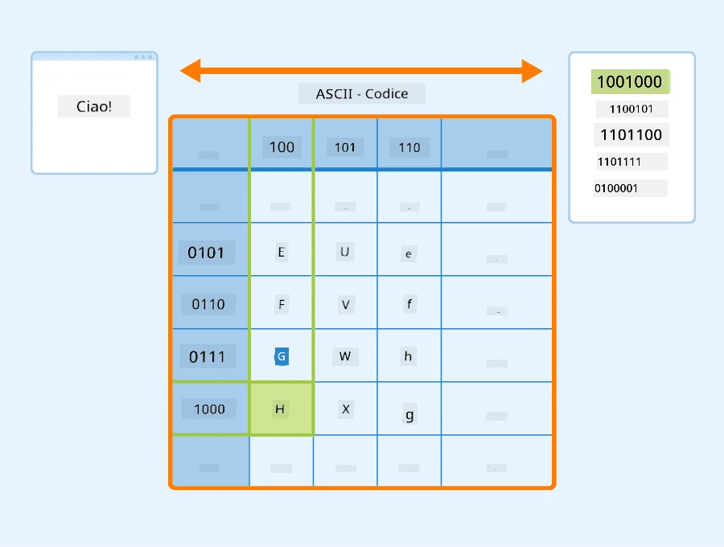
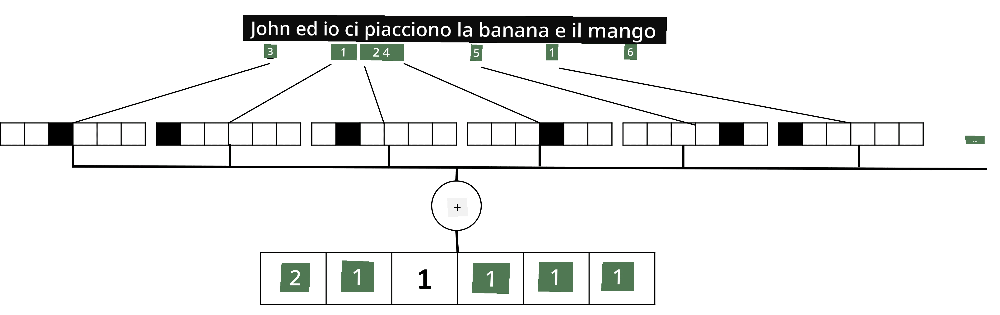

# Rappresentare il Testo come Tensors

## [Quiz pre-lezione](https://ff-quizzes.netlify.app/en/ai/quiz/25)

## Classificazione del Testo

Nella prima parte di questa sezione, ci concentreremo sul compito di **classificazione del testo**. Utilizzeremo il dataset [AG News](https://www.kaggle.com/amananandrai/ag-news-classification-dataset), che contiene articoli di notizie come il seguente:

* Categoria: Sci/Tech  
* Titolo: Ky. Company Wins Grant to Study Peptides (AP)  
* Corpo: AP - Una compagnia fondata da un ricercatore di chimica dell'Università di Louisville ha ottenuto un finanziamento per sviluppare...

Il nostro obiettivo sarà classificare l'articolo di notizie in una delle categorie basandoci sul testo.

## Rappresentare il testo

Se vogliamo risolvere compiti di Elaborazione del Linguaggio Naturale (NLP) con reti neurali, abbiamo bisogno di un modo per rappresentare il testo come tensors. I computer rappresentano già i caratteri testuali come numeri che mappano i font sullo schermo utilizzando codifiche come ASCII o UTF-8.

> [Fonte immagine](https://www.seobility.net/en/wiki/ASCII)

Come esseri umani, comprendiamo cosa rappresenta ogni lettera e come tutti i caratteri si uniscono per formare le parole di una frase. Tuttavia, i computer da soli non hanno questa comprensione, e la rete neurale deve apprendere il significato durante l'addestramento.

Pertanto, possiamo utilizzare diversi approcci per rappresentare il testo:

* **Rappresentazione a livello di carattere**, in cui rappresentiamo il testo trattando ogni carattere come un numero. Dato che abbiamo *C* caratteri diversi nel nostro corpus di testo, la parola *Hello* sarebbe rappresentata da un tensor 5x*C*. Ogni lettera corrisponderebbe a una colonna del tensor in codifica one-hot.  
* **Rappresentazione a livello di parola**, in cui creiamo un **vocabolario** di tutte le parole nel nostro testo e rappresentiamo le parole utilizzando la codifica one-hot. Questo approccio è in qualche modo migliore, perché ogni lettera da sola non ha molto significato, e quindi utilizzando concetti semantici di livello superiore - le parole - semplifichiamo il compito per la rete neurale. Tuttavia, data la grande dimensione del dizionario, dobbiamo gestire tensors sparsi ad alta dimensionalità.

Indipendentemente dalla rappresentazione, dobbiamo prima convertire il testo in una sequenza di **token**, dove un token può essere un carattere, una parola o talvolta anche una parte di una parola. Poi, convertiamo il token in un numero, tipicamente utilizzando un **vocabolario**, e questo numero può essere fornito a una rete neurale utilizzando la codifica one-hot.

## N-Grams

Nel linguaggio naturale, il significato preciso delle parole può essere determinato solo nel contesto. Ad esempio, i significati di *neural network* e *fishing network* sono completamente diversi. Uno dei modi per tenerne conto è costruire il nostro modello su coppie di parole, considerando le coppie di parole come token separati del vocabolario. In questo modo, la frase *I like to go fishing* sarà rappresentata dalla seguente sequenza di token: *I like*, *like to*, *to go*, *go fishing*. Il problema con questo approccio è che la dimensione del dizionario cresce significativamente, e combinazioni come *go fishing* e *go shopping* sono rappresentate da token diversi, che non condividono alcuna somiglianza semantica nonostante lo stesso verbo.

In alcuni casi, possiamo considerare l'uso di tri-grammi -- combinazioni di tre parole -- o più. Questo approccio è spesso chiamato **n-grams**. Inoltre, ha senso utilizzare n-grams con rappresentazioni a livello di carattere, in cui gli n-grams corrisponderanno approssimativamente a diverse sillabe.

## Bag-of-Words e TF/IDF

Quando risolviamo compiti come la classificazione del testo, dobbiamo essere in grado di rappresentare il testo con un vettore di dimensione fissa, che utilizzeremo come input per il classificatore denso finale. Uno dei modi più semplici per farlo è combinare tutte le rappresentazioni individuali delle parole, ad esempio sommando. Se sommiamo le codifiche one-hot di ogni parola, otterremo un vettore di frequenze, che mostra quante volte ogni parola appare nel testo. Questa rappresentazione del testo è chiamata **bag of words** (BoW).

> Immagine dell'autore

Un BoW rappresenta essenzialmente quali parole appaiono nel testo e in quali quantità, il che può effettivamente essere un buon indicatore di cosa tratta il testo. Ad esempio, un articolo di notizie sulla politica è probabile che contenga parole come *president* e *country*, mentre una pubblicazione scientifica potrebbe avere termini come *collider*, *discovered*, ecc. Pertanto, le frequenze delle parole possono in molti casi essere un buon indicatore del contenuto del testo.

Il problema con BoW è che alcune parole comuni, come *and*, *is*, ecc., appaiono nella maggior parte dei testi e hanno le frequenze più alte, oscurando le parole che sono realmente importanti. Possiamo ridurre l'importanza di queste parole tenendo conto della frequenza con cui appaiono in tutta la collezione di documenti. Questa è l'idea principale dietro l'approccio TF/IDF, che è trattato in maggior dettaglio nei notebook allegati a questa lezione.

Tuttavia, nessuno di questi approcci può tenere pienamente conto della **semantica** del testo. Abbiamo bisogno di modelli di reti neurali più potenti per farlo, che discuteremo più avanti in questa sezione.

## ✍️ Esercizi: Rappresentazione del Testo

Continua il tuo apprendimento nei seguenti notebook:

* [Rappresentazione del Testo con PyTorch](TextRepresentationPyTorch.ipynb)  
* [Rappresentazione del Testo con TensorFlow](TextRepresentationTF.ipynb)

## Conclusione

Finora, abbiamo studiato tecniche che possono aggiungere peso di frequenza a diverse parole. Tuttavia, queste tecniche non sono in grado di rappresentare il significato o l'ordine. Come disse il famoso linguista J. R. Firth nel 1935, "Il significato completo di una parola è sempre contestuale, e nessuno studio del significato al di fuori del contesto può essere preso seriamente." Impareremo più avanti nel corso come catturare le informazioni contestuali dal testo utilizzando il linguaggio modellato.

## 🚀 Sfida

Prova altri esercizi utilizzando bag-of-words e diversi modelli di dati. Potresti trovare ispirazione in questa [competizione su Kaggle](https://www.kaggle.com/competitions/word2vec-nlp-tutorial/overview/part-1-for-beginners-bag-of-words)

## [Quiz post-lezione](https://ff-quizzes.netlify.app/en/ai/quiz/26)

## Revisione e Studio Autonomo

Esercitati con le tecniche di embedding del testo e bag-of-words su [Microsoft Learn](https://docs.microsoft.com/learn/modules/intro-natural-language-processing-pytorch/?WT.mc_id=academic-77998-cacaste)

## [Compito: Notebook](assignment.md)

---

