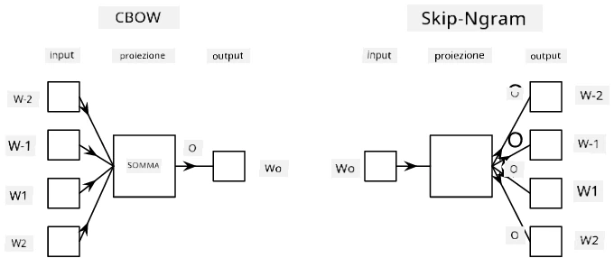

# Embeddings

## [Quiz pre-lezione](https://ff-quizzes.netlify.app/en/ai/quiz/27)

Quando si allenano classificatori basati su BoW o TF/IDF, abbiamo lavorato su vettori bag-of-words ad alta dimensionalità con lunghezza `vocab_size`, e stavamo esplicitamente convertendo da vettori di rappresentazione posizionale a bassa dimensionalità in rappresentazioni sparse one-hot. Tuttavia, questa rappresentazione one-hot non è efficiente in termini di memoria. Inoltre, ogni parola viene trattata indipendentemente dalle altre, ovvero i vettori codificati one-hot non esprimono alcuna somiglianza semantica tra le parole.

L'idea di **embedding** è rappresentare le parole con vettori densi a bassa dimensionalità, che in qualche modo riflettano il significato semantico di una parola. Più avanti discuteremo come costruire embedding di parole significativi, ma per ora pensiamo agli embedding come a un modo per ridurre la dimensionalità di un vettore di parole.

Quindi, il livello di embedding prenderebbe una parola come input e produrrebbe un vettore di output di dimensione specificata `embedding_size`. In un certo senso, è molto simile a un livello `Linear`, ma invece di prendere un vettore codificato one-hot, sarà in grado di prendere un numero di parola come input, permettendoci di evitare di creare grandi vettori codificati one-hot.

Utilizzando un livello di embedding come primo livello nella nostra rete di classificazione, possiamo passare da un modello bag-of-words a un modello **embedding bag**, dove prima convertiamo ogni parola nel nostro testo nel corrispondente embedding, e poi calcoliamo una funzione aggregata su tutti questi embedding, come `sum`, `average` o `max`.  

> Immagine dell'autore

## ✍️ Esercizi: Embeddings

Continua il tuo apprendimento nei seguenti notebook:
* [Embeddings con PyTorch](EmbeddingsPyTorch.ipynb)
* [Embeddings con TensorFlow](EmbeddingsTF.ipynb)

## Embeddings Semantici: Word2Vec

Sebbene il livello di embedding abbia imparato a mappare le parole in rappresentazioni vettoriali, questa rappresentazione non necessariamente ha un significato semantico. Sarebbe utile imparare una rappresentazione vettoriale tale che parole simili o sinonimi corrispondano a vettori vicini tra loro in termini di una certa distanza vettoriale (ad esempio, distanza euclidea).

Per fare ciò, dobbiamo pre-addestrare il nostro modello di embedding su una grande raccolta di testi in un modo specifico. Un metodo per allenare embedding semantici si chiama [Word2Vec](https://en.wikipedia.org/wiki/Word2vec). Si basa su due principali architetture utilizzate per produrre una rappresentazione distribuita delle parole:

 - **Continuous bag-of-words** (CBoW) — in questa architettura, alleniamo il modello a prevedere una parola dal contesto circostante. Dato l'ngram $(W_{-2},W_{-1},W_0,W_1,W_2)$, l'obiettivo del modello è prevedere $W_0$ da $(W_{-2},W_{-1},W_1,W_2)$.
 - **Continuous skip-gram** è l'opposto di CBoW. Il modello utilizza la finestra di contesto circostante per prevedere la parola corrente.

CBoW è più veloce, mentre skip-gram è più lento, ma rappresenta meglio le parole meno frequenti.

> Immagine tratta da [questo articolo](https://arxiv.org/pdf/1301.3781.pdf)

Gli embedding pre-addestrati di Word2Vec (così come altri modelli simili, come GloVe) possono anche essere utilizzati al posto del livello di embedding nelle reti neurali. Tuttavia, dobbiamo gestire i vocabolari, poiché il vocabolario utilizzato per pre-addestrare Word2Vec/GloVe probabilmente differisce dal vocabolario nel nostro corpus di testo. Dai un'occhiata ai notebook sopra per vedere come risolvere questo problema.

## Embeddings Contestuali

Una limitazione chiave delle rappresentazioni di embedding pre-addestrate tradizionali come Word2Vec è il problema della disambiguazione del senso delle parole. Sebbene gli embedding pre-addestrati possano catturare parte del significato delle parole nel contesto, ogni possibile significato di una parola è codificato nello stesso embedding. Questo può causare problemi nei modelli a valle, poiché molte parole, come la parola 'play', hanno significati diversi a seconda del contesto in cui vengono utilizzate.

Ad esempio, la parola 'play' in queste due frasi ha significati piuttosto diversi:

- Sono andato a vedere una **commedia** a teatro.
- John vuole **giocare** con i suoi amici.

Gli embedding pre-addestrati sopra rappresentano entrambi i significati della parola 'play' nello stesso embedding. Per superare questa limitazione, dobbiamo costruire embedding basati sul **modello linguistico**, che è addestrato su un grande corpus di testo e *sa* come le parole possono essere messe insieme in contesti diversi. Discutere gli embedding contestuali è fuori dal campo di questo tutorial, ma torneremo su di essi quando parleremo di modelli linguistici più avanti nel corso.

## Conclusione

In questa lezione, hai scoperto come costruire e utilizzare livelli di embedding in TensorFlow e Pytorch per riflettere meglio i significati semantici delle parole.

## 🚀 Sfida

Word2Vec è stato utilizzato per alcune applicazioni interessanti, tra cui la generazione di testi di canzoni e poesie. Dai un'occhiata a [questo articolo](https://www.politetype.com/blog/word2vec-color-poems) che spiega come l'autore ha utilizzato Word2Vec per generare poesie. Guarda anche [questo video di Dan Shiffmann](https://www.youtube.com/watch?v=LSS_bos_TPI&ab_channel=TheCodingTrain) per scoprire una spiegazione diversa di questa tecnica. Poi prova ad applicare queste tecniche al tuo corpus di testo, magari preso da Kaggle.

## [Quiz post-lezione](https://ff-quizzes.netlify.app/en/ai/quiz/28)

## Revisione & Studio Autonomo

Leggi questo articolo su Word2Vec: [Efficient Estimation of Word Representations in Vector Space](https://arxiv.org/pdf/1301.3781.pdf)

## [Compito: Notebook](assignment.md)

---

