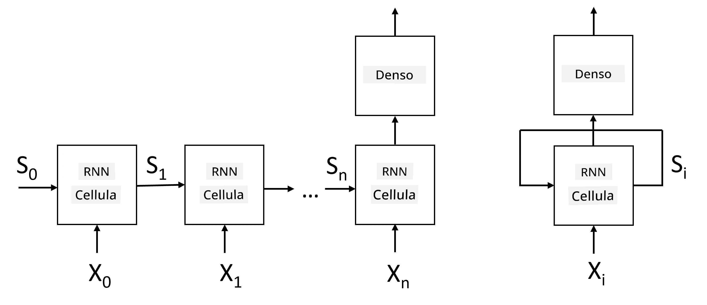
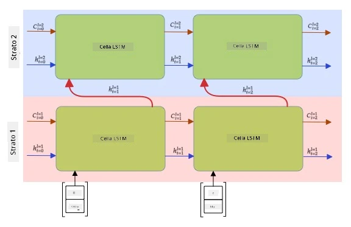

# Reti Neurali Ricorrenti

## [Quiz pre-lezione](https://ff-quizzes.netlify.app/en/ai/quiz/31)

Nelle sezioni precedenti, abbiamo utilizzato rappresentazioni semantiche ricche del testo e un semplice classificatore lineare sopra gli embeddings. Questa architettura cattura il significato aggregato delle parole in una frase, ma non tiene conto dell'**ordine** delle parole, poiché l'operazione di aggregazione sugli embeddings elimina questa informazione dal testo originale. Poiché questi modelli non sono in grado di modellare l'ordine delle parole, non possono risolvere compiti più complessi o ambigui come la generazione di testo o la risposta a domande.

Per catturare il significato di una sequenza di testo, dobbiamo utilizzare un'altra architettura di rete neurale, chiamata **rete neurale ricorrente**, o RNN. Nelle RNN, passiamo la nostra frase attraverso la rete un simbolo alla volta, e la rete produce uno **stato**, che poi passiamo nuovamente alla rete insieme al simbolo successivo.

> Immagine dell'autore

Dato l'input di una sequenza di token X0,...,Xn, l'RNN crea una sequenza di blocchi di rete neurale e allena questa sequenza end-to-end utilizzando la retropropagazione. Ogni blocco di rete prende una coppia (Xi,Si) come input e produce Si+1 come risultato. Lo stato finale Sn o (output Yn) viene inviato a un classificatore lineare per produrre il risultato. Tutti i blocchi di rete condividono gli stessi pesi e vengono allenati end-to-end con un unico passaggio di retropropagazione.

Poiché i vettori di stato S0,...,Sn vengono passati attraverso la rete, essa è in grado di apprendere le dipendenze sequenziali tra le parole. Ad esempio, quando la parola *non* appare da qualche parte nella sequenza, può imparare a negare certi elementi all'interno del vettore di stato, risultando in una negazione.

> ✅ Poiché i pesi di tutti i blocchi RNN nell'immagine sopra sono condivisi, la stessa immagine può essere rappresentata come un unico blocco (a destra) con un ciclo di feedback ricorrente, che passa lo stato di output della rete nuovamente all'input.

## Anatomia di una cella RNN

Vediamo come è organizzata una semplice cella RNN. Accetta lo stato precedente Si-1 e il simbolo corrente Xi come input, e deve produrre lo stato di output Si (e, a volte, siamo anche interessati a un altro output Yi, come nel caso delle reti generative).

Una semplice cella RNN ha due matrici di peso al suo interno: una trasforma un simbolo di input (chiamiamola W) e un'altra trasforma uno stato di input (H). In questo caso, l'output della rete è calcolato come &sigma;(W&times;Xi+H&times;Si-1+b), dove &sigma; è la funzione di attivazione e b è un bias aggiuntivo.

> Immagine dell'autore

In molti casi, i token di input vengono passati attraverso il livello di embedding prima di entrare nell'RNN per ridurre la dimensionalità. In questo caso, se la dimensione dei vettori di input è *emb_size* e il vettore di stato è *hid_size*, la dimensione di W è *emb_size*&times;*hid_size*, e la dimensione di H è *hid_size*&times;*hid_size*.

## Long Short Term Memory (LSTM)

Uno dei principali problemi delle RNN classiche è il cosiddetto problema dei **gradienti che svaniscono**. Poiché le RNN vengono allenate end-to-end in un unico passaggio di retropropagazione, hanno difficoltà a propagare l'errore ai primi strati della rete, e quindi la rete non può apprendere relazioni tra token distanti. Uno dei modi per evitare questo problema è introdurre una **gestione esplicita dello stato** utilizzando i cosiddetti **gate**. Esistono due architetture ben note di questo tipo: **Long Short Term Memory** (LSTM) e **Gated Relay Unit** (GRU).

> Fonte immagine TBD

La rete LSTM è organizzata in modo simile all'RNN, ma ci sono due stati che vengono passati da uno strato all'altro: lo stato effettivo C e il vettore nascosto H. In ogni unità, il vettore nascosto Hi viene concatenato con l'input Xi, e controllano ciò che accade allo stato C tramite i **gate**. Ogni gate è una rete neurale con attivazione sigmoide (output nell'intervallo [0,1]), che può essere considerata come una maschera bitwise quando moltiplicata per il vettore di stato. Ci sono i seguenti gate (da sinistra a destra nell'immagine sopra):

* Il **forget gate** prende un vettore nascosto e determina quali componenti del vettore C dobbiamo dimenticare e quali passare.
* Il **input gate** prende alcune informazioni dai vettori di input e nascosti e le inserisce nello stato.
* Il **output gate** trasforma lo stato tramite un livello lineare con attivazione *tanh*, quindi seleziona alcune delle sue componenti utilizzando un vettore nascosto Hi per produrre un nuovo stato Ci+1.

Le componenti dello stato C possono essere considerate come alcune bandiere che possono essere attivate o disattivate. Ad esempio, quando incontriamo un nome *Alice* nella sequenza, potremmo voler supporre che si riferisca a un personaggio femminile e attivare la bandiera nello stato che indica un sostantivo femminile nella frase. Quando successivamente incontriamo la frase *e Tom*, attiveremo la bandiera che indica un sostantivo plurale. Quindi, manipolando lo stato, possiamo teoricamente tenere traccia delle proprietà grammaticali delle parti della frase.

> ✅ Una risorsa eccellente per comprendere i dettagli interni delle LSTM è questo fantastico articolo [Understanding LSTM Networks](https://colah.github.io/posts/2015-08-Understanding-LSTMs/) di Christopher Olah.

## RNN Bidirezionali e Multistrato

Abbiamo discusso reti ricorrenti che operano in una direzione, dall'inizio di una sequenza alla fine. Sembra naturale, poiché somiglia al modo in cui leggiamo e ascoltiamo il discorso. Tuttavia, poiché in molti casi pratici abbiamo accesso casuale alla sequenza di input, potrebbe avere senso eseguire il calcolo ricorrente in entrambe le direzioni. Tali reti sono chiamate **RNN bidirezionali**. Quando si lavora con una rete bidirezionale, avremmo bisogno di due vettori di stato nascosto, uno per ciascuna direzione.

Una rete ricorrente, sia unidirezionale che bidirezionale, cattura certi schemi all'interno di una sequenza e può memorizzarli in un vettore di stato o passarli all'output. Come con le reti convoluzionali, possiamo costruire un altro strato ricorrente sopra il primo per catturare schemi di livello superiore e costruire a partire dagli schemi di basso livello estratti dal primo strato. Questo ci porta al concetto di **RNN multistrato**, che consiste in due o più reti ricorrenti, dove l'output del livello precedente viene passato al livello successivo come input.

*Immagine tratta da [questo meraviglioso post](https://towardsdatascience.com/from-a-lstm-cell-to-a-multilayer-lstm-network-with-pytorch-2899eb5696f3) di Fernando López*

## ✍️ Esercizi: Embeddings

Continua il tuo apprendimento nei seguenti notebook:

* [RNNs con PyTorch](RNNPyTorch.ipynb)
* [RNNs con TensorFlow](RNNTF.ipynb)

## Conclusione

In questa unità, abbiamo visto che le RNN possono essere utilizzate per la classificazione di sequenze, ma in realtà possono gestire molti altri compiti, come la generazione di testo, la traduzione automatica e altro. Considereremo questi compiti nella prossima unità.

## 🚀 Sfida

Leggi alcune pubblicazioni sulle LSTM e considera le loro applicazioni:

- [Grid Long Short-Term Memory](https://arxiv.org/pdf/1507.01526v1.pdf)
- [Show, Attend and Tell: Neural Image Caption
Generation with Visual Attention](https://arxiv.org/pdf/1502.03044v2.pdf)

## [Quiz post-lezione](https://ff-quizzes.netlify.app/en/ai/quiz/32)

## Revisione & Studio Autonomo

- [Understanding LSTM Networks](https://colah.github.io/posts/2015-08-Understanding-LSTMs/) di Christopher Olah.

## [Compito: Notebook](assignment.md)

---

