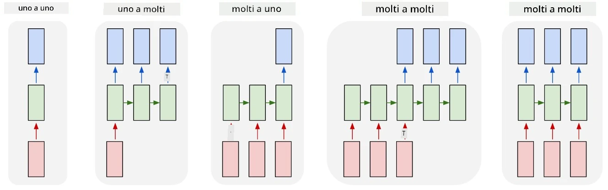

# Reti Generative

## [Quiz pre-lezione](https://ff-quizzes.netlify.app/en/ai/quiz/33)

Le Reti Neurali Ricorrenti (RNN) e le loro varianti con celle a controllo, come le Long Short Term Memory Cells (LSTM) e le Gated Recurrent Units (GRU), hanno fornito un meccanismo per il modellamento del linguaggio, poiché possono apprendere l'ordine delle parole e fornire previsioni per la parola successiva in una sequenza. Questo ci permette di utilizzare le RNN per compiti **generativi**, come la generazione di testo ordinario, la traduzione automatica e persino la creazione di didascalie per immagini.

> ✅ Pensa a tutte le volte in cui hai beneficiato di compiti generativi, come il completamento del testo mentre scrivi. Fai una ricerca sulle tue applicazioni preferite per vedere se utilizzano le RNN.

Nell'architettura RNN discussa nell'unità precedente, ogni unità RNN produceva il successivo stato nascosto come output. Tuttavia, possiamo anche aggiungere un altro output a ciascuna unità ricorrente, che ci permetterebbe di generare una **sequenza** (di lunghezza uguale alla sequenza originale). Inoltre, possiamo utilizzare unità RNN che non accettano un input a ogni passo, ma prendono solo un vettore di stato iniziale e producono una sequenza di output.

Questo consente diverse architetture neurali, come mostrato nell'immagine seguente:



> Immagine tratta dal post del blog [Unreasonable Effectiveness of Recurrent Neural Networks](http://karpathy.github.io/2015/05/21/rnn-effectiveness/) di [Andrej Karpaty](http://karpathy.github.io/)

* **One-to-one** è una rete neurale tradizionale con un input e un output
* **One-to-many** è un'architettura generativa che accetta un valore di input e genera una sequenza di valori di output. Ad esempio, se vogliamo addestrare una rete per la **descrizione di immagini** che produca una descrizione testuale di un'immagine, possiamo fornire l'immagine come input, passarla attraverso una CNN per ottenere il suo stato nascosto e poi utilizzare una catena ricorrente per generare la didascalia parola per parola.
* **Many-to-one** corrisponde alle architetture RNN descritte nell'unità precedente, come la classificazione del testo.
* **Many-to-many**, o **sequence-to-sequence**, corrisponde a compiti come la **traduzione automatica**, dove una prima RNN raccoglie tutte le informazioni dalla sequenza di input nello stato nascosto, e un'altra catena RNN espande questo stato nella sequenza di output.

In questa unità, ci concentreremo su modelli generativi semplici che ci aiutano a generare testo. Per semplicità, utilizzeremo la tokenizzazione a livello di carattere.

Addestreremo questa RNN per generare testo passo dopo passo. A ogni passo, prenderemo una sequenza di caratteri di lunghezza `nchars` e chiederemo alla rete di generare il carattere successivo per ciascun carattere di input:


Durante la generazione del testo (in fase di inferenza), iniziamo con un **prompt**, che viene passato attraverso le celle RNN per generare il suo stato intermedio, e da questo stato inizia la generazione. Generiamo un carattere alla volta, passando lo stato e il carattere generato a un'altra cella RNN per generare il successivo, fino a quando non abbiamo generato un numero sufficiente di caratteri.


> Immagine dell'autore

## ✍️ Esercizi: Reti Generative

Continua il tuo apprendimento nei seguenti notebook:

* [Reti Generative con PyTorch](GenerativePyTorch.ipynb)
* [Reti Generative con TensorFlow](GenerativeTF.ipynb)

## Generazione di testo morbida e temperatura

L'output di ciascuna cella RNN è una distribuzione di probabilità dei caratteri. Se scegliamo sempre il carattere con la probabilità più alta come prossimo carattere nel testo generato, il testo può spesso diventare "ciclico", ripetendo le stesse sequenze di caratteri più e più volte, come in questo esempio:

```
today of the second the company and a second the company ...
```

Tuttavia, se osserviamo la distribuzione di probabilità per il carattere successivo, potrebbe accadere che la differenza tra alcune delle probabilità più alte non sia enorme, ad esempio un carattere potrebbe avere una probabilità di 0.2, un altro di 0.19, ecc. Ad esempio, cercando il prossimo carattere nella sequenza '*play*', il carattere successivo potrebbe essere sia uno spazio che una **e** (come nella parola *player*).

Questo ci porta alla conclusione che non è sempre "giusto" scegliere il carattere con la probabilità più alta, perché scegliere il secondo più probabile potrebbe comunque portare a un testo significativo. È più saggio **campionare** i caratteri dalla distribuzione di probabilità fornita dall'output della rete. Possiamo anche utilizzare un parametro, chiamato **temperatura**, che appiattisce la distribuzione di probabilità se vogliamo aggiungere più casualità, o la rende più ripida se vogliamo attenerci maggiormente ai caratteri con la probabilità più alta.

Esplora come questa generazione di testo morbida è implementata nei notebook collegati sopra.

## Conclusione

Sebbene la generazione di testo possa essere utile di per sé, i principali vantaggi derivano dalla capacità di generare testo utilizzando le RNN a partire da un vettore di caratteristiche iniziale. Ad esempio, la generazione di testo viene utilizzata come parte della traduzione automatica (sequence-to-sequence, in questo caso il vettore di stato dell'*encoder* viene utilizzato per generare o *decodificare* il messaggio tradotto), o per generare descrizioni testuali di un'immagine (in questo caso il vettore di caratteristiche proviene da un estrattore CNN).

## 🚀 Sfida

Segui alcune lezioni su Microsoft Learn su questo argomento:

* Generazione di Testo con [PyTorch](https://docs.microsoft.com/learn/modules/intro-natural-language-processing-pytorch/6-generative-networks/?WT.mc_id=academic-77998-cacaste)/[TensorFlow](https://docs.microsoft.com/learn/modules/intro-natural-language-processing-tensorflow/5-generative-networks/?WT.mc_id=academic-77998-cacaste)

## [Quiz post-lezione](https://ff-quizzes.netlify.app/en/ai/quiz/34)

## Revisione e Studio Autonomo

Ecco alcuni articoli per ampliare le tue conoscenze:

* Approcci diversi alla generazione di testo con Catena di Markov, LSTM e GPT-2: [post del blog](https://towardsdatascience.com/text-generation-gpt-2-lstm-markov-chain-9ea371820e1e)
* Esempio di generazione di testo nella [documentazione di Keras](https://keras.io/examples/generative/lstm_character_level_text_generation/)

## [Compito](lab/README.md)

Abbiamo visto come generare testo carattere per carattere. Nel laboratorio, esplorerai la generazione di testo a livello di parola.

---

