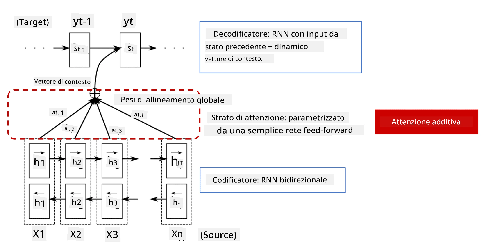
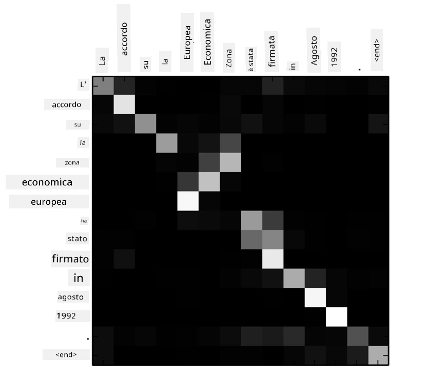
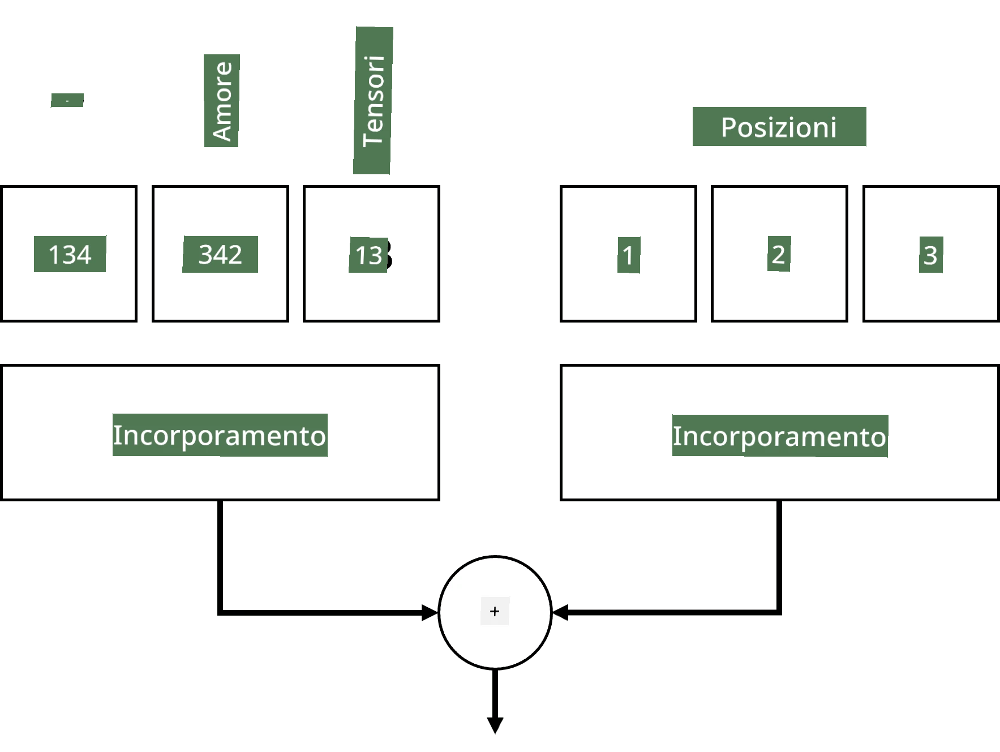
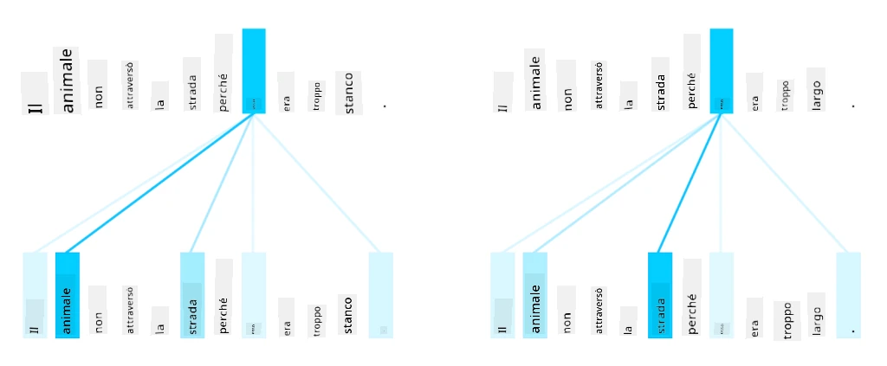
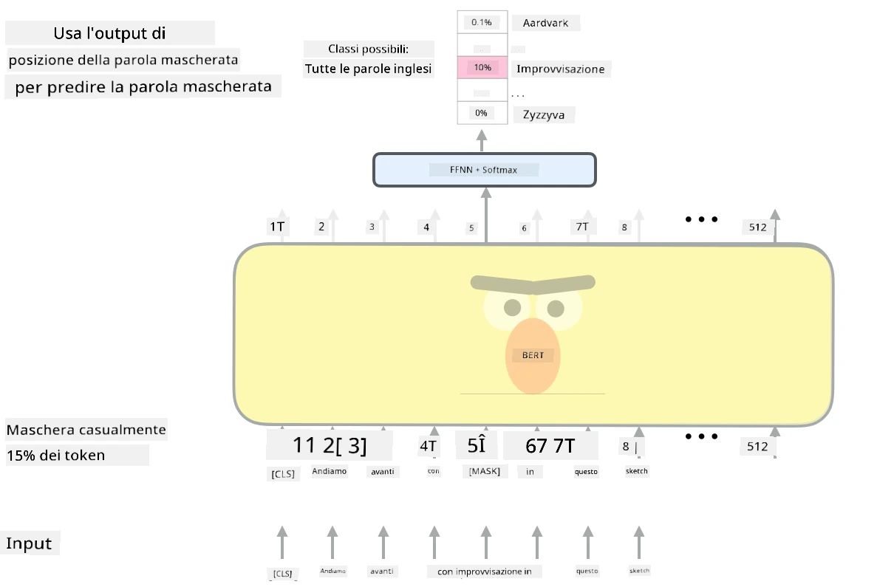

# Meccanismi di Attenzione e Transformers

## [Quiz pre-lezione](https://ff-quizzes.netlify.app/en/ai/quiz/35)

Uno dei problemi più importanti nel campo dell'NLP è la **traduzione automatica**, un compito essenziale alla base di strumenti come Google Translate. In questa sezione ci concentreremo sulla traduzione automatica, o, più in generale, su qualsiasi attività di *sequence-to-sequence* (chiamata anche **trasduzione di frasi**).

Con gli RNN, il sequence-to-sequence viene implementato da due reti ricorrenti, dove una rete, l'**encoder**, comprime una sequenza di input in uno stato nascosto, mentre un'altra rete, il **decoder**, espande questo stato nascosto in un risultato tradotto. Ci sono alcuni problemi con questo approccio:

* Lo stato finale della rete encoder ha difficoltà a ricordare l'inizio di una frase, causando una scarsa qualità del modello per frasi lunghe.
* Tutte le parole in una sequenza hanno lo stesso impatto sul risultato. In realtà, però, alcune parole nella sequenza di input hanno un impatto maggiore sugli output sequenziali rispetto ad altre.

I **Meccanismi di Attenzione** forniscono un mezzo per pesare l'impatto contestuale di ciascun vettore di input su ciascuna previsione di output dell'RNN. Questo viene implementato creando scorciatoie tra gli stati intermedi dell'RNN di input e l'RNN di output. In questo modo, quando si genera il simbolo di output yt, si prendono in considerazione tutti gli stati nascosti di input hi, con diversi coefficienti di peso &alpha;t,i.

> Il modello encoder-decoder con meccanismo di attenzione additiva in [Bahdanau et al., 2015](https://arxiv.org/pdf/1409.0473.pdf), citato da [questo blog post](https://lilianweng.github.io/lil-log/2018/06/24/attention-attention.html)

La matrice di attenzione {&alpha;i,j} rappresenta il grado in cui alcune parole di input influenzano la generazione di una determinata parola nella sequenza di output. Di seguito è riportato un esempio di tale matrice:

> Figura da [Bahdanau et al., 2015](https://arxiv.org/pdf/1409.0473.pdf) (Fig.3)

I meccanismi di attenzione sono responsabili di gran parte dello stato dell'arte attuale o quasi attuale nell'NLP. Tuttavia, aggiungere attenzione aumenta notevolmente il numero di parametri del modello, il che ha portato a problemi di scalabilità con gli RNN. Un vincolo chiave nella scalabilità degli RNN è che la natura ricorrente dei modelli rende difficile il batching e la parallelizzazione dell'addestramento. In un RNN, ogni elemento di una sequenza deve essere elaborato in ordine sequenziale, il che significa che non può essere facilmente parallelizzato.

> Figura dal [Blog di Google](https://research.googleblog.com/2016/09/a-neural-network-for-machine.html)

L'adozione dei meccanismi di attenzione combinata con questo vincolo ha portato alla creazione dei modelli Transformer, ora lo stato dell'arte, che conosciamo e utilizziamo oggi, come BERT e Open-GPT3.

## Modelli Transformer

Una delle idee principali dietro i transformers è evitare la natura sequenziale degli RNN e creare un modello parallelizzabile durante l'addestramento. Questo viene ottenuto implementando due idee:

* codifica posizionale
* utilizzo del meccanismo di auto-attenzione per catturare schemi invece degli RNN (o CNN) (ecco perché il paper che introduce i transformers si chiama *[Attention is all you need](https://arxiv.org/abs/1706.03762)*)

### Codifica/Embedding Posizionale

L'idea della codifica posizionale è la seguente. 
1. Quando si utilizzano gli RNN, la posizione relativa dei token è rappresentata dal numero di passaggi e quindi non necessita di essere rappresentata esplicitamente. 
2. Tuttavia, una volta che si passa all'attenzione, è necessario conoscere le posizioni relative dei token all'interno di una sequenza. 
3. Per ottenere la codifica posizionale, si arricchisce la sequenza di token con una sequenza di posizioni dei token nella sequenza (cioè una sequenza di numeri 0,1, ...).
4. Si mescola quindi la posizione del token con un vettore di embedding del token. Per trasformare la posizione (intero) in un vettore, si possono utilizzare diversi approcci:

* Embedding addestrabile, simile all'embedding dei token. Questo è l'approccio che consideriamo qui. Applichiamo strati di embedding sia sui token che sulle loro posizioni, ottenendo vettori di embedding delle stesse dimensioni, che poi sommiamo.
* Funzione di codifica posizionale fissa, come proposto nel paper originale.

> Immagine dell'autore

Il risultato che otteniamo con l'embedding posizionale incorpora sia il token originale che la sua posizione all'interno di una sequenza.

### Auto-Attenzione Multi-Testa

Successivamente, dobbiamo catturare alcuni schemi all'interno della nostra sequenza. Per fare ciò, i transformers utilizzano un meccanismo di **auto-attenzione**, che è essenzialmente attenzione applicata alla stessa sequenza come input e output. Applicare l'auto-attenzione ci consente di tenere conto del **contesto** all'interno della frase e vedere quali parole sono interconnesse. Ad esempio, ci consente di vedere quali parole sono riferite da coreferenze, come *it*, e di considerare il contesto:

> Immagine dal [Blog di Google](https://research.googleblog.com/2017/08/transformer-novel-neural-network.html)

Nei transformers, utilizziamo l'**attenzione multi-testa** per dare alla rete la capacità di catturare diversi tipi di dipendenze, ad esempio relazioni tra parole a lungo termine vs. a breve termine, coreferenze vs. altro, ecc.

[Notebook TensorFlow](TransformersTF.ipynb) contiene maggiori dettagli sull'implementazione degli strati transformer.

### Attenzione Encoder-Decoder

Nei transformers, l'attenzione viene utilizzata in due punti:

* Per catturare schemi all'interno del testo di input utilizzando l'auto-attenzione.
* Per eseguire la traduzione di sequenze - è lo strato di attenzione tra encoder e decoder.

L'attenzione encoder-decoder è molto simile al meccanismo di attenzione utilizzato negli RNN, come descritto all'inizio di questa sezione. Questo diagramma animato spiega il ruolo dell'attenzione encoder-decoder.

Poiché ogni posizione di input viene mappata indipendentemente a ogni posizione di output, i transformers possono parallelizzare meglio rispetto agli RNN, il che consente modelli linguistici molto più grandi ed espressivi. Ogni testa di attenzione può essere utilizzata per apprendere diverse relazioni tra parole, migliorando i compiti di elaborazione del linguaggio naturale a valle.

## BERT

**BERT** (Bidirectional Encoder Representations from Transformers) è una rete transformer multi-strato molto grande con 12 strati per *BERT-base* e 24 per *BERT-large*. Il modello viene prima pre-addestrato su un ampio corpus di dati testuali (Wikipedia + libri) utilizzando un addestramento non supervisionato (predizione di parole mascherate in una frase). Durante il pre-addestramento, il modello acquisisce livelli significativi di comprensione del linguaggio che possono poi essere sfruttati con altri dataset utilizzando il fine tuning. Questo processo è chiamato **transfer learning**.

> Immagine [fonte](http://jalammar.github.io/illustrated-bert/)

## ✍️ Esercizi: Transformers

Continua il tuo apprendimento nei seguenti notebook:

* [Transformers in PyTorch](TransformersPyTorch.ipynb)
* [Transformers in TensorFlow](TransformersTF.ipynb)

## Conclusione

In questa lezione hai imparato i Transformers e i Meccanismi di Attenzione, strumenti essenziali nella cassetta degli attrezzi dell'NLP. Esistono molte varianti di architetture Transformer, tra cui BERT, DistilBERT, BigBird, OpenGPT3 e altre, che possono essere ottimizzate. Il pacchetto [HuggingFace](https://github.com/huggingface/) fornisce un repository per l'addestramento di molte di queste architetture sia con PyTorch che con TensorFlow.

## 🚀 Sfida

## [Quiz post-lezione](https://ff-quizzes.netlify.app/en/ai/quiz/36)

## Revisione e Studio Autonomo

* [Blog post](https://mchromiak.github.io/articles/2017/Sep/12/Transformer-Attention-is-all-you-need/), che spiega il classico paper [Attention is all you need](https://arxiv.org/abs/1706.03762) sui transformers.
* [Una serie di blog post](https://towardsdatascience.com/transformers-explained-visually-part-1-overview-of-functionality-95a6dd460452) sui transformers, che spiegano l'architettura in dettaglio.

## [Compito](assignment.md)

---

