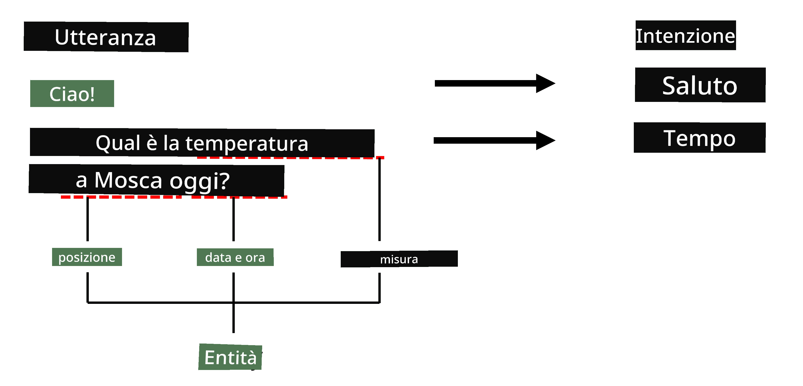

# Riconoscimento delle Entità Nominate

Fino ad ora ci siamo concentrati principalmente su un compito di NLP - la classificazione. Tuttavia, ci sono anche altri compiti di NLP che possono essere affrontati con reti neurali. Uno di questi è il **[Riconoscimento delle Entità Nominate](https://wikipedia.org/wiki/Named-entity_recognition)** (NER), che si occupa di riconoscere entità specifiche all'interno di un testo, come luoghi, nomi di persone, intervalli di date e orari, formule chimiche e così via.

## [Quiz pre-lezione](https://ff-quizzes.netlify.app/en/ai/quiz/37)

## Esempio di Utilizzo del NER

Supponiamo che tu voglia sviluppare un chatbot di linguaggio naturale, simile ad Amazon Alexa o Google Assistant. Il modo in cui funzionano i chatbot intelligenti è *comprendere* ciò che l'utente desidera facendo una classificazione del testo sulla frase di input. Il risultato di questa classificazione è il cosiddetto **intent**, che determina cosa dovrebbe fare il chatbot.

> Immagine dell'autore

Tuttavia, un utente potrebbe fornire alcuni parametri come parte della frase. Ad esempio, quando chiede informazioni sul meteo, potrebbe specificare una località o una data. Un bot dovrebbe essere in grado di comprendere queste entità e riempire gli slot dei parametri di conseguenza prima di eseguire l'azione. Ed è proprio qui che entra in gioco il NER.

> ✅ Un altro esempio potrebbe essere [l'analisi di articoli scientifici medici](https://soshnikov.com/science/analyzing-medical-papers-with-azure-and-text-analytics-for-health/). Una delle principali cose da cercare sono termini medici specifici, come malattie e sostanze mediche. Mentre un piccolo numero di malattie può probabilmente essere estratto utilizzando la ricerca per sottostringhe, entità più complesse, come composti chimici e nomi di farmaci, richiedono un approccio più sofisticato.

## NER come Classificazione dei Token

I modelli NER sono essenzialmente **modelli di classificazione dei token**, perché per ciascuno dei token di input dobbiamo decidere se appartiene a un'entità o meno, e se sì - a quale classe di entità.

Considera il seguente titolo di un articolo:

**Rigurgito della valvola tricuspide** e **carbonato di litio** **tossicità** in un neonato.

Le entità qui sono:

* Rigurgito della valvola tricuspide è una malattia (`DIS`)
* Carbonato di litio è una sostanza chimica (`CHEM`)
* Tossicità è anch'essa una malattia (`DIS`)

Nota che un'entità può estendersi su più token. E, come in questo caso, dobbiamo distinguere tra due entità consecutive. Pertanto, è comune utilizzare due classi per ogni entità - una che specifica il primo token dell'entità (spesso si usa il prefisso `B-`, per **inizio**), e un'altra - la continuazione di un'entità (`I-`, per **interno**). Usiamo anche `O` come classe per rappresentare tutti gli altri token. Questo tipo di tagging dei token è chiamato [BIO tagging](https://en.wikipedia.org/wiki/Inside%E2%80%93outside%E2%80%93beginning_(tagging)) (o IOB). Quando taggato, il nostro titolo apparirà così:

Token | Tag
------|-----
Rigurgito | B-DIS
della | I-DIS
valvola | I-DIS
tricuspide | I-DIS
e | O
carbonato | B-CHEM
di | I-CHEM
litio | I-CHEM
tossicità | B-DIS
in | O
un | O
neonato | O
. | O

Poiché dobbiamo costruire una corrispondenza uno-a-uno tra token e classi, possiamo allenare un modello neurale **molti-a-molti** come mostrato in questa immagine:

> *Immagine tratta da [questo post sul blog](http://karpathy.github.io/2015/05/21/rnn-effectiveness/) di [Andrej Karpathy](http://karpathy.github.io/). I modelli di classificazione dei token NER corrispondono all'architettura di rete più a destra in questa immagine.*

## Allenamento dei modelli NER

Poiché un modello NER è essenzialmente un modello di classificazione dei token, possiamo utilizzare le RNN che già conosciamo per questo compito. In questo caso, ogni blocco della rete ricorrente restituirà l'ID del token. Il seguente notebook di esempio mostra come allenare un LSTM per la classificazione dei token.

## ✍️ Notebook di Esempio: NER

Continua il tuo apprendimento nel seguente notebook:

* [NER con TensorFlow](NER-TF.ipynb)

## Conclusione

Un modello NER è un **modello di classificazione dei token**, il che significa che può essere utilizzato per eseguire la classificazione dei token. Questo è un compito molto comune in NLP, utile per riconoscere entità specifiche all'interno di un testo, inclusi luoghi, nomi, date e altro.

## 🚀 Sfida

Completa l'esercizio collegato qui sotto per allenare un modello di riconoscimento delle entità nominate per termini medici, quindi prova a utilizzarlo su un dataset diverso.

## [Quiz post-lezione](https://ff-quizzes.netlify.app/en/ai/quiz/38)

## Revisione & Studio Autonomo

Leggi il blog [The Unreasonable Effectiveness of Recurrent Neural Networks](http://karpathy.github.io/2015/05/21/rnn-effectiveness/) e segui la sezione di Ulteriori Letture in quell'articolo per approfondire la tua conoscenza.

## [Esercizio](lab/README.md)

Nell'esercizio di questa lezione, dovrai allenare un modello di riconoscimento delle entità mediche. Puoi iniziare con l'allenamento di un modello LSTM come descritto in questa lezione, e procedere con l'utilizzo del modello transformer BERT. Leggi [le istruzioni](lab/README.md) per ottenere tutti i dettagli.

---

