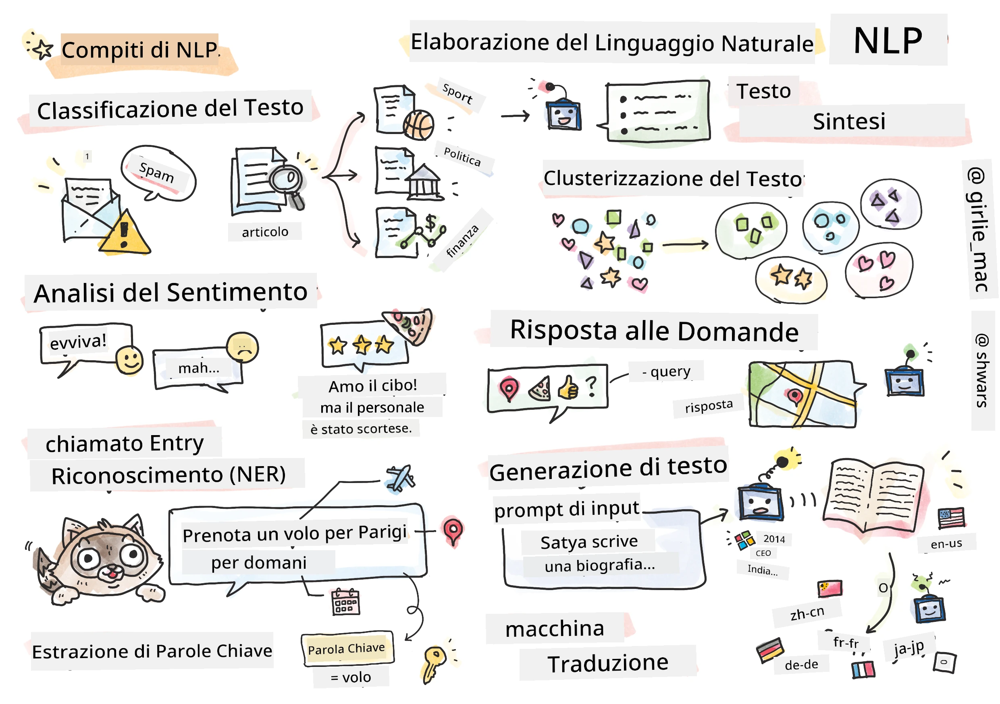

# Elaborazione del Linguaggio Naturale



In questa sezione ci concentreremo sull'utilizzo delle reti neurali per gestire compiti legati all'**Elaborazione del Linguaggio Naturale (NLP)**. Ci sono molti problemi di NLP che vogliamo che i computer siano in grado di risolvere:

* **Classificazione del testo** è un tipico problema di classificazione relativo alle sequenze di testo. Gli esempi includono la classificazione di e-mail come spam o non-spam, o la categorizzazione di articoli come sport, economia, politica, ecc. Inoltre, nello sviluppo di chatbot, spesso dobbiamo capire cosa l'utente vuole dire -- in questo caso ci occupiamo della **classificazione dell'intento**. Spesso, nella classificazione dell'intento, dobbiamo gestire molte categorie.
* **Analisi del sentiment** è un tipico problema di regressione, dove dobbiamo attribuire un numero (un sentiment) che corrisponde a quanto positivo/negativo è il significato di una frase. Una versione più avanzata dell'analisi del sentiment è l'**analisi del sentiment basata sugli aspetti** (ABSA), dove attribuiamo il sentiment non all'intera frase, ma a diverse parti di essa (aspetti), ad esempio: *In questo ristorante, mi è piaciuta la cucina, ma l'atmosfera era terribile*.
* **Riconoscimento delle entità nominate** (NER) si riferisce al problema di estrarre determinate entità dal testo. Ad esempio, potremmo dover capire che nella frase *Devo volare a Parigi domani* la parola *domani* si riferisce a una DATA, e *Parigi* è una LOCALITÀ.  
* **Estrazione di parole chiave** è simile al NER, ma dobbiamo estrarre automaticamente le parole importanti per il significato della frase, senza pre-addestramento per tipi specifici di entità.
* **Clustering del testo** può essere utile quando vogliamo raggruppare insieme frasi simili, ad esempio, richieste simili nelle conversazioni di supporto tecnico.
* **Risposta alle domande** si riferisce alla capacità di un modello di rispondere a una domanda specifica. Il modello riceve un passaggio di testo e una domanda come input, e deve fornire un punto nel testo dove si trova la risposta alla domanda (o, a volte, generare il testo della risposta).
* **Generazione di testo** è la capacità di un modello di generare nuovo testo. Può essere considerato un compito di classificazione che prevede la prossima lettera/parola basandosi su un *prompt di testo*. Modelli avanzati di generazione di testo, come GPT-3, sono in grado di risolvere altri compiti NLP utilizzando una tecnica chiamata [programmazione tramite prompt](https://towardsdatascience.com/software-3-0-how-prompting-will-change-the-rules-of-the-game-a982fbfe1e0) o [ingegneria dei prompt](https://medium.com/swlh/openai-gpt-3-and-prompt-engineering-dcdc2c5fcd29).
* **Riassunto del testo** è una tecnica in cui vogliamo che un computer "legga" un testo lungo e lo riassuma in poche frasi.
* **Traduzione automatica** può essere vista come una combinazione di comprensione del testo in una lingua e generazione di testo in un'altra.

Inizialmente, la maggior parte dei compiti NLP veniva risolta utilizzando metodi tradizionali come le grammatiche. Ad esempio, nella traduzione automatica venivano utilizzati parser per trasformare la frase iniziale in un albero sintattico, poi venivano estratte strutture semantiche di livello superiore per rappresentare il significato della frase, e basandosi su questo significato e sulla grammatica della lingua di destinazione veniva generato il risultato. Oggi, molti compiti NLP vengono risolti in modo più efficace utilizzando reti neurali.

> Molti metodi classici di NLP sono implementati nella libreria Python [Natural Language Processing Toolkit (NLTK)](https://www.nltk.org). È disponibile online un ottimo [Libro NLTK](https://www.nltk.org/book/) che copre come diversi compiti NLP possono essere risolti utilizzando NLTK.

Nel nostro corso, ci concentreremo principalmente sull'utilizzo delle reti neurali per il NLP, e utilizzeremo NLTK dove necessario.

Abbiamo già imparato a utilizzare le reti neurali per gestire dati tabulari e immagini. La principale differenza tra questi tipi di dati e il testo è che il testo è una sequenza di lunghezza variabile, mentre la dimensione dell'input nel caso delle immagini è nota in anticipo. Mentre le reti convoluzionali possono estrarre schemi dai dati di input, gli schemi nel testo sono più complessi. Ad esempio, possiamo avere una negazione separata dal soggetto da molte parole (ad esempio: *Non mi piacciono le arance*, vs. *Non mi piacciono quelle grandi arance colorate e gustose*), e ciò dovrebbe comunque essere interpretato come un unico schema. Pertanto, per gestire il linguaggio dobbiamo introdurre nuovi tipi di reti neurali, come le *reti ricorrenti* e i *transformer*.

## Installare le librerie

Se stai utilizzando un'installazione locale di Python per eseguire questo corso, potresti dover installare tutte le librerie necessarie per il NLP utilizzando i seguenti comandi:

**Per PyTorch**
```bash
pip install -r requirements-torch.txt
```
**Per TensorFlow**
```bash
pip install -r requirements-tf.txt
```

> Puoi provare il NLP con TensorFlow su [Microsoft Learn](https://docs.microsoft.com/learn/modules/intro-natural-language-processing-tensorflow/?WT.mc_id=academic-77998-cacaste)

## Avviso GPU

In questa sezione, in alcuni esempi alleneremo modelli piuttosto grandi.
* **Usa un computer con GPU**: È consigliabile eseguire i tuoi notebook su un computer con GPU per ridurre i tempi di attesa quando lavori con modelli grandi.
* **Vincoli di memoria GPU**: L'esecuzione su GPU può portare a situazioni in cui esaurisci la memoria GPU, specialmente durante l'addestramento di modelli grandi.
* **Consumo di memoria GPU**: La quantità di memoria GPU consumata durante l'addestramento dipende da vari fattori, inclusa la dimensione del minibatch.
* **Riduci la dimensione del minibatch**: Se riscontri problemi di memoria GPU, considera di ridurre la dimensione del minibatch nel tuo codice come possibile soluzione.
* **Rilascio della memoria GPU in TensorFlow**: Le versioni più vecchie di TensorFlow potrebbero non rilasciare correttamente la memoria GPU durante l'addestramento di più modelli all'interno di un kernel Python. Per gestire efficacemente l'uso della memoria GPU, puoi configurare TensorFlow per allocare memoria GPU solo quando necessario.
* **Inclusione del codice**: Per impostare TensorFlow affinché cresca l'allocazione della memoria GPU solo quando richiesto, includi il seguente codice nei tuoi notebook:

```python
physical_devices = tf.config.list_physical_devices('GPU') 
if len(physical_devices)>0:
    tf.config.experimental.set_memory_growth(physical_devices[0], True) 
```

Se sei interessato a imparare il NLP da una prospettiva di ML classico, visita [questa suite di lezioni](https://github.com/microsoft/ML-For-Beginners/tree/main/6-NLP)

## In questa sezione
In questa sezione impareremo:

* [Rappresentare il testo come tensori](13-TextRep/README.md)
* [Word Embeddings](14-Emdeddings/README.md)
* [Modellazione del linguaggio](15-LanguageModeling/README.md)
* [Reti neurali ricorrenti](16-RNN/README.md)
* [Reti generative](17-GenerativeNetworks/README.md)
* [Transformers](18-Transformers/README.md)

**Disclaimer**:  
Questo documento è stato tradotto utilizzando il servizio di traduzione AI [Co-op Translator](https://github.com/Azure/co-op-translator). Sebbene ci impegniamo per garantire l'accuratezza, si prega di notare che le traduzioni automatiche possono contenere errori o imprecisioni. Il documento originale nella sua lingua nativa dovrebbe essere considerato la fonte autorevole. Per informazioni critiche, si raccomanda una traduzione professionale effettuata da un esperto umano. Non siamo responsabili per eventuali incomprensioni o interpretazioni errate derivanti dall'uso di questa traduzione.