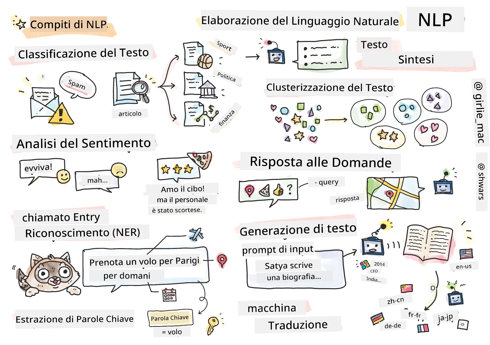

# Elaborazione del Linguaggio Naturale



In questa sezione, ci concentreremo sull'uso delle Reti Neurali per affrontare compiti correlati all'**Elaborazione del Linguaggio Naturale (NLP)**. Ci sono molti problemi di NLP che vogliamo che i computer siano in grado di risolvere:

* **Classificazione del testo** è un tipico problema di classificazione che riguarda sequenze di testo. Esempi includono la classificazione di messaggi e-mail come spam o non spam, o la categorizzazione di articoli in sport, economia, politica, ecc. Inoltre, nello sviluppo di chatbot, spesso è necessario comprendere cosa l'utente voleva dire -- in questo caso si tratta di **classificazione dell'intento**. Spesso, nella classificazione dell'intento, dobbiamo gestire molte categorie.
* **Analisi del sentiment** è un tipico problema di regressione, dove dobbiamo attribuire un numero (un sentiment) corrispondente a quanto positivo/negativo sia il significato di una frase. Una versione più avanzata dell'analisi del sentiment è l'**analisi del sentiment basata sugli aspetti** (ABSA), dove attribuiamo sentiment non all'intera frase, ma a parti diverse di essa (aspetti), ad esempio *In questo ristorante, mi è piaciuta la cucina, ma l'atmosfera era orribile*.
* **Named Entity Recognition** (NER) si riferisce al problema di estrarre certe entità dal testo. Per esempio, potremmo dover capire che nella frase *Devo volare a Parigi domani* la parola *domani* si riferisce a una DATA, e *Parigi* è una LOCALITÀ.  
* **Estrazione di parole chiave** è simile alla NER, ma dobbiamo estrarre automaticamente parole importanti per il significato della frase, senza un pre-addestramento per tipi specifici di entità.
* **Clustering del testo** può essere utile quando vogliamo raggruppare insieme frasi simili, ad esempio, richieste simili nelle conversazioni di supporto tecnico.
* **Risposta a domande** si riferisce alla capacità di un modello di rispondere a una domanda specifica. Il modello riceve in input un passaggio di testo e una domanda, e deve fornire un luogo nel testo dove la risposta alla domanda è contenuta (o, talvolta, generare il testo della risposta).
* **Generazione di testo** è la capacità di un modello di generare nuovo testo. Può essere considerata come un compito di classificazione che predice la lettera/parola successiva basandosi su un *prompt di testo*. Modelli avanzati di generazione testuale, come GPT-3, sono in grado di risolvere altri compiti di NLP come la classificazione usando una tecnica chiamata [prompt programming](https://towardsdatascience.com/software-3-0-how-prompting-will-change-the-rules-of-the-game-a982fbfe1e0) o [prompt engineering](https://medium.com/swlh/openai-gpt-3-and-prompt-engineering-dcdc2c5fcd29)
* **Sintesi del testo** è una tecnica in cui vogliamo che un computer "legga" un testo lungo e lo riassuma in poche frasi.
* **Traduzione automatica** può essere vista come una combinazione della comprensione del testo in una lingua e della generazione del testo in un'altra.

Inizialmente, la maggior parte dei compiti di NLP venivano risolti usando metodi tradizionali come le grammatiche. Ad esempio, nella traduzione automatica venivano usati parser per trasformare la frase iniziale in un albero sintattico, poi venivano estratte strutture semantiche di livello superiore per rappresentare il significato della frase, e basandosi su questo significato e sulla grammatica della lingua di destinazione veniva generato il risultato. Oggi molti compiti di NLP sono risolti in modo più efficace usando reti neurali.

> Molti metodi classici di NLP sono implementati nella libreria Python [Natural Language Processing Toolkit (NLTK)](https://www.nltk.org). È disponibile online un ottimo [Libro NLTK](https://www.nltk.org/book/) che spiega come diversi compiti di NLP possano essere risolti usando NLTK.

Nel nostro corso, ci concentreremo principalmente sull’uso delle Reti Neurali per NLP, e utilizzeremo NLTK quando necessario.

Abbiamo già imparato a usare reti neurali per lavorare con dati tabellari e immagini. La principale differenza tra quei tipi di dati e il testo è che il testo è una sequenza di lunghezza variabile, mentre la dimensione dell’input nel caso delle immagini è nota in anticipo. Mentre le reti convoluzionali possono estrarre pattern dai dati di input, i pattern nel testo sono più complessi. Ad esempio, possiamo avere una negazione separata dal soggetto da un numero arbitrario di parole (es. *Non mi piacciono le arance*, vs. *Non mi piacciono quelle grosse arance colorate e gustose*), e ciò dovrebbe ancora essere interpretato come un unico pattern. Quindi, per gestire il linguaggio, dobbiamo introdurre nuovi tipi di reti neurali, come le *reti ricorrenti* e i *transformers*.

## Installazione delle librerie

Se stai usando un’installazione locale di Python per seguire questo corso, potresti dover installare tutte le librerie necessarie per NLP utilizzando i seguenti comandi:

**Per PyTorch**
```bash
pip install -r requirements-pytorch.txt
```
**Per TensorFlow**
```bash
pip install -r requirements-tf.txt
```

> Puoi provare NLP con TensorFlow su [Microsoft Learn](https://docs.microsoft.com/learn/modules/intro-natural-language-processing-tensorflow/?WT.mc_id=academic-77998-cacaste)

## Avviso GPU

In questa sezione, in alcuni degli esempi alleneremo modelli piuttosto grandi.
* **Usa un computer con GPU abilitata**: È consigliabile eseguire i tuoi notebook su un computer con GPU abilitata per ridurre i tempi di attesa quando si lavora con modelli grandi.
* **Vincoli di memoria GPU**: L'esecuzione su GPU può portare a situazioni in cui la memoria GPU si esaurisce, specialmente durante l’addestramento di modelli grandi.
* **Consumo di memoria GPU**: La quantità di memoria GPU consumata durante l’addestramento dipende da vari fattori, inclusa la dimensione del minibatch.
* **Minimizza la dimensione del minibatch**: Se riscontri problemi di memoria GPU, considera di ridurre la dimensione del minibatch nel tuo codice come possibile soluzione.
* **Rilascio di memoria GPU in TensorFlow**: Versioni più vecchie di TensorFlow possono non rilasciare correttamente la memoria GPU quando si addestrano più modelli all'interno dello stesso kernel Python. Per gestire efficacemente l’uso della memoria GPU, puoi configurare TensorFlow per allocare la memoria GPU solo quando necessario.
* **Inclusione del codice**: Per impostare TensorFlow in modo che cresca nell’allocazione della memoria GPU solo quando richiesto, includi il seguente codice nei tuoi notebook:

```python
physical_devices = tf.config.list_physical_devices('GPU') 
if len(physical_devices)>0:
    tf.config.experimental.set_memory_growth(physical_devices[0], True) 
```

Se sei interessato a imparare NLP da una prospettiva classica di ML, visita [questa serie di lezioni](https://github.com/microsoft/ML-For-Beginners/tree/main/6-NLP)

## In questa sezione
In questa sezione impareremo:

* [Rappresentare il testo come tensori](13-TextRep/README.md)
* [Word Embeddings](14-Embeddings/README.md)
* [Modellazione del linguaggio](15-LanguageModeling/README.md)
* [Reti Neurali Ricorrenti](16-RNN/README.md)
* [Reti generative](17-GenerativeNetworks/README.md)
* [Transformers](18-Transformers/README.md)

---

<!-- CO-OP TRANSLATOR DISCLAIMER START -->
**Disclaimer**:
Questo documento è stato tradotto utilizzando il servizio di traduzione AI [Co-op Translator](https://github.com/Azure/co-op-translator). Sebbene ci impegniamo per garantire la precisione, si prega di notare che le traduzioni automatizzate possono contenere errori o imprecisioni. Il documento originale nella sua lingua nativa deve essere considerato la fonte autorevole. Per informazioni critiche, si raccomanda una traduzione professionale effettuata da un essere umano. Non siamo responsabili per eventuali malintesi o interpretazioni errate derivanti dall’uso di questa traduzione.
<!-- CO-OP TRANSLATOR DISCLAIMER END -->