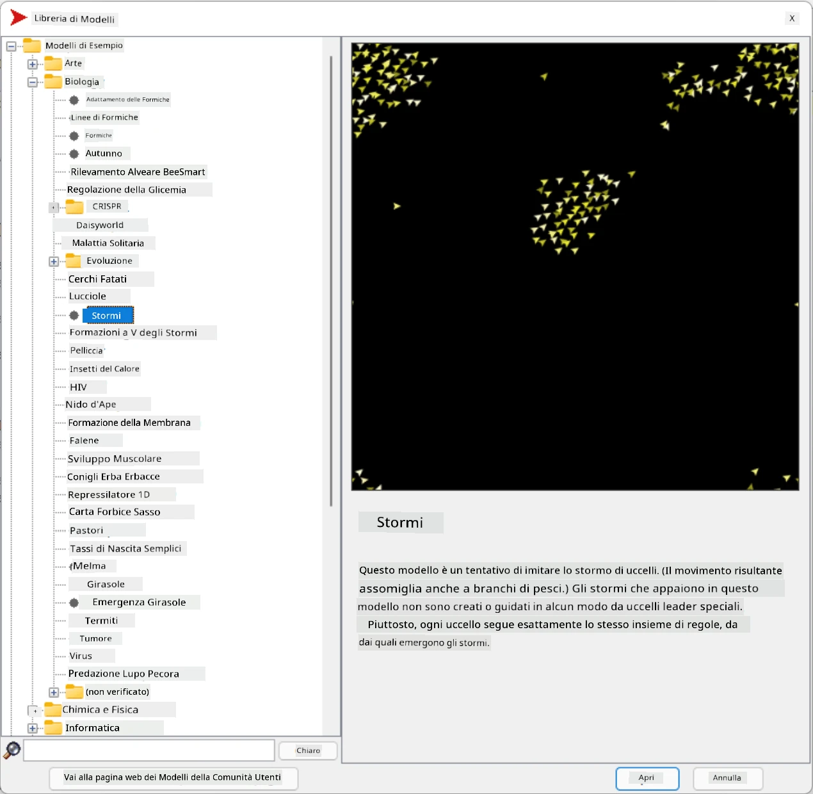
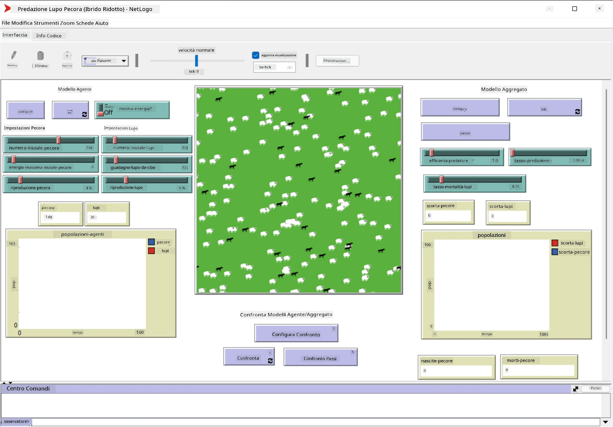

# Sistemi Multi-Agente

Uno dei modi possibili per raggiungere l'intelligenza è il cosiddetto approccio **emergente** (o **sinergico**), basato sul fatto che il comportamento combinato di molti agenti relativamente semplici può portare a un comportamento complessivo più complesso (o intelligente) del sistema nel suo insieme. Teoricamente, ciò si basa sui principi di [Intelligenza Collettiva](https://en.wikipedia.org/wiki/Collective_intelligence), [Emergentismo](https://en.wikipedia.org/wiki/Global_brain) e [Cibernetica Evolutiva](https://en.wikipedia.org/wiki/Global_brain), che affermano che i sistemi di livello superiore acquisiscono un certo valore aggiunto quando vengono opportunamente combinati da sistemi di livello inferiore (il cosiddetto *principio della transizione del metasistema*).

## [Quiz pre-lezione](https://ff-quizzes.netlify.app/en/ai/quiz/45)

La direzione dei **Sistemi Multi-Agente** è emersa nell'IA negli anni '90 come risposta alla crescita di Internet e dei sistemi distribuiti. Uno dei classici libri di testo sull'IA, [Artificial Intelligence: A Modern Approach](https://en.wikipedia.org/wiki/Artificial_Intelligence:_A_Modern_Approach), si concentra sulla visione dell'IA classica dal punto di vista dei sistemi multi-agente.

Centrale nell'approccio multi-agente è il concetto di **Agente** - un'entità che vive in un certo **ambiente**, che può percepire e su cui può agire. Questa è una definizione molto ampia, e ci possono essere molti tipi e classificazioni di agenti:

* In base alla loro capacità di ragionare:
   - Gli agenti **reattivi** di solito hanno un comportamento semplice di tipo richiesta-risposta
   - Gli agenti **deliberativi** utilizzano una qualche forma di ragionamento logico e/o capacità di pianificazione
* In base al luogo in cui l'agente esegue il suo codice:
   - Gli agenti **statici** operano su un nodo di rete dedicato
   - Gli agenti **mobili** possono spostare il loro codice tra i nodi di rete
* In base al loro comportamento:
   - Gli agenti **passivi** non hanno obiettivi specifici. Tali agenti possono reagire a stimoli esterni, ma non inizieranno azioni di propria iniziativa.
   - Gli agenti **attivi** hanno degli obiettivi che perseguono
   - Gli agenti **cognitivi** coinvolgono pianificazione e ragionamento complessi

I sistemi multi-agente sono oggi utilizzati in numerose applicazioni:

* Nei giochi, molti personaggi non giocanti utilizzano una qualche forma di IA e possono essere considerati agenti intelligenti
* Nella produzione video, il rendering di scene 3D complesse che coinvolgono folle viene tipicamente realizzato utilizzando simulazioni multi-agente
* Nella modellazione di sistemi, l'approccio multi-agente viene utilizzato per simulare il comportamento di un modello complesso. Ad esempio, l'approccio multi-agente è stato utilizzato con successo per prevedere la diffusione della malattia COVID-19 a livello mondiale. Un approccio simile può essere utilizzato per modellare il traffico in una città e vedere come reagisce ai cambiamenti nelle regole del traffico.
* Nei sistemi di automazione complessi, ogni dispositivo può agire come un agente indipendente, rendendo l'intero sistema meno monolitico e più robusto.

Non dedicheremo molto tempo ad approfondire i sistemi multi-agente, ma considereremo un esempio di **Modellazione Multi-Agente**.

## NetLogo

[NetLogo](https://ccl.northwestern.edu/netlogo/) è un ambiente di modellazione multi-agente basato su una versione modificata del linguaggio di programmazione [Logo](https://en.wikipedia.org/wiki/Logo_(programming_language)). Questo linguaggio è stato sviluppato per insegnare i concetti di programmazione ai bambini e consente di controllare un agente chiamato **tartaruga**, che può muoversi lasciando una traccia dietro di sé. Questo permette di creare figure geometriche complesse, un modo molto visivo per comprendere il comportamento di un agente.

In NetLogo, possiamo creare molte tartarughe usando il comando `create-turtles`. Possiamo quindi comandare a tutte le tartarughe di eseguire alcune azioni (nell'esempio seguente - avanzare di 10 punti):

```
create-turtles 10
ask turtles [
  forward 10
]
```

Ovviamente, non è interessante quando tutte le tartarughe fanno la stessa cosa, quindi possiamo `ask` a gruppi di tartarughe, ad esempio quelle che si trovano nelle vicinanze di un determinato punto. Possiamo anche creare tartarughe di diverse *razze* usando il comando `breed [cats cat]`. Qui `cat` è il nome di una razza, e dobbiamo specificare sia la parola al singolare che al plurale, poiché diversi comandi utilizzano forme diverse per chiarezza.

> ✅ Non approfondiremo l'apprendimento del linguaggio NetLogo - puoi visitare la brillante risorsa [Beginner's Interactive NetLogo Dictionary](https://ccl.northwestern.edu/netlogo/bind/) se sei interessato a saperne di più.

Puoi [scaricare](https://ccl.northwestern.edu/netlogo/download.shtml) e installare NetLogo per provarlo.

### Libreria di Modelli

Una grande caratteristica di NetLogo è che contiene una libreria di modelli funzionanti che puoi provare. Vai su **File &rightarrow; Models Library**, e troverai molte categorie di modelli tra cui scegliere.



> Uno screenshot della libreria di modelli di Dmitry Soshnikov

Puoi aprire uno dei modelli, ad esempio **Biology &rightarrow; Flocking**.

### Principi Fondamentali

Dopo aver aperto il modello, verrai portato alla schermata principale di NetLogo. Ecco un esempio di modello che descrive la popolazione di lupi e pecore, date risorse finite (erba).



> Screenshot di Dmitry Soshnikov

In questa schermata, puoi vedere:

* La sezione **Interfaccia** che contiene:
  - Il campo principale, dove vivono tutti gli agenti
  - Diversi controlli: pulsanti, cursori, ecc.
  - Grafici che puoi utilizzare per visualizzare i parametri della simulazione
* La scheda **Codice** che contiene l'editor, dove puoi scrivere il programma NetLogo

Nella maggior parte dei casi, l'interfaccia avrà un pulsante **Setup**, che inizializza lo stato della simulazione, e un pulsante **Go** che avvia l'esecuzione. Questi sono gestiti da gestori corrispondenti nel codice che appaiono così:

```
to go [
...
]
```

Il mondo di NetLogo è composto dai seguenti oggetti:

* **Agenti** (tartarughe) che possono muoversi sul campo e fare qualcosa. Comandi gli agenti usando la sintassi `ask turtles [...]`, e il codice tra parentesi viene eseguito da tutti gli agenti in *modalità tartaruga*.
* **Patch** sono aree quadrate del campo, su cui vivono gli agenti. Puoi fare riferimento a tutti gli agenti sulla stessa patch, oppure puoi cambiare i colori delle patch e alcune altre proprietà. Puoi anche `ask patches` di fare qualcosa.
* **Osservatore** è un agente unico che controlla il mondo. Tutti i gestori dei pulsanti vengono eseguiti in *modalità osservatore*.

> ✅ La bellezza di un ambiente multi-agente è che il codice che gira in modalità tartaruga o in modalità patch viene eseguito contemporaneamente da tutti gli agenti in parallelo. Così, scrivendo poco codice e programmando il comportamento di un singolo agente, puoi creare un comportamento complesso del sistema di simulazione nel suo insieme.

### Flocking

Come esempio di comportamento multi-agente, consideriamo il **[Flocking](https://en.wikipedia.org/wiki/Flocking_(behavior))**. Il flocking è un modello complesso molto simile al modo in cui volano gli stormi di uccelli. Osservandoli volare, potresti pensare che seguano una sorta di algoritmo collettivo o che possiedano una forma di *intelligenza collettiva*. Tuttavia, questo comportamento complesso emerge quando ogni singolo agente (in questo caso, un *uccello*) osserva solo alcuni altri agenti a breve distanza da sé e segue tre semplici regole:

* **Allineamento** - si orienta verso la direzione media degli agenti vicini
* **Coesione** - cerca di orientarsi verso la posizione media dei vicini (*attrazione a lungo raggio*)
* **Separazione** - quando si avvicina troppo ad altri uccelli, cerca di allontanarsi (*repulsione a corto raggio*)

Puoi eseguire l'esempio di flocking e osservare il comportamento. Puoi anche regolare i parametri, come il *grado di separazione* o il *raggio visivo*, che definisce quanto lontano ogni uccello può vedere. Nota che se riduci il raggio visivo a 0, tutti gli uccelli diventano ciechi e il flocking si interrompe. Se riduci la separazione a 0, tutti gli uccelli si raggruppano in una linea retta.

> ✅ Passa alla scheda **Codice** e osserva dove sono implementate nel codice le tre regole del flocking (allineamento, coesione e separazione). Nota come ci riferiamo solo agli agenti che sono visibili.

### Altri Modelli da Vedere

Ci sono alcuni altri modelli interessanti con cui puoi sperimentare:

* **Art &rightarrow; Fireworks** mostra come un fuoco d'artificio possa essere considerato un comportamento collettivo di singoli flussi di fuoco
* **Social Science &rightarrow; Traffic Basic** e **Social Science &rightarrow; Traffic Grid** mostrano il modello del traffico cittadino in una griglia 1D e 2D con o senza semafori. Ogni auto nella simulazione segue le seguenti regole:
   - Se lo spazio davanti è vuoto - accelera (fino a una certa velocità massima)
   - Se vede un ostacolo davanti - frena (e puoi regolare quanto lontano un conducente può vedere)
* **Social Science &rightarrow; Party** mostra come le persone si raggruppano durante una festa. Puoi trovare la combinazione di parametri che porta al più rapido aumento della felicità del gruppo.

Come puoi vedere da questi esempi, le simulazioni multi-agente possono essere un modo molto utile per comprendere il comportamento di un sistema complesso composto da individui che seguono la stessa o simile logica. Può anche essere utilizzato per controllare agenti virtuali, come [NPC](https://en.wikipedia.org/wiki/NPC) nei videogiochi o agenti in mondi animati 3D.

## Agenti Deliberativi

Gli agenti descritti sopra sono molto semplici, reagendo ai cambiamenti nell'ambiente utilizzando una sorta di algoritmo. In quanto tali, sono **agenti reattivi**. Tuttavia, a volte gli agenti possono ragionare e pianificare le loro azioni, nel qual caso vengono chiamati **deliberativi**.

Un esempio tipico potrebbe essere un agente personale che riceve un'istruzione da un umano per prenotare un viaggio. Supponiamo che ci siano molti agenti che vivono su Internet e che possono aiutarlo. Dovrebbe quindi contattare altri agenti per vedere quali voli sono disponibili, quali sono i prezzi degli hotel per diverse date e cercare di negoziare il miglior prezzo. Quando il piano di viaggio è completo e confermato dal proprietario, può procedere con la prenotazione.

Per fare ciò, gli agenti devono **comunicare**. Per una comunicazione efficace, hanno bisogno di:

* Alcuni **linguaggi standard per scambiare conoscenze**, come [Knowledge Interchange Format](https://en.wikipedia.org/wiki/Knowledge_Interchange_Format) (KIF) e [Knowledge Query and Manipulation Language](https://en.wikipedia.org/wiki/Knowledge_Query_and_Manipulation_Language) (KQML). Questi linguaggi sono progettati basandosi sulla [teoria degli atti linguistici](https://en.wikipedia.org/wiki/Speech_act).
* Questi linguaggi dovrebbero includere anche alcuni **protocolli per le negoziazioni**, basati su diversi **tipi di aste**.
* Una **ontologia comune** da utilizzare, in modo che si riferiscano agli stessi concetti conoscendone la semantica
* Un modo per **scoprire** cosa possono fare i diversi agenti, anch'esso basato su una sorta di ontologia

Gli agenti deliberativi sono molto più complessi di quelli reattivi, perché non si limitano a reagire ai cambiamenti nell'ambiente, ma devono anche essere in grado di *iniziare* azioni. Una delle architetture proposte per gli agenti deliberativi è il cosiddetto agente Belief-Desire-Intention (BDI):

* **Beliefs** formano un insieme di conoscenze sull'ambiente dell'agente. Può essere strutturato come una base di conoscenza o un insieme di regole che un agente può applicare a una situazione specifica nell'ambiente.
* **Desires** definiscono ciò che un agente vuole fare, cioè i suoi obiettivi. Ad esempio, l'obiettivo dell'agente assistente personale sopra è prenotare un viaggio, e l'obiettivo di un agente di un hotel è massimizzare il profitto.
* **Intentions** sono azioni specifiche che un agente pianifica per raggiungere i suoi obiettivi. Le azioni tipicamente cambiano l'ambiente e causano comunicazione con altri agenti.

Esistono alcune piattaforme disponibili per costruire sistemi multi-agente, come [JADE](https://jade.tilab.com/). [Questo articolo](https://arxiv.org/ftp/arxiv/papers/2007/2007.08961.pdf) contiene una panoramica delle piattaforme multi-agente, insieme a una breve storia dei sistemi multi-agente e ai loro diversi scenari di utilizzo.

## Conclusione

I sistemi Multi-Agente possono assumere forme molto diverse ed essere utilizzati in molte applicazioni differenti. 
Tendono tutti a concentrarsi sul comportamento più semplice di un singolo agente, ottenendo un comportamento più complesso del sistema complessivo grazie all'**effetto sinergico**.

## 🚀 Sfida

Porta questa lezione nel mondo reale e prova a concettualizzare un sistema multi-agente che possa risolvere un problema. Cosa, ad esempio, dovrebbe fare un sistema multi-agente per ottimizzare il percorso di uno scuolabus? Come potrebbe funzionare in una panetteria?

## [Quiz post-lezione](https://ff-quizzes.netlify.app/en/ai/quiz/46)

## Revisione e Studio Autonomo

Esamina l'uso di questo tipo di sistema nell'industria. Scegli un dominio come la produzione o l'industria dei videogiochi e scopri come i sistemi multi-agente possono essere utilizzati per risolvere problemi unici.

## [Compito su NetLogo](assignment.md)

---

