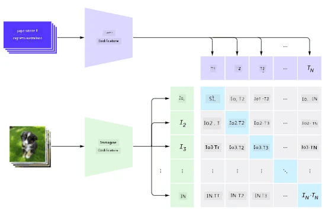
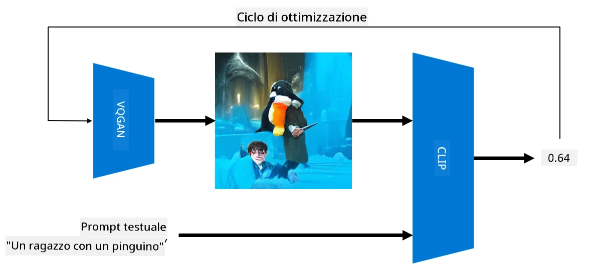

# Reti Multi-Modali

Dopo il successo dei modelli transformer per risolvere compiti di NLP, le stesse o simili architetture sono state applicate ai compiti di visione artificiale. C'è un crescente interesse nel costruire modelli che *combinino* capacità di visione e linguaggio naturale. Uno di questi tentativi è stato fatto da OpenAI, ed è chiamato CLIP e DALL.E.

## Contrastive Image Pre-Training (CLIP)

L'idea principale di CLIP è quella di confrontare i prompt testuali con un'immagine e determinare quanto bene l'immagine corrisponda al prompt.

> *Immagine tratta da [questo post sul blog](https://openai.com/blog/clip/)*

Il modello è addestrato su immagini ottenute da Internet e sulle loro didascalie. Per ogni batch, prendiamo N coppie di (immagine, testo) e le convertiamo in rappresentazioni vettoriali I, ..., T. Queste rappresentazioni vengono poi abbinate tra loro. La funzione di perdita è definita per massimizzare la similarità coseno tra i vettori corrispondenti a una coppia (es. I e T) e minimizzare la similarità coseno tra tutte le altre coppie. Questo è il motivo per cui questo approccio è chiamato **contrastivo**.

Il modello/libreria CLIP è disponibile su [GitHub di OpenAI](https://github.com/openai/CLIP). L'approccio è descritto in [questo post sul blog](https://openai.com/blog/clip/) e in modo più dettagliato in [questo articolo](https://arxiv.org/pdf/2103.00020.pdf).

Una volta che questo modello è stato pre-addestrato, possiamo fornire un batch di immagini e un batch di prompt testuali, e il risultato sarà un tensore con probabilità. CLIP può essere utilizzato per diversi compiti:

**Classificazione delle Immagini**

Supponiamo di dover classificare immagini tra, ad esempio, gatti, cani e esseri umani. In questo caso, possiamo fornire al modello un'immagine e una serie di prompt testuali: "*una foto di un gatto*", "*una foto di un cane*", "*una foto di un essere umano*". Nel vettore risultante di 3 probabilità, dobbiamo semplicemente selezionare l'indice con il valore più alto.

> *Immagine tratta da [questo post sul blog](https://openai.com/blog/clip/)*

**Ricerca di Immagini Basata su Testo**

Possiamo anche fare il contrario. Se abbiamo una collezione di immagini, possiamo passarla al modello insieme a un prompt testuale: questo ci darà l'immagine più simile al prompt fornito.

## ✍️ Esempio: [Utilizzo di CLIP per la Classificazione delle Immagini e la Ricerca di Immagini](../../../../../lessons/X-Extras/X1-MultiModal/Clip.ipynb)

Apri il notebook [Clip.ipynb](../../../../../lessons/X-Extras/X1-MultiModal/Clip.ipynb) per vedere CLIP in azione.

## Generazione di Immagini con VQGAN+CLIP

CLIP può essere utilizzato anche per la **generazione di immagini** a partire da un prompt testuale. Per fare ciò, abbiamo bisogno di un **modello generatore** che sia in grado di generare immagini basate su un input vettoriale. Uno di questi modelli è chiamato [VQGAN](https://compvis.github.io/taming-transformers/) (Vector-Quantized GAN).

Le idee principali di VQGAN che lo differenziano dai tradizionali [GAN](../../4-ComputerVision/10-GANs/README.md) sono le seguenti:
* Utilizzo di un'architettura transformer autoregressiva per generare una sequenza di parti visive ricche di contesto che compongono l'immagine. Queste parti visive sono a loro volta apprese da [CNN](../../4-ComputerVision/07-ConvNets/README.md).
* Uso di un discriminatore di sotto-immagini che rileva se le parti dell'immagine sono "reali" o "false" (a differenza dell'approccio "tutto o niente" nei GAN tradizionali).

Scopri di più su VQGAN sul sito web [Taming Transformers](https://compvis.github.io/taming-transformers/).

Una delle differenze importanti tra VQGAN e i GAN tradizionali è che questi ultimi possono produrre un'immagine decente da qualsiasi vettore di input, mentre VQGAN è più propenso a produrre un'immagine incoerente. Pertanto, è necessario guidare ulteriormente il processo di creazione dell'immagine, e questo può essere fatto utilizzando CLIP.

Per generare un'immagine corrispondente a un prompt testuale, iniziamo con un vettore di codifica casuale che viene passato attraverso VQGAN per produrre un'immagine. Successivamente, CLIP viene utilizzato per produrre una funzione di perdita che mostra quanto bene l'immagine corrisponda al prompt testuale. L'obiettivo è quindi minimizzare questa perdita, utilizzando la retropropagazione per regolare i parametri del vettore di input.

Una grande libreria che implementa VQGAN+CLIP è [Pixray](http://github.com/pixray/pixray).

 |   | 
----|----|----
Immagine generata dal prompt *un ritratto ravvicinato ad acquerello di un giovane insegnante di letteratura con un libro* | Immagine generata dal prompt *un ritratto ravvicinato a olio di una giovane insegnante di informatica con un computer* | Immagine generata dal prompt *un ritratto ravvicinato a olio di un anziano insegnante di matematica davanti a una lavagna*

> Immagini dalla collezione **Artificial Teachers** di [Dmitry Soshnikov](http://soshnikov.com)

## DALL-E
### [DALL-E 1](https://openai.com/research/dall-e)
DALL-E è una versione di GPT-3 addestrata per generare immagini a partire da prompt. È stato addestrato con 12 miliardi di parametri.

A differenza di CLIP, DALL-E riceve sia testo che immagine come un unico flusso di token per entrambi. Pertanto, da più prompt, è possibile generare immagini basate sul testo.

### [DALL-E 2](https://openai.com/dall-e-2)
La principale differenza tra DALL-E 1 e 2 è che quest'ultimo genera immagini e arte più realistiche.

Esempi di generazione di immagini con DALL-E:
 |   | 
----|----|----
Immagine generata dal prompt *un ritratto ravvicinato ad acquerello di un giovane insegnante di letteratura con un libro* | Immagine generata dal prompt *un ritratto ravvicinato a olio di una giovane insegnante di informatica con un computer* | Immagine generata dal prompt *un ritratto ravvicinato a olio di un anziano insegnante di matematica davanti a una lavagna*

## Riferimenti

* Articolo su VQGAN: [Taming Transformers for High-Resolution Image Synthesis](https://compvis.github.io/taming-transformers/paper/paper.pdf)
* Articolo su CLIP: [Learning Transferable Visual Models From Natural Language Supervision](https://arxiv.org/pdf/2103.00020.pdf)

**Disclaimer**:  
Questo documento è stato tradotto utilizzando il servizio di traduzione automatica [Co-op Translator](https://github.com/Azure/co-op-translator). Sebbene ci impegniamo per garantire l'accuratezza, si prega di notare che le traduzioni automatiche potrebbero contenere errori o imprecisioni. Il documento originale nella sua lingua nativa dovrebbe essere considerato la fonte autorevole. Per informazioni critiche, si raccomanda una traduzione professionale effettuata da un traduttore umano. Non siamo responsabili per eventuali incomprensioni o interpretazioni errate derivanti dall'uso di questa traduzione.