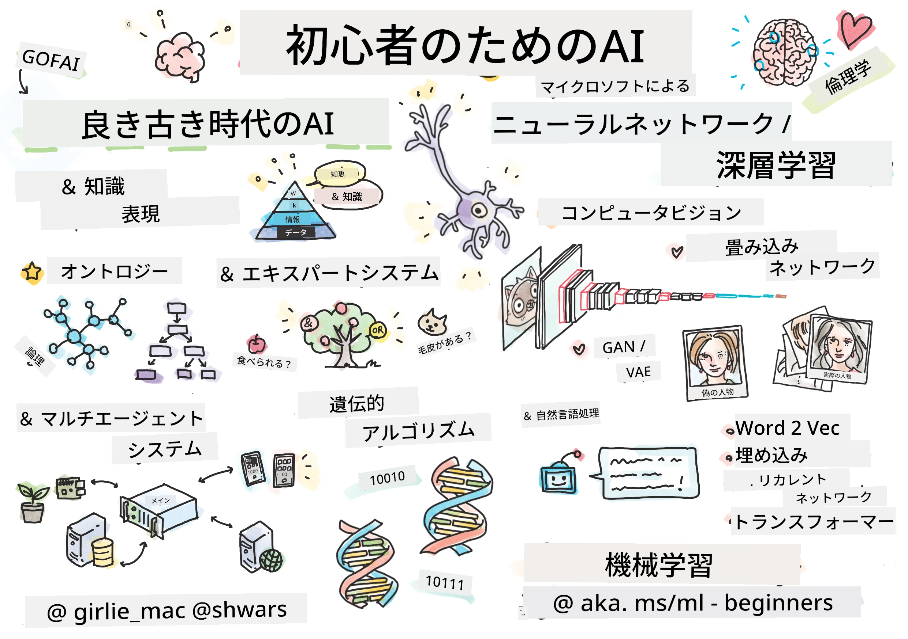

[](https://github.com/microsoft/AI-For-Beginners/blob/main/LICENSE)
[](https://GitHub.com/microsoft/AI-For-Beginners/graphs/contributors/)
[](https://GitHub.com/microsoft/AI-For-Beginners/issues/)
[](https://GitHub.com/microsoft/AI-For-Beginners/pulls/)
[](http://makeapullrequest.com)

[](https://GitHub.com/microsoft/AI-For-Beginners/watchers/)
[](https://GitHub.com/microsoft/AI-For-Beginners/network/)
[](https://GitHub.com/microsoft/AI-For-Beginners/stargazers/)
[](https://mybinder.org/v2/gh/microsoft/ai-for-beginners/HEAD)
[](https://gitter.im/Microsoft/ai-for-beginners?utm_source=badge&utm_medium=badge&utm_campaign=pr-badge)

[](https://discord.gg/nTYy5BXMWG)

# 初心者向け人工知能 - カリキュラム

||
|:---:|
| AI For Beginners - _[@girlie_mac](https://twitter.com/girlie_mac)によるスケッチノート_ |

12週間、24レッスンで構成されたカリキュラムで**人工知能**(AI)の世界を探求しましょう！実践的なレッスン、クイズ、ラボを含んでいます。初心者に優しく、TensorFlowやPyTorchなどのツールや、AIにおける倫理も扱います。


### 🌐 多言語サポート

#### GitHub Actionsによるサポート（自動化 & 常に最新）

<!-- CO-OP TRANSLATOR LANGUAGES TABLE START -->
[アラビア語](../ar/README.md) | [ベンガル語](../bn/README.md) | [ブルガリア語](../bg/README.md) | [ビルマ語（ミャンマー）](../my/README.md) | [中国語（簡体字）](../zh-CN/README.md) | [中国語（繁体字、香港）](../zh-HK/README.md) | [中国語（繁体字、マカオ）](../zh-MO/README.md) | [中国語（繁体字、台湾）](../zh-TW/README.md) | [クロアチア語](../hr/README.md) | [チェコ語](../cs/README.md) | [デンマーク語](../da/README.md) | [オランダ語](../nl/README.md) | [エストニア語](../et/README.md) | [フィンランド語](../fi/README.md) | [フランス語](../fr/README.md) | [ドイツ語](../de/README.md) | [ギリシャ語](../el/README.md) | [ヘブライ語](../he/README.md) | [ヒンディー語](../hi/README.md) | [ハンガリー語](../hu/README.md) | [インドネシア語](../id/README.md) | [イタリア語](../it/README.md) | [日本語](./README.md) | [カンナダ語](../kn/README.md) | [韓国語](../ko/README.md) | [リトアニア語](../lt/README.md) | [マレー語](../ms/README.md) | [マラヤーラム語](../ml/README.md) | [マラーティー語](../mr/README.md) | [ネパール語](../ne/README.md) | [ナイジェリア ピジン語](../pcm/README.md) | [ノルウェー語](../no/README.md) | [ペルシア語（ファルシ）](../fa/README.md) | [ポーランド語](../pl/README.md) | [ポルトガル語（ブラジル）](../pt-BR/README.md) | [ポルトガル語（ポルトガル）](../pt-PT/README.md) | [パンジャブ語（グルムキー）](../pa/README.md) | [ルーマニア語](../ro/README.md) | [ロシア語](../ru/README.md) | [セルビア語（キリル）](../sr/README.md) | [スロバキア語](../sk/README.md) | [スロベニア語](../sl/README.md) | [スペイン語](../es/README.md) | [スワヒリ語](../sw/README.md) | [スウェーデン語](../sv/README.md) | [タガログ語（フィリピン）](../tl/README.md) | [タミル語](../ta/README.md) | [テルグ語](../te/README.md) | [タイ語](../th/README.md) | [トルコ語](../tr/README.md) | [ウクライナ語](../uk/README.md) | [ウルドゥー語](../ur/README.md) | [ベトナム語](../vi/README.md)

> **ローカルにクローンしたい方へ**

> このリポジトリには50以上の言語翻訳が含まれ、ダウンロードサイズが大幅に増加します。翻訳なしでクローンするには、スパースチェックアウトを利用してください：
> ```bash
> git clone --filter=blob:none --sparse https://github.com/microsoft/AI-For-Beginners.git
> cd AI-For-Beginners
> git sparse-checkout set --no-cone '/*' '!translations' '!translated_images'
> ```
> これにより、コース修了に必要なすべての内容を、はるかに高速なダウンロードで入手可能です。
<!-- CO-OP TRANSLATOR LANGUAGES TABLE END -->

**追加の翻訳言語をご希望の場合は、[こちら](https://github.com/Azure/co-op-translator/blob/main/getting_started/supported-languages.md)に記載されています。**

## コミュニティに参加しよう
[](https://discord.gg/nTYy5BXMWG)

## 学べること

**[コースのマインドマップ](http://soshnikov.com/courses/ai-for-beginners/mindmap.html)**

このカリキュラムでは、以下を学びます：

* 「古き良き」知識表現と推論を含む、様々な人工知能のアプローチ（[GOFAI](https://en.wikipedia.org/wiki/Symbolic_artificial_intelligence)）。
* 現代AIの中核をなす**ニューラルネットワーク**と**深層学習**。人気のフレームワークである[TensorFlow](http://Tensorflow.org)と[PyTorch](http://pytorch.org)を使ったコードで、これらの重要概念を説明します。
* 画像やテキスト処理のための**ニューラルアーキテクチャ**。最新モデルを扱いますが、最先端にはやや及ばないかもしれません。
* あまり知られていないAIのアプローチ、例えば**遺伝的アルゴリズム**や**マルチエージェントシステム**。

このカリキュラムで扱わない内容：

> [Microsoft Learnコレクションで本コースの追加リソースをすべて見る](https://learn.microsoft.com/en-us/collections/7w28iy2xrqzdj0?WT.mc_id=academic-77998-bethanycheum)

* **ビジネスにおけるAI**の事例。Microsoft Learnの[ビジネスユーザー向けAI入門](https://docs.microsoft.com/learn/paths/introduction-ai-for-business-users/?WT.mc_id=academic-77998-bethanycheum)や、[INSEAD](https://www.insead.edu/)との協力による[AIビジネススクール](https://www.microsoft.com/ai/ai-business-school/?WT.mc_id=academic-77998-bethanycheum)の受講を推奨します。
* よく解説されている**クラシック機械学習**。詳細は[Machine Learning for Beginners Curriculum](http://github.com/Microsoft/ML-for-Beginners)をご覧ください。
* **[Cognitive Services](https://azure.microsoft.com/services/cognitive-services/?WT.mc_id=academic-77998-bethanycheum)**を使った実践的AIアプリケーション。Microsoft Learnの[ビジョン](https://docs.microsoft.com/learn/paths/create-computer-vision-solutions-azure-cognitive-services/?WT.mc_id=academic-77998-bethanycheum)、[自然言語処理](https://docs.microsoft.com/learn/paths/explore-natural-language-processing/?WT.mc_id=academic-77998-bethanycheum)、**[Azure OpenAI Serviceによる生成AI](https://learn.microsoft.com/en-us/training/paths/develop-ai-solutions-azure-openai/?WT.mc_id=academic-77998-bethanycheum)**などのモジュールを推奨します。
* [Azure Machine Learning](https://azure.microsoft.com/services/machine-learning/?WT.mc_id=academic-77998-bethanycheum)、[Microsoft Fabric](https://learn.microsoft.com/en-us/training/paths/get-started-fabric/?WT.mc_id=academic-77998-bethanycheum)、[Azure Databricks](https://docs.microsoft.com/learn/paths/data-engineer-azure-databricks?WT.mc_id=academic-77998-bethanycheum)などの特定のML**クラウドフレームワーク**。[Build and operate machine learning solutions with Azure Machine Learning](https://docs.microsoft.com/learn/paths/build-ai-solutions-with-azure-ml-service/?WT.mc_id=academic-77998-bethanycheum)や[Build and Operate Machine Learning Solutions with Azure Databricks](https://docs.microsoft.com/learn/paths/build-operate-machine-learning-solutions-azure-databricks/?WT.mc_id=academic-77998-bethanycheum)学習パスの利用を検討してください。
* **会話型AI**や**チャットボット**。専用の[Create conversational AI solutions](https://docs.microsoft.com/learn/paths/create-conversational-ai-solutions/?WT.mc_id=academic-77998-bethanycheum)学習パスがあり、詳細は[このブログ記事](https://soshnikov.com/azure/hello-bot-conversational-ai-on-microsoft-platform/)も参考にできます。
* 深層学習の**深い数学的基礎**。これには、Ian Goodfellow、Yoshua Bengio、Aaron Courvilleによる[Deep Learning](https://www.amazon.com/Deep-Learning-Adaptive-Computation-Machine/dp/0262035618)を推奨します。オンラインでも[https://www.deeplearningbook.org/](https://www.deeplearningbook.org/)で利用可能です。

_cloud_上のAIにやさしく入門したい方は、[Azureで人工知能を始めよう](https://docs.microsoft.com/learn/paths/get-started-with-artificial-intelligence-on-azure/?WT.mc_id=academic-77998-bethanycheum)の学習パスもご検討ください。

# コンテンツ

|     |                                                                 レッスンリンク                                                                  |                                           PyTorch/Keras/TensorFlow                                          | ラボ                                                            |
| :-: | :------------------------------------------------------------------------------------------------------------------------------------------: | :---------------------------------------------------------------------------------------------: | ------------------------------------------------------------------------------ |
| 0  |                                 [コースセットアップ](./lessons/0-course-setup/setup.md)                                 |                      [開発環境のセットアップ](./lessons/0-course-setup/how-to-run.md)                       |   |
| I  |               [**AIのイントロダクション**](./lessons/1-Intro/README.md)      | | |
| 01  |       [AIの紹介と歴史](./lessons/1-Intro/README.md)       |           -                            | -  |
| II |              **シンボリックAI**              |
| 02  |       [知識表現とエキスパートシステム](./lessons/2-Symbolic/README.md)       |            [エキスパートシステム](./lessons/2-Symbolic/Animals.ipynb) /  [オントロジー](./lessons/2-Symbolic/FamilyOntology.ipynb) /[概念グラフ](./lessons/2-Symbolic/MSConceptGraph.ipynb)                             |  |
| III |                        [**ニューラルネットワーク入門**](./lessons/3-NeuralNetworks/README.md) |||
| 03  |                [パーセプトロン](./lessons/3-NeuralNetworks/03-Perceptron/README.md)                 |                       [ノートブック](./lessons/3-NeuralNetworks/03-Perceptron/Perceptron.ipynb)                      | [ラボ](./lessons/3-NeuralNetworks/03-Perceptron/lab/README.md) |
| 04  |                   [多層パーセプトロンと独自フレームワークの作成](./lessons/3-NeuralNetworks/04-OwnFramework/README.md)                   |        [ノートブック](./lessons/3-NeuralNetworks/04-OwnFramework/OwnFramework.ipynb)        | [ラボ](./lessons/3-NeuralNetworks/04-OwnFramework/lab/README.md) |
| 05  |            [フレームワーク入門 (PyTorch/TensorFlow) と過学習](./lessons/3-NeuralNetworks/05-Frameworks/README.md)             |           [PyTorch](./lessons/3-NeuralNetworks/05-Frameworks/IntroPyTorch.ipynb) / [Keras](./lessons/3-NeuralNetworks/05-Frameworks/IntroKeras.ipynb) / [TensorFlow](./lessons/3-NeuralNetworks/05-Frameworks/IntroKerasTF.ipynb)             | [ラボ](./lessons/3-NeuralNetworks/05-Frameworks/lab/README.md) |
| IV  |            [**コンピュータービジョン**](./lessons/4-ComputerVision/README.md)             | [PyTorch](https://docs.microsoft.com/learn/modules/intro-computer-vision-pytorch/?WT.mc_id=academic-77998-cacaste) / [TensorFlow](https://docs.microsoft.com/learn/modules/intro-computer-vision-TensorFlow/?WT.mc_id=academic-77998-cacaste)| [Microsoft Azureでコンピュータービジョンを探索](https://learn.microsoft.com/en-us/collections/7w28iy2xrqzdj0?WT.mc_id=academic-77998-bethanycheum) |
| 06  |            [コンピュータービジョン入門・OpenCV](./lessons/4-ComputerVision/06-IntroCV/README.md)             |           [ノートブック](./lessons/4-ComputerVision/06-IntroCV/OpenCV.ipynb)         | [ラボ](./lessons/4-ComputerVision/06-IntroCV/lab/README.md) |
| 07  |            [畳み込みニューラルネットワーク](./lessons/4-ComputerVision/07-ConvNets/README.md) &  [CNNアーキテクチャ](./lessons/4-ComputerVision/07-ConvNets/CNN_Architectures.md)             |           [PyTorch](./lessons/4-ComputerVision/07-ConvNets/ConvNetsPyTorch.ipynb) /[TensorFlow](./lessons/4-ComputerVision/07-ConvNets/ConvNetsTF.ipynb)             | [ラボ](./lessons/4-ComputerVision/07-ConvNets/lab/README.md) |
| 08  |            [事前学習済みネットワークと転移学習](./lessons/4-ComputerVision/08-TransferLearning/README.md) と [トレーニングのコツ](./lessons/4-ComputerVision/08-TransferLearning/TrainingTricks.md)             |           [PyTorch](./lessons/4-ComputerVision/08-TransferLearning/TransferLearningPyTorch.ipynb) / [TensorFlow](./lessons/3-NeuralNetworks/05-Frameworks/IntroKerasTF.ipynb)             | [ラボ](./lessons/4-ComputerVision/08-TransferLearning/lab/README.md) |
| 09  |            [オートエンコーダーとVAE](./lessons/4-ComputerVision/09-Autoencoders/README.md)             |           [PyTorch](./lessons/4-ComputerVision/09-Autoencoders/AutoEncodersPyTorch.ipynb) / [TensorFlow](./lessons/4-ComputerVision/09-Autoencoders/AutoencodersTF.ipynb)             |  |
| 10  |            [敵対的生成ネットワークと芸術的スタイル転送](./lessons/4-ComputerVision/10-GANs/README.md)             |           [PyTorch](./lessons/4-ComputerVision/10-GANs/GANPyTorch.ipynb) / [TensorFlow](./lessons/4-ComputerVision/10-GANs/GANTF.ipynb)             |  |
| 11  |            [物体検出](./lessons/4-ComputerVision/11-ObjectDetection/README.md)             |         [TensorFlow](./lessons/4-ComputerVision/11-ObjectDetection/ObjectDetection.ipynb)             | [ラボ](./lessons/4-ComputerVision/11-ObjectDetection/lab/README.md) |
| 12  |            [セマンティックセグメンテーション・U-Net](./lessons/4-ComputerVision/12-Segmentation/README.md)             |           [PyTorch](./lessons/4-ComputerVision/12-Segmentation/SemanticSegmentationPytorch.ipynb) / [TensorFlow](./lessons/4-ComputerVision/12-Segmentation/SemanticSegmentationTF.ipynb)             |  |
| V  |            [**自然言語処理**](./lessons/5-NLP/README.md)             | [PyTorch](https://docs.microsoft.com/learn/modules/intro-natural-language-processing-pytorch/?WT.mc_id=academic-77998-cacaste) /[TensorFlow](https://docs.microsoft.com/learn/modules/intro-natural-language-processing-TensorFlow/?WT.mc_id=academic-77998-cacaste) | [Microsoft Azureで自然言語処理を探索](https://learn.microsoft.com/en-us/collections/7w28iy2xrqzdj0?WT.mc_id=academic-77998-bethanycheum)|
| 13  |            [テキスト表現・Bag of Words/TF-IDF](./lessons/5-NLP/13-TextRep/README.md)             |           [PyTorch](https://github.com/microsoft/AI-For-Beginners/blob/main/lessons/5-NLP/13-TextRep/TextRepresentationPyTorch.ipynb) / [TensorFlow](https://github.com/microsoft/AI-For-Beginners/blob/main/lessons/5-NLP/13-TextRep/TextRepresentationTF.ipynb)             | |
| 14  |            [意味的単語埋め込み・Word2VecとGloVe](./lessons/5-NLP/14-Embeddings/README.md)             |           [PyTorch](https://github.com/microsoft/AI-For-Beginners/blob/main/lessons/5-NLP/14-Embeddings/EmbeddingsPyTorch.ipynb) / [TensorFlow](https://github.com/microsoft/AI-For-Beginners/blob/main/lessons/5-NLP/14-Embeddings/EmbeddingsTF.ipynb)             |  |
| 15  |            [言語モデル・独自の埋め込みの訓練](./lessons/5-NLP/15-LanguageModeling/README.md)             |           [PyTorch](https://github.com/microsoft/AI-For-Beginners/blob/main/lessons/5-NLP/15-LanguageModeling/CBoW-PyTorch.ipynb) / [TensorFlow](https://github.com/microsoft/AI-For-Beginners/blob/main/lessons/5-NLP/15-LanguageModeling/CBoW-TF.ipynb)             | [ラボ](./lessons/5-NLP/15-LanguageModeling/lab/README.md) |
| 16  |            [リカレントニューラルネットワーク](./lessons/5-NLP/16-RNN/README.md)             |           [PyTorch](https://github.com/microsoft/AI-For-Beginners/blob/main/lessons/5-NLP/16-RNN/RNNPyTorch.ipynb) / [TensorFlow](https://github.com/microsoft/AI-For-Beginners/blob/main/lessons/5-NLP/16-RNN/RNNTF.ipynb)             |  |
| 17  |            [生成的リカレントネットワーク](./lessons/5-NLP/17-GenerativeNetworks/README.md)             |           [PyTorch](https://github.com/microsoft/AI-For-Beginners/blob/main/lessons/5-NLP/17-GenerativeNetworks/GenerativePyTorch.ipynb) / [TensorFlow](https://github.com/microsoft/AI-For-Beginners/blob/main/lessons/5-NLP/17-GenerativeNetworks/GenerativeTF.ipynb)             | [ラボ](./lessons/5-NLP/17-GenerativeNetworks/lab/README.md) |
| 18  |            [トランスフォーマー・BERT](./lessons/5-NLP/18-Transformers/README.md)             |           [PyTorch](https://github.com/microsoft/AI-For-Beginners/blob/main/lessons/5-NLP/18-Transformers/TransformersPyTorch.ipynb) /[TensorFlow](https://github.com/microsoft/AI-For-Beginners/blob/main/lessons/5-NLP/18-Transformers/TransformersTF.ipynb)             |  |
| 19  |            [固有表現抽出](./lessons/5-NLP/19-NER/README.md)             |           [TensorFlow](https://microsoft.github.io/AI-For-Beginners/lessons/5-NLP/19-NER/NER-TF.ipynb)             | [ラボ](./lessons/5-NLP/19-NER/lab/README.md) |
| 20  |            [大規模言語モデル、プロンプトプログラミング、少数ショットタスク](./lessons/5-NLP/20-LangModels/README.md)             |           [PyTorch](https://microsoft.github.io/AI-For-Beginners/lessons/5-NLP/20-LangModels/GPT-PyTorch.ipynb) | |
| VI |            **その他のAI技術** || |
| 21  |            [遺伝的アルゴリズム](./lessons/6-Other/21-GeneticAlgorithms/README.md)             |           [ノートブック](./lessons/6-Other/21-GeneticAlgorithms/Genetic.ipynb) | |
| 22  |            [深層強化学習](./lessons/6-Other/22-DeepRL/README.md)             |           [PyTorch](./lessons/6-Other/22-DeepRL/CartPole-RL-PyTorch.ipynb) /[TensorFlow](./lessons/6-Other/22-DeepRL/CartPole-RL-TF.ipynb)             | [ラボ](./lessons/6-Other/22-DeepRL/lab/README.md) |
| 23  |            [マルチエージェントシステム](./lessons/6-Other/23-MultiagentSystems/README.md)             |  | |
| VII |            **AI倫理** | | |
| 24  |            [AI倫理と責任あるAI](./lessons/7-Ethics/README.md)             |           [Microsoft Learn: 責任あるAIの原則](https://docs.microsoft.com/learn/paths/responsible-ai-business-principles/?WT.mc_id=academic-77998-cacaste) | |
| IX  |            **エクストラ** | | |
| 25  |            [マルチモーダルネットワーク、CLIPとVQGAN](./lessons/X-Extras/X1-MultiModal/README.md)             |           [ノートブック](./lessons/X-Extras/X1-MultiModal/Clip.ipynb)    | |

## 各レッスンに含まれるもの

* 予習用教材
* 実行可能なJupyterノートブック。多くは特定のフレームワーク（**PyTorch** または **TensorFlow**）向けです。実行可能なノートブックには理論的な内容も多く含まれているため、トピックを理解するには少なくともいずれか一方のノートブック（PyTorchまたはTensorFlow）を通して学習する必要があります。
* 一部のトピックには**ラボ**があり、学んだ内容を特定の問題に適用する機会を提供します。
* 一部のセクションには関連トピックを扱う[**MS Learn**](https://learn.microsoft.com/en-us/collections/7w28iy2xrqzdj0?WT.mc_id=academic-77998-bethanycheum)のモジュールへのリンクがあります。

## はじめに

### 🎯 AI初心者の方へ！ここから始めよう！

AIがまったく初めてで、手早くハンズオンの例を試したい場合は、[**初心者向けの例**](./examples/README.md)をご覧ください！以下を含みます：

- 🌟 **Hello AI World** - あなたの最初のAIプログラム（パターン認識）
- 🧠 **シンプルニューラルネットワーク** - ニューラルネットワークをゼロから構築
- 🖼️ **画像分類器** - 詳細なコメント付きで画像を分類
- 💬 **テキスト感情分析** - ポジティブ/ネガティブなテキストを分析

これらの例は、完全なカリキュラムに進む前にAIの概念を理解するのに役立つよう設計されています。

### 📚 完全なカリキュラムのセットアップ

- 開発環境のセットアップを支援するために [セットアップレッスン](./lessons/0-course-setup/setup.md) を作成しました。- 教育者向けに [カリキュラムセットアップレッスン](./lessons/0-course-setup/for-teachers.md) も用意しています！
- VSCodeまたはCodespaceでのコードの[実行方法](./lessons/0-course-setup/how-to-run.md)

次の手順に従ってください:

リポジトリをフォーク：このページ右上の「Fork」ボタンをクリックします。

リポジトリをクローン：`git clone https://github.com/microsoft/AI-For-Beginners.git`

後で簡単に見つけられるようにこのリポジトリにスター（🌟）を付けるのを忘れないでください。

## 他の学習者と出会う

このコースを受講している他の学習者と交流し、サポートを受けるために[公式AI Discordサーバー](https://aka.ms/genai-discord?WT.mc_id=academic-105485-bethanycheum)に参加しましょう。

製品のフィードバックや質問がある場合は、[Azure AI Foundry Developer Forum](https://aka.ms/foundry/forum)をご利用ください。

## クイズ

> **クイズに関する注意：** すべてのクイズはetc\quiz-appフォルダー内のQuiz-appフォルダーにあります。また、[オンラインはこちら](https://ff-quizzes.netlify.app/)です。クイズはレッスン内からリンクされており、クイズアプリはローカルで実行するかAzureにデプロイできます。`quiz-app`フォルダー内の指示に従ってください。徐々に多言語対応が進められています。

## ヘルプ募集

提案やスペルミス、コードの誤りを見つけた場合は、Issueを上げるかプルリクエストを作成してください。

## 特別な感謝

* **✍️ 主著者:** [Dmitry Soshnikov](http://soshnikov.com), PhD
* **🔥 編集者:** [Jen Looper](https://twitter.com/jenlooper), PhD
* **🎨 スケッチノートイラストレーター:** [Tomomi Imura](https://twitter.com/girlie_mac)
* **✅ クイズ作成者:** [Lateefah Bello](https://github.com/CinnamonXI), [MLSA](https://studentambassadors.microsoft.com/)
* **🙏 コアコントリビューター:** [Evgenii Pishchik](https://github.com/Pe4enIks)

## その他のカリキュラム

私たちのチームはその他のカリキュラムも制作しています！ぜひご覧ください：

<!-- CO-OP TRANSLATOR OTHER COURSES START -->
### LangChain
[](https://aka.ms/langchain4j-for-beginners)
[](https://aka.ms/langchainjs-for-beginners?WT.mc_id=m365-94501-dwahlin)
[](https://github.com/microsoft/langchain-for-beginners?WT.mc_id=m365-94501-dwahlin)
---

### Azure / Edge / MCP / Agents
[](https://github.com/microsoft/AZD-for-beginners?WT.mc_id=academic-105485-koreyst)
[](https://github.com/microsoft/edgeai-for-beginners?WT.mc_id=academic-105485-koreyst)
[](https://github.com/microsoft/mcp-for-beginners?WT.mc_id=academic-105485-koreyst)
[](https://github.com/microsoft/ai-agents-for-beginners?WT.mc_id=academic-105485-koreyst)

---
 
### 生成AIシリーズ
[](https://github.com/microsoft/generative-ai-for-beginners?WT.mc_id=academic-105485-koreyst)
[-9333EA?style=for-the-badge&labelColor=E5E7EB&color=9333EA)](https://github.com/microsoft/Generative-AI-for-beginners-dotnet?WT.mc_id=academic-105485-koreyst)
[-C084FC?style=for-the-badge&labelColor=E5E7EB&color=C084FC)](https://github.com/microsoft/generative-ai-for-beginners-java?WT.mc_id=academic-105485-koreyst)
[-E879F9?style=for-the-badge&labelColor=E5E7EB&color=E879F9)](https://github.com/microsoft/generative-ai-with-javascript?WT.mc_id=academic-105485-koreyst)

---
 
### コアラーニング
[](https://aka.ms/ml-beginners?WT.mc_id=academic-105485-koreyst)
[](https://aka.ms/datascience-beginners?WT.mc_id=academic-105485-koreyst)
[](https://aka.ms/ai-beginners?WT.mc_id=academic-105485-koreyst)
[](https://github.com/microsoft/Security-101?WT.mc_id=academic-96948-sayoung)
[](https://aka.ms/webdev-beginners?WT.mc_id=academic-105485-koreyst)
[](https://aka.ms/iot-beginners?WT.mc_id=academic-105485-koreyst)
[](https://github.com/microsoft/xr-development-for-beginners?WT.mc_id=academic-105485-koreyst)

---
 
### コパイロットシリーズ
[](https://aka.ms/GitHubCopilotAI?WT.mc_id=academic-105485-koreyst)
[](https://github.com/microsoft/mastering-github-copilot-for-dotnet-csharp-developers?WT.mc_id=academic-105485-koreyst)
[](https://github.com/microsoft/CopilotAdventures?WT.mc_id=academic-105485-koreyst)
<!-- CO-OP TRANSLATOR OTHER COURSES END -->

## ヘルプを求める

AIアプリの開発で困ったり質問がある場合は、MCPに関するディスカッションに参加して他の学習者や経験豊富な開発者と交流してください。ここは質問歓迎のサポートコミュニティで、知識が自由に共有されています。

[](https://discord.gg/nTYy5BXMWG)

製品に関するフィードバックやビルド時のエラーがある場合は、次をご利用ください：

[](https://aka.ms/foundry/forum)

---

<!-- CO-OP TRANSLATOR DISCLAIMER START -->
**免責事項**：  
本書類は、AI翻訳サービス [Co-op Translator](https://github.com/Azure/co-op-translator) を使用して翻訳されています。正確性の向上に努めておりますが、自動翻訳には誤りや不正確な箇所が含まれる可能性があることをご承知おきください。原文はその言語における正式な版としてご確認ください。重要な情報に関しては、専門の人間翻訳をご利用いただくことを推奨します。本翻訳の利用により生じた誤解や誤訳について、当方は一切の責任を負いかねます。
<!-- CO-OP TRANSLATOR DISCLAIMER END -->