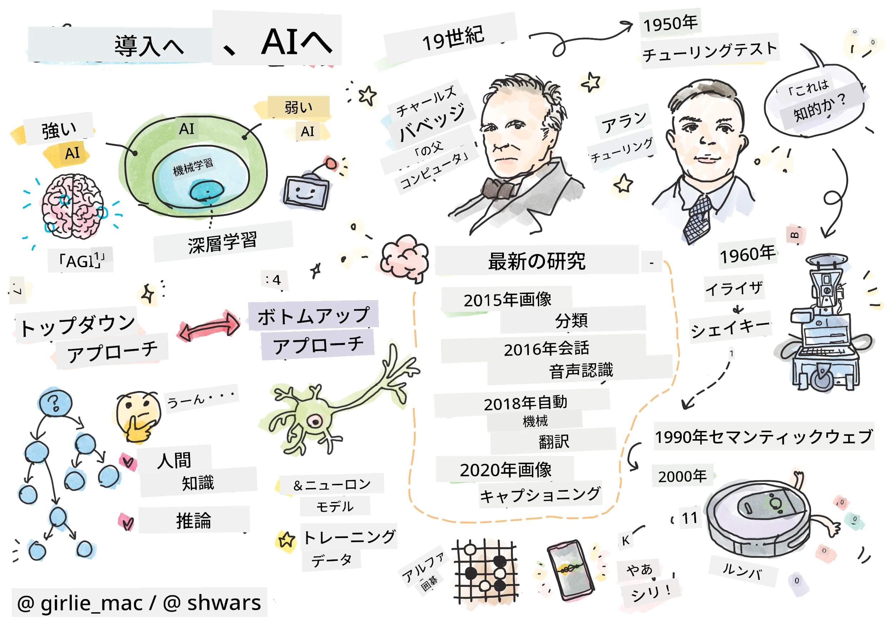
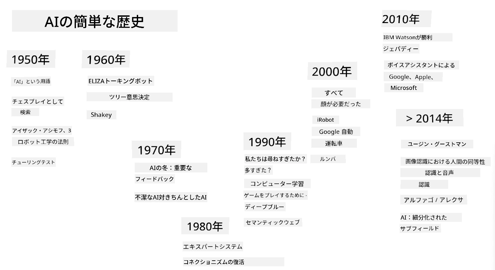

# AIの紹介

> スケッチノート: [Tomomi Imura](https://twitter.com/girlie_mac)

## [講義前のクイズ](https://ff-quizzes.netlify.app/en/ai/quiz/1)

**人工知能（AI）** は、コンピュータに知的な振る舞いをさせる方法を研究する、非常に興味深い科学分野です。例えば、人間が得意とすることをコンピュータに行わせることを目指します。

もともとコンピュータは、[チャールズ・バベッジ](https://en.wikipedia.org/wiki/Charles_Babbage)によって、明確に定義された手順（アルゴリズム）に従って数値を操作するために発明されました。現代のコンピュータは、19世紀に提案された元のモデルよりもはるかに高度ですが、依然として制御された計算という同じ考えに基づいています。そのため、目標を達成するために必要な手順を正確に知っていれば、コンピュータに何かをプログラムすることが可能です。

> 写真: [Vickie Soshnikova](http://twitter.com/vickievalerie)

> ✅ 写真からその人の年齢を定義することは、明確にプログラムすることができないタスクです。なぜなら、私たちが頭の中でその数字を思いつく方法を正確に説明することができないからです。

---

しかし、解決方法を明確に知らないタスクもあります。例えば、写真からその人の年齢を判断することを考えてみてください。私たちは、さまざまな年齢の人々の例をたくさん見てきたため、なんとなくそれを学びますが、それをどのように行うのかを明確に説明することはできませんし、コンピュータにプログラムすることもできません。これこそが、**人工知能（AI）** が関心を持つタスクの典型例です。

✅ コンピュータに任せることができるタスクをいくつか考えてみてください。金融、医療、芸術の分野を考慮してみましょう。これらの分野が今日どのようにAIの恩恵を受けているかを考えてみてください。

## 弱いAIと強いAI

弱いAI | 強いAI
---------------------------------------|-------------------------------------
弱いAIは、特定のタスクまたは狭い範囲のタスクのために設計および訓練されたAIシステムを指します。|強いAI、または人工汎用知能（AGI）は、人間レベルの知能と理解を持つAIシステムを指します。
これらのAIシステムは一般的な知能を持っているわけではなく、特定のタスクを実行することに優れていますが、真の理解や意識は持っていません。|これらのAIシステムは、人間が行うあらゆる知的タスクを実行し、異なる分野に適応し、意識や自己認識の形を持つ能力を持っています。
弱いAIの例としては、SiriやAlexaのようなバーチャルアシスタント、ストリーミングサービスで使用される推薦アルゴリズム、特定のカスタマーサービスタスクのために設計されたチャットボットなどがあります。|強いAIを達成することはAI研究の長期的な目標であり、幅広いタスクや文脈にわたって推論、学習、理解、適応するAIシステムの開発が必要です。
弱いAIは非常に専門的であり、その狭い領域を超えた人間のような認知能力や一般的な問題解決能力を持っていません。|強いAIは現在理論的な概念であり、このレベルの汎用知能に達したAIシステムは存在しません。

詳細については、**[人工汎用知能](https://en.wikipedia.org/wiki/Artificial_general_intelligence)** (AGI) を参照してください。

## 知能の定義とチューリングテスト

**[知能](https://en.wikipedia.org/wiki/Intelligence)** という用語を扱う際の問題の1つは、この用語に明確な定義がないことです。知能は**抽象的思考**や**自己認識**に関連していると主張することができますが、それを適切に定義することはできません。

> [写真](https://unsplash.com/photos/75715CVEJhI): [Amber Kipp](https://unsplash.com/@sadmax) (Unsplashより)

「知能」という用語の曖昧さを理解するために、「猫は知能を持っているか？」という質問に答えてみてください。この質問に対する答えは人によって異なります。なぜなら、この主張が真実かどうかを証明する普遍的に受け入れられたテストがないからです。そして、もしあると思うなら、あなたの猫にIQテストを受けさせてみてください...

✅ 知能をどのように定義するかについて1分間考えてみてください。迷路を解いて食べ物を手に入れるカラスは知能を持っているでしょうか？子供は知能を持っているでしょうか？

---

AGIについて話すとき、私たちは本当に知能を持つシステムを作成したかどうかを判断する方法を持つ必要があります。[アラン・チューリング](https://en.wikipedia.org/wiki/Alan_Turing) は、**[チューリングテスト](https://en.wikipedia.org/wiki/Turing_test)** と呼ばれる方法を提案しました。これは知能の定義としても機能します。このテストでは、与えられたシステムを本質的に知能を持つもの、つまり実際の人間と比較します。自動比較はコンピュータプログラムによって回避される可能性があるため、人間の尋問者を使用します。もし人間がテキストベースの対話で実際の人間とコンピュータシステムを区別できない場合、そのシステムは知能を持つと見なされます。

> サンクトペテルブルクで開発されたチャットボット [Eugene Goostman](https://en.wikipedia.org/wiki/Eugene_Goostman) は、2014年にチューリングテストを通過しそうになりました。このボットは、13歳のウクライナ人少年であると事前に宣言し、知識の欠如やテキストの矛盾を説明しました。このボットは、5分間の対話の後、30％の審査員を人間だと納得させました。これは、チューリングが2000年までに機械が達成できると信じていた基準です。しかし、これが知能を持つシステムを作成したことを示しているわけではなく、コンピュータシステムが人間の尋問者を欺いたわけでもありません。実際には、ボットの作成者が人間を欺いたのです！

✅ チャットボットに人間と話していると錯覚させられたことはありますか？それはどのようにしてあなたを納得させましたか？

## AIへのさまざまなアプローチ

コンピュータを人間のように振る舞わせたい場合、コンピュータ内に私たちの思考方法を何らかの形でモデル化する必要があります。そのためには、人間が知能を持つ理由を理解しようとする必要があります。

> 機械に知能をプログラムするためには、私たち自身の意思決定プロセスがどのように機能しているかを理解する必要があります。少し自己内省をしてみると、無意識に行われるプロセス（例: 猫と犬を区別する）と、推論を伴うプロセスがあることに気づくでしょう。

この問題には2つのアプローチがあります：

トップダウンアプローチ（記号的推論） | ボトムアップアプローチ（ニューラルネットワーク）
---------------------------------------|-------------------------------------
トップダウンアプローチでは、人が問題を解決するために推論する方法をモデル化します。これは、人間から**知識**を抽出し、それをコンピュータが読み取れる形式で表現することを含みます。また、コンピュータ内で**推論**をモデル化する方法を開発する必要があります。|ボトムアップアプローチでは、人間の脳の構造をモデル化します。これは、**ニューロン**と呼ばれる多数の単純なユニットで構成されています。各ニューロンは入力の加重平均のように機能し、**トレーニングデータ**を提供することで、ニューロンのネットワークを訓練して有用な問題を解決できるようにします。

他にも知能へのアプローチがあります：

* **創発的**、**シナジー的**、または**マルチエージェントアプローチ**は、多数の単純なエージェントの相互作用によって複雑な知的行動が得られるという事実に基づいています。[進化的サイバネティクス](https://en.wikipedia.org/wiki/Global_brain#Evolutionary_cybernetics) によれば、知能は*メタシステム移行*の過程で、より単純で反応的な行動から*創発*することができます。

* **進化的アプローチ**または**遺伝的アルゴリズム**は、進化の原則に基づいた最適化プロセスです。

これらのアプローチについてはコースの後半で考察しますが、今は主にトップダウンとボトムアップの2つの方向に焦点を当てます。

### トップダウンアプローチ

**トップダウンアプローチ**では、私たちの推論をモデル化しようとします。私たちは推論する際に自分の思考を追うことができるため、このプロセスを形式化してコンピュータ内にプログラムすることができます。これを**記号的推論**と呼びます。

人々は意思決定プロセスを導くいくつかのルールを頭の中に持っている傾向があります。例えば、医者が患者を診断する際、患者に発熱があることに気づき、それによって体内で炎症が起きている可能性があると判断するかもしれません。医者は特定の問題に対して多くのルールを適用することで、最終的な診断を下すことができます。

このアプローチは、**知識表現**と**推論**に大きく依存しています。人間の専門家から知識を抽出することは最も難しい部分かもしれません。なぜなら、多くの場合、医者は特定の診断に至る理由を正確に知らないからです。時には、明確な思考を伴わずに解決策が頭に浮かぶこともあります。写真からその人の年齢を判断するようなタスクは、知識を操作することに還元することが全くできません。

### ボトムアップアプローチ

一方で、私たちの脳の中で最も単純な要素、つまりニューロンをモデル化しようとすることもできます。コンピュータ内にいわゆる**人工ニューラルネットワーク**を構築し、それに例を与えることで問題を解決するように教えることができます。このプロセスは、新生児が観察を通じて周囲の世界を学ぶ方法に似ています。

✅ 赤ちゃんがどのように学ぶかについて少し調べてみてください。赤ちゃんの脳の基本的な要素は何ですか？

> | 機械学習については？         |      |
> |--------------|-----------|
> | データに基づいて問題を解決する方法をコンピュータが学ぶ人工知能の一部は、**機械学習**と呼ばれます。このコースでは古典的な機械学習は扱いません。別のカリキュラム [Machine Learning for Beginners](http://aka.ms/ml-beginners) を参照してください。 |       |

## AIの簡単な歴史

人工知能は20世紀中頃に分野として始まりました。当初は記号的推論が主流のアプローチであり、専門家システムのような重要な成功を収めました。専門家システムは、限られた問題領域で専門家として行動できるコンピュータプログラムです。しかし、このアプローチがスケールしにくいことがすぐに明らかになりました。専門家から知識を抽出し、それをコンピュータに表現し、その知識ベースを正確に保つことは非常に複雑で、多くの場合実用的ではないほど高価な作業であることが判明しました。この結果、1970年代にいわゆる[AIの冬](https://en.wikipedia.org/wiki/AI_winter)が訪れました。

> 画像: [Dmitry Soshnikov](http://soshnikov.com)

時が経つにつれて、コンピューティングリソースが安価になり、より多くのデータが利用可能になったため、ニューラルネットワークアプローチが多くの分野で人間と競争する上で優れたパフォーマンスを示し始めました。例えば、コンピュータビジョンや音声理解などです。過去10年間で、人工知能という用語は主にニューラルネットワークの同義語として使用されてきました。なぜなら、私たちが耳にするAIの成功のほとんどがそれに基づいているからです。

チェスをプレイするコンピュータプログラムの作成において、アプローチがどのように変化したかを観察することができます：

* 初期のチェスプログラムは探索に基づいていました。プログラムは、次の数手の間に相手の可能な手を明示的に推定し、数手以内に達成できる最適な位置に基づいて最適な手を選択しました。これにより、いわゆる[アルファベータ枝刈り](https://en.wikipedia.org/wiki/Alpha%E2%80%93beta_pruning)探索アルゴリズムが開発されました。
* 探索戦略は、可能な手の数が限られているゲームの終盤ではうまく機能します。しかし、ゲームの序盤では探索空間が非常に広く、アルゴリズムは人間プレイヤー間の既存の試合から学ぶことで改善されました。その後の実験では、いわゆる[ケースベース推論](https://en.wikipedia.org/wiki/Case-based_reasoning)が採用されました。ここでは、プログラムがゲームの現在の位置に非常に似たケースを知識ベースから探しました。
* 現代の人間プレイヤーに勝つプログラムは、ニューラルネットワークと[強化学習](https://en.wikipedia.org/wiki/Reinforcement_learning)に基づいています。これらのプログラムは、自分自身と長時間プレイし、自分のミスから学ぶことでプレイする方法を学びます。これは、人間がチェスを学ぶ方法に非常に似ています。ただし、コンピュータプログラムははるかに多くのゲームをはるかに短い時間でプレイできるため、学習速度がはるかに速いです。

✅ AIがプレイした他のゲームについて少し調べてみてください。

同様に、「話すプログラム」（チューリングテストに合格する可能性がある）の作成に対するアプローチがどのように変化したかを見ることができます：

* [Eliza](https://en.wikipedia.org/wiki/ELIZA)のような初期のプログラムは、非常に単純な文法ルールと入力文を質問に再構成する方法に基づいていました。
* 現代のアシスタント（Cortana、Siri、Googleアシスタントなど）はすべてハイブリッドシステムであり、ニューラルネットワークを使用して音声をテキストに変換し、意図を認識し、その後、必要なアクションを
> Dmitry Soshnikovによる画像、[写真](https://unsplash.com/photos/r8LmVbUKgns)は[Marina Abrosimova](https://unsplash.com/@abrosimova_marina_foto)によるもの、Unsplashより

## 最近のAI研究

ニューラルネットワーク研究の急速な成長は2010年頃から始まりました。この頃、大規模な公開データセットが利用可能になり始めました。約1400万枚の注釈付き画像を含む膨大な画像コレクションである[ImageNet](https://en.wikipedia.org/wiki/ImageNet)は、[ImageNet Large Scale Visual Recognition Challenge](https://image-net.org/challenges/LSVRC/)の誕生を促しました。

> [Dmitry Soshnikov](http://soshnikov.com)による画像

2012年に、[畳み込みニューラルネットワーク](../4-ComputerVision/07-ConvNets/README.md)が初めて画像分類に使用され、分類エラー率が大幅に低下しました（約30%から16.4%へ）。2015年には、Microsoft ResearchのResNetアーキテクチャが[人間レベルの精度を達成](https://doi.org/10.1109/ICCV.2015.123)しました。

それ以来、ニューラルネットワークは多くのタスクで非常に成功を収めています。

---

年 | 人間と同等の精度達成
-----|--------
2015 | [画像分類](https://doi.org/10.1109/ICCV.2015.123)
2016 | [会話型音声認識](https://arxiv.org/abs/1610.05256)
2018 | [自動機械翻訳](https://arxiv.org/abs/1803.05567)（中国語から英語）
2020 | [画像キャプション生成](https://arxiv.org/abs/2009.13682)

ここ数年で、BERTやGPT-3のような大規模言語モデルの大きな成功を目の当たりにしました。これが可能になった主な理由は、一般的なテキストデータが豊富に存在し、それを利用してモデルがテキストの構造や意味を捉えることができるからです。これにより、一般的なテキストコレクションでモデルを事前学習し、その後特定のタスクに特化させることが可能になります。このコースの後半で[自然言語処理](../5-NLP/README.md)についてさらに学びます。

## 🚀 チャレンジ

インターネットを巡り、AIが最も効果的に使用されていると思う分野を調べてみましょう。それは地図アプリでしょうか、音声認識サービスでしょうか、それともビデオゲームでしょうか？そのシステムがどのように構築されたかを調査してください。

## [講義後のクイズ](https://ff-quizzes.netlify.app/en/ai/quiz/2)

## 復習と自己学習

[このレッスン](https://github.com/microsoft/ML-For-Beginners/tree/main/1-Introduction/2-history-of-ML)を読んで、AIとMLの歴史を復習してください。このレッスンや冒頭のスケッチノートから要素を1つ選び、それをより深く調査して、その進化を支えた文化的背景を理解してください。

**課題**: [ゲームジャム](assignment.md)

---

<!-- CO-OP TRANSLATOR DISCLAIMER START -->
**免責事項**:  
この文書は、AI翻訳サービス[Co-op Translator](https://github.com/Azure/co-op-translator)を使用して翻訳されています。正確性を期すよう努めておりますが、自動翻訳には誤りや不正確さが含まれる可能性があります。元の言語で記載された原文が正式な情報源とみなされるべきです。重要な情報については、専門の人間による翻訳をお勧めします。この翻訳の使用に起因する誤解や誤認について、当方は一切の責任を負いません。
<!-- CO-OP TRANSLATOR DISCLAIMER END -->