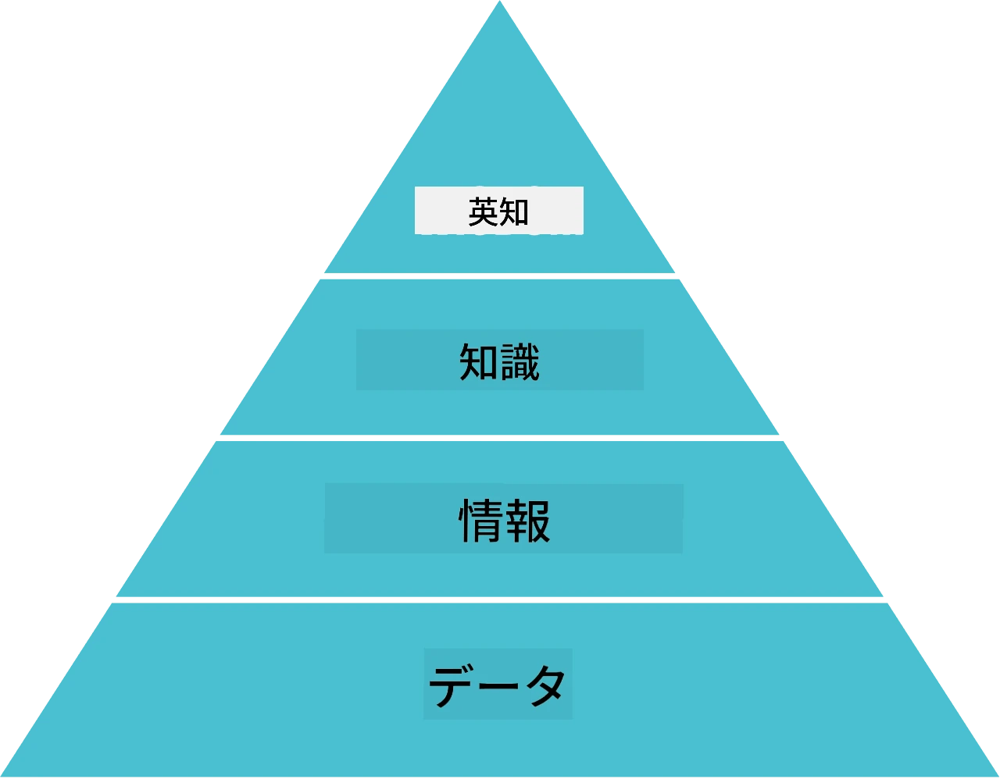
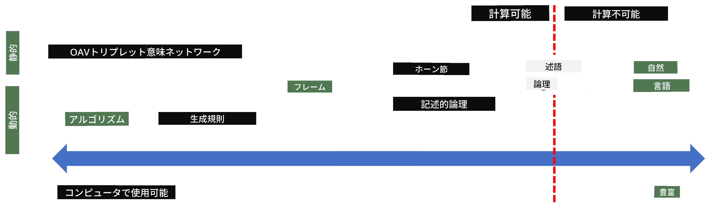
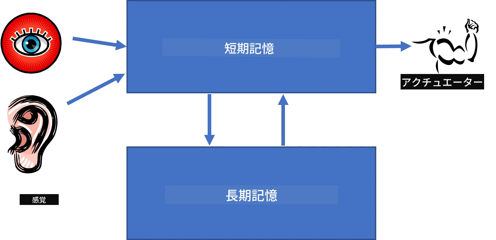
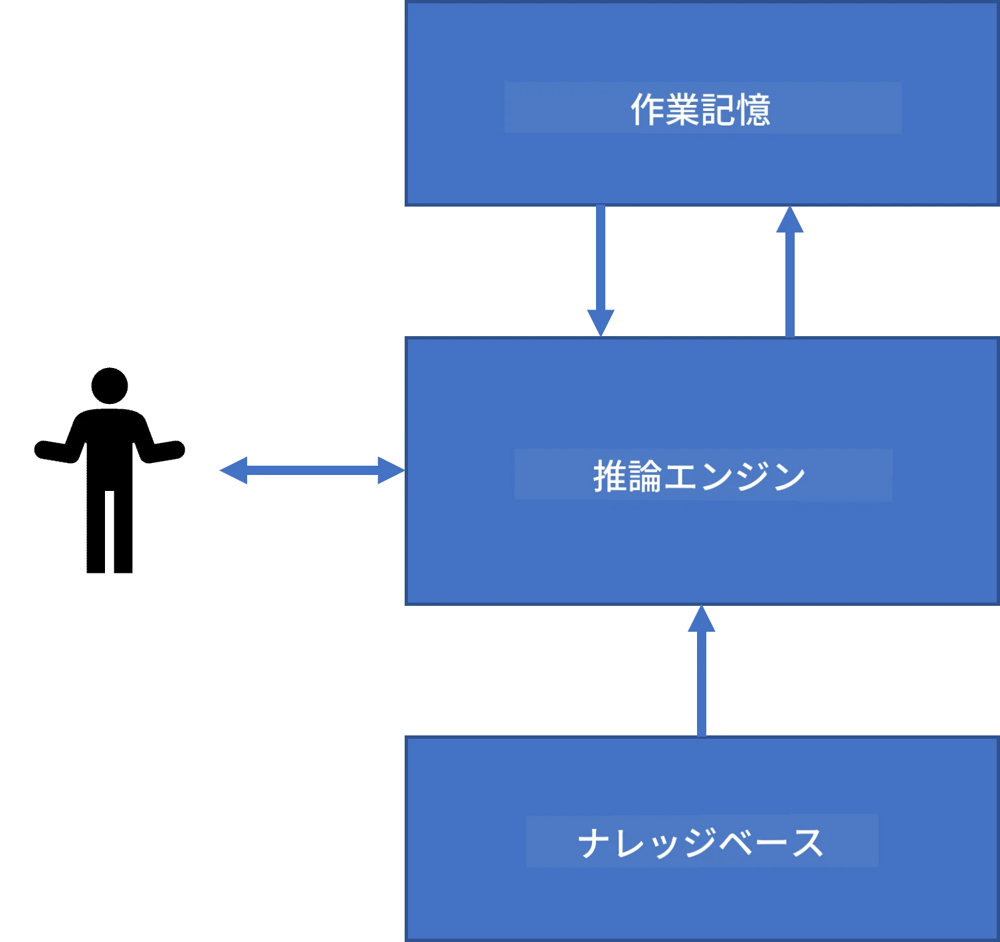
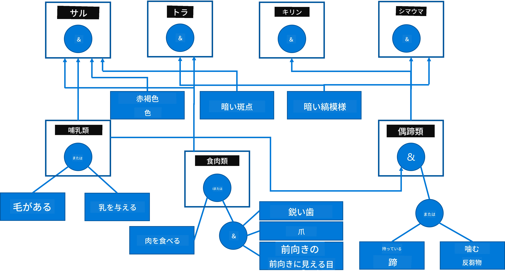
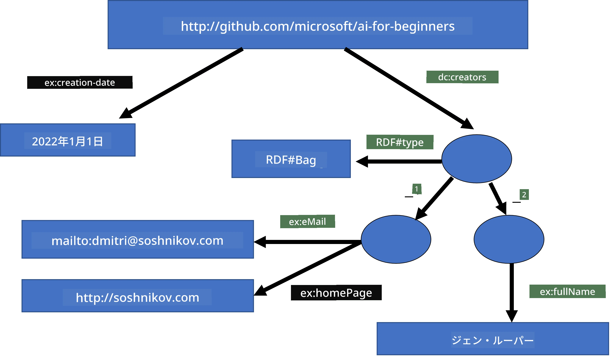
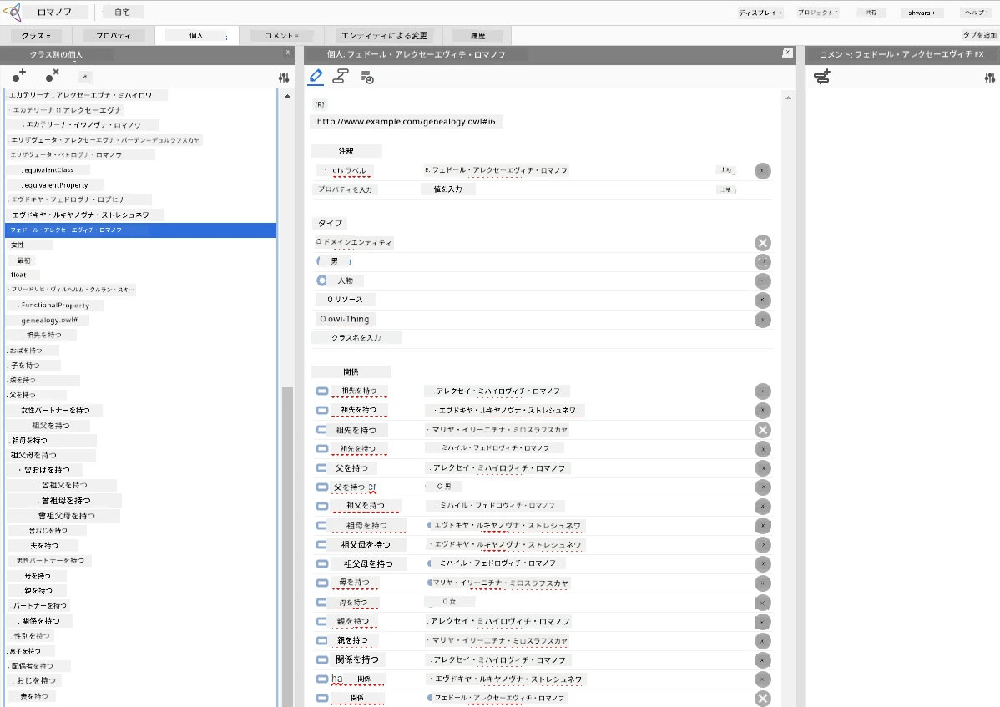

# 知識表現とエキスパートシステム


> スケッチノート作成者：[Tomomi Imura](https://twitter.com/girlie_mac)

人工知能の探求は、人間と同様に世界を理解するための知識の探求に基づいています。しかし、それをどうやって行えばよいのでしょうか？

## [講義前クイズ](https://ff-quizzes.netlify.app/en/ai/quiz/3)

AIの初期には、インテリジェントシステムを作成するためのトップダウンアプローチ（前のレッスンで議論した）が人気でした。この考え方は、人から知識を抽出し、それを機械で読み取れる形式にし、それを使って問題を自動的に解決するというものです。このアプローチは二つの大きなアイデアに基づいていました：

* 知識表現
* 推論

## 知識表現

記号的AIにおける重要な概念の一つが**知識**です。知識を*情報*や*データ*と区別することが重要です。例えば、本は知識を含むと言えます。なぜなら、本を学ぶことで専門家になることができるからです。しかし、実際に本に含まれているのは*データ*であり、本を読み、このデータを自分の世界モデルに取り込むことでそのデータを知識に変換しているのです。

> ✅ **知識**とは、頭の中に含まれていて私たちの世界の理解を表すものです。情報の断片を自分の積極的な世界モデルに統合する、能動的な**学習**プロセスによって得られます。

多くの場合、知識を厳密に定義することはしませんが、[DIKWピラミッド](https://en.wikipedia.org/wiki/DIKW_pyramid)を使って関連した他の概念と整合させます。ピラミッドには以下の概念が含まれます：

* **データ**は、書かれたテキストや話された言葉のように物理的な媒体で表現されるものです。データは人間とは独立して存在し、人から人へ渡すことができます。
* **情報**は、私たちが頭の中でデータを解釈したものです。例えば、「コンピューター」という言葉を聞くと、それが何かを理解します。
* **知識**は、情報が私たちの世界モデルに統合されたものです。例えば、コンピューターが何かを学ぶと、その動作や価格、用途についてのアイデアを持ち始めます。この相互関連した概念のネットワークが私たちの知識を形成します。
* **知恵**は、さらに私たちの世界理解の一段階上で、*メタ知識*を表します。例えば、知識をどのように、いつ使うべきかという概念です。



*画像 [Wikipediaより](https://commons.wikimedia.org/w/index.php?curid=37705247)、Longlivetheuxによるオリジナル作品、CC BY-SA 4.0*

したがって、**知識表現**の問題は、知識を自動的に利用可能にするために、コンピューター内でデータという形で効果的に表現する方法を見つけることです。これは次のようなスペクトルとして見ることができます：



> 画像提供：[Dmitry Soshnikov](http://soshnikov.com)

* 左側には、コンピューターが効果的に利用できる非常に単純な種類の知識表現があります。最も単純なのはアルゴリズム型で、知識はコンピュータープログラムで表現されます。しかしこれは柔軟性がなく、最良の方法ではありません。私たちの頭の中の知識はしばしば非アルゴリズム的です。
* 右側には自然言語テキストのような表現があります。これは最も強力ですが、自動推論には利用できません。

> ✅ あなたの頭の中での知識表現とノートに変換する方法について考えてみてください。記憶保持に役立つ特定のフォーマットはありますか？

## コンピュータ知識表現の分類

異なるコンピュータの知識表現方法は、以下のカテゴリに分類できます：

* **ネットワーク表現**は、頭の中に相互に関連する概念のネットワークがある事実に基づいています。これと同じネットワークをコンピューター内のグラフとして再現することができます。これを**セマンティックネットワーク**と呼びます。

1. **オブジェクト・属性・値のトリプレット**または**属性値ペア**。グラフはノードとエッジのリストとしてコンピューターに表現できるため、セマンティックネットワークはオブジェクト、属性、値を含むトリプレットのリストとして表現できます。例えば、プログラミング言語についての以下のトリプレットを作ります：

オブジェクト | 属性 | 値
------------|------|-----
Python | is | Untyped-Language
Python | invented-by | Guido van Rossum
Python | block-syntax | indentation
Untyped-Language | doesn't have | type definitions

> ✅ トリプレットが他のタイプの知識をどのように表現できるか考えてみましょう。

2. **階層表現**は、頭の中にオブジェクトの階層を作ることを強調します。例えば、カナリアは鳥であり、すべての鳥は翼を持っていることを知っています。カナリアの通常の色や飛行速度についてもある程度知っています。

   - **フレーム表現**は各オブジェクトまたはオブジェクトクラスを**フレーム**として表現し、その中に**スロット**があります。スロットは可能なデフォルト値、値の制約、または値を得るために呼び出せる格納手続きがあります。すべてのフレームはオブジェクト指向プログラミング言語のオブジェクト階層に似た階層を形成します。
   - **シナリオ**は時間経過に伴い展開する複雑な状況を表す特別なフレームの種類です。

**Python**

スロット | 値 | デフォルト値 | 範囲 |
--------|----|--------------|------|
Name | Python | | |
Is-A | Untyped-Language | | |
Variable Case | | CamelCase | |
Program Length | | | 5-5000行 |
Block Syntax | Indent | | |

3. **手続き的表現**は、ある条件が発生したときに実行されるアクションのリストとして知識を表現します。
   - 生産ルールは if-then 文で結論を導きます。例えば、医者は「もし」患者が高熱「または」血液検査でCRP値が高い「ならば」炎症がある、というルールを持つことができます。これらの条件が満たされると、炎症の結論を導き、さらに理由付けに使います。
   - アルゴリズムも手続き的表現の一種と考えられますが、知識ベースシステムで直接使われることはほとんどありません。

4. **論理**はもともとアリストテレスによって普遍的な人間の知識を表現する方法として提案されました。
   - 数学的理論としての述語論理は計算可能には豊か過ぎるため、通常は部分集合が使われます。例えば、Prologで使われるホーン節が代表的です。
   - 記述論理（Descriptive Logic）は、オブジェクトの階層や分散知識表現（*セマンティックウェブ*など）を表現・推論するための論理システム群です。

## エキスパートシステム

記号的AIの初期の成功例の一つが**エキスパートシステム**です。これは限定された問題領域の専門家として振る舞うよう設計されたコンピューターシステムです。複数の人間専門家から抽出された**知識ベース**を基にし、その上で推論を行う**推論エンジン**を備えています。

 | 
---------------------------------------------|------------------------------------------------
人間の神経系の簡略化された構造 | 知識ベースシステムのアーキテクチャ

エキスパートシステムは、人間の推論システムのように**短期記憶**と**長期記憶**を含む形で構築されます。同様に、知識ベースシステムでは以下のコンポーネントに分けられます：

* **問題メモリ**：現在解決中の問題についての知識を含みます。例えば、患者の体温や血圧、炎症があるかどうかなど。この知識は**静的知識**とも呼ばれ、現在の問題状態のスナップショットを含みます。
* **知識ベース**：問題ドメインに関する長期知識を表します。人間の専門家から手動で抽出され、診療ごとに変わりません。これにより問題状態間の移動が可能になるため、**動的知識**とも呼ばれます。
* **推論エンジン**：問題状態空間の探索プロセスを統括し、必要に応じてユーザーに質問します。各状態で適用すべきルールを見つける責任も持っています。

例として、動物の身体的特徴から動物を決定する以下のエキスパートシステムを考えましょう：



> 画像提供：[Dmitry Soshnikov](http://soshnikov.com)

この図は**AND-ORツリー**と呼ばれ、生産ルールの集合をグラフで表現しています。知識を専門家から抽出する初期段階で樹形図を描くのは有用です。コンピューター内で知識を表現するには、ルールを使う方が便利です：

```
IF the animal eats meat
OR (animal has sharp teeth
    AND animal has claws
    AND animal has forward-looking eyes
) 
THEN the animal is a carnivore
```

各ルールの左辺の条件とアクションは基本的にオブジェクト・属性・値（OAV）トリプレットであることが分かります。**作業メモリ**は現在解決中の問題に対応するOAVトリプレットの集合を含みます。**ルールエンジン**は条件が満たされているルールを探し、それを適用して作業メモリにトリプレットを追加します。

> ✅ あなた自身の好きなテーマでAND-ORツリーを書いてみましょう！

### 順方向推論と逆方向推論

上記のプロセスは**順方向推論**と呼ばれます。これは作業メモリにある初期データから開始し、以下の推論ループを実行します：

1. ターゲット属性が作業メモリにあれば処理を止めて結果を出す
2. 条件が満たされているすべてのルールを探し、**競合セット**を得る
3. **競合解決**を行い、このステップで実行する1つのルールを選ぶ。競合解決戦略には以下がある：
   - 知識ベースの中で適用できる最初のルールを選ぶ
   - ランダムにルールを選ぶ
   - *より具体的な* すなわち左辺(LHS)の条件を最も多く満たすルールを選ぶ
4. 選んだルールを適用し、新しい知識を問題状態に挿入する
5. ステップ1に戻る

しかし、場合によっては問題についての知識が空の場合から始め、結論に至るのに役立つ質問をしたいこともあります。例えば医療診断では、通常患者を診る前にすべての検査をしていません。決定を下す必要が生じたときに検査を行いたいのです。

このプロセスは**逆方向推論**でモデル化できます。これは**ゴール**（探している属性値）に駆動されます：

1. ゴールの値を与えうるすべてのルール（右辺（RHS）にゴールがあるもの）を選ぶ - 競合セット
2. もしこの属性にルールがなければ、または値をユーザーに尋ねるルールがあれば、ユーザーに質問する。そうでなければ：
3. 競合解決戦略を使って、*仮説*として使用するルールを1つ選ぶ。これを証明しようとする
4. ルールの左辺（LHS）のすべての属性に対して再帰的にゴールとしてこのプロセスを繰り返す
5. 途中で失敗したら、ステップ3で別のルールを使う

> ✅ どんな場合に順方向推論がより適しているでしょうか？逆方向推論はどうですか？

### エキスパートシステムの実装

エキスパートシステムは様々なツールで実装できます：

* 高水準プログラミング言語で直接プログラミングする方法。これはあまりよい方法ではありません。なぜなら、知識ベースシステムの主な利点は推論から知識が分離されていることであり、問題ドメインの専門家が推論の詳細を理解せずにルールを書けるようにすべきだからです。
* **エキスパートシステムシェル**を使う。これは特別に設計されたシステムで、特定の知識表現言語を使って知識を投入します。

## ✍️ 演習：動物推論

順方向推論と逆方向推論エキスパートシステムの実装例については、[Animals.ipynb](https://github.com/microsoft/AI-For-Beginners/blob/main/lessons/2-Symbolic/Animals.ipynb)を参照してください。

> **注**：この例はかなり簡単で、エキスパートシステムのイメージを掴むためのものです。実際にこの種のシステムを作り始めると、200以上のルールに達するまでは*知的な*振る舞いを感じないでしょう。ある段階でルールが複雑になりすぎて全体を把握できなくなり、システムがなぜ特定の決定をしたのか疑問に思い始めます。しかし、知識ベースシステムの重要な特徴は、どんな決定がどのように行われたかを常に*説明*できることです。

## オントロジーとセマンティックウェブ

20世紀末に、知識表現を使ってインターネット上のリソースに注釈をつけ、非常に具体的な検索クエリに対応できるようにする取り組みがありました。これは**セマンティックウェブ**と呼ばれ、以下の概念に依拠しています：

- **[記述論理](https://en.wikipedia.org/wiki/Description_logic)**（DL）に基づく特別な知識表現。これはフレーム表現に似ており、属性を持つオブジェクトの階層を構築しますが、形式的な論理意味論と推論を持っています。推論の表現力と計算複雑性のバランスをとった様々なDLのファミリーがあります。
- 分散知識表現で、すべての概念がグローバルなURI識別子で表現されており、インターネット全体に及ぶ知識階層を作成できます。
- 知識記述のためのXMLベース言語のファミリー：RDF（Resource Description Framework）、RDFS（RDF Schema）、OWL（Ontology Web Language）。

セマンティックウェブの核心概念の一つが**オントロジー**の概念です。これは、ある問題領域を形式的な知識表現を用いて明示的に仕様化することを指します。最も単純なオントロジーは問題領域内のオブジェクトの階層でしかありませんが、より複雑なオントロジーは推論に使えるルールも含みます。

セマンティックウェブでは、すべての表現が三つ組（トリプレット）に基づいています。各オブジェクトと各関係はURIによって一意に識別されます。例えば、このAIカリキュラムが2022年1月1日にDmitry Soshnikovによって作成されたという事実を述べたい場合、次のようなトリプレットが使えます：


```
http://github.com/microsoft/ai-for-beginners http://www.example.com/terms/creation-date “Jan 1, 2022”
http://github.com/microsoft/ai-for-beginners http://purl.org/dc/elements/1.1/creator http://soshnikov.com
```

> ✅ ここで `http://www.example.com/terms/creation-date` と `http://purl.org/dc/elements/1.1/creator` は、*作成者* と *作成日時* の概念を表すためによく知られた普遍的に受け入れられているURIです。

より複雑な場合、作成者の一覧を定義したい場合は、RDFで定義されたいくつかのデータ構造を使うことができます。



> 上記の図は[Dmitry Soshnikov](http://soshnikov.com)によるものです

セマンティックウェブの構築の進展は、検索エンジンや自然言語処理技術の成功によってある程度遅れました。これらの技術はテキストから構造化データを抽出可能にしました。しかし、いくつかの分野では依然としてオントロジーや知識ベースの維持にかなりの努力が払われています。注目すべきプロジェクトをいくつか紹介します：

* [WikiData](https://wikidata.org/) はウィキペディアに関連した機械可読の知識ベースの集合です。ほとんどのデータはウィキペディアの*インフォボックス*（ページ内の構造化コンテンツ）から抽出されています。SPARQLというセマンティックウェブ専用のクエリ言語で[クエリ](https://query.wikidata.org/)が可能です。以下は人間の最も人気のある目の色を表示するサンプルクエリです：

```sparql
#defaultView:BubbleChart
SELECT ?eyeColorLabel (COUNT(?human) AS ?count)
WHERE
{
  ?human wdt:P31 wd:Q5.       # human instance-of homo sapiens
  ?human wdt:P1340 ?eyeColor. # human eye-color ?eyeColor
  SERVICE wikibase:label { bd:serviceParam wikibase:language "en". }
}
GROUP BY ?eyeColorLabel
```

* [DBpedia](https://www.dbpedia.org/) はWikiDataに似たもう一つのプロジェクトです。

> ✅ オントロジーの構築や既存オントロジーの開示を試したい場合は、優れたビジュアルオントロジーエディタである[Protégé](https://protege.stanford.edu/)があります。ダウンロードするかオンラインで利用してください。



*Web ProtégéエディタでRomanov Familyオントロジーを開いた様子。スクリーンショット提供：Dmitry Soshnikov*

## ✍️ 練習問題：家族オントロジー

[FamilyOntology.ipynb](https://github.com/Ezana135/AI-For-Beginners/blob/main/lessons/2-Symbolic/FamilyOntology.ipynb) では、セマンティックウェブ技術を使って家族関係を推論する例を示しています。一般的なGEDCOM形式で表現された家系図と家族関係のオントロジーを使い、指定された個人群に対するすべての家族関係のグラフを構築します。

## Microsoft Concept Graph

多くの場合、オントロジーは注意深く手作業で作成されます。しかし、自然言語テキストのような非構造化データからオントロジーを**マイニング**することも可能です。

この試みの一つはMicrosoft Researchによってなされ、[Microsoft Concept Graph](https://blogs.microsoft.com/ai/microsoft-researchers-release-graph-that-helps-machines-conceptualize/?WT.mc_id=academic-77998-cacaste)として発表されました。

これは`is-a`継承関係を用いてグルーピングされた大量のエンティティのコレクションで、「Microsoftとは何か？」という問いに「0.87の確率で会社であり、0.75の確率でブランドである」などの回答を可能にします。

このグラフはREST APIとして利用可能であるほか、すべてのエンティティペアをリストした大きなテキストファイルとしてもダウンロード可能です。

## ✍️ 練習問題：コンセプトグラフ

[MSConceptGraph.ipynb](https://github.com/microsoft/AI-For-Beginners/blob/main/lessons/2-Symbolic/MSConceptGraph.ipynb)のノートブックで、Microsoft Concept Graphを使ってニュース記事をいくつかのカテゴリに分類する方法を試してみてください。

## 結論

今日、AIはしばしば*機械学習*や*ニューラルネットワーク*の同義語として見なされます。しかし、人間は明示的な推論も行い、これは現在ニューラルネットワークでは扱いきれていないものです。実際のプロジェクトでは、説明を要するタスクやシステムの振る舞いを制御可能に変更する必要がある場面で明示的推論が今も利用されています。

## 🚀 チャレンジ

このレッスンに関連したFamily Ontologyノートブックでは、他の家族関係について実験できる機会があります。家系図内の人物同士の新しい繋がりを発見してみてください。

## [講義後クイズ](https://ff-quizzes.netlify.app/en/ai/quiz/4)

## 復習と自主学習

インターネットで人類が知識を定量化・体系化しようとした領域を調べてみましょう。ブルームのタキソノミーを見て、人間がどのように世界を理解しようと試みてきたか歴史を遡って学んでください。リンネによる生物分類の研究を探り、ドミトリ・メンデレーエフが化学元素を記述・分類した方法を観察しましょう。ほかに興味深い例は何がありますか？

**課題**：[オントロジーを作成しよう](assignment.md)

---

<!-- CO-OP TRANSLATOR DISCLAIMER START -->
**免責事項**：  
本書類はAI翻訳サービス「Co-op Translator」（https://github.com/Azure/co-op-translator）を使用して翻訳されました。正確性を期しておりますが、自動翻訳には誤りや不正確な部分が含まれる可能性があることをご理解ください。原文のオリジナル版が正式な情報源とみなされます。重要な情報については、専門の人間翻訳者による翻訳を推奨いたします。本翻訳の利用による誤解や誤訳に関して、当方は一切の責任を負いかねます。
<!-- CO-OP TRANSLATOR DISCLAIMER END -->