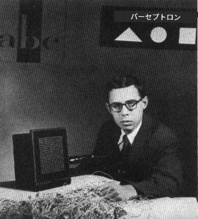
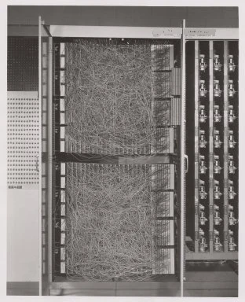

# ニューラルネットワーク入門: パーセプトロン

## [講義前クイズ](https://ff-quizzes.netlify.app/en/ai/quiz/5)

現代のニューラルネットワークに似たものを初めて実装しようとした試みは、1957年にコーネル航空研究所のフランク・ローゼンブラットによって行われました。それは「Mark-1」と呼ばれるハードウェア実装で、三角形、四角形、円などの原始的な幾何学的図形を認識するよう設計されていました。

|      |      |
|--------------|-----------|
| | |

> 画像は[Wikipedia](https://en.wikipedia.org/wiki/Perceptron)より

入力画像は20x20のフォトセル配列で表され、ニューラルネットワークには400の入力と1つの二値出力がありました。単純なネットワークは1つのニューロン、つまり**閾値論理ユニット**を含んでいました。ニューラルネットワークの重みはポテンショメータのように機能し、トレーニングフェーズ中に手動で調整する必要がありました。

> ✅ ポテンショメータは、回路の抵抗を調整できる装置です。

> 当時のニューヨーク・タイムズはパーセプトロンについて次のように書いています: *海軍が期待する電子コンピュータの胚であり、それは歩き、話し、見て、書き、自己複製し、自分の存在を意識することができるようになるだろう。*

## パーセプトロンモデル

モデルにN個の特徴があると仮定すると、入力ベクトルはサイズNのベクトルになります。パーセプトロンは**二値分類**モデルであり、入力データの2つのクラスを区別することができます。各入力ベクトルxに対して、パーセプトロンの出力はクラスに応じて+1または-1になります。出力は次の式で計算されます:

y(x) = f(w<sup>T</sup>x)

ここでfはステップ活性化関数です。

<!-- img src="http://www.sciweavers.org/tex2img.php?eq=f%28x%29%20%3D%20%5Cbegin%7Bcases%7D%0A%20%20%20%20%20%20%20%20%20%2B1%20%26%20x%20%5Cgeq%200%20%5C%5C%0A%20%20%20%20%20%20%20%20%20-1%20%26%20x%20%3C%200%0A%20%20%20%20%20%20%20%5Cend%7Bcases%7D%20%5C%5C%0A&bc=White&fc=Black&im=jpg&fs=12&ff=arev&edit=0" align="center" border="0" alt="f(x) = \begin{cases} +1 & x \geq 0 \\ -1 & x < 0 \end{cases} \\" width="154" height="50" / -->


## パーセプトロンのトレーニング

パーセプトロンをトレーニングするには、ほとんどの値を正しく分類する重みベクトルwを見つける必要があります。つまり、**誤差**を最小化する必要があります。この誤差Eは、**パーセプトロン基準**によって次のように定義されます:

E(w) = -&sum;w<sup>T</sup>x<sub>i</sub>t<sub>i</sub>

ここで:

* 和は誤分類を引き起こすトレーニングデータポイントiに対して取られます。
* x<sub>i</sub>は入力データであり、t<sub>i</sub>は負の例と正の例に応じてそれぞれ-1または+1です。

この基準は重みwの関数とみなされ、これを最小化する必要があります。しばしば**勾配降下法**と呼ばれる方法が使用されます。この方法では、初期重みw<sup>(0)</sup>から始め、各ステップで次の式に従って重みを更新します:

w<sup>(t+1)</sup> = w<sup>(t)</sup> - &eta;&nabla;E(w)

ここで&eta;は**学習率**と呼ばれ、&nabla;E(w)はEの**勾配**を表します。勾配を計算した後、次の式になります:

w<sup>(t+1)</sup> = w<sup>(t)</sup> + &sum;&eta;x<sub>i</sub>t<sub>i</sub>

Pythonでのアルゴリズムは次のようになります:

```python
def train(positive_examples, negative_examples, num_iterations = 100, eta = 1):

    weights = [0,0,0] # Initialize weights (almost randomly :)
        
    for i in range(num_iterations):
        pos = random.choice(positive_examples)
        neg = random.choice(negative_examples)

        z = np.dot(pos, weights) # compute perceptron output
        if z < 0: # positive example classified as negative
            weights = weights + eta*weights.shape

        z  = np.dot(neg, weights)
        if z >= 0: # negative example classified as positive
            weights = weights - eta*weights.shape

    return weights
```

## 結論

このレッスンでは、二値分類モデルであるパーセプトロンについて学び、重みベクトルを使用してトレーニングする方法を学びました。

## 🚀 チャレンジ

自分でパーセプトロンを構築してみたい場合は、[Microsoft Learnのこのラボ](https://docs.microsoft.com/en-us/azure/machine-learning/component-reference/two-class-averaged-perceptron?WT.mc_id=academic-77998-cacaste)を試してみてください。このラボでは[Azure MLデザイナー](https://docs.microsoft.com/en-us/azure/machine-learning/concept-designer?WT.mc_id=academic-77998-cacaste)を使用します。

## [講義後クイズ](https://ff-quizzes.netlify.app/en/ai/quiz/6)

## 復習と自己学習

パーセプトロンを使用しておもちゃの問題や実際の問題を解決する方法を確認し、学習を続けるには、[Perceptron](Perceptron.ipynb)ノートブックに進んでください。

こちらも興味深い[パーセプトロンに関する記事](https://towardsdatascience.com/what-is-a-perceptron-basics-of-neural-networks-c4cfea20c590)です。

## [課題](lab/README.md)

このレッスンでは、二値分類タスクのためのパーセプトロンを実装し、2つの手書き数字を分類するために使用しました。このラボでは、数字分類の問題を完全に解決することが求められます。つまり、与えられた画像に最も対応する数字を特定する必要があります。

* [指示](lab/README.md)
* [ノートブック](lab/PerceptronMultiClass.ipynb)

---

