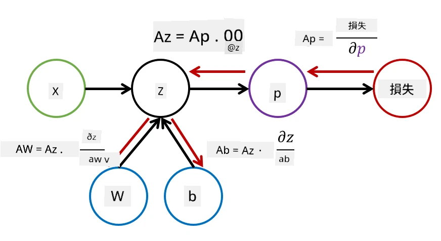

# ニューラルネットワーク入門: 多層パーセプトロン

前のセクションでは、最も基本的なニューラルネットワークモデルである1層パーセプトロン（線形2クラス分類モデル）について学びました。

このセクションでは、このモデルをより柔軟なフレームワークに拡張し、以下を可能にします：

* **多クラス分類**を2クラス分類に加えて実行する  
* **回帰問題**を分類に加えて解く  
* 線形分離不可能なクラスを分離する  

また、Pythonで独自のモジュール型フレームワークを開発し、さまざまなニューラルネットワークアーキテクチャを構築できるようにします。

## [講義前のクイズ](https://ff-quizzes.netlify.app/en/ai/quiz/7)

## 機械学習の形式化

まず、機械学習の問題を形式化することから始めましょう。トレーニングデータセット**X**とラベル**Y**があると仮定し、最も正確な予測を行うモデル*f*を構築する必要があります。予測の品質は**損失関数**&lagran;で測定されます。以下の損失関数がよく使用されます：

* 数値を予測する必要がある回帰問題では、**絶対誤差** &sum;i|f(x(i))-y(i)| または **二乗誤差** &sum;i(f(x(i))-y(i))2 を使用できます。
* 分類では、**0-1損失**（モデルの**精度**とほぼ同じ）や**ロジスティック損失**を使用します。

1層パーセプトロンの場合、関数*f*は線形関数*f(x)=wx+b*として定義されます（ここで*w*は重み行列、*x*は入力特徴ベクトル、*b*はバイアスベクトル）。異なるニューラルネットワークアーキテクチャでは、この関数はより複雑な形を取ることができます。

> 分類の場合、対応するクラスの確率をネットワークの出力として得ることが望ましいことがよくあります。任意の数値を確率に変換するため（つまり出力を正規化するため）、**ソフトマックス**関数&sigma;をよく使用します。この場合、関数*f*は*f(x)=&sigma;(wx+b)*となります。

上記の*f*の定義では、*w*と*b*は**パラメータ**&theta;=⟨*w,b*⟩と呼ばれます。データセット⟨**X**,**Y**⟩が与えられると、パラメータ&theta;に基づいてデータセット全体の誤差を計算できます。

> ✅ **ニューラルネットワークのトレーニングの目的は、パラメータ&theta;を変化させて誤差を最小化することです**

## 勾配降下法による最適化

関数最適化のためのよく知られた方法に**勾配降下法**があります。この方法のアイデアは、損失関数のパラメータに対する微分（多次元の場合は**勾配**と呼ばれる）を計算し、誤差が減少するようにパラメータを変化させることです。これを以下のように形式化できます：

* 初期パラメータをランダムな値で設定する w(0), b(0)
* 以下のステップを何度も繰り返す：
    - w(i+1) = w(i)-&eta;&part;&lagran;/&part;w
    - b(i+1) = b(i)-&eta;&part;&lagran;/&part;b

トレーニング中、最適化ステップはデータセット全体を考慮して計算されるべきです（損失はすべてのトレーニングサンプルを通じて合計として計算されます）。しかし実際には、データセットの小さな部分を**ミニバッチ**と呼び、それに基づいて勾配を計算します。この部分は毎回ランダムに選ばれるため、この方法は**確率的勾配降下法**（SGD）と呼ばれます。

## 多層パーセプトロンとバックプロパゲーション

1層ネットワークは、前述のように線形分離可能なクラスを分類する能力を持っています。より豊かなモデルを構築するために、ネットワークの層を複数組み合わせることができます。数学的には、関数*f*がより複雑な形を取り、いくつかのステップで計算されることを意味します：
* z1=w1x+b1
* z2=w2&alpha;(z1)+b2
* f = &sigma;(z2)

ここで、&alpha;は**非線形活性化関数**、&sigma;はソフトマックス関数、パラメータ&theta;=<*w1,b1,w2,b2*>です。

勾配降下アルゴリズムは同じままですが、勾配の計算はより困難になります。連鎖微分法則を用いることで、以下のように微分を計算できます：

* &part;&lagran;/&part;w2 = (&part;&lagran;/&part;&sigma;)(&part;&sigma;/&part;z2)(&part;z2/&part;w2)
* &part;&lagran;/&part;w1 = (&part;&lagran;/&part;&sigma;)(&part;&sigma;/&part;z2)(&part;z2/&part;&alpha;)(&part;&alpha;/&part;z1)(&part;z1/&part;w1)

> ✅ 連鎖微分法則は、損失関数のパラメータに対する微分を計算するために使用されます。

これらの式の左端部分はすべて同じであるため、損失関数から始めて計算グラフを「逆方向」にたどることで効率的に微分を計算できます。このため、多層パーセプトロンのトレーニング方法は**バックプロパゲーション**（バックプロップ）と呼ばれます。

> TODO: 画像の引用元

> ✅ バックプロップについては、ノートブックの例でさらに詳しく説明します。

## 結論

このレッスンでは、独自のニューラルネットワークライブラリを構築し、それを使って簡単な2次元分類タスクを実行しました。

## 🚀 チャレンジ

付属のノートブックでは、多層パーセプトロンを構築・トレーニングするための独自のフレームワークを実装します。これにより、現代のニューラルネットワークがどのように動作するかを詳細に確認できます。

[OwnFramework](OwnFramework.ipynb)ノートブックに進み、作業を進めてください。

## [講義後のクイズ](https://ff-quizzes.netlify.app/en/ai/quiz/8)

## 復習と自己学習

バックプロパゲーションはAIや機械学習でよく使われるアルゴリズムであり、[さらに詳しく](https://wikipedia.org/wiki/Backpropagation)学ぶ価値があります。

## [課題](lab/README.md)

このラボでは、このレッスンで構築したフレームワークを使用して、MNIST手書き数字分類を解決することが求められます。

* [指示](lab/README.md)  
* [ノートブック](lab/MyFW_MNIST.ipynb)  

---

