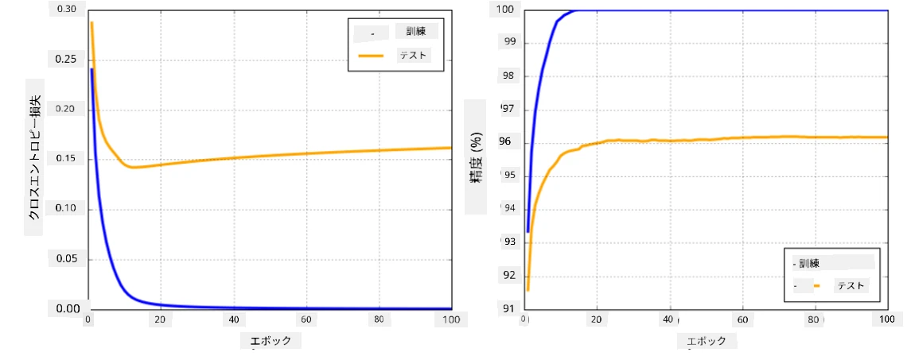

# ニューラルネットワークフレームワーク

すでに学んだように、ニューラルネットワークを効率的に学習させるためには、以下の2つのことを行う必要があります：

* テンソルを操作すること（例：乗算、加算、シグモイドやソフトマックスなどの関数を計算すること）
* 勾配降下法による最適化を行うために、すべての式の勾配を計算すること

## [事前クイズ](https://ff-quizzes.netlify.app/en/ai/quiz/9)

`numpy`ライブラリは最初の部分を実行できますが、勾配を計算する仕組みが必要です。前のセクションで開発した[独自のフレームワーク](../04-OwnFramework/OwnFramework.ipynb)では、`backward`メソッド内で逆伝播を行うためにすべての微分関数を手動でプログラムする必要がありました。理想的には、フレームワークは定義可能な*任意の式*の勾配を計算する機能を提供すべきです。

もう一つ重要なのは、GPUや[TPU](https://en.wikipedia.org/wiki/Tensor_Processing_Unit)などの特殊な計算ユニットで計算を実行できることです。深層ニューラルネットワークの学習には*非常に多くの計算*が必要であり、これらの計算をGPU上で並列化することが非常に重要です。

> ✅ 「並列化」とは、計算を複数のデバイスに分散させることを意味します。

現在、最も人気のあるニューラルネットワークフレームワークは、[TensorFlow](http://TensorFlow.org)と[PyTorch](https://pytorch.org/)です。どちらもCPUとGPUの両方でテンソルを操作するための低レベルAPIを提供しています。低レベルAPIの上には、高レベルAPIである[Keras](https://keras.io/)や[PyTorch Lightning](https://pytorchlightning.ai/)があります。

低レベルAPI | [TensorFlow](http://TensorFlow.org) | [PyTorch](https://pytorch.org/)
--------------|-------------------------------------|--------------------------------
高レベルAPI | [Keras](https://keras.io/) | [PyTorch Lightning](https://pytorchlightning.ai/)

**低レベルAPI**は、いわゆる**計算グラフ**を構築することを可能にします。このグラフは、入力パラメータを基に出力（通常は損失関数）を計算する方法を定義し、GPUが利用可能であればGPU上で計算を実行できます。この計算グラフを微分して勾配を計算する関数があり、それを使ってモデルパラメータを最適化できます。

**高レベルAPI**は、ニューラルネットワークを**層のシーケンス**として扱い、ほとんどのニューラルネットワークの構築を非常に簡単にします。モデルの学習は通常、データを準備し、`fit`関数を呼び出すことで行われます。

高レベルAPIは、典型的なニューラルネットワークを非常に迅速に構築することを可能にし、多くの詳細を気にする必要がありません。一方で、低レベルAPIは学習プロセスをより細かく制御できるため、新しいニューラルネットワークアーキテクチャを扱う研究において頻繁に使用されます。

また、両方のAPIを組み合わせて使用することも可能です。例えば、低レベルAPIを使用して独自のネットワーク層アーキテクチャを開発し、それを高レベルAPIで構築・学習された大規模なネットワーク内で使用することができます。または、高レベルAPIを使用して層のシーケンスとしてネットワークを定義し、独自の低レベル学習ループを使用して最適化を行うこともできます。両方のAPIは同じ基本的な概念を使用しており、互いにうまく連携するように設計されています。

## 学習

このコースでは、PyTorchとTensorFlowの両方に対応したコンテンツを提供しています。好みのフレームワークを選び、それに対応するノートブックだけを学習してください。どちらを選ぶべきか迷った場合は、**PyTorch vs. TensorFlow**に関するインターネット上の議論を読んでみてください。また、両方のフレームワークを見て理解を深めるのも良いでしょう。

可能な限り、高レベルAPIを使用して簡単に進めます。しかし、ニューラルネットワークがどのように動作するかを基礎から理解することが重要だと考えているため、最初は低レベルAPIとテンソルを扱うところから始めます。ただし、詳細を学ぶ時間をあまりかけたくない場合は、それらをスキップして高レベルAPIのノートブックに直接進むこともできます。

## ✍️ 演習: フレームワーク

以下のノートブックで学習を続けてください：

低レベルAPI | [TensorFlow+Keras Notebook](IntroKerasTF.ipynb) | [PyTorch](IntroPyTorch.ipynb)
--------------|-------------------------------------|--------------------------------
高レベルAPI | [Keras](IntroKeras.ipynb) | *PyTorch Lightning*

フレームワークを習得した後は、過学習の概念を復習しましょう。

# 過学習

過学習は機械学習において非常に重要な概念であり、正しく理解することが非常に重要です！

以下の5つの点（グラフ上の`x`で表される）を近似する問題を考えてみましょう：

 | 
-------------------------|--------------------------
**線形モデル、2つのパラメータ** | **非線形モデル、7つのパラメータ**
学習誤差 = 5.3 | 学習誤差 = 0
検証誤差 = 5.1 | 検証誤差 = 20

* 左側では、良い直線近似が見られます。パラメータ数が適切であるため、モデルは点の分布の背後にあるアイデアを正しく捉えています。
* 右側では、モデルが強力すぎます。点が5つしかないのにモデルには7つのパラメータがあるため、すべての点を通過するように調整でき、学習誤差が0になります。しかし、これによりデータの正しいパターンを理解することが妨げられ、検証誤差が非常に高くなります。

モデルの豊かさ（パラメータ数）と学習サンプル数のバランスを正しく取ることが非常に重要です。

## 過学習が発生する理由

  * 学習データが不足している
  * モデルが強力すぎる
  * 入力データにノイズが多すぎる

## 過学習の検出方法

上記のグラフからわかるように、過学習は非常に低い学習誤差と高い検証誤差によって検出できます。通常、学習中は学習誤差と検証誤差の両方が減少し始めますが、ある時点で検証誤差が減少を止めて上昇し始めることがあります。これが過学習の兆候であり、この時点で学習を停止するべき（または少なくともモデルのスナップショットを作成するべき）という指標になります。

## 過学習を防ぐ方法

過学習が発生している場合、以下のいずれかを行うことができます：

 * 学習データの量を増やす
 * モデルの複雑さを減らす
 * [正則化技術](../../4-ComputerVision/08-TransferLearning/TrainingTricks.md)を使用する（例：[Dropout](../../4-ComputerVision/08-TransferLearning/TrainingTricks.md#Dropout)）。これについては後で詳しく説明します。

## 過学習とバイアス-バリアンストレードオフ

過学習は、統計学におけるより一般的な問題である[バイアス-バリアンストレードオフ](https://en.wikipedia.org/wiki/Bias%E2%80%93variance_tradeoff)の一例です。モデルの誤差の原因を考えると、以下の2種類の誤差があることがわかります：

* **バイアス誤差**は、アルゴリズムが学習データ間の関係を正しく捉えられないことによって引き起こされます。これは、モデルが十分に強力でないこと（**アンダーフィッティング**）が原因で発生する可能性があります。
* **バリアンス誤差**は、モデルが入力データのノイズを意味のある関係ではなく近似してしまうことによって引き起こされます（**オーバーフィッティング**）。

学習中、バイアス誤差は減少します（モデルがデータを近似することを学習するため）。一方で、バリアンス誤差は増加します。過学習を防ぐためには、学習を手動で停止する（過学習を検出した場合）か、正則化を導入して自動的に停止することが重要です。

## 結論

このレッスンでは、2つの最も人気のあるAIフレームワークであるTensorFlowとPyTorchのさまざまなAPIの違いについて学びました。また、非常に重要なトピックである過学習についても学びました。

## 🚀 チャレンジ

付属のノートブックには「タスク」が記載されています。ノートブックを進めてタスクを完了してください。

## [事後クイズ](https://ff-quizzes.netlify.app/en/ai/quiz/10)

## 復習と自己学習

以下のトピックについて調査してください：

- TensorFlow
- PyTorch
- 過学習

以下の質問を自問してください：

- TensorFlowとPyTorchの違いは何ですか？
- 過学習とアンダーフィッティングの違いは何ですか？

## [課題](lab/README.md)

このラボでは、PyTorchまたはTensorFlowを使用して、単層および多層の完全結合ネットワークを用いた2つの分類問題を解決することが求められます。

* [指示](lab/README.md)
* [ノートブック](lab/LabFrameworks.ipynb)

---

