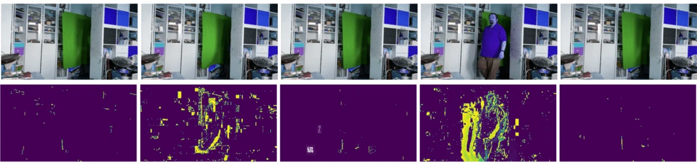

# コンピュータビジョンの概要

[コンピュータビジョン](https://wikipedia.org/wiki/Computer_vision)は、コンピュータがデジタル画像を高レベルで理解できるようにすることを目的とした分野です。この定義は非常に広範であり、*理解*には多くの意味が含まれます。例えば、画像内の物体を見つける（**物体検出**）、何が起きているかを理解する（**イベント検出**）、画像をテキストで説明する、または3Dでシーンを再構築することなどです。さらに、人間の画像に関連する特別なタスクもあります。例えば、年齢や感情の推定、顔の検出と識別、3Dポーズ推定などです。

## [講義前のクイズ](https://ff-quizzes.netlify.app/en/ai/quiz/11)

コンピュータビジョンの最も基本的なタスクの一つは**画像分類**です。

コンピュータビジョンはしばしばAIの一分野と見なされます。現在では、ほとんどのコンピュータビジョンのタスクはニューラルネットワークを使用して解決されています。このセクションでは、コンピュータビジョンに使用される特別なタイプのニューラルネットワークである[畳み込みニューラルネットワーク](../07-ConvNets/README.md)について学びます。

ただし、画像をニューラルネットワークに渡す前に、多くの場合、アルゴリズム的な手法を使用して画像を改善することが理にかなっています。

画像処理に利用できるPythonライブラリはいくつかあります：

* **[imageio](https://imageio.readthedocs.io/en/stable/)** は、さまざまな画像フォーマットの読み書きに使用できます。また、ffmpegをサポートしており、ビデオフレームを画像に変換する便利なツールです。
* **[Pillow](https://pillow.readthedocs.io/en/stable/index.html)**（PILとしても知られる）は、より強力で、モーフィングやパレット調整などの画像操作もサポートしています。
* **[OpenCV](https://opencv.org/)** はC++で書かれた強力な画像処理ライブラリで、画像処理の*事実上の標準*となっています。Pythonインターフェースも便利です。
* **[dlib](http://dlib.net/)** は、多くの機械学習アルゴリズムを実装したC++ライブラリで、コンピュータビジョンアルゴリズムも含まれています。Pythonインターフェースもあり、顔や顔のランドマーク検出などの難しいタスクに使用できます。

## OpenCV

[OpenCV](https://opencv.org/)は画像処理の*事実上の標準*とされています。C++で実装された多くの便利なアルゴリズムが含まれています。PythonからもOpenCVを呼び出すことができます。

OpenCVを学ぶのに良い場所は[このLearn OpenCVコース](https://learnopencv.com/getting-started-with-opencv/)です。このカリキュラムでは、OpenCVを学ぶことが目的ではなく、使用例とその方法を示すことが目的です。

### 画像の読み込み

Pythonでは画像をNumPy配列で便利に表現できます。例えば、320x200ピクセルのグレースケール画像は200x320の配列に保存され、同じサイズのカラー画像は200x320x3（3つのカラーチャンネル）という形状になります。画像を読み込むには、以下のコードを使用します：

```python
import cv2
import matplotlib.pyplot as plt

im = cv2.imread('image.jpeg')
plt.imshow(im)
```

伝統的に、OpenCVはカラー画像にBGR（青-緑-赤）エンコーディングを使用しますが、Pythonの他のツールはより一般的なRGB（赤-緑-青）を使用します。画像を正しく表示するには、NumPy配列の次元を入れ替えるか、OpenCV関数を呼び出してRGBカラースペースに変換する必要があります：

```python
im = cv2.cvtColor(im,cv2.COLOR_BGR2RGB)
```

同じ`cvtColor`関数を使用して、画像をグレースケールやHSV（色相-彩度-明度）カラースペースに変換することもできます。

OpenCVを使用してビデオをフレームごとに読み込むことも可能です。例は[OpenCV Notebook](OpenCV.ipynb)の演習で示されています。

### 画像処理

画像をニューラルネットワークに渡す前に、いくつかの前処理ステップを適用することが望ましい場合があります。OpenCVは以下のような多くのことが可能です：

* `im = cv2.resize(im, (320,200),interpolation=cv2.INTER_LANCZOS)`を使用して画像を**リサイズ**する
* `im = cv2.medianBlur(im,3)`または`im = cv2.GaussianBlur(im, (3,3), 0)`を使用して画像を**ぼかす**
* 画像の**明るさとコントラスト**を変更するには、NumPy配列操作を使用します。[このStackoverflowのノート](https://stackoverflow.com/questions/39308030/how-do-i-increase-the-contrast-of-an-image-in-python-opencv)で説明されています。
* `cv2.threshold`/`cv2.adaptiveThreshold`関数を呼び出して[閾値処理](https://docs.opencv.org/4.x/d7/d4d/tutorial_py_thresholding.html)を使用することは、明るさやコントラストを調整するよりも好ましい場合があります。
* 画像にさまざまな[変換](https://docs.opencv.org/4.5.5/da/d6e/tutorial_py_geometric_transformations.html)を適用する：
    - **[アフィン変換](https://docs.opencv.org/4.5.5/d4/d61/tutorial_warp_affine.html)** は、画像の回転、リサイズ、傾きを組み合わせる必要があり、画像内の3点のソースと目的地の位置が分かっている場合に便利です。アフィン変換は平行線を平行に保ちます。
    - **[透視変換](https://medium.com/analytics-vidhya/opencv-perspective-transformation-9edffefb2143)** は、画像内の4点のソースと目的地の位置が分かっている場合に便利です。例えば、スマートフォンのカメラで角度をつけて長方形の文書を撮影し、その文書自体の長方形画像を作成したい場合などです。
* **[オプティカルフロー](https://docs.opencv.org/4.5.5/d4/dee/tutorial_optical_flow.html)** を使用して画像内の動きを理解する。

## コンピュータビジョンの使用例

[OpenCV Notebook](OpenCV.ipynb)では、コンピュータビジョンを使用して特定のタスクを実行する例をいくつか示しています：

* **点字本の写真の前処理**。閾値処理、特徴検出、透視変換、NumPy操作を使用して、個々の点字記号を分離し、ニューラルネットワークによる分類に備える方法に焦点を当てています。

 |  | 
----|-----|-----

> 画像は[OpenCV.ipynb](OpenCV.ipynb)から引用

* **フレーム差分を使用したビデオ内の動きの検出**。カメラが固定されている場合、カメラフィードのフレームは互いに非常に似ているはずです。フレームが配列として表現されているため、2つの連続するフレームの配列を引き算するだけでピクセル差分が得られます。静的なフレームでは差分は低く、画像内に大きな動きがあると差分が高くなります。



> 画像は[OpenCV.ipynb](OpenCV.ipynb)から引用

* **オプティカルフローを使用した動きの検出**。[オプティカルフロー](https://docs.opencv.org/3.4/d4/dee/tutorial_optical_flow.html)を使用すると、ビデオフレーム上の個々のピクセルがどのように移動するかを理解できます。オプティカルフローには2種類あります：

   - **密なオプティカルフロー**は、各ピクセルがどこに移動しているかを示すベクトルフィールドを計算します。
   - **疎なオプティカルフロー**は、画像内の特徴的な部分（例：エッジ）を取り、それらのフレーム間の軌跡を構築します。


> 画像は[OpenCV.ipynb](OpenCV.ipynb)から引用

## ✍️ 実例ノートブック: OpenCV [OpenCV in Actionを試す](OpenCV.ipynb)

[OpenCV Notebook](OpenCV.ipynb)を探索して、OpenCVを使った実験をしてみましょう。

## 結論

動きの検出や指先の検出など、比較的複雑なタスクがコンピュータビジョンだけで解決できる場合があります。そのため、コンピュータビジョンの基本的な技術やOpenCVのようなライブラリが何をできるかを知っておくことは非常に役立ちます。

## 🚀 チャレンジ

AIショーの[このビデオ](https://docs.microsoft.com/shows/ai-show/ai-show--2021-opencv-ai-competition--grand-prize-winners--cortic-tigers--episode-32?WT.mc_id=academic-77998-cacaste)を視聴して、Cortic Tigersプロジェクトについて学び、彼らがロボットを通じてコンピュータビジョンタスクを民主化するブロックベースのソリューションをどのように構築したかを確認してください。この分野への新しい学習者を導入する他のプロジェクトについても調査してみてください。

## [講義後のクイズ](https://ff-quizzes.netlify.app/en/ai/quiz/12)

## レビューと自己学習

[この素晴らしいチュートリアル](https://learnopencv.com/optical-flow-in-opencv/)でオプティカルフローについてさらに学びましょう。

## [課題](lab/README.md)

このラボでは、簡単なジェスチャーを含むビデオを撮影し、オプティカルフローを使用して上下左右の動きを抽出することを目指します。


---

