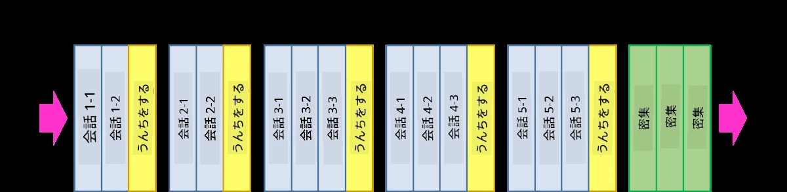
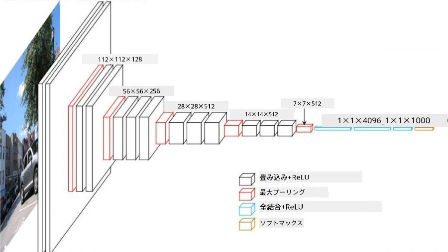
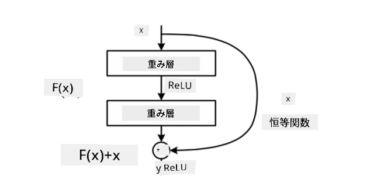
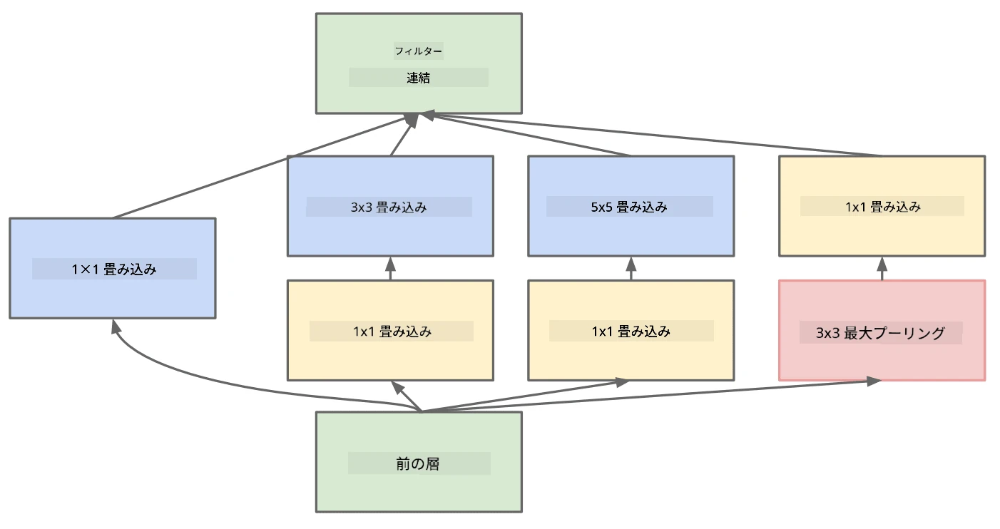

# よく知られたCNNアーキテクチャ

### VGG-16

VGG-16は、2014年にImageNetのトップ5分類で92.7%の精度を達成したネットワークです。そのレイヤー構造は以下の通りです：

ご覧の通り、VGGは従来のピラミッド型アーキテクチャを採用しており、畳み込み層とプーリング層が順番に並んでいます。

> 画像出典: [Researchgate](https://www.researchgate.net/figure/Vgg16-model-structure-To-get-the-VGG-NIN-model-we-replace-the-2-nd-4-th-6-th-7-th_fig2_335194493)

### ResNet

ResNetは、2015年にMicrosoft Researchによって提案されたモデル群です。ResNetの主なアイデアは**残差ブロック**を使用することです：

> 画像出典: [この論文](https://arxiv.org/pdf/1512.03385.pdf)

アイデンティティパススルーを使用する理由は、レイヤーが前のレイヤーの結果と残差ブロックの出力との差分を予測するようにするためです。そのため、*残差*という名前が付けられています。このブロックは非常に学習しやすく、数百ものブロックを持つネットワークを構築することが可能です（一般的なバリエーションはResNet-52、ResNet-101、ResNet-152）。

また、このネットワークはデータセットに応じて複雑さを調整できると考えることもできます。学習を開始したばかりの段階では、重みの値が小さく、ほとんどの信号がアイデンティティ層を通過します。学習が進むにつれて重みが大きくなり、ネットワークのパラメータの重要性が増し、ネットワークは必要な表現力を調整してトレーニング画像を正確に分類できるようになります。

### Google Inception

Google Inceptionアーキテクチャはこのアイデアをさらに進化させ、各ネットワーク層を複数の異なる経路の組み合わせとして構築します：

> 画像出典: [Researchgate](https://www.researchgate.net/figure/Inception-module-with-dimension-reductions-left-and-schema-for-Inception-ResNet-v1_fig2_355547454)

ここで、1x1畳み込みの役割を強調する必要があります。一見すると意味がないように思えるかもしれません。なぜ1x1フィルターで画像を処理する必要があるのでしょうか？しかし、畳み込みフィルターは複数の深度チャネル（元々はRGBカラー、後の層では異なるフィルターのチャネル）でも動作することを思い出してください。1x1畳み込みは、異なる学習可能な重みを使用してこれらの入力チャネルを混合するために使用されます。また、チャネル次元でのダウンサンプリング（プーリング）としても見ることができます。

こちらに[1x1畳み込みに関する良いブログ記事](https://medium.com/analytics-vidhya/talented-mr-1x1-comprehensive-look-at-1x1-convolution-in-deep-learning-f6b355825578)と[元論文](https://arxiv.org/pdf/1312.4400.pdf)があります。

### MobileNet

MobileNetは、モバイルデバイスに適したサイズが小さいモデル群です。リソースが限られていて、多少の精度を犠牲にしても良い場合に使用してください。これらのモデルの主なアイデアは、**深度方向分離畳み込み**と呼ばれるもので、空間畳み込みと深度チャネル上の1x1畳み込みの組み合わせで畳み込みフィルターを表現することができます。これにより、パラメータ数が大幅に削減され、ネットワークのサイズが小さくなり、少ないデータでの学習も容易になります。

こちらに[MobileNetに関する良いブログ記事](https://medium.com/analytics-vidhya/image-classification-with-mobilenet-cc6fbb2cd470)があります。

## 結論

このユニットでは、コンピュータビジョンのニューラルネットワークの主要な概念である畳み込みネットワークについて学びました。画像分類、物体検出、さらには画像生成ネットワークを支える実際のアーキテクチャはすべてCNNに基づいており、より多くの層といくつかの追加の学習テクニックを備えています。

## 🚀 チャレンジ

付属のノートブックには、精度を向上させる方法についてのメモが下部にあります。いくつかの実験を行い、より高い精度を達成できるか試してみてください。

## [講義後のクイズ](https://ff-quizzes.netlify.app/en/ai/quiz/14)

## 復習と自己学習

CNNは主にコンピュータビジョンのタスクで使用されますが、固定サイズのパターンを抽出するのに適しています。例えば、音声を扱う場合、音声信号内の特定のパターンを探すためにCNNを使用することもできます。この場合、フィルターは1次元となり、このCNNは1D-CNNと呼ばれます。また、3D-CNNを使用して多次元空間で特徴を抽出することもあります。例えば、ビデオ内で特定のイベントが発生する場合、CNNは時間経過に伴う特徴の変化のパターンを捉えることができます。CNNで可能なその他のタスクについて復習と自己学習を行ってください。

## [課題](lab/README.md)

このラボでは、異なる猫と犬の品種を分類することが課題です。これらの画像はMNISTデータセットよりも複雑で、次元が高く、10以上のクラスがあります。

---

