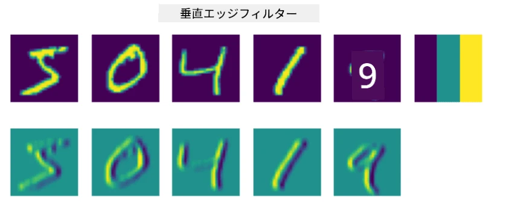
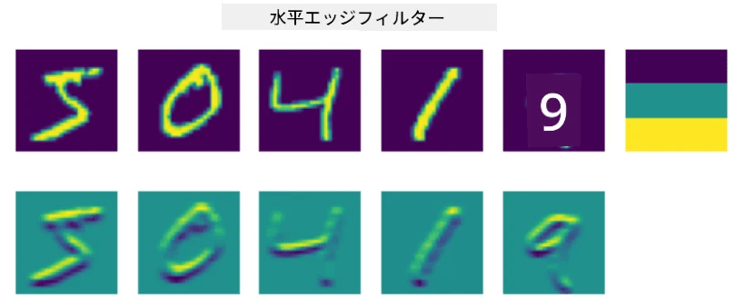
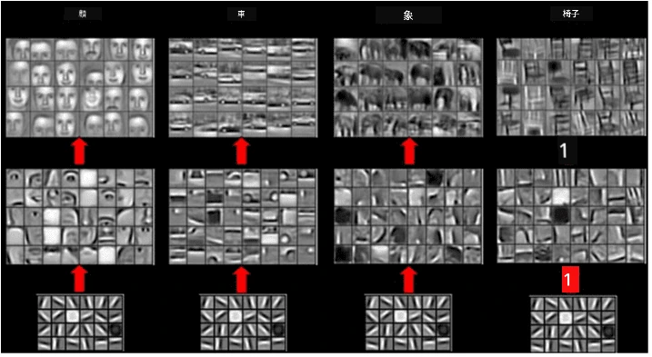

# 畳み込みニューラルネットワーク

以前、ニューラルネットワークが画像処理に非常に優れていることを学びました。一層のパーセプトロンでも、MNISTデータセットの手書き数字をかなりの精度で認識できることが分かっています。ただし、MNISTデータセットは特別なもので、すべての数字が画像の中心に配置されているため、タスクが簡単になっています。

## [講義前のクイズ](https://ff-quizzes.netlify.app/en/ai/quiz/13)

現実世界では、画像内の正確な位置に関係なく、写真の中の物体を認識できることが求められます。コンピュータビジョンは一般的な分類とは異なり、特定の物体を写真の中で探そうとする際には、特定の**パターン**やその組み合わせを探すことになります。例えば、猫を探す場合、まずはヒゲを形成する水平線を探し、その後ヒゲの特定の組み合わせが猫の写真であることを示すかもしれません。特定のパターンの相対的な位置や存在が重要であり、画像内の正確な位置は重要ではありません。

パターンを抽出するために、**畳み込みフィルター**という概念を使用します。ご存じの通り、画像は2D行列、または色深度を持つ3Dテンソルとして表されます。フィルターを適用するとは、比較的小さな**フィルターカーネル**行列を取り、元の画像の各ピクセルに対して隣接する点との加重平均を計算することを意味します。これは、小さな窓が画像全体をスライドし、フィルターカーネル行列の重みに従ってすべてのピクセルを平均化するようなものと考えることができます。

 | 
----|----

> Dmitry Soshnikovによる画像

例えば、MNISTの数字に3x3の垂直エッジフィルターと水平エッジフィルターを適用すると、元の画像の垂直および水平エッジがある場所でハイライト（例: 高い値）を得ることができます。このようにして、これら2つのフィルターを使用してエッジを「探す」ことができます。同様に、他の低レベルのパターンを探すためのフィルターを設計することも可能です。

> [Leung-Malikフィルターバンク](https://www.robots.ox.ac.uk/~vgg/research/texclass/filters.html)の画像

ただし、特定のパターンを抽出するためのフィルターを手動で設計することもできますが、ネットワークを設計してパターンを自動的に学習するようにすることも可能です。これがCNNの背後にある主要なアイデアの1つです。

## CNNの主要なアイデア

CNNが機能する仕組みは、以下の重要なアイデアに基づいています：

* 畳み込みフィルターはパターンを抽出できる
* フィルターが自動的に学習されるようにネットワークを設計できる
* 元の画像だけでなく、高レベルの特徴におけるパターンを見つけるためにも同じアプローチを使用できる。そのため、CNNの特徴抽出は低レベルのピクセルの組み合わせから始まり、画像の部分の高レベルの組み合わせに至るまで、特徴の階層で機能する。

> Hislop-Lynchによる論文からの画像 [研究に基づく](https://dl.acm.org/doi/abs/10.1145/1553374.1553453)

## ✍️ 演習: 畳み込みニューラルネットワーク

畳み込みニューラルネットワークがどのように機能するか、またトレーニング可能なフィルターをどのように実現できるかを探求するために、対応するノートブックを使って学習を続けましょう：

* [畳み込みニューラルネットワーク - PyTorch](ConvNetsPyTorch.ipynb)
* [畳み込みニューラルネットワーク - TensorFlow](ConvNetsTF.ipynb)

## ピラミッドアーキテクチャ

画像処理に使用されるほとんどのCNNは、いわゆるピラミッドアーキテクチャに従います。元の画像に適用される最初の畳み込み層は、通常、比較的少ない数のフィルター（8～16）を持ち、水平/垂直の線やストロークなどの異なるピクセルの組み合わせに対応します。次のレベルでは、ネットワークの空間的次元を縮小し、フィルターの数を増やします。これにより、単純な特徴のより多くの組み合わせが可能になります。各層で、最終的な分類器に向かうにつれて、画像の空間的次元は減少し、フィルターの数は増加します。

例として、2014年にImageNetのトップ5分類で92.7%の精度を達成したVGG-16のアーキテクチャを見てみましょう：

> [Researchgate](https://www.researchgate.net/figure/Vgg16-model-structure-To-get-the-VGG-NIN-model-we-replace-the-2-nd-4-th-6-th-7-th_fig2_335194493)からの画像

## よく知られたCNNアーキテクチャ

[よく知られたCNNアーキテクチャについての学習を続ける](CNN_Architectures.md)

---

