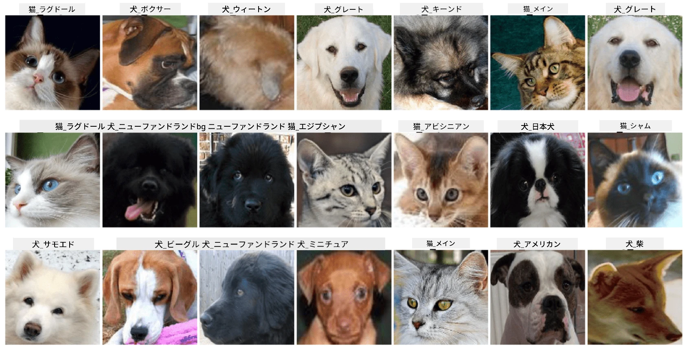

# ペットの顔の分類

[AI for Beginners Curriculum](https://github.com/microsoft/ai-for-beginners) のラボ課題。

## 課題

ペットの託児所用のアプリケーションを開発し、すべてのペットをカタログ化する必要があると想像してください。このアプリケーションの素晴らしい機能の1つは、写真から自動的に品種を特定することです。これはニューラルネットワークを使用して成功裏に実現できます。

**Pet Faces** データセットを使用して、猫と犬の異なる品種を分類する畳み込みニューラルネットワークをトレーニングする必要があります。

## データセット

[Oxford-IIIT Pet Dataset](https://www.robots.ox.ac.uk/~vgg/data/pets/) を使用します。このデータセットには、37種類の犬と猫の品種の画像が含まれています。



データセットをダウンロードするには、以下のコードスニペットを使用してください：

```python
!wget https://thor.robots.ox.ac.uk/~vgg/data/pets/images.tar.gz
!tar xfz images.tar.gz
!rm images.tar.gz
```

**注:** Oxford-IIIT Pet Dataset の画像はファイル名（例: `Abyssinian_1.jpg`, `Bengal_2.jpg`）で整理されています。ノートブックには、これらの画像を品種別のサブディレクトリに整理するコードが含まれており、分類が容易になります。

## ノートブックの開始

[PetFaces.ipynb](PetFaces.ipynb) を開いてラボを開始してください。

## 学びのポイント

画像分類という比較的複雑な問題をゼロから解決しました！クラス数がかなり多かったにもかかわらず、合理的な精度を達成することができました。また、top-k 精度を測定することも理にかなっています。なぜなら、人間でも明確に区別できないクラスがいくつかあり、それらを混同するのは簡単だからです。

---

**免責事項**:  
この文書は、AI翻訳サービス [Co-op Translator](https://github.com/Azure/co-op-translator) を使用して翻訳されています。正確性を追求しておりますが、自動翻訳には誤りや不正確な部分が含まれる可能性があります。元の言語で記載された文書を正式な情報源としてお考えください。重要な情報については、専門の人間による翻訳を推奨します。この翻訳の使用に起因する誤解や誤解について、当社は責任を負いません。