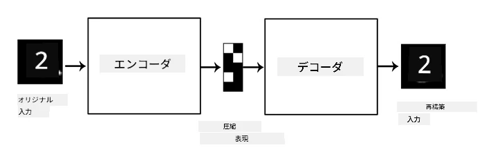
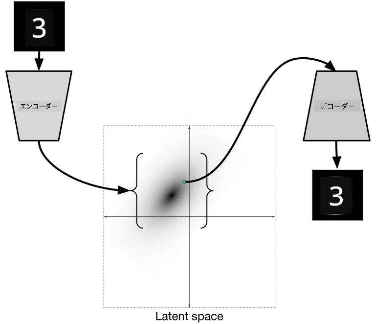

# オートエンコーダー

CNNをトレーニングする際の問題の一つは、多くのラベル付きデータが必要になることです。画像分類の場合、画像を異なるクラスに分ける必要があり、これは手作業で行う必要があります。

## [事前クイズ](https://ff-quizzes.netlify.app/en/ai/quiz/17)

しかし、CNNの特徴抽出器をトレーニングするために、生の（ラベルなしの）データを使用したい場合があります。これを**自己教師あり学習**と呼びます。この場合、ラベルの代わりに、トレーニング画像をネットワークの入力と出力の両方として使用します。**オートエンコーダー**の主なアイデアは、入力画像を**潜在空間**（通常は小さなサイズのベクトル）に変換する**エンコーダーネットワーク**と、元の画像を再構築することを目的とする**デコーダーネットワーク**を持つことです。

> ✅ [オートエンコーダー](https://wikipedia.org/wiki/Autoencoder)は、「ラベルなしデータの効率的なコーディングを学習するための人工ニューラルネットワークの一種」です。

オートエンコーダーをトレーニングして、元の画像から可能な限り多くの情報をキャプチャし、正確に再構築するため、ネットワークは入力画像の意味を捉える最適な**埋め込み**を見つけようとします。

> 画像は[Kerasブログ](https://blog.keras.io/building-autoencoders-in-keras.html)より

## オートエンコーダーの使用シナリオ

元の画像を再構築すること自体は一見役に立たないように思えますが、オートエンコーダーが特に有用なシナリオがいくつかあります：

* **画像の次元削減**や**画像埋め込みのトレーニング**。通常、オートエンコーダーはPCAよりも良い結果をもたらします。なぜなら、画像の空間的な性質や階層的な特徴を考慮するからです。
* **ノイズ除去**、つまり画像からノイズを取り除くこと。ノイズは多くの無駄な情報を含むため、オートエンコーダーはそれを比較的小さな潜在空間に収めることができず、結果として画像の重要な部分だけをキャプチャします。ノイズ除去器をトレーニングする際は、元の画像を使用し、人工的にノイズを加えた画像をオートエンコーダーの入力として使用します。
* **超解像**、画像の解像度を上げること。高解像度の画像を使用し、低解像度の画像をオートエンコーダーの入力として使用します。
* **生成モデル**。オートエンコーダーをトレーニングした後、デコーダー部分を使用してランダムな潜在ベクトルから新しいオブジェクトを生成できます。

## 変分オートエンコーダー（VAE）

従来のオートエンコーダーは、入力データの次元を何らかの形で削減し、入力画像の重要な特徴を見つけ出します。しかし、潜在ベクトルはあまり意味を持たないことが多いです。例えば、MNISTデータセットを例にとると、異なる潜在ベクトルがどの数字に対応するかを理解するのは簡単ではありません。なぜなら、近い潜在ベクトルが必ずしも同じ数字に対応するとは限らないからです。

一方で、*生成*モデルをトレーニングするには、潜在空間をある程度理解できる方が良いです。このアイデアが**変分オートエンコーダー**（VAE）につながります。

VAEは、潜在パラメータの*統計分布*、いわゆる**潜在分布**を予測することを学習するオートエンコーダーです。例えば、潜在ベクトルが平均zmeanと標準偏差zsigmaを持つ正規分布に従うようにしたい場合があります（平均と標準偏差はそれぞれ次元dのベクトルです）。VAEのエンコーダーはこれらのパラメータを予測し、デコーダーはこの分布からランダムなベクトルを取り出してオブジェクトを再構築します。

まとめると：

 * 入力ベクトルから、`z_mean`と`z_log_sigma`を予測します（標準偏差そのものではなく、その対数を予測します）。
 * 分布N(zmean,exp(zlog_sigma))からベクトル`sample`をサンプリングします。
 * デコーダーは`sample`を入力ベクトルとして使用し、元の画像をデコードしようとします。

 

> 画像は[Isaak Dykemanのブログ記事](https://ijdykeman.github.io/ml/2016/12/21/cvae.html)より

変分オートエンコーダーは、以下の2つの部分からなる複雑な損失関数を使用します：

* **再構築損失**：再構築された画像がターゲットにどれだけ近いかを示す損失関数（平均二乗誤差、MSEなど）。通常のオートエンコーダーと同じ損失関数です。
* **KL損失**：潜在変数の分布が正規分布に近い状態を保つことを保証します。[カルバック・ライブラー発散](https://www.countbayesie.com/blog/2017/5/9/kullback-leibler-divergence-explained)という2つの統計分布の類似性を推定する指標に基づいています。

VAEの重要な利点の一つは、潜在ベクトルをサンプリングする分布が分かっているため、新しい画像を比較的簡単に生成できることです。例えば、2次元の潜在ベクトルを持つVAEをMNISTでトレーニングした場合、潜在ベクトルの成分を変化させることで異なる数字を得ることができます：

> 画像は[Dmitry Soshnikov](http://soshnikov.com)より

潜在パラメータ空間の異なる部分から潜在ベクトルを取得するにつれて、画像がどのように互いにブレンドされるかを観察できます。この空間を2次元で視覚化することも可能です：

 

> 画像は[Dmitry Soshnikov](http://soshnikov.com)より

## ✍️ 演習：オートエンコーダー

以下のノートブックでオートエンコーダーについてさらに学びましょう：

* [TensorFlowでのオートエンコーダー](AutoencodersTF.ipynb)
* [PyTorchでのオートエンコーダー](AutoEncodersPyTorch.ipynb)

## オートエンコーダーの特性

* **データ特化型** - トレーニングした画像の種類にのみうまく機能します。例えば、花の超解像ネットワークをトレーニングした場合、ポートレートにはうまく機能しません。これは、ネットワークがトレーニングデータセットから学習した特徴を使用して細部を補完するためです。
* **損失あり** - 再構築された画像は元の画像と同じではありません。損失の性質は、トレーニング中に使用される*損失関数*によって定義されます。
* **ラベルなしデータ**で動作

## [事後クイズ](https://ff-quizzes.netlify.app/en/ai/quiz/18)

## 結論

このレッスンでは、AI研究者が利用できるさまざまな種類のオートエンコーダーについて学びました。それらを構築する方法や、画像を再構築するための使用方法についても学びました。また、VAEについて学び、それを使用して新しい画像を生成する方法も学びました。

## 🚀 チャレンジ

このレッスンでは、画像にオートエンコーダーを使用する方法を学びましたが、音楽にも使用できます！Magentaプロジェクトの[MusicVAE](https://magenta.tensorflow.org/music-vae)プロジェクトをチェックしてみてください。このプロジェクトでは、オートエンコーダーを使用して音楽を再構築する方法を学びます。このライブラリを使って[実験](https://colab.research.google.com/github/magenta/magenta-demos/blob/master/colab-notebooks/Multitrack_MusicVAE.ipynb)を行い、どのようなものが作れるか試してみてください。

## [事後クイズ](https://ff-quizzes.netlify.app/en/ai/quiz/16)

## 復習と自己学習

参考として、以下のリソースでオートエンコーダーについてさらに学んでください：

* [Kerasでオートエンコーダーを構築する](https://blog.keras.io/building-autoencoders-in-keras.html)
* [NeuroHiveのブログ記事](https://neurohive.io/ru/osnovy-data-science/variacionnyj-avtojenkoder-vae/)
* [変分オートエンコーダーの解説](https://kvfrans.com/variational-autoencoders-explained/)
* [条件付き変分オートエンコーダー](https://ijdykeman.github.io/ml/2016/12/21/cvae.html)

## 課題

[TensorFlowを使用したこのノートブック](AutoencodersTF.ipynb)の最後に「タスク」があります。これを課題として取り組んでください。

---

