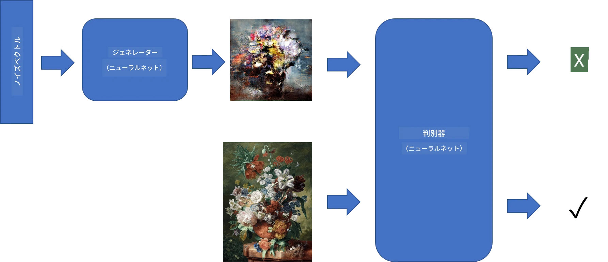
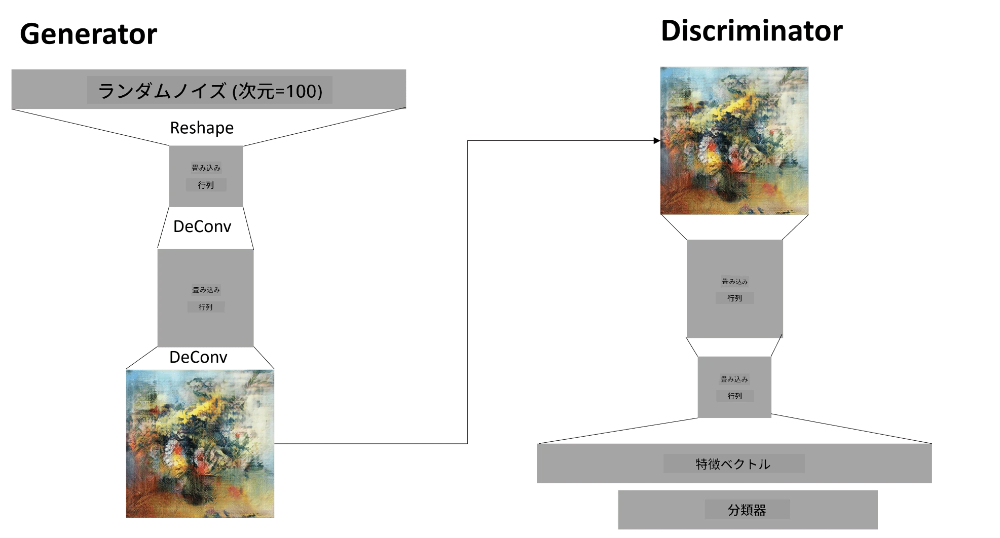

# 生成的敵対的ネットワーク（Generative Adversarial Networks）

前のセクションでは、**生成モデル**について学びました。これらのモデルは、トレーニングデータセットに似た新しい画像を生成することができます。VAEは生成モデルの良い例でした。

## [事前クイズ](https://ff-quizzes.netlify.app/en/ai/quiz/19)

しかし、VAEを使って合理的な解像度の絵画のような本当に意味のあるものを生成しようとすると、トレーニングがうまく収束しないことがわかります。このような用途には、生成モデルに特化した別のアーキテクチャを学ぶ必要があります。それが**生成的敵対的ネットワーク（Generative Adversarial Networks, GANs）**です。

GANの主なアイデアは、2つのニューラルネットワークを互いに競わせながらトレーニングすることです。

> 画像提供: [Dmitry Soshnikov](http://soshnikov.com)

> ✅ 用語の簡単な説明:
> * **Generator**: ランダムなベクトルを入力として受け取り、結果として画像を生成するネットワーク
> * **Discriminator**: 画像を入力として受け取り、それがトレーニングデータセットからの実際の画像か、Generatorによって生成された画像かを判定するネットワーク。基本的には画像分類器です。

### Discriminator

Discriminatorのアーキテクチャは、通常の画像分類ネットワークとほとんど変わりません。最も簡単な場合、完全結合型の分類器として設計できますが、通常は[畳み込みネットワーク](../07-ConvNets/README.md)になることが多いです。

> ✅ 畳み込みネットワークに基づくGANは、[DCGAN](https://arxiv.org/pdf/1511.06434.pdf)と呼ばれます。

CNN Discriminatorは以下の層で構成されます: 複数の畳み込み+プーリング層（空間サイズを縮小）と、1つ以上の完全結合層で「特徴ベクトル」を取得し、最終的に2値分類器を構築します。

> ✅ この文脈での「プーリング」は画像のサイズを縮小する技術です。「プーリング層は、ある層のニューロンクラスターの出力を次の層の単一ニューロンに結合することでデータの次元を削減します。」 - [出典](https://wikipedia.org/wiki/Convolutional_neural_network#Pooling_layers)

### Generator

Generatorは少し複雑です。Discriminatorを逆にしたものと考えることができます。特徴ベクトルの代わりに潜在ベクトルから始まり、必要なサイズ/形状に変換する完全結合層を持ち、その後に逆畳み込み+アップスケーリングを行います。これは[オートエンコーダ](../09-Autoencoders/README.md)の*デコーダ*部分に似ています。

> ✅ 畳み込み層が画像を横断する線形フィルターとして実装されるため、逆畳み込みは本質的に畳み込みと似ており、同じ層ロジックを使用して実装できます。

> 画像提供: [Dmitry Soshnikov](http://soshnikov.com)

### GANのトレーニング

GANは**敵対的**と呼ばれるのは、GeneratorとDiscriminatorの間で絶えず競争が行われるためです。この競争の中で、GeneratorとDiscriminatorの両方が改善され、ネットワークはより良い画像を生成する方法を学びます。

トレーニングは以下の2つのステージで行われます:

* **Discriminatorのトレーニング**: このタスクは比較的簡単です。Generatorによって生成された画像のバッチを取得し、それらに「偽画像」を意味するラベル0を付けます。そして、入力データセットから画像のバッチを取得し（ラベル1、実画像）、*Discriminator損失*を計算してバックプロパゲーションを行います。
* **Generatorのトレーニング**: これは少し複雑です。Generatorの期待される出力を直接知ることはできません。GeneratorとDiscriminatorを組み合わせたGANネットワーク全体を使用し、ランダムベクトルを入力として与え、結果が1（実画像に対応）になることを期待します。このステップではDiscriminatorのパラメータを固定し（このステップでトレーニングしたくないため）、バックプロパゲーションを行います。

このプロセスでは、GeneratorとDiscriminatorの損失が大幅に減少することはありません。理想的な状況では、両方のネットワークが性能を向上させることに対応して損失が振動するはずです。

## ✍️ 演習: GANs

* [TensorFlow/KerasによるGANノートブック](GANTF.ipynb)
* [PyTorchによるGANノートブック](GANPyTorch.ipynb)

### GANトレーニングの課題

GANは特にトレーニングが難しいことで知られています。以下はそのいくつかの課題です:

* **モード崩壊**: GeneratorがDiscriminatorを欺く1つの成功した画像を生成することを学び、多様な画像を生成しなくなる現象。
* **ハイパーパラメータへの感度**: GANが全く収束しない場合があり、学習率を突然減少させることで収束することがあります。
* GeneratorとDiscriminatorの**バランスを保つ**: 多くの場合、Discriminatorの損失が比較的早くゼロに近づき、Generatorがさらにトレーニングできなくなることがあります。これを克服するために、GeneratorとDiscriminatorに異なる学習率を設定したり、損失がすでに低い場合はDiscriminatorのトレーニングをスキップすることができます。
* **高解像度のトレーニング**: オートエンコーダと同様の問題で、畳み込みネットワークの層を再構築する際にアーティファクトが発生します。この問題は、いわゆる**段階的成長**によって解決されることが多いです。最初は低解像度画像で数層をトレーニングし、その後層を「解除」または追加します。別の解決策として、層間に追加の接続を追加し、複数の解像度を同時にトレーニングする方法があります。詳細はこの[Multi-Scale Gradient GANs論文](https://arxiv.org/abs/1903.06048)を参照してください。

## スタイル転送

GANは芸術的な画像を生成する素晴らしい方法です。もう1つ興味深い技術は、**スタイル転送**と呼ばれるもので、1つの**コンテンツ画像**を別のスタイルで再描画し、**スタイル画像**のフィルターを適用します。

その仕組みは以下の通りです:
* ランダムなノイズ画像（またはコンテンツ画像）から開始しますが、理解を簡単にするためにランダムノイズから始める方が良いです。
* 目標は、コンテンツ画像とスタイル画像の両方に近い画像を作成することです。これは2つの損失関数によって決定されます:
   - **コンテンツ損失**: 現在の画像とコンテンツ画像からCNNのいくつかの層で抽出された特徴に基づいて計算されます。
   - **スタイル損失**: 現在の画像とスタイル画像の間で、Gram行列を使用して巧妙に計算されます（詳細は[例のノートブック](StyleTransfer.ipynb)を参照）。
* 画像を滑らかにし、ノイズを除去するために、**変動損失**も導入します。これは隣接するピクセル間の平均距離を計算します。
* 主な最適化ループは、勾配降下法（または他の最適化アルゴリズム）を使用して現在の画像を調整し、すべての損失の加重合計を最小化します。

## ✍️ 例: [スタイル転送](StyleTransfer.ipynb)

## [事後クイズ](https://ff-quizzes.netlify.app/en/ai/quiz/20)

## 結論

このレッスンでは、GANとそのトレーニング方法について学びました。また、このタイプのニューラルネットワークが直面する特別な課題と、それを克服するためのいくつかの戦略についても学びました。

## 🚀 チャレンジ

[スタイル転送ノートブック](StyleTransfer.ipynb)を使用して、自分の画像で試してみましょう。

## 復習と自己学習

参考として、以下のリソースでGANについてさらに学んでください:

* Marco Pasini, [1年間GANをトレーニングして学んだ10の教訓](https://towardsdatascience.com/10-lessons-i-learned-training-generative-adversarial-networks-gans-for-a-year-c9071159628)
* [StyleGAN](https://en.wikipedia.org/wiki/StyleGAN): 検討すべきGANアーキテクチャのデファクトスタンダード
* [Azure MLでGANを使用して生成的アートを作成する](https://soshnikov.com/scienceart/creating-generative-art-using-gan-on-azureml/)

## 課題

このレッスンに関連する2つのノートブックのいずれかを再訪し、自分の画像でGANを再トレーニングしてください。何が作れるでしょうか？

---

