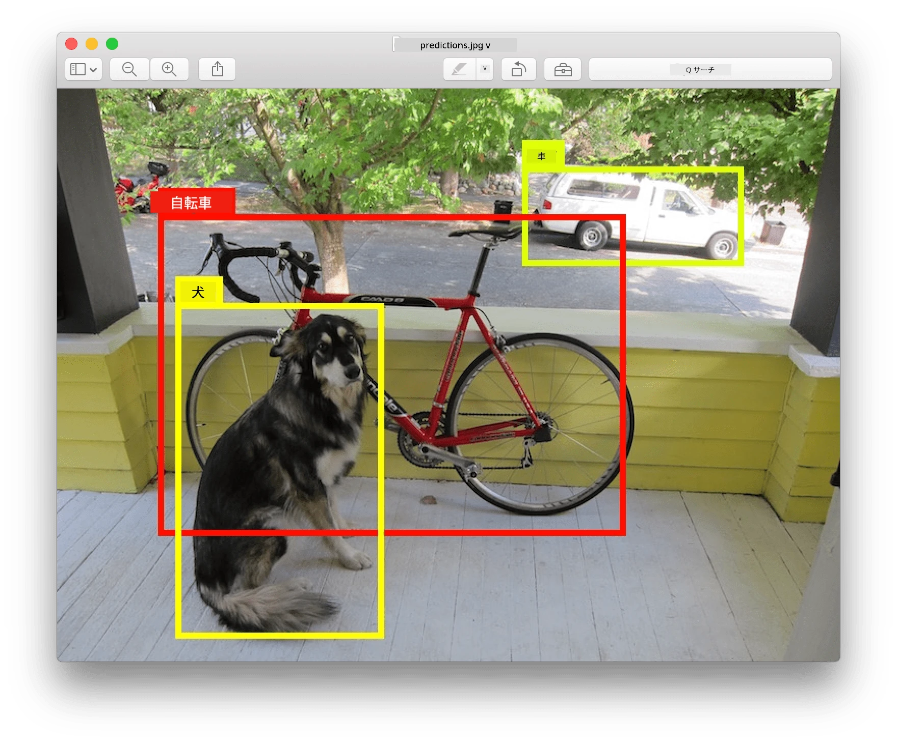
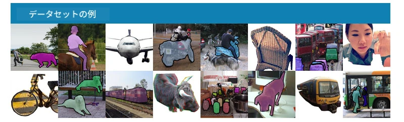
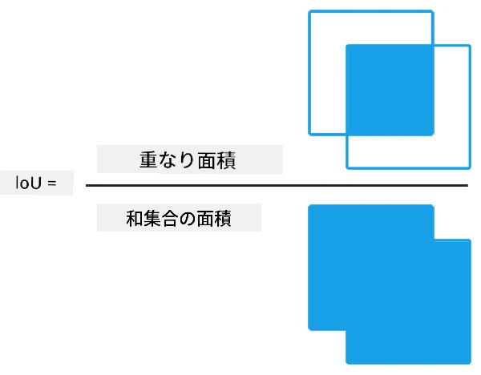
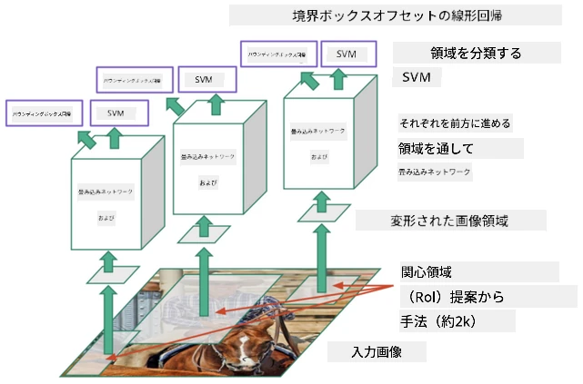
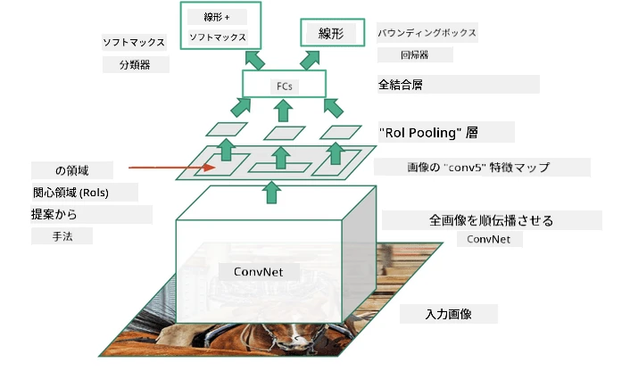
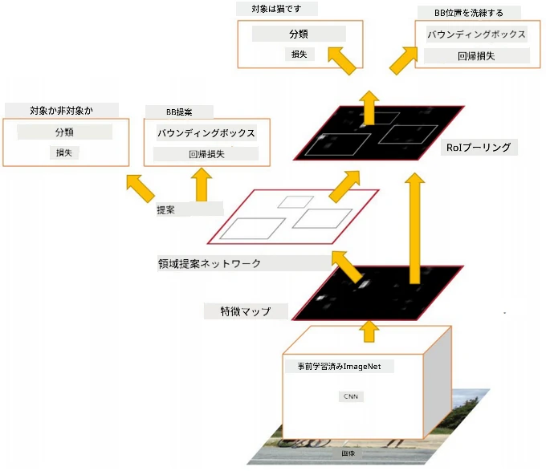
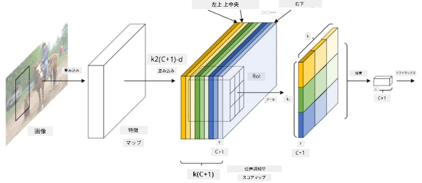
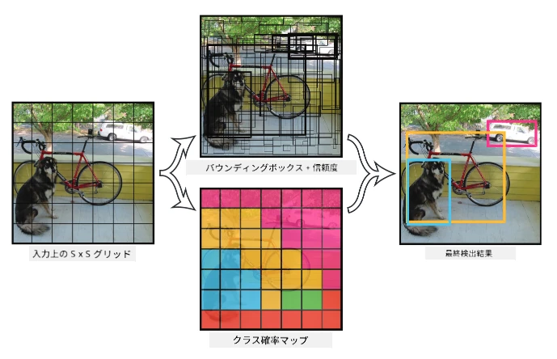

# オブジェクト検出

これまで扱ってきた画像分類モデルは、画像を入力として受け取り、MNIST問題の「数字」クラスのようなカテゴリカルな結果を出力していました。しかし、多くの場合、画像に物体が写っていることを知るだけでなく、その正確な位置を特定したいと考えます。それがまさに**オブジェクト検出**の目的です。

## [事前クイズ](https://ff-quizzes.netlify.app/en/ai/quiz/21)

> 画像出典: [YOLO v2 ウェブサイト](https://pjreddie.com/darknet/yolov2/)

## オブジェクト検出の単純なアプローチ

例えば、画像内の猫を見つけたいと仮定します。非常に単純なオブジェクト検出のアプローチは以下のようになります：

1. 画像を複数のタイルに分割する
2. 各タイルに対して画像分類を実行する
3. 十分に高い活性化を示したタイルを、対象の物体を含むとみなす

> *画像出典: [演習ノートブック](ObjectDetection-TF.ipynb)*

しかし、この方法では物体の境界ボックスを非常に不正確にしか特定できません。より正確な位置を特定するには、**回帰**を使用して境界ボックスの座標を予測する必要があります。そのためには特定のデータセットが必要です。

## オブジェクト検出のための回帰

[このブログ記事](https://towardsdatascience.com/object-detection-with-neural-networks-a4e2c46b4491)では、形状検出についての優しい導入が紹介されています。

## オブジェクト検出用データセット

以下のようなデータセットに出会うことがあるかもしれません：

* [PASCAL VOC](http://host.robots.ox.ac.uk/pascal/VOC/) - 20クラス
* [COCO](http://cocodataset.org/#home) - コンテキスト内の一般的な物体。80クラス、境界ボックスとセグメンテーションマスクを含む

## オブジェクト検出の評価指標

### Intersection over Union (IoU)

画像分類ではアルゴリズムの性能を測定するのは簡単ですが、オブジェクト検出ではクラスの正確性だけでなく、推定された境界ボックスの位置の精度も測定する必要があります。そのために使用されるのが**Intersection over Union** (IoU)です。これは、2つのボックス（または任意の領域）がどれだけ重なっているかを測定します。

> *図2 出典: [IoUに関する優れたブログ記事](https://pyimagesearch.com/2016/11/07/intersection-over-union-iou-for-object-detection/)*

アイデアはシンプルです。2つの図形の交差部分の面積を、それらの結合部分の面積で割ります。2つの領域が完全に一致している場合、IoUは1になります。一方、完全に分離している場合は0になります。それ以外の場合は0から1の間で変動します。通常、IoUが一定値以上の境界ボックスのみを考慮します。

### 平均精度 (Average Precision)

特定のクラスの物体 $C$ がどれだけ正確に認識されるかを測定したいとします。そのために**平均精度** (Average Precision) 指標を使用します。計算方法は以下の通りです：

1. 精度-再現率曲線を考慮し、検出閾値（0から1まで）に応じた精度を示します。
2. 閾値に応じて、画像内で検出される物体の数や精度・再現率の値が変わります。
3. 曲線は以下のようになります：

> *画像出典: [NeuroWorkshop](http://github.com/shwars/NeuroWorkshop)*

特定のクラス $C$ の平均精度は、この曲線の下の面積です。具体的には、再現率軸を通常10分割し、精度をそれぞれの点で平均化します：

$$
AP = {1\over11}\sum_{i=0}^{10}\mbox{Precision}(\mbox{Recall}={i\over10})
$$

### APとIoU

IoUが一定値以上の検出のみを考慮します。例えば、PASCAL VOCデータセットでは通常$\mbox{IoU Threshold} = 0.5$が使用されます。一方、COCOでは異なる$\mbox{IoU Threshold}$値でAPが測定されます。

> *画像出典: [NeuroWorkshop](http://github.com/shwars/NeuroWorkshop)*

### 平均平均精度 - mAP

オブジェクト検出の主な評価指標は**平均平均精度** (Mean Average Precision, mAP) と呼ばれます。これは、すべての物体クラスにわたる平均精度の値であり、場合によっては$\mbox{IoU Threshold}$も含めて平均化されます。**mAP**の計算プロセスについては、[このブログ記事](https://medium.com/@timothycarlen/understanding-the-map-evaluation-metric-for-object-detection-a07fe6962cf3)や[コードサンプル付きの説明](https://gist.github.com/tarlen5/008809c3decf19313de216b9208f3734)で詳しく解説されています。

## オブジェクト検出の異なるアプローチ

オブジェクト検出アルゴリズムには大きく分けて2つの種類があります：

* **領域提案ネットワーク** (Region Proposal Networks) (R-CNN, Fast R-CNN, Faster R-CNN)。主なアイデアは、**関心領域** (ROI) を生成し、それに対してCNNを実行して最大活性化を探すことです。この方法は単純なアプローチに似ていますが、ROIがより賢く生成される点が異なります。この方法の主な欠点は、画像に対してCNN分類器を何度も実行する必要があるため、速度が遅いことです。
* **ワンパス** (YOLO, SSD, RetinaNet) メソッド。これらのアーキテクチャでは、クラスとROIを一度のパスで予測するようにネットワークを設計します。

### R-CNN: 領域ベースのCNN

[R-CNN](http://islab.ulsan.ac.kr/files/announcement/513/rcnn_pami.pdf)は、[Selective Search](http://www.huppelen.nl/publications/selectiveSearchDraft.pdf) を使用してROI領域の階層構造を生成します。それらはCNN特徴抽出器とSVM分類器を通じて物体クラスを決定し、線形回帰を使用して*境界ボックス*の座標を決定します。[公式論文](https://arxiv.org/pdf/1506.01497v1.pdf)

> *画像出典: van de Sande et al. ICCV’11*

> *画像出典: [このブログ](https://towardsdatascience.com/r-cnn-fast-r-cnn-faster-r-cnn-yolo-object-detection-algorithms-36d53571365e)*

### F-RCNN - Fast R-CNN

このアプローチはR-CNNに似ていますが、領域は畳み込み層が適用された後に定義されます。

> 画像出典: [公式論文](https://www.cv-foundation.org/openaccess/content_iccv_2015/papers/Girshick_Fast_R-CNN_ICCV_2015_paper.pdf), [arXiv](https://arxiv.org/pdf/1504.08083.pdf), 2015

### Faster R-CNN

このアプローチの主なアイデアは、ROIを予測するためにニューラルネットワークを使用することです。これを*領域提案ネットワーク* (Region Proposal Network) と呼びます。[論文](https://arxiv.org/pdf/1506.01497.pdf), 2016

> 画像出典: [公式論文](https://arxiv.org/pdf/1506.01497.pdf)

### R-FCN: 領域ベースの完全畳み込みネットワーク

このアルゴリズムはFaster R-CNNよりもさらに高速です。主なアイデアは以下の通りです：

1. ResNet-101を使用して特徴を抽出
1. 特徴は**位置感知スコアマップ**で処理されます。$C$クラスの各物体は$k\times k$領域に分割され、物体の部分を予測するように学習します。
1. $k\times k$領域の各部分について、すべてのネットワークが物体クラスに投票し、最大票を得た物体クラスが選択されます。

> 画像出典: [公式論文](https://arxiv.org/abs/1605.06409)

### YOLO - You Only Look Once

YOLOはリアルタイムのワンパスアルゴリズムです。主なアイデアは以下の通りです：

 * 画像を$S\times S$領域に分割
 * 各領域について、**CNN**が$n$個の可能な物体、*境界ボックス*の座標、*信頼度*=*確率* * IoUを予測

 

> 画像出典: [公式論文](https://arxiv.org/abs/1506.02640)

### その他のアルゴリズム

* RetinaNet: [公式論文](https://arxiv.org/abs/1708.02002)
   - [PyTorchのTorchvisionによる実装](https://pytorch.org/vision/stable/_modules/torchvision/models/detection/retinanet.html)
   - [Kerasによる実装](https://github.com/fizyr/keras-retinanet)
   - [Keras SamplesでのRetinaNetによるオブジェクト検出](https://keras.io/examples/vision/retinanet/)
* SSD (Single Shot Detector): [公式論文](https://arxiv.org/abs/1512.02325)

## ✍️ 演習: オブジェクト検出

以下のノートブックで学習を続けてください：

[ObjectDetection.ipynb](ObjectDetection.ipynb)

## 結論

このレッスンでは、オブジェクト検出を達成するさまざまな方法について一通り学びました！

## 🚀 チャレンジ

以下の記事やノートブックを読み、YOLOを試してみてください：

* [YOLOについての良いブログ記事](https://www.analyticsvidhya.com/blog/2018/12/practical-guide-object-detection-yolo-framewor-python/)
 * [公式サイト](https://pjreddie.com/darknet/yolo/)
 * Yolo: [Kerasによる実装](https://github.com/experiencor/keras-yolo2), [ステップバイステップノートブック](https://github.com/experiencor/basic-yolo-keras/blob/master/Yolo%20Step-by-Step.ipynb)
 * Yolo v2: [Kerasによる実装](https://github.com/experiencor/keras-yolo2), [ステップバイステップノートブック](https://github.com/experiencor/keras-yolo2/blob/master/Yolo%20Step-by-Step.ipynb)

## [事後クイズ](https://ff-quizzes.netlify.app/en/ai/quiz/22)

## 復習と自己学習

* [オブジェクト検出](https://tjmachinelearning.com/lectures/1718/obj/) by Nikhil Sardana
* [オブジェクト検出アルゴリズムの良い比較](https://lilianweng.github.io/lil-log/2018/12/27/object-detection-part-4.html)
* [オブジェクト検出のための深層学習アルゴリズムのレビュー](https://medium.com/comet-app/review-of-deep-learning-algorithms-for-object-detection-c1f3d437b852)
* [基本的なオブジェクト検出アルゴリズムへのステップバイステップの導入](https://www.analyticsvidhya.com/blog/2018/10/a-step-by-step-introduction-to-the-basic-object-detection-algorithms-part-1/)
* [PythonでのFaster R-CNNの実装によるオブジェクト検出](https://www.analyticsvidhya.com/blog/2018/11/implementation-faster-r-cnn-python-object-detection/)

## [課題: オブジェクト検出](lab/README.md)

---

