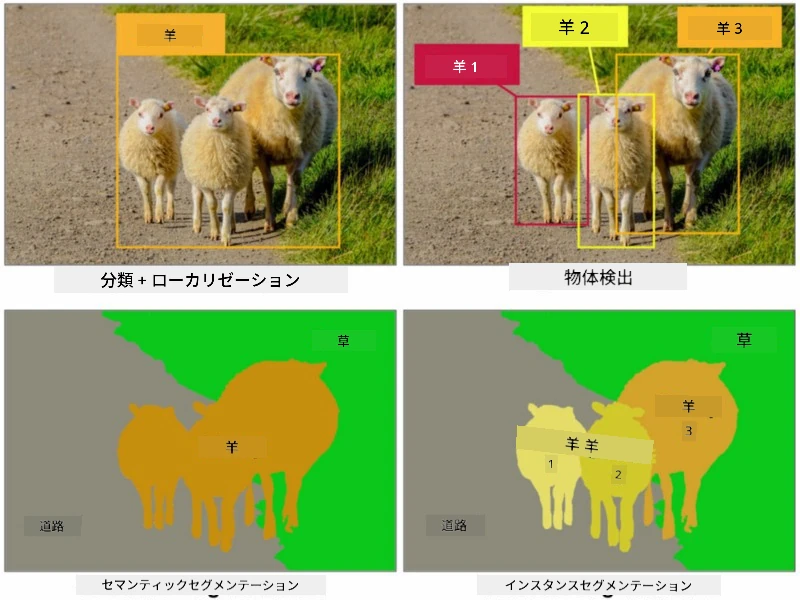
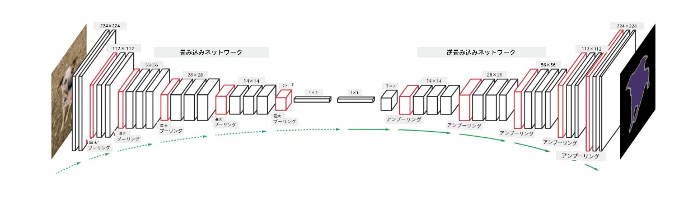

# セグメンテーション

以前、物体検出について学びました。これは、画像内の物体をその*バウンディングボックス*を予測することで特定する方法です。しかし、いくつかのタスクではバウンディングボックスだけでなく、より正確な物体の位置情報が必要です。このタスクは**セグメンテーション**と呼ばれます。

## [事前クイズ](https://ff-quizzes.netlify.app/en/ai/quiz/23)

セグメンテーションは**ピクセル分類**として見ることができます。画像の**各**ピクセルに対してそのクラスを予測する必要があります（*背景*もクラスの1つです）。セグメンテーションには主に2つのアルゴリズムがあります：

* **セマンティックセグメンテーション**はピクセルのクラスを示すだけで、同じクラスの異なる物体を区別しません。
* **インスタンスセグメンテーション**はクラスを異なるインスタンスに分割します。

例えば、インスタンスセグメンテーションではこれらの羊は異なる物体として扱われますが、セマンティックセグメンテーションではすべての羊が1つのクラスとして表されます。

> 画像出典：[このブログ記事](https://nirmalamurali.medium.com/image-classification-vs-semantic-segmentation-vs-instance-segmentation-625c33a08d50)

セグメンテーションにはさまざまなニューラルネットワークのアーキテクチャがありますが、それらはすべて同じ構造を持っています。ある意味では、以前学んだオートエンコーダに似ていますが、元の画像を分解するのではなく、**マスク**を分解することが目的です。そのため、セグメンテーションネットワークは以下の部分で構成されています：

* **エンコーダ**：入力画像から特徴を抽出します。
* **デコーダ**：その特徴を**マスク画像**に変換します。このマスク画像は元の画像と同じサイズで、クラス数に対応するチャンネル数を持っています。

> 画像出典：[この論文](https://arxiv.org/pdf/2001.05566.pdf)

特にセグメンテーションで使用される損失関数について言及する必要があります。従来のオートエンコーダを使用する場合、2つの画像間の類似性を測定する必要があり、平均二乗誤差（MSE）を使用できます。しかし、セグメンテーションでは、ターゲットマスク画像の各ピクセルがクラス番号（一つの次元に沿ってワンホットエンコードされたもの）を表すため、分類に特化した損失関数を使用する必要があります。具体的には、すべてのピクセルにわたって平均化されたクロスエントロピー損失を使用します。マスクがバイナリの場合は、**バイナリクロスエントロピー損失**（BCE）が使用されます。

> ✅ ワンホットエンコーディングは、クラスラベルをクラス数と同じ長さのベクトルにエンコードする方法です。[この記事](https://datagy.io/sklearn-one-hot-encode/)でこの技術について詳しく学んでください。

## 医療画像におけるセグメンテーション

このレッスンでは、ネットワークをトレーニングして医療画像上で人間のほくろ（ネビ）を認識する方法を学びます。画像ソースとして<a href="https://www.fc.up.pt/addi/ph2%20database.html">PH2データベース</a>を使用します。このデータセットには、典型的なネビ、非典型的なネビ、メラノーマの3つのクラスに属する200枚の画像が含まれています。すべての画像には、ネビを輪郭で示した対応する**マスク**も含まれています。

> ✅ この技術はこの種の医療画像に特に適していますが、他にどのような現実世界の応用が考えられるでしょうか？

> 画像出典：PH2データベース

私たちはモデルをトレーニングして、背景からネビをセグメントすることを目指します。

## ✍️ 演習：セマンティックセグメンテーション

以下のノートブックを開いて、さまざまなセマンティックセグメンテーションのアーキテクチャについて学び、それらを操作し、実際に動作する様子を確認してください。

* [セマンティックセグメンテーション Pytorch](SemanticSegmentationPytorch.ipynb)
* [セマンティックセグメンテーション TensorFlow](SemanticSegmentationTF.ipynb)

## [事後クイズ](https://ff-quizzes.netlify.app/en/ai/quiz/24)

## 結論

セグメンテーションは非常に強力な画像分類技術であり、バウンディングボックスを超えてピクセルレベルの分類を可能にします。この技術は医療画像をはじめとするさまざまな応用分野で使用されています。

## 🚀 チャレンジ

人体セグメンテーションは、人間の画像を使った一般的なタスクの1つにすぎません。他にも**骨格検出**や**ポーズ検出**などの重要なタスクがあります。[OpenPose](https://github.com/CMU-Perceptual-Computing-Lab/openpose)ライブラリを試して、ポーズ検出がどのように使用されるかを確認してください。

## 復習と自己学習

この[Wikipediaの記事](https://wikipedia.org/wiki/Image_segmentation)は、この技術のさまざまな応用についての良い概要を提供しています。インスタンスセグメンテーションやパノプティックセグメンテーションのサブドメインについてさらに学んでみてください。

## [課題](lab/README.md)

このラボでは、[Segmentation Full Body MADS Dataset](https://www.kaggle.com/datasets/tapakah68/segmentation-full-body-mads-dataset)を使用して**人体セグメンテーション**を試してみてください。

---

