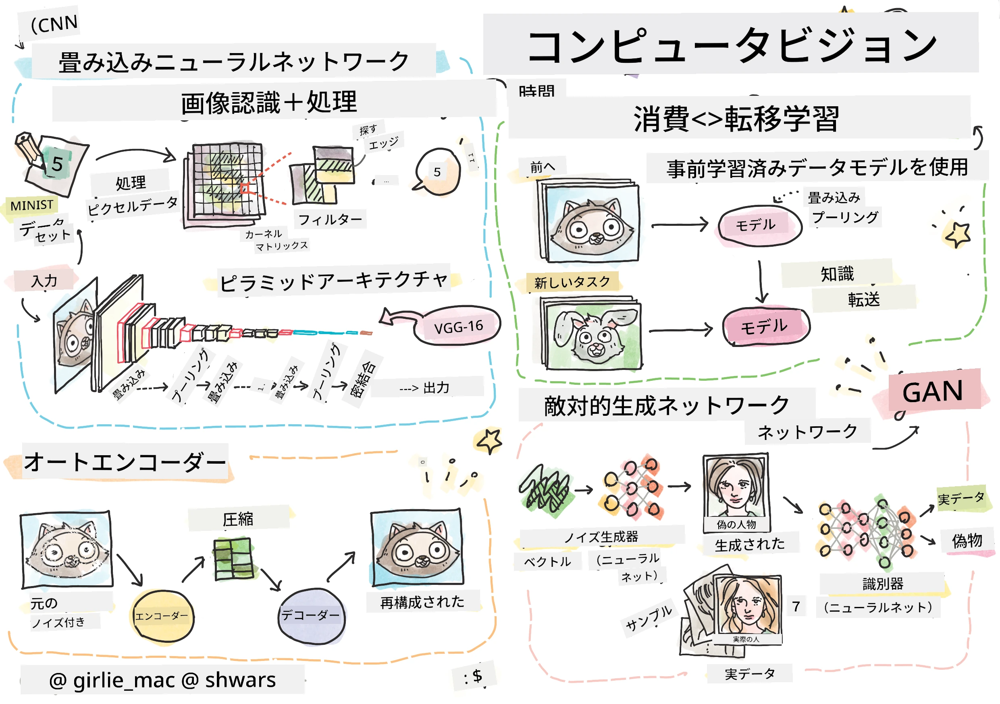

# コンピュータビジョン

このセクションでは以下について学びます:

* [コンピュータビジョンとOpenCVの概要](06-IntroCV/README.md)
* [畳み込みニューラルネットワーク](07-ConvNets/README.md)
* [事前学習済みネットワークと転移学習](08-TransferLearning/README.md) 
* [オートエンコーダー](09-Autoencoders/README.md)
* [生成的敵対ネットワーク](10-GANs/README.md)
* [物体検出](11-ObjectDetection/README.md)
* [セマンティックセグメンテーション](12-Segmentation/README.md)

**免責事項**:  
この文書は、AI翻訳サービス [Co-op Translator](https://github.com/Azure/co-op-translator) を使用して翻訳されています。正確性を追求しておりますが、自動翻訳には誤りや不正確な部分が含まれる可能性があることをご承知ください。元の言語で記載された文書が正式な情報源とみなされるべきです。重要な情報については、専門の人間による翻訳を推奨します。この翻訳の使用に起因する誤解や誤解釈について、当方は責任を負いません。