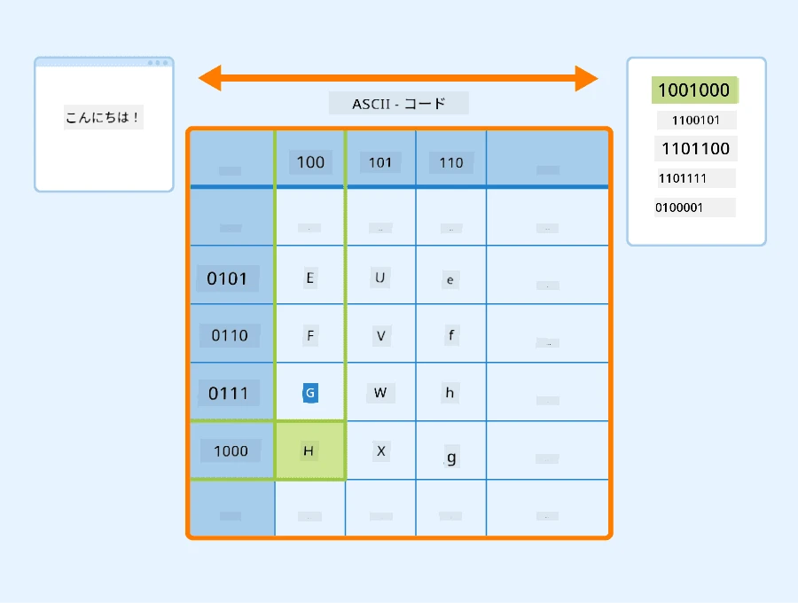
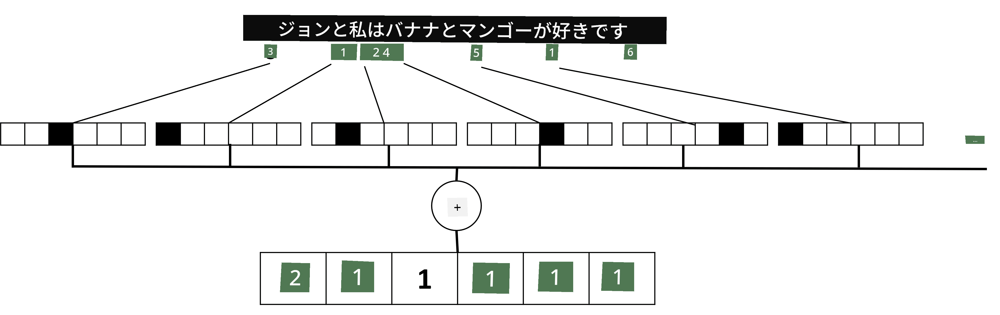

# テキストをテンソルとして表現する

## [講義前のクイズ](https://ff-quizzes.netlify.app/en/ai/quiz/25)

## テキスト分類

このセクションの前半では、**テキスト分類**タスクに焦点を当てます。[AG News](https://www.kaggle.com/amananandrai/ag-news-classification-dataset) データセットを使用します。このデータセットには以下のようなニュース記事が含まれています：

* カテゴリ: Sci/Tech
* タイトル: Ky. Company Wins Grant to Study Peptides (AP)
* 本文: AP - ルイビル大学の化学研究者によって設立された企業が、ペプチドの研究開発のための助成金を獲得しました...

私たちの目標は、テキストに基づいてニュース項目をカテゴリのいずれかに分類することです。

## テキストの表現

ニューラルネットワークを使用して自然言語処理 (NLP) タスクを解決するには、テキストをテンソルとして表現する方法が必要です。コンピュータはすでにASCIIやUTF-8などのエンコーディングを使用して、画面上のフォントにマッピングされる数字として文字を表現しています。

> [画像の出典](https://www.seobility.net/en/wiki/ASCII)

人間は各文字が**何を表しているか**を理解し、すべての文字がどのように組み合わさって文の単語を形成するかを理解します。しかし、コンピュータ自体はそのような理解を持っておらず、ニューラルネットワークはトレーニング中にその意味を学習する必要があります。

したがって、テキストを表現する際には以下のような異なるアプローチを使用できます：

* **文字レベルの表現**：テキストを各文字を数字として扱うことで表現します。テキストコーパスに*C*種類の異なる文字がある場合、単語*Hello*は5x*C*のテンソルで表されます。各文字はワンホットエンコーディングでテンソルの列に対応します。
* **単語レベルの表現**：テキスト内のすべての単語の**語彙**を作成し、ワンホットエンコーディングを使用して単語を表現します。このアプローチは文字単体ではあまり意味を持たないため、より高次の意味概念である単語を使用することでニューラルネットワークのタスクを簡略化します。ただし、大きな辞書サイズにより高次元のスパーステンソルを扱う必要があります。

どの表現を使用する場合でも、まずテキストを**トークン**のシーケンスに変換する必要があります。トークンは文字、単語、または単語の一部である場合があります。その後、通常は**語彙**を使用してトークンを数字に変換し、この数字をワンホットエンコーディングを使用してニューラルネットワークに入力します。

## N-Grams

自然言語では、単語の正確な意味は文脈によってのみ決定されます。例えば、*neural network*と*fishing network*の意味は完全に異なります。この点を考慮する方法の一つは、単語のペアをモデルに組み込み、単語ペアを別々の語彙トークンとして扱うことです。この方法では、文*I like to go fishing*は以下のトークンのシーケンスで表されます：*I like*、*like to*、*to go*、*go fishing*。このアプローチの問題は、辞書サイズが大幅に増加し、*go fishing*と*go shopping*のような組み合わせが異なるトークンで表されることです。同じ動詞を使用しているにもかかわらず、これらのトークンは意味的な類似性を共有しません。

場合によっては、三語の組み合わせであるトライグラムを使用することも検討できます。このようなアプローチは一般的に**n-grams**と呼ばれます。また、文字レベルの表現でn-gramsを使用することも理にかなっており、この場合n-gramsは異なる音節に大まかに対応します。

## Bag-of-WordsとTF/IDF

テキスト分類のようなタスクを解決する際には、固定サイズのベクトルでテキストを表現する必要があります。このベクトルを最終的な密な分類器への入力として使用します。最も簡単な方法の一つは、個々の単語表現を組み合わせることです。例えば、ワンホットエンコーディングを加算すると、各単語がテキスト内で何回出現するかを示す頻度ベクトルが得られます。このようなテキストの表現は**Bag-of-Words** (BoW) と呼ばれます。

> 画像作成者

BoWはテキスト内にどの単語がどの程度出現するかを表し、テキストの内容を示す良い指標となる場合があります。例えば、政治に関するニュース記事には*president*や*country*のような単語が含まれる可能性が高く、科学的な出版物には*collider*や*discovered*などの単語が含まれるでしょう。このように、単語の頻度は多くの場合、テキストの内容を示す良い指標となります。

しかし、BoWの問題は、*and*や*is*などの一般的な単語がほとんどのテキストに出現し、最も高い頻度を持つため、本当に重要な単語を隠してしまうことです。これらの単語の重要性を低下させるために、単語が全体の文書コレクションで出現する頻度を考慮することができます。これがTF/IDFアプローチの主なアイデアであり、このレッスンに付属するノートブックで詳しく説明されています。

ただし、これらのアプローチではテキストの**意味**を完全に考慮することはできません。これを実現するには、より強力なニューラルネットワークモデルが必要であり、このセクションの後半で詳しく説明します。

## ✍️ 演習: テキストの表現

以下のノートブックで学習を続けてください：

* [PyTorchによるテキスト表現](TextRepresentationPyTorch.ipynb)
* [TensorFlowによるテキスト表現](TextRepresentationTF.ipynb)

## 結論

これまでに、異なる単語に頻度の重みを追加する技術を学びました。しかし、これらの技術は意味や順序を表現することはできません。著名な言語学者J.R. Firthが1935年に述べたように、「単語の完全な意味は常に文脈的であり、文脈を無視した意味の研究は真剣に受け止められるべきではない。」このコースの後半では、言語モデルを使用してテキストから文脈情報を取得する方法を学びます。

## 🚀 チャレンジ

Bag-of-Wordsや異なるデータモデルを使用した他の演習を試してみてください。この[Kaggleのコンペティション](https://www.kaggle.com/competitions/word2vec-nlp-tutorial/overview/part-1-for-beginners-bag-of-words)からインスピレーションを得るかもしれません。

## [講義後のクイズ](https://ff-quizzes.netlify.app/en/ai/quiz/26)

## 復習と自己学習

[Microsoft Learn](https://docs.microsoft.com/learn/modules/intro-natural-language-processing-pytorch/?WT.mc_id=academic-77998-cacaste)でテキスト埋め込みやBag-of-Words技術を練習してください。

## [課題: ノートブック](assignment.md)

---

