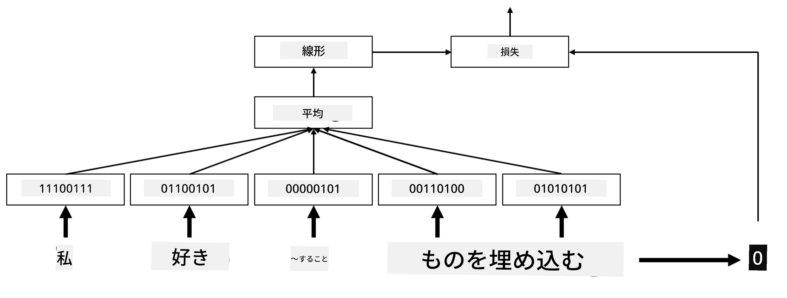

# 埋め込み

## [講義前クイズ](https://ff-quizzes.netlify.app/en/ai/quiz/27)

BoWやTF/IDFに基づく分類器を訓練する際、高次元の単語袋ベクトル（`vocab_size`の長さ）を操作し、低次元の位置表現ベクトルをスパースなワンホット表現に明示的に変換していました。しかし、このワンホット表現はメモリ効率が良くありません。さらに、各単語は互いに独立して扱われるため、ワンホットエンコードされたベクトルは単語間の意味的な類似性を表現しません。

**埋め込み**のアイデアは、単語を低次元の密なベクトルで表現し、単語の意味的な意味を何らかの形で反映させることです。後で意味のある単語埋め込みを構築する方法について議論しますが、今のところ埋め込みを単語ベクトルの次元を下げる方法として考えてみましょう。

埋め込み層は単語を入力として受け取り、指定された`embedding_size`の出力ベクトルを生成します。ある意味では`Linear`層に非常に似ていますが、ワンホットエンコードされたベクトルを受け取る代わりに、単語番号を入力として受け取ることができ、大きなワンホットエンコードされたベクトルを作成する必要がなくなります。

分類器ネットワークの最初の層として埋め込み層を使用することで、単語袋モデルから**埋め込み袋**モデルに切り替えることができます。このモデルでは、テキスト内の各単語を対応する埋め込みに変換し、それらの埋め込み全体に対して`sum`、`average`、`max`などの集約関数を計算します。

> 著者による画像

## ✍️ 演習: 埋め込み

以下のノートブックで学習を続けてください:
* [PyTorchでの埋め込み](EmbeddingsPyTorch.ipynb)
* [TensorFlowでの埋め込み](EmbeddingsTF.ipynb)

## 意味的埋め込み: Word2Vec

埋め込み層が単語をベクトル表現にマッピングすることを学習しましたが、この表現が必ずしも意味的な意味を持つわけではありません。類似した単語や同義語が、あるベクトル距離（例: ユークリッド距離）において互いに近いベクトルに対応するようなベクトル表現を学習できると良いでしょう。

そのためには、特定の方法で大規模なテキストコレクションに基づいて埋め込みモデルを事前訓練する必要があります。意味的埋め込みを訓練する方法の1つが[Word2Vec](https://en.wikipedia.org/wiki/Word2vec)と呼ばれるものです。これは、単語の分散表現を生成するために使用される2つの主要なアーキテクチャに基づいています:

 - **連続単語袋** (CBoW) — このアーキテクチャでは、周囲のコンテキストから単語を予測するようにモデルを訓練します。ngram $(W_{-2},W_{-1},W_0,W_1,W_2)$が与えられた場合、モデルの目標は$(W_{-2},W_{-1},W_1,W_2)$から$W_0$を予測することです。
 - **連続スキップグラム** — CBoWとは逆で、モデルは周囲のコンテキスト単語のウィンドウを使用して現在の単語を予測します。

CBoWは高速ですが、スキップグラムは遅いものの、頻度の低い単語をより良く表現します。

> [この論文](https://arxiv.org/pdf/1301.3781.pdf)からの画像

Word2Vecの事前訓練済み埋め込み（およびGloVeなどの類似モデル）は、ニューラルネットワークの埋め込み層の代わりとしても使用できます。ただし、語彙の問題に対処する必要があります。Word2Vec/GloVeを事前訓練する際に使用された語彙は、私たちのテキストコーパスの語彙と異なる可能性が高いからです。この問題を解決する方法については、上記のノートブックを参照してください。

## 文脈的埋め込み

Word2Vecのような従来の事前訓練済み埋め込み表現の主な制限の1つは、単語の意味の曖昧性の問題です。事前訓練済み埋め込みは、単語の意味をある程度コンテキスト内で捉えることができますが、単語のすべての可能な意味が同じ埋め込みにエンコードされます。これにより、例えば「play」のようにコンテキストによって異なる意味を持つ単語がある場合、下流のモデルで問題が発生する可能性があります。

例えば、「play」という単語は以下の2つの文で異なる意味を持ちます:

- 劇場で**劇**を観ました。
- ジョンは友達と**遊び**たいと思っています。

上記の事前訓練済み埋め込みは、「play」のこれら両方の意味を同じ埋め込みで表現します。この制限を克服するためには、大規模なテキストコーパスで訓練された**言語モデル**に基づいて埋め込みを構築する必要があります。このモデルは、単語が異なるコンテキストでどのように組み合わされるかを「理解」しています。文脈的埋め込みについての議論はこのチュートリアルの範囲外ですが、コースの後半で言語モデルについて話す際に再び取り上げます。

## 結論

このレッスンでは、TensorFlowとPyTorchを使用して埋め込み層を構築し、単語の意味的な意味をよりよく反映させる方法を学びました。

## 🚀 チャレンジ

Word2Vecは、歌詞や詩の生成など、興味深い応用に使用されています。[この記事](https://www.politetype.com/blog/word2vec-color-poems)では、著者がWord2Vecを使用して詩を生成する方法を説明しています。また、[Dan Shiffmannのこの動画](https://www.youtube.com/watch?v=LSS_bos_TPI&ab_channel=TheCodingTrain)も視聴して、この技術の別の説明を発見してください。その後、Kaggleから取得したテキストコーパスなどを使用して、これらの技術を自分のテキストコーパスに適用してみてください。

## [講義後クイズ](https://ff-quizzes.netlify.app/en/ai/quiz/28)

## 復習と自己学習

Word2Vecに関するこの論文を読んでください: [Efficient Estimation of Word Representations in Vector Space](https://arxiv.org/pdf/1301.3781.pdf)

## [課題: ノートブック](assignment.md)

---

