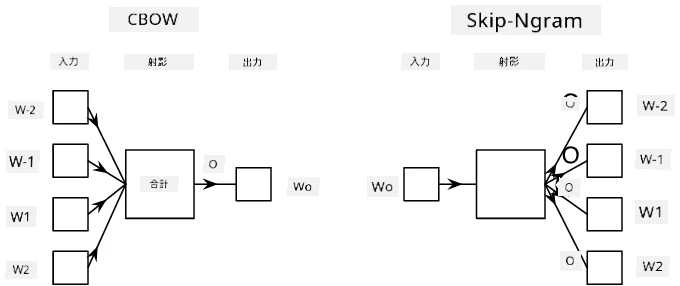

# 言語モデル

Word2VecやGloVeのようなセマンティック埋め込みは、実際には**言語モデル**への第一歩です。つまり、言語の性質を何らかの形で*理解*（または*表現*）するモデルを作成することです。

## [講義前クイズ](https://ff-quizzes.netlify.app/en/ai/quiz/29)

言語モデルの背後にある主なアイデアは、ラベル付けされていないデータセットを使用して教師なしでトレーニングすることです。これは、ラベル付けされていないテキストが膨大に存在する一方で、ラベル付けされたテキストの量はラベル付けに費やせる労力によって常に制限されるため、非常に重要です。多くの場合、テキスト内の**欠損単語を予測する**言語モデルを構築できます。なぜなら、テキスト内のランダムな単語をマスクしてトレーニングサンプルとして使用するのは簡単だからです。

## 埋め込みのトレーニング

前回の例では、事前にトレーニングされたセマンティック埋め込みを使用しましたが、それらの埋め込みがどのようにトレーニングされるかを見るのも興味深いです。以下のようなアイデアがいくつかあります：

* **Nグラム**言語モデル：N個の前のトークンを見てトークンを予測する（N-gram）。
* **Continuous Bag-of-Words** (CBoW)：トークン列$W_{-N}$, ..., $W_N$の中間トークン$W_0$を予測する。
* **Skip-gram**：中間トークン$W_0$から、隣接するトークンの集合{$W_{-N},\dots, W_{-1}, W_1,\dots, W_N$}を予測する。

> 画像出典：[この論文](https://arxiv.org/pdf/1301.3781.pdf)

## ✍️ サンプルノートブック: CBoWモデルのトレーニング

以下のノートブックで学習を続けてください：

* [TensorFlowを使ったCBoW Word2Vecのトレーニング](CBoW-TF.ipynb)
* [PyTorchを使ったCBoW Word2Vecのトレーニング](CBoW-PyTorch.ipynb)

## 結論

前回のレッスンでは、単語埋め込みがまるで魔法のように機能することを学びました！今回の内容で、単語埋め込みのトレーニングがそれほど複雑な作業ではないことを理解しました。必要に応じて、特定の分野のテキストに合わせた独自の単語埋め込みをトレーニングできるはずです。

## [講義後クイズ](https://ff-quizzes.netlify.app/en/ai/quiz/30)

## 復習と自己学習

* [PyTorch公式の言語モデルに関するチュートリアル](https://pytorch.org/tutorials/beginner/nlp/word_embeddings_tutorial.html)
* [TensorFlow公式のWord2Vecモデルトレーニングに関するチュートリアル](https://www.TensorFlow.org/tutorials/text/word2vec)
* **gensim**フレームワークを使用して、最も一般的な埋め込みを数行のコードでトレーニングする方法は[こちらのドキュメント](https://pytorch.org/tutorials/beginner/nlp/word_embeddings_tutorial.html)に記載されています。

## 🚀 [課題: Skip-Gramモデルをトレーニング](lab/README.md)

このラボでは、CBoWの代わりにSkip-Gramモデルをトレーニングするように、このレッスンのコードを変更する課題に挑戦していただきます。[詳細はこちら](lab/README.md)

---

