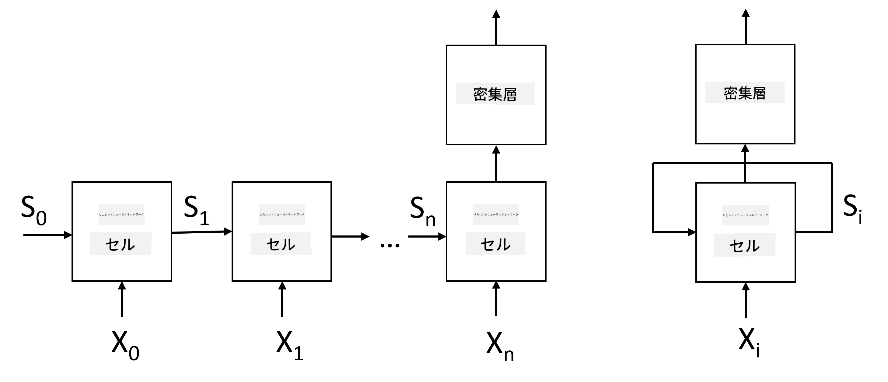
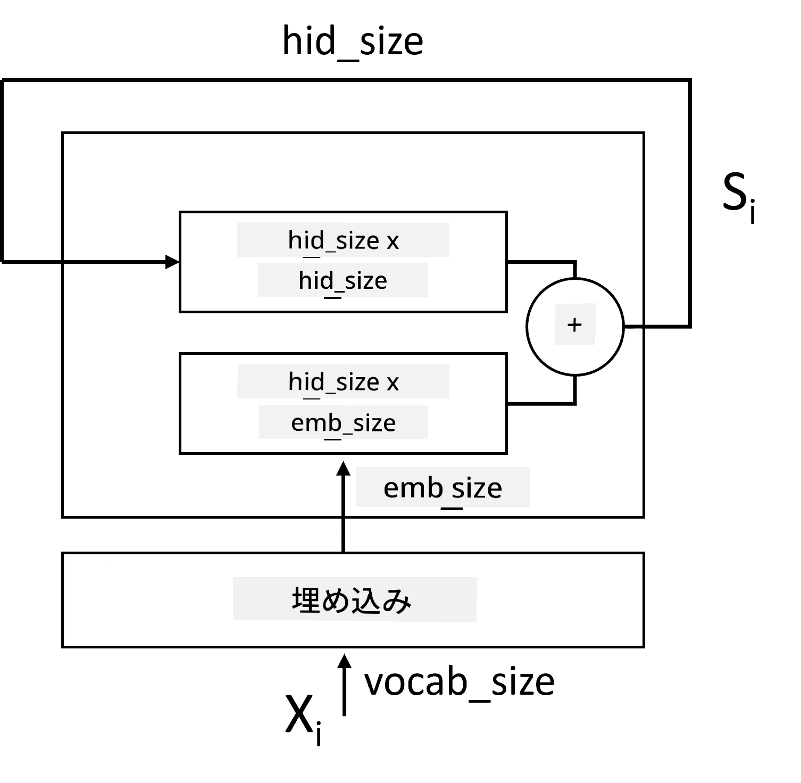
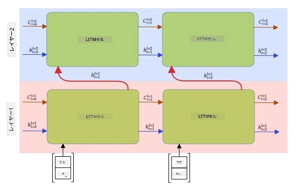

# リカレントニューラルネットワーク

## [講義前クイズ](https://ff-quizzes.netlify.app/en/ai/quiz/31)

これまでのセクションでは、テキストの豊かなセマンティック表現と、その埋め込みの上に単純な線形分類器を使用してきました。このアーキテクチャは、文中の単語の集約された意味を捉えるものですが、単語の**順序**を考慮していません。埋め込みの上での集約操作によって、元のテキストからこの情報が失われるためです。このため、これらのモデルは単語の順序をモデル化することができず、テキスト生成や質問応答のような複雑または曖昧なタスクを解決することができません。

テキストシーケンスの意味を捉えるためには、**リカレントニューラルネットワーク**（RNN）と呼ばれる別のニューラルネットワークアーキテクチャを使用する必要があります。RNNでは、文をネットワークに1つずつシンボルを通し、ネットワークは**状態**を生成します。この状態を次のシンボルとともに再びネットワークに渡します。

> 著者による画像

トークンの入力シーケンス X0,...,Xn が与えられると、RNNはニューラルネットワークブロックのシーケンスを作成し、このシーケンスをバックプロパゲーションを使用してエンドツーエンドでトレーニングします。各ネットワークブロックは (Xi,Si) のペアを入力として受け取り、結果として Si+1 を生成します。最終状態 Sn または (出力 Yn) は線形分類器に渡され、結果を生成します。すべてのネットワークブロックは同じ重みを共有し、1回のバックプロパゲーションパスを使用してエンドツーエンドでトレーニングされます。

状態ベクトル S0,...,Sn がネットワークを通じて渡されるため、単語間のシーケンシャルな依存関係を学習することができます。例えば、シーケンス内のどこかに単語 *not* が現れると、状態ベクトル内の特定の要素を否定することを学習し、否定の結果を得ることができます。

> ✅ 上記の図で示されているすべてのRNNブロックの重みが共有されているため、右側の図のように、ネットワークの出力状態を入力に戻すリカレントフィードバックループを持つ1つのブロックとして表現することができます。

## RNNセルの構造

単純なRNNセルがどのように構成されているかを見てみましょう。このセルは、前の状態 Si-1 と現在のシンボル Xi を入力として受け取り、出力状態 Si を生成する必要があります（場合によっては、生成ネットワークのように他の出力 Yi にも関心があります）。

単純なRNNセルには内部に2つの重み行列があります。1つは入力シンボルを変換するもので（これをWと呼びます）、もう1つは入力状態を変換するものです（これをHと呼びます）。この場合、ネットワークの出力は &sigma;(W&times;Xi+H&times;Si-1+b) として計算されます。ここで &sigma; は活性化関数、b は追加のバイアスです。

> 著者による画像

多くの場合、入力トークンはRNNに入る前に埋め込み層を通過し、次元を下げます。この場合、入力ベクトルの次元が *emb_size*、状態ベクトルが *hid_size* の場合、Wのサイズは *emb_size*&times;*hid_size*、Hのサイズは *hid_size*&times;*hid_size* となります。

## 長短期記憶（LSTM）

古典的なRNNの主な問題の1つは、いわゆる**勾配消失**問題です。RNNは1回のバックプロパゲーションパスでエンドツーエンドでトレーニングされるため、ネットワークの最初の層に誤差を伝播するのが難しく、遠く離れたトークン間の関係を学習することができません。この問題を回避する方法の1つは、**ゲート**を使用して**明示的な状態管理**を導入することです。この種のよく知られたアーキテクチャには、**長短期記憶**（LSTM）と**ゲート付きリレー単位**（GRU）があります。

> 画像の出典は未定

LSTMネットワークはRNNと似た構成ですが、層から層へ渡される状態が2つあります。実際の状態Cと隠れベクトルHです。各ユニットでは、隠れベクトルHiが入力Xiと結合され、**ゲート**を介して状態Cに何が起こるかを制御します。各ゲートはシグモイド活性化（出力範囲[0,1]）を持つニューラルネットワークであり、状態ベクトルと掛け算されるとビットマスクのように機能します。以下のゲートがあります（上記の図で左から右へ）：

* **忘却ゲート**は隠れベクトルを受け取り、ベクトルCのどの成分を忘れるべきか、どれを通過させるべきかを決定します。
* **入力ゲート**は入力と隠れベクトルから情報を取り出し、状態に挿入します。
* **出力ゲート**は状態を*tanh*活性化を持つ線形層を介して変換し、その成分の一部を隠れベクトルHiを使用して選択し、新しい状態Ci+1を生成します。

状態Cの成分は、オンとオフを切り替えるフラグのように考えることができます。例えば、シーケンス内で名前*Alice*に遭遇した場合、それが女性キャラクターを指していると仮定し、文中に女性名詞があるというフラグを状態に立てることができます。その後、*and Tom*というフレーズに遭遇すると、複数名詞があるというフラグを立てます。このようにして、状態を操作することで文の部分の文法的特性を追跡することができます。

> ✅ LSTMの内部を理解するための優れたリソースとして、Christopher Olahによる素晴らしい記事 [Understanding LSTM Networks](https://colah.github.io/posts/2015-08-Understanding-LSTMs/) をおすすめします。

## 双方向および多層RNN

これまで、シーケンスの始まりから終わりまで1方向で動作するリカレントネットワークについて説明しました。これは自然に見えます。なぜなら、私たちが読む方法や話を聞く方法に似ているからです。しかし、多くの実際のケースでは入力シーケンスにランダムアクセスできるため、リカレント計算を両方向で実行する方が理にかなっている場合があります。このようなネットワークは**双方向**RNNと呼ばれます。双方向ネットワークを扱う場合、各方向に1つずつ、2つの隠れ状態ベクトルが必要です。

リカレントネットワークは、1方向または双方向のいずれであっても、シーケンス内の特定のパターンを捉え、それを状態ベクトルに保存するか、出力に渡すことができます。畳み込みネットワークと同様に、最初の層によって抽出された低レベルのパターンから構築し、高レベルのパターンを捉えるために、最初の層の上に別のリカレント層を構築することができます。これにより、**多層RNN**の概念に至ります。これは2つ以上のリカレントネットワークで構成され、前の層の出力が次の層の入力として渡されます。

*Fernando Lópezによる[この素晴らしい投稿](https://towardsdatascience.com/from-a-lstm-cell-to-a-multilayer-lstm-network-with-pytorch-2899eb5696f3)からの画像*

## ✍️ 演習: 埋め込み

以下のノートブックで学習を続けてください：

* [PyTorchによるRNN](RNNPyTorch.ipynb)
* [TensorFlowによるRNN](RNNTF.ipynb)

## 結論

このユニットでは、RNNがシーケンス分類に使用できることを見てきましたが、実際にはテキスト生成、機械翻訳など、さらに多くのタスクを処理することができます。次のユニットではこれらのタスクを検討します。

## 🚀 チャレンジ

LSTMに関する文献を読み、その応用を考えてみてください：

- [Grid Long Short-Term Memory](https://arxiv.org/pdf/1507.01526v1.pdf)
- [Show, Attend and Tell: Neural Image Caption
Generation with Visual Attention](https://arxiv.org/pdf/1502.03044v2.pdf)

## [講義後クイズ](https://ff-quizzes.netlify.app/en/ai/quiz/32)

## 復習と自己学習

- Christopher Olahによる[Understanding LSTM Networks](https://colah.github.io/posts/2015-08-Understanding-LSTMs/)。

## [課題: ノートブック](assignment.md)

---

