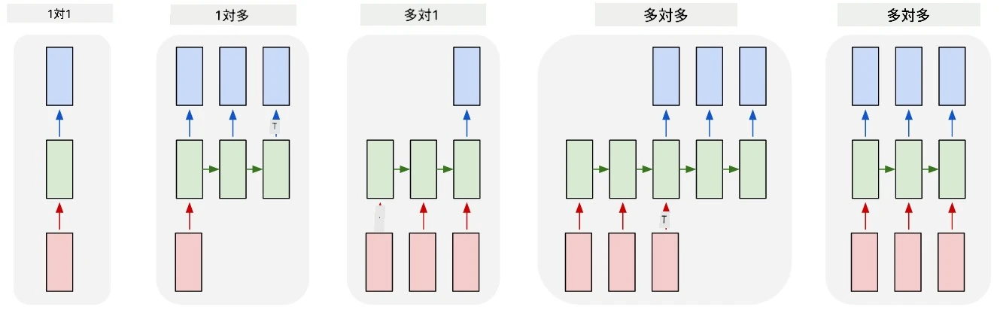
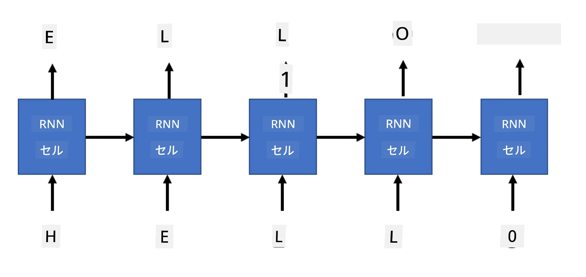

# 生成ネットワーク

## [講義前のクイズ](https://ff-quizzes.netlify.app/en/ai/quiz/33)

リカレントニューラルネットワーク（RNN）とそのゲート付きセルのバリエーション（例えば、長短期記憶セル（LSTM）やゲート付きリカレントユニット（GRU））は、単語の順序を学習し、次の単語を予測することで言語モデルを構築する仕組みを提供します。これにより、RNNを使用して**生成タスク**を実行することが可能になります。例えば、通常のテキスト生成、機械翻訳、さらには画像キャプション生成などです。

> ✅ テキスト入力中の補完機能など、生成タスクから恩恵を受けた経験を思い出してみてください。お気に入りのアプリケーションがRNNを活用しているかどうか調べてみましょう。

前のユニットで説明したRNNアーキテクチャでは、各RNNユニットが次の隠れ状態を出力として生成しました。しかし、各リカレントユニットにもう一つの出力を追加することで、**シーケンス**（元のシーケンスと同じ長さ）を出力することが可能になります。さらに、各ステップで入力を受け取らず、初期状態ベクトルだけを受け取り、出力シーケンスを生成するRNNユニットを使用することもできます。

これにより、以下の図に示されるようなさまざまなニューラルアーキテクチャが可能になります：



> 画像は [Andrej Karpaty](http://karpathy.github.io/) のブログ記事 [Unreasonable Effectiveness of Recurrent Neural Networks](http://karpathy.github.io/2015/05/21/rnn-effectiveness/) より引用

* **One-to-one** は1つの入力と1つの出力を持つ従来のニューラルネットワーク
* **One-to-many** は1つの入力値を受け取り、出力値のシーケンスを生成する生成アーキテクチャ。例えば、画像キャプション生成ネットワークを訓練する場合、画像を入力として受け取り、CNNを通じて隠れ状態を取得し、その後リカレントチェーンが単語ごとにキャプションを生成します。
* **Many-to-one** は前のユニットで説明したRNNアーキテクチャに対応し、例えばテキスト分類など
* **Many-to-many** または **sequence-to-sequence** は、例えば機械翻訳のようなタスクに対応。最初のRNNが入力シーケンスから隠れ状態に情報を集め、別のRNNチェーンがこの状態を展開して出力シーケンスを生成します。

このユニットでは、テキスト生成を助けるシンプルな生成モデルに焦点を当てます。簡単のため、文字レベルのトークン化を使用します。

このRNNを訓練してステップごとにテキストを生成します。各ステップで、`nchars`の長さの文字列を取り、ネットワークに各入力文字に対して次の出力文字を生成させます：



テキスト生成（推論中）では、まず**プロンプト**を使用し、それをRNNセルに通して中間状態を生成します。その後、この状態から生成が始まります。1文字ずつ生成し、状態と生成された文字を次のRNNセルに渡して次の文字を生成します。このプロセスを繰り返して十分な文字数を生成します。


> 画像は著者によるもの

## ✍️ 演習: 生成ネットワーク

以下のノートブックで学習を続けてください：

* [PyTorchによる生成ネットワーク](GenerativePyTorch.ipynb)
* [TensorFlowによる生成ネットワーク](GenerativeTF.ipynb)

## ソフトテキスト生成と温度

各RNNセルの出力は文字の確率分布です。生成されたテキストの次の文字として常に最も高い確率の文字を選ぶと、以下の例のように同じ文字列が繰り返されることがあります：

```
today of the second the company and a second the company ...
```

しかし、次の文字の確率分布を見ると、いくつかの最も高い確率の間の差がそれほど大きくない場合があります。例えば、ある文字の確率が0.2で、別の文字が0.19である場合などです。例えば、'*play*'というシーケンスの次の文字を探す際、次の文字はスペースでも**e**（*player*という単語のように）でも同じくらい適切です。

これにより、最も高い確率の文字を選ぶのが常に「公平」とは限らないという結論に至ります。2番目に高い確率の文字を選ぶことでも意味のあるテキストが生成される可能性があります。ネットワークの出力による確率分布から文字を**サンプリング**する方が賢明です。また、**温度**というパラメータを使用して確率分布を平坦化し、ランダム性を増やしたり、逆に分布を急峻にして最も高い確率の文字により忠実にすることもできます。

このソフトテキスト生成がどのように実装されているか、上記のノートブックで探求してください。

## 結論

テキスト生成はそれ自体で有用ですが、RNNを使用して初期の特徴ベクトルからテキストを生成する能力が大きな利点をもたらします。例えば、テキスト生成は機械翻訳（sequence-to-sequence、ここでは*エンコーダ*の状態ベクトルを使用して翻訳されたメッセージを生成または*デコード*）や画像のテキスト説明生成（この場合、特徴ベクトルはCNN抽出器から取得される）に使用されます。

## 🚀 チャレンジ

このトピックに関するMicrosoft Learnのレッスンを受けてみましょう：

* [PyTorch](https://docs.microsoft.com/learn/modules/intro-natural-language-processing-pytorch/6-generative-networks/?WT.mc_id=academic-77998-cacaste)/[TensorFlow](https://docs.microsoft.com/learn/modules/intro-natural-language-processing-tensorflow/5-generative-networks/?WT.mc_id=academic-77998-cacaste)によるテキスト生成

## [講義後のクイズ](https://ff-quizzes.netlify.app/en/ai/quiz/34)

## 復習と自己学習

知識を広げるためのいくつかの記事を紹介します：

* マルコフ連鎖、LSTM、GPT-2を使用したテキスト生成の異なるアプローチ：[ブログ記事](https://towardsdatascience.com/text-generation-gpt-2-lstm-markov-chain-9ea371820e1e)
* [Kerasドキュメント](https://keras.io/examples/generative/lstm_character_level_text_generation/)のテキスト生成サンプル

## [課題](lab/README.md)

文字ごとのテキスト生成方法を学びました。ラボでは単語レベルのテキスト生成を探求します。

---

