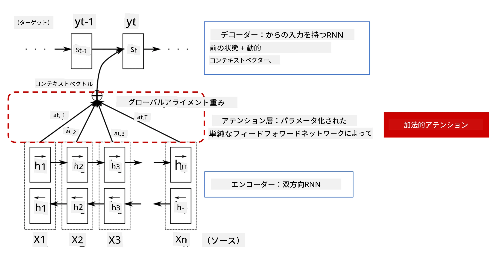
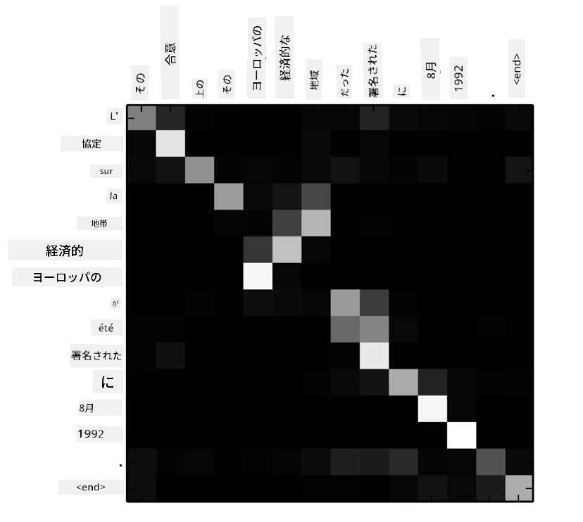
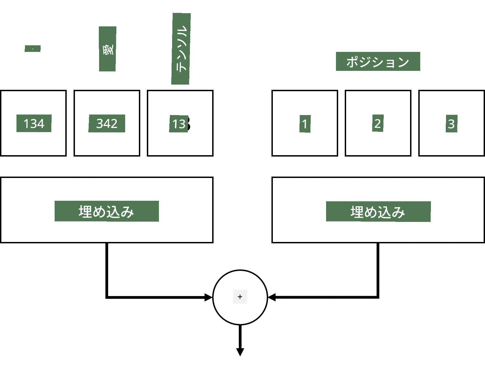
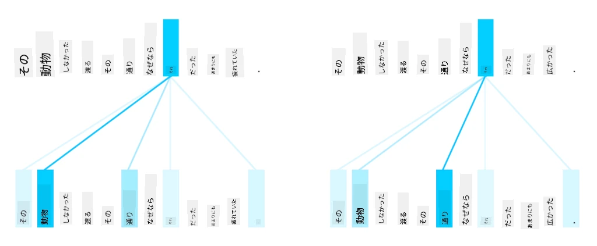
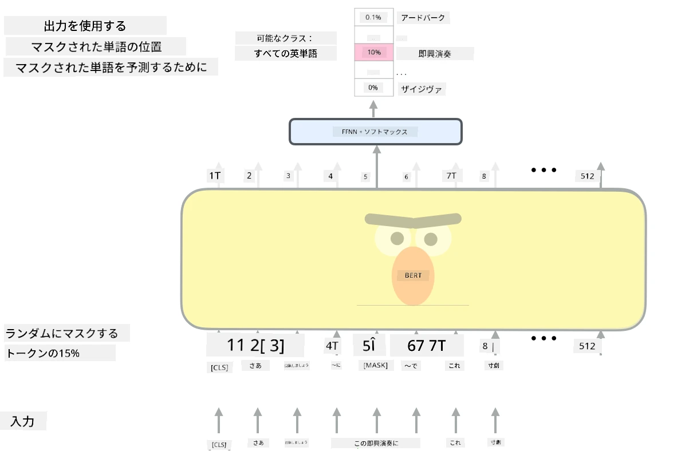

# 注意機構とトランスフォーマー

## [講義前クイズ](https://ff-quizzes.netlify.app/en/ai/quiz/35)

NLP分野で最も重要な問題の1つが**機械翻訳**です。これはGoogle翻訳のようなツールの基盤となる重要なタスクです。このセクションでは、機械翻訳、またはより一般的には*シーケンス間変換*タスク（**文変換**とも呼ばれる）に焦点を当てます。

RNNを使用したシーケンス間変換は、2つのリカレントネットワークによって実装されます。1つのネットワークである**エンコーダ**は入力シーケンスを隠れ状態に圧縮し、もう1つのネットワークである**デコーダ**はその隠れ状態を展開して翻訳結果を生成します。このアプローチにはいくつかの問題があります：

* エンコーダネットワークの最終状態が文の冒頭を記憶するのが難しく、長い文ではモデルの品質が低下する
* シーケンス内のすべての単語が結果に同じ影響を与える。しかし実際には、入力シーケンス内の特定の単語が他の単語よりも出力に大きな影響を与えることが多い。

**注意機構**は、RNNの各出力予測に対する各入力ベクトルの文脈的な影響を重み付けする手段を提供します。これを実現する方法は、入力RNNの中間状態と出力RNNの間にショートカットを作成することです。この方法では、出力記号ytを生成する際に、異なる重み係数&alpha;t,iを用いてすべての入力隠れ状態hiを考慮します。

> [Bahdanau et al., 2015](https://arxiv.org/pdf/1409.0473.pdf)の加法型注意機構を持つエンコーダ-デコーダモデル。引用元：[このブログ記事](https://lilianweng.github.io/lil-log/2018/06/24/attention-attention.html)

注意行列{&alpha;i,j}は、出力シーケンス内の特定の単語の生成において、入力単語がどの程度関与しているかを表します。以下はそのような行列の例です：

> [Bahdanau et al., 2015](https://arxiv.org/pdf/1409.0473.pdf)からの図（Fig.3）

注意機構は、現在または近い将来のNLPの最先端技術の多くを支えています。しかし、注意を追加するとモデルのパラメータ数が大幅に増加し、RNNのスケーリング問題を引き起こしました。RNNのスケーリングの主な制約は、モデルのリカレント性がトレーニングのバッチ化と並列化を困難にすることです。RNNではシーケンスの各要素を順序通りに処理する必要があり、簡単に並列化することができません。

> [Googleのブログ](https://research.googleblog.com/2016/09/a-neural-network-for-machine.html)からの図

注意機構の採用とこの制約が組み合わさり、現在の最先端であるトランスフォーマーモデルが誕生しました。これにはBERTやOpen-GPT3などが含まれます。

## トランスフォーマーモデル

トランスフォーマーの背後にある主なアイデアの1つは、RNNの逐次性を回避し、トレーニング中に並列化可能なモデルを作成することです。これを実現するために以下の2つのアイデアが採用されています：

* 位置エンコーディング
* RNN（またはCNN）の代わりに自己注意機構を使用してパターンを捉える（そのため、トランスフォーマーを紹介する論文は*[Attention is all you need](https://arxiv.org/abs/1706.03762)*と呼ばれています）

### 位置エンコーディング/埋め込み

位置エンコーディングのアイデアは以下の通りです。
1. RNNを使用する場合、トークンの相対位置はステップ数によって表されるため、明示的に表現する必要はありません。
2. しかし、注意に切り替えると、シーケンス内のトークンの相対位置を知る必要があります。
3. 位置エンコーディングを得るために、トークンのシーケンスにシーケンス内のトークン位置（つまり、0,1,...という数列）を追加します。
4. 次に、トークン位置をトークン埋め込みベクトルと混ぜ合わせます。位置（整数）をベクトルに変換するために、以下のような異なるアプローチを使用できます：

* トークン埋め込みに似た学習可能な埋め込み。ここではこのアプローチを検討します。トークンとその位置の両方に埋め込み層を適用し、同じ次元の埋め込みベクトルを生成し、それらを加算します。
* 元の論文で提案された固定位置エンコーディング関数。

> 著者による画像

位置埋め込みを使用すると、元のトークンとそのシーケンス内の位置の両方を埋め込むことができます。

### マルチヘッド自己注意

次に、シーケンス内のパターンを捉える必要があります。これを行うために、トランスフォーマーは**自己注意**機構を使用します。これは入力と出力が同じシーケンスに対して適用される注意です。自己注意を適用することで、文内の**文脈**を考慮し、どの単語が相互に関連しているかを確認できます。例えば、*it*のような共参照が指す単語を確認したり、文脈を考慮することができます：

> [Googleのブログ](https://research.googleblog.com/2017/08/transformer-novel-neural-network.html)からの画像

トランスフォーマーでは、**マルチヘッド注意**を使用して、ネットワークが複数の異なる依存関係（例：長期的 vs 短期的な単語関係、共参照 vs その他）を捉える能力を持つようにします。

[TensorFlow Notebook](TransformersTF.ipynb)には、トランスフォーマーレイヤーの実装に関する詳細が含まれています。

### エンコーダ-デコーダ注意

トランスフォーマーでは、注意は以下の2つの場所で使用されます：

* 入力テキスト内のパターンを自己注意を使用して捉える
* シーケンス翻訳を実行する - これはエンコーダとデコーダ間の注意層です。

エンコーダ-デコーダ注意は、セクションの冒頭で説明したRNNで使用される注意機構と非常に似ています。このアニメーション図はエンコーダ-デコーダ注意の役割を説明しています。

各入力位置が各出力位置に独立してマッピングされるため、トランスフォーマーはRNNよりも並列化が容易で、より大規模で表現力豊かな言語モデルを可能にします。各注意ヘッドは、単語間の異なる関係を学習するために使用され、下流の自然言語処理タスクを改善します。

## BERT

**BERT**（Bidirectional Encoder Representations from Transformers）は非常に大規模な多層トランスフォーマーネットワークで、*BERT-base*では12層、*BERT-large*では24層を持ちます。このモデルはまず、WikiPediaや書籍などの大規模なテキストデータコーパスで教師なし学習（文中のマスクされた単語を予測する）を使用して事前学習されます。事前学習中にモデルは言語理解の重要なレベルを吸収し、その後他のデータセットで微調整することで活用できます。このプロセスは**転移学習**と呼ばれます。

> 画像の[出典](http://jalammar.github.io/illustrated-bert/)

## ✍️ 演習: トランスフォーマー

以下のノートブックで学習を続けてください：

* [PyTorchでのトランスフォーマー](TransformersPyTorch.ipynb)
* [TensorFlowでのトランスフォーマー](TransformersTF.ipynb)

## 結論

このレッスンでは、NLPツールボックスに欠かせないトランスフォーマーと注意機構について学びました。BERT、DistilBERT、BigBird、OpenGPT3など、微調整可能なトランスフォーマーアーキテクチャには多くのバリエーションがあります。[HuggingFaceパッケージ](https://github.com/huggingface/)は、PyTorchとTensorFlowの両方でこれらのアーキテクチャをトレーニングするためのリポジトリを提供しています。

## 🚀 チャレンジ

## [講義後クイズ](https://ff-quizzes.netlify.app/en/ai/quiz/36)

## レビューと自己学習

* トランスフォーマーに関する古典的な論文[Attention is all you need](https://arxiv.org/abs/1706.03762)を説明する[ブログ記事](https://mchromiak.github.io/articles/2017/Sep/12/Transformer-Attention-is-all-you-need/)。
* トランスフォーマーのアーキテクチャを詳細に説明する[一連のブログ記事](https://towardsdatascience.com/transformers-explained-visually-part-1-overview-of-functionality-95a6dd460452)。

## [課題](assignment.md)

---

