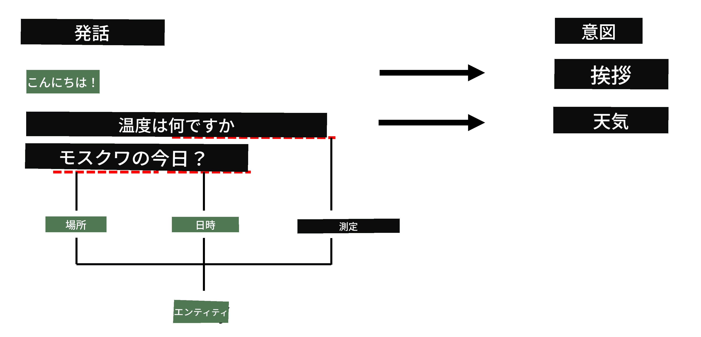

# 固有表現認識

これまでのところ、主に1つのNLPタスク、つまり分類に集中してきました。しかし、ニューラルネットワークを使用して達成できる他のNLPタスクもあります。その1つが**[固有表現認識](https://wikipedia.org/wiki/Named-entity_recognition)**（NER）です。これは、テキスト内の特定のエンティティ（場所、人名、日時、化学式など）を認識することを扱います。

## [講義前クイズ](https://ff-quizzes.netlify.app/en/ai/quiz/37)

## NERの使用例

例えば、Amazon AlexaやGoogleアシスタントのような自然言語チャットボットを開発したいとします。インテリジェントなチャットボットが動作する仕組みは、入力された文に対してテキスト分類を行い、ユーザーが何を求めているのかを「理解」することです。この分類の結果が、チャットボットが何をすべきかを決定する**インテント**と呼ばれるものです。

> 著者による画像

しかし、ユーザーはフレーズの一部としていくつかのパラメータを提供する場合があります。例えば、天気を尋ねる際に、場所や日付を指定することがあります。ボットはこれらのエンティティを理解し、それに応じてパラメータスロットを埋めてからアクションを実行する必要があります。これがまさにNERが活躍する場面です。

> ✅ 別の例としては、[科学的な医療論文の分析](https://soshnikov.com/science/analyzing-medical-papers-with-azure-and-text-analytics-for-health/)があります。ここで主に探すべきものは、病気や医薬品などの特定の医療用語です。少数の病気であれば部分文字列検索で抽出できるかもしれませんが、化学化合物や薬品名のような複雑なエンティティには、より高度なアプローチが必要です。

## トークン分類としてのNER

NERモデルは本質的に**トークン分類モデル**です。なぜなら、入力された各トークンについて、それがエンティティに属するかどうか、そして属する場合はどのエンティティクラスに属するかを決定する必要があるからです。

以下の論文タイトルを考えてみましょう：

**三尖弁逆流**と**炭酸リチウム**の**毒性**が新生児に見られる。

ここでのエンティティは以下の通りです：

* 三尖弁逆流は病気（`DIS`）
* 炭酸リチウムは化学物質（`CHEM`）
* 毒性も病気（`DIS`）

1つのエンティティが複数のトークンにまたがることがある点に注意してください。また、この例のように、2つの連続するエンティティを区別する必要があります。そのため、各エンティティに対して2つのクラスを使用するのが一般的です。1つはエンティティの最初のトークンを指定するクラス（通常は`B-`プレフィックスを使用し、**b**eginningを表す）、もう1つはエンティティの継続部分を指定するクラス（`I-`、**i**nnerトークンを表す）です。また、すべての**o**therトークンを表すクラスとして`O`を使用します。このようなトークンタグ付けは[BIOタグ付け](https://en.wikipedia.org/wiki/Inside%E2%80%93outside%E2%80%93beginning_(tagging))（またはIOB）と呼ばれます。タグ付けされたタイトルは以下のようになります：

Token | Tag
------|-----
三尖弁 | B-DIS
逆流 | I-DIS
と | O
炭酸 | B-CHEM
リチウム | I-CHEM
毒性 | B-DIS
が | O
新生児 | O
に | O
見られる | O
。 | O

トークンとクラスの1対1の対応を構築する必要があるため、この図から右端の**多対多**ニューラルネットワークモデルをトレーニングできます：

> *[Andrej Karpathy](http://karpathy.github.io/)による[このブログ記事](http://karpathy.github.io/2015/05/21/rnn-effectiveness/)からの画像。NERトークン分類モデルは、この画像の右端のネットワークアーキテクチャに対応します。*

## NERモデルのトレーニング

NERモデルは本質的にトークン分類モデルであるため、このタスクには既におなじみのRNNを使用できます。この場合、リカレントネットワークの各ブロックがトークンIDを返します。以下のノートブックでは、トークン分類のためのLSTMのトレーニング方法を示しています。

## ✍️ ノートブック例: NER

以下のノートブックで学習を続けてください：

* [TensorFlowを使用したNER](NER-TF.ipynb)

## 結論

NERモデルは**トークン分類モデル**であり、トークン分類を実行するために使用できます。これはNLPで非常に一般的なタスクであり、テキスト内の特定のエンティティ（場所、名前、日付など）を認識するのに役立ちます。

## 🚀 チャレンジ

以下の課題を完了して、医療用語の固有表現認識モデルをトレーニングし、別のデータセットで試してみてください。

## [講義後クイズ](https://ff-quizzes.netlify.app/en/ai/quiz/38)

## 復習と自己学習

[The Unreasonable Effectiveness of Recurrent Neural Networks](http://karpathy.github.io/2015/05/21/rnn-effectiveness/)というブログを読み、記事内の「Further Reading」セクションに従って知識を深めてください。

## [課題](lab/README.md)

このレッスンの課題では、医療エンティティ認識モデルをトレーニングする必要があります。このレッスンで説明されているようにLSTMモデルのトレーニングから始め、BERTトランスフォーマーモデルを使用する方向に進んでください。[指示](lab/README.md)を読んで詳細を確認してください。

---

