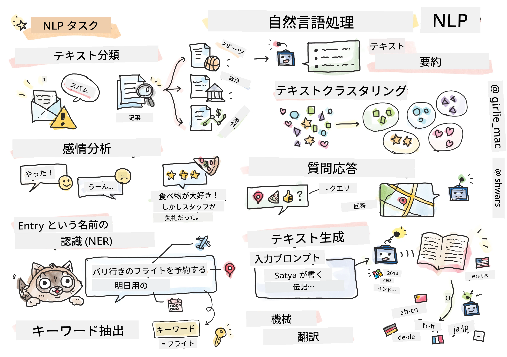

# 自然言語処理



このセクションでは、**自然言語処理 (NLP)** に関連するタスクを扱うためにニューラルネットワークを使用する方法に焦点を当てます。コンピュータに解決してほしい多くのNLP問題があります。

* **テキスト分類**は、テキストシーケンスに関する典型的な分類問題です。例として、電子メールをスパムか非スパムに分類したり、記事をスポーツ、ビジネス、政治などに分類することが挙げられます。また、チャットボットを開発する際には、ユーザーが何を言いたかったのかを理解する必要があります。この場合、**意図分類**を扱うことになります。意図分類では、多くのカテゴリを扱う必要があることがよくあります。
* **感情分析**は典型的な回帰問題であり、文の意味がどれだけポジティブ/ネガティブであるかを示す数値（感情）を割り当てる必要があります。感情分析のより高度なバージョンとして、**側面ベース感情分析** (ABSA) があります。これは、文全体ではなくその異なる部分（側面）に感情を割り当てるものです。例: *このレストランでは料理は気に入ったが、雰囲気はひどかった*。
* **固有表現抽出** (NER) は、テキストから特定のエンティティを抽出する問題を指します。例えば、*明日パリに飛びたい*というフレーズでは、*明日*が日付 (DATE) を指し、*パリ*が場所 (LOCATION) を指していることを理解する必要があります。
* **キーワード抽出**はNERに似ていますが、特定のエンティティタイプを事前学習することなく、文の意味に重要な単語を自動的に抽出する必要があります。
* **テキストクラスタリング**は、例えば技術サポートの会話で似たリクエストをグループ化したい場合に役立ちます。
* **質問応答**は、モデルが特定の質問に答える能力を指します。モデルはテキストの一部と質問を入力として受け取り、質問の答えが含まれるテキスト内の場所を提供する必要があります（場合によっては答えのテキストを生成することもあります）。
* **テキスト生成**は、モデルが新しいテキストを生成する能力です。これは、*テキストプロンプト*に基づいて次の文字や単語を予測する分類タスクと見なすことができます。GPT-3のような高度なテキスト生成モデルは、[プロンプトプログラミング](https://towardsdatascience.com/software-3-0-how-prompting-will-change-the-rules-of-the-game-a982fbfe1e0)や[プロンプトエンジニアリング](https://medium.com/swlh/openai-gpt-3-and-prompt-engineering-dcdc2c5fcd29)と呼ばれる技術を使用して、分類などの他のNLPタスクを解決することができます。
* **テキスト要約**は、コンピュータに長いテキストを「読んで」数文に要約させたい場合の技術です。
* **機械翻訳**は、一つの言語でのテキスト理解と別の言語でのテキスト生成を組み合わせたものと見なすことができます。

初期の頃は、ほとんどのNLPタスクが文法などの従来の方法で解決されていました。例えば、機械翻訳では、初期の文を構文木に変換するためにパーサーが使用され、その後、文の意味を表す高次の意味構造が抽出され、この意味とターゲット言語の文法に基づいて結果が生成されました。現在では、多くのNLPタスクがニューラルネットワークを使用することでより効果的に解決されています。

> 多くの古典的なNLP手法は、Pythonライブラリの[自然言語処理ツールキット (NLTK)](https://www.nltk.org) に実装されています。異なるNLPタスクをNLTKを使用して解決する方法をカバーした素晴らしい[NLTKの本](https://www.nltk.org/book/)がオンラインで利用可能です。

このコースでは、主にニューラルネットワークを使用したNLPに焦点を当て、必要に応じてNLTKを使用します。

これまでに、表形式データや画像を扱うためのニューラルネットワークの使用方法を学びました。これらのデータタイプとテキストの主な違いは、テキストが可変長のシーケンスであるのに対し、画像の場合は入力サイズが事前にわかっていることです。畳み込みネットワークは入力データからパターンを抽出できますが、テキストのパターンはより複雑です。例えば、否定が主語から任意の多くの単語で分離される場合があります（例: *私はオレンジが好きではありません* vs. *私はあの大きくてカラフルで美味しいオレンジが好きではありません*）。これでも一つのパターンとして解釈されるべきです。そのため、言語を扱うには、*リカレントネットワーク*や*トランスフォーマー*などの新しいニューラルネットワークタイプを導入する必要があります。

## ライブラリのインストール

このコースをローカルのPython環境で実行する場合、以下のコマンドを使用してNLPに必要なライブラリをインストールする必要があります。

**PyTorchの場合**
```bash
pip install -r requirements-torch.txt
```
**TensorFlowの場合**
```bash
pip install -r requirements-tf.txt
```

> TensorFlowを使用したNLPを試したい場合は、[Microsoft Learn](https://docs.microsoft.com/learn/modules/intro-natural-language-processing-tensorflow/?WT.mc_id=academic-77998-cacaste)をご覧ください。

## GPUに関する注意

このセクションでは、一部の例で非常に大きなモデルをトレーニングします。
* **GPU対応のコンピュータを使用する**: 大きなモデルを扱う際の待機時間を短縮するために、GPU対応のコンピュータでノートブックを実行することをお勧めします。
* **GPUメモリの制約**: GPUで実行すると、大きなモデルをトレーニングする際にGPUメモリが不足する状況が発生する可能性があります。
* **GPUメモリ消費量**: トレーニング中のGPUメモリ消費量は、ミニバッチサイズなどのさまざまな要因によって異なります。
* **ミニバッチサイズを最小化する**: GPUメモリの問題が発生した場合、コード内のミニバッチサイズを減らすことを検討してください。
* **TensorFlowのGPUメモリ解放**: 古いバージョンのTensorFlowでは、1つのPythonカーネル内で複数のモデルをトレーニングする際にGPUメモリが正しく解放されないことがあります。GPUメモリ使用量を効果的に管理するには、必要に応じてGPUメモリを割り当てるようTensorFlowを設定できます。
* **コードの追加**: 必要に応じてGPUメモリ割り当てを増やすようTensorFlowを設定するには、以下のコードをノートブックに追加してください。

```python
physical_devices = tf.config.list_physical_devices('GPU') 
if len(physical_devices)>0:
    tf.config.experimental.set_memory_growth(physical_devices[0], True) 
```

古典的な機械学習の観点からNLPを学びたい場合は、[このレッスン集](https://github.com/microsoft/ML-For-Beginners/tree/main/6-NLP)をご覧ください。

## このセクションで学ぶ内容
このセクションでは以下について学びます:

* [テキストをテンソルとして表現する](13-TextRep/README.md)
* [単語埋め込み](14-Emdeddings/README.md)
* [言語モデリング](15-LanguageModeling/README.md)
* [リカレントニューラルネットワーク](16-RNN/README.md)
* [生成ネットワーク](17-GenerativeNetworks/README.md)
* [トランスフォーマー](18-Transformers/README.md)

**免責事項**:  
この文書は、AI翻訳サービス [Co-op Translator](https://github.com/Azure/co-op-translator) を使用して翻訳されています。正確性を追求しておりますが、自動翻訳には誤りや不正確な部分が含まれる可能性があることをご承知おきください。元の言語で記載された文書が公式な情報源とみなされるべきです。重要な情報については、専門の人間による翻訳を推奨します。この翻訳の使用に起因する誤解や誤認について、当方は一切の責任を負いません。