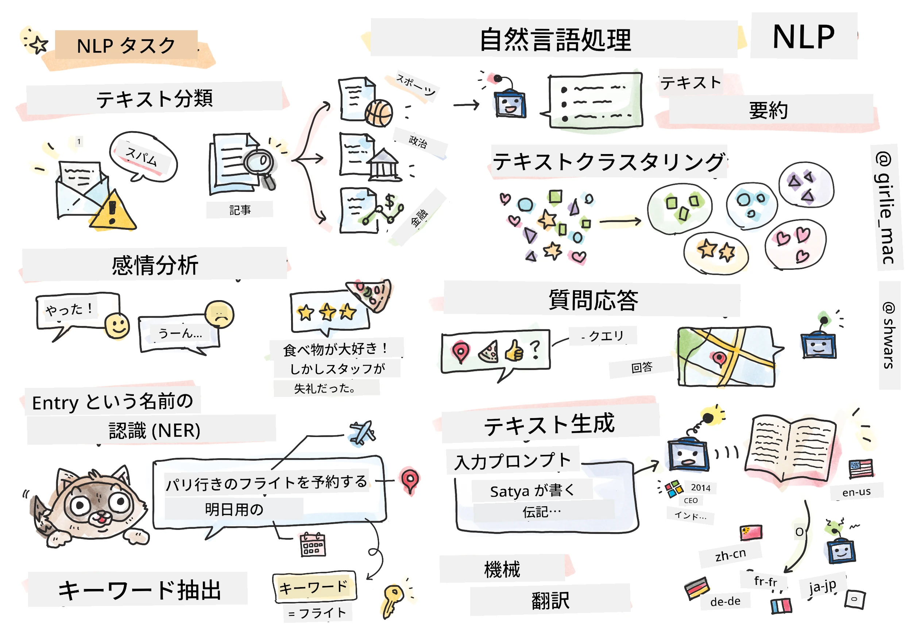

# 自然言語処理



このセクションでは、<strong>自然言語処理（NLP）</strong>に関連するタスクを扱うためにニューラルネットワークを使うことに焦点を当てます。コンピューターに解決してほしい多くのNLP問題があります：

* <strong>テキスト分類</strong> はテキストシーケンスに関する典型的な分類問題です。例としては、メールメッセージをスパムか非スパムに分類したり、記事をスポーツ、ビジネス、政治などに分類したりすることです。また、チャットボットを開発する際にはユーザーが何を言いたかったのかを理解する必要があり、この場合は <strong>意図分類</strong> を扱います。意図分類では多くのカテゴリを扱う必要があることが多いです。
<em> <strong>感情分析</strong> は典型的な回帰問題で、文の意味のポジティブ/ネガティブの度合いに対応する数値（感情）を割り当てる必要があります。より高度な感情分析は <strong>アスペクトベース感情分析</strong> (ABSA) で、文全体ではなく異なる部分（アスペクト）に対して感情を割り当てます。例：</em>このレストランでは料理は好みでしたが、雰囲気はひどかった* などです。
<em> <strong>固有表現抽出</strong> (NER) はテキストから特定の実体を抽出する問題を指します。例えば、</em>明日パリに飛ばなければならない<em> というフレーズでは </em>明日<em> は日時を表し、</em>パリ* は場所を表していると理解する必要があります。  
* <strong>キーワード抽出</strong> はNERに似ていますが、特定の実体タイプの事前学習なしに文の意味に重要な単語を自動的に抽出する必要があります。
* <strong>テキストクラスタリング</strong> は、技術サポートの会話における類似の要求など、類似した文をまとめたい場合に役立ちます。
* <strong>質問応答</strong> は、モデルが特定の質問に答える能力を指します。モデルはテキストの通過部分と質問を入力として受け取り、質問の答えが含まれるテキストの部分を提供する（または時には答えのテキストを生成する）必要があります。
* <strong>テキスト生成</strong> は、モデルが新しいテキストを生成する能力です。テキストの一部に基づいて次の文字や単語を予測する分類タスクと見なせます。GPT-3のような高度なテキスト生成モデルは、[prompt programming](https://towardsdatascience.com/software-3-0-how-prompting-will-change-the-rules-of-the-game-a982fbfe1e0)や[prompt engineering](https://medium.com/swlh/openai-gpt-3-and-prompt-engineering-dcdc2c5fcd29)という技術を用いて分類など他のNLPタスクも解決可能です。
* <strong>テキスト要約</strong> は、長いテキストをコンピューターに「読ませ」、数文に要約させる技術です。
* <strong>機械翻訳</strong> は一言語でのテキスト理解と別言語でのテキスト生成の組み合わせと見ることができます。

当初、多くのNLPタスクは文法解析のような従来の方法で解決されていました。例えば、機械翻訳ではパーサーを使って初期の文を構文木に変換し、そこから文の意味を表す高レベルの意味構造を抽出し、その意味と目的言語の文法に基づいて結果を生成していました。現在、多くのNLPタスクはニューラルネットワークを用いた方が効果的に解決されています。

> 多くの古典的なNLP手法は [Natural Language Processing Toolkit (NLTK)](https://www.nltk.org) Pythonライブラリに実装されています。NLTKを使った様々なNLPタスクの解決方法を扱った素晴らしい [NLTK Book](https://www.nltk.org/book/) がオンラインで利用可能です。

当コースでは主にニューラルネットワークを使ったNLPに焦点を当て、必要に応じてNLTKを使用します。

すでにニューラルネットワークを使って表形式データや画像を扱う方法を学びました。それらのデータタイプとテキストの主な違いは、テキストが可変長のシーケンスであるのに対し、画像の入力サイズは事前に分かっている点です。畳み込みネットワークは入力データからパターンを抽出できますが、テキストのパターンはより複雑です。例えば、否定が主語から離れて多くの単語を挟む場合でも（例：*I do not like oranges*、または *I do not like those big colorful tasty oranges*）それは一つのパターンとして解釈されるべきです。したがって言語処理には、<em>リカレントネットワーク</em> や <em>トランスフォーマー</em> といった新しいタイプのニューラルネットワークを導入する必要があります。

## ライブラリのインストール

ローカルのPython環境でこのコースを実行する場合、以下のコマンドでNLPに必要なすべてのライブラリをインストールする必要があるかもしれません：

**PyTorch用**
```bash
pip install -r requirements-pytorch.txt
```
**TensorFlow用**
```bash
pip install -r requirements-tf.txt
```

> TensorFlowでのNLPを試す場合は、[Microsoft Learn](https://docs.microsoft.com/learn/modules/intro-natural-language-processing-tensorflow/?WT.mc_id=academic-77998-cacaste) を参照してください

## GPUに関する警告

このセクションの一部の例では、かなり大きなモデルを訓練します。
* **GPU対応のコンピューターを使用する**: 大きなモデルを扱う際の待ち時間を短縮するために、GPU対応のコンピューターでノートブックを実行することをおすすめします。
* **GPUメモリの制約**: GPUで実行すると、特に大きなモデルを訓練する際にGPUメモリ不足になることがあります。
* **GPUメモリ消費量**: 訓練時に消費されるGPUメモリ量は、ミニバッチサイズを含む様々な要因に依存します。
* <strong>ミニバッチサイズを最小化する</strong>: GPUメモリ問題に直面した場合、解決策としてコード内のミニバッチサイズを減らすことを検討してください。
* **TensorFlowのGPUメモリ解放**: 古いバージョンのTensorFlowは、一つのPythonカーネル内で複数のモデルを訓練するとGPUメモリを正しく解放しないことがあります。GPUメモリの使用を効果的に管理するために、TensorFlowのGPUメモリを必要に応じて割り当てる設定が可能です。
* <strong>コードの挿入</strong>: TensorFlowを必要に応じてGPUメモリを割り当てるモードに設定するには、ノートブックに以下のコードを含めてください：

```python
physical_devices = tf.config.list_physical_devices('GPU') 
if len(physical_devices)>0:
    tf.config.experimental.set_memory_growth(physical_devices[0], True) 
```

クラシックな機械学習の視点からNLPを学びたい場合は、[このレッスンスイート](https://github.com/microsoft/ML-For-Beginners/tree/main/6-NLP) を参照してください

## このセクションで学ぶこと
このセクションでは以下のことを学びます：

* [テキストをテンソルとして表現する](13-TextRep/README.md)
* [単語埋め込み](14-Embeddings/README.md)
* [言語モデル](15-LanguageModeling/README.md)
* [リカレントニューラルネットワーク](16-RNN/README.md)
* [生成モデル](17-GenerativeNetworks/README.md)
* [トランスフォーマー](18-Transformers/README.md)

---

<!-- CO-OP TRANSLATOR DISCLAIMER START -->
**免責事項**：
本書類は AI 翻訳サービス [Co-op Translator](https://github.com/Azure/co-op-translator) を使用して翻訳されています。正確性を期していますが、自動翻訳には誤りや不正確な部分が含まれる可能性があることをご承知おきください。原文の原語版が正式な情報源とみなされるべきです。重要な情報については、専門の人間による翻訳を推奨します。本翻訳の利用により生じたいかなる誤解や解釈違いについても、当方は責任を負いかねます。
<!-- CO-OP TRANSLATOR DISCLAIMER END -->